# System Diagrams

This document contains all Mermaid diagrams extracted from PRD and architecture documents.
Diagrams are organized by domain for easy reference.

---

## Prd Domain

### From: `prd/customer-journey.md`

*Type: stateDiagram-v2, Source: `prd/customer-journey.md`*

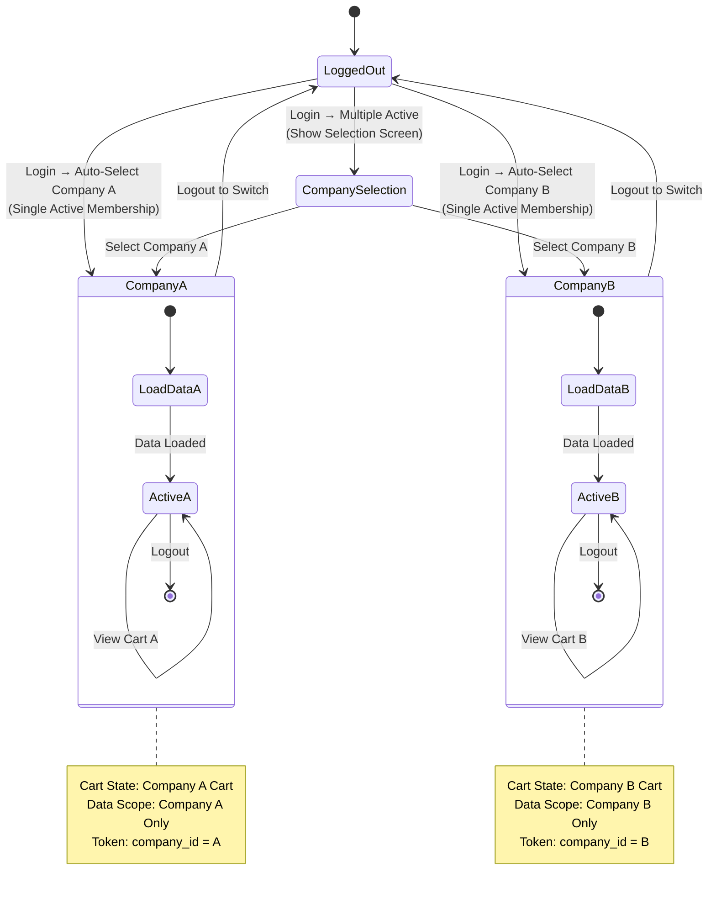
```mermaid
stateDiagram-v2
    [*] --> LoggedOut
    LoggedOut --> CompanyA: Login → Auto-Select Company A<br/>(Single Active Membership)
    LoggedOut --> CompanyB: Login → Auto-Select Company B<br/>(Single Active Membership)
    LoggedOut --> CompanySelection: Login → Multiple Active<br/>(Show Selection Screen)
    CompanySelection --> CompanyA: Select Company A
    CompanySelection --> CompanyB: Select Company B
    
    CompanyA --> LoggedOut: Logout to Switch
    CompanyB --> LoggedOut: Logout to Switch
    
    state CompanyA {
        [*] --> LoadDataA
        LoadDataA --> ActiveA: Data Loaded
        ActiveA --> ActiveA: View Bookings A
        ActiveA --> ActiveA: View Financial Dashboard A
        ActiveA --> ActiveA: View Cart A
        ActiveA --> [*]: Logout
    }
    
    state CompanyB {
        [*] --> LoadDataB
        LoadDataB --> ActiveB: Data Loaded
        ActiveB --> ActiveB: View Bookings B
        ActiveB --> ActiveB: View Financial Dashboard B
        ActiveB --> ActiveB: View Cart B
        ActiveB --> [*]: Logout
    }
    
    note right of CompanyA
        Cart State: Company A Cart
        Data Scope: Company A Only
        Token: company_id = A
    end note
    
    note right of CompanyB
        Cart State: Company B Cart
        Data Scope: Company B Only
        Token: company_id = B
    end note
```

---

**Login-Time Company Context Resolution Flow Diagrams:**

*Type: sequenceDiagram, Source: `prd/customer-journey.md`, Section: Multi-Company Workflow (Login-Time Resolution)*

```mermaid
sequenceDiagram
    participant U as User
    participant FE as Frontend
    participant API as API Server
    participant DB as Database
    participant Auth as Auth Service

    Note over U,Auth: Login with Identifier (Phone/Email)
    U->>FE: Login (Identifier + Password)
    FE->>API: POST /auth/login<br/>{identifier, password}
    API->>DB: Find User by Email OR Mobile Number
    DB->>API: User Record
    API->>DB: Get Active Company Memberships
    DB->>API: Company Memberships
    
    alt Single Active Membership
        API->>Auth: Generate JWT (company_id: Company A)
        Auth->>FE: Access Token + User Data
        FE->>FE: Store Token + Company Context
        FE->>U: Redirect to Dashboard (Company A)
    else Multiple Active Memberships
        API->>FE: Access Token + requiresCompanySelection: true
        FE->>U: Show "Select Company" Screen
        U->>FE: Select Company B
        FE->>API: POST /auth/select-company<br/>{companyId: Company B}
        API->>Auth: Generate New JWT (company_id: Company B)
        Auth->>FE: New Access Token
        FE->>FE: Store Token + Company Context
        FE->>U: Redirect to Dashboard (Company B)
    end
        FE->>FE: Load Company B Context
        FE->>API: GET /cart (Company B Context)
        API->>DB: Get Cart (company_id: Company B)
        DB->>API: Cart Data (Company B)
        API->>FE: Cart Response
        FE->>U: Display Company B Dashboard
    else Membership Invalid
        API->>FE: Error: "Not a member of target company"
        FE->>U: Display Error
    end
    
    Note over FE,DB: Data Isolation
    U->>FE: Request Bookings
    FE->>API: GET /bookings<br/>(Token: company_id: Company B)
    API->>API: Extract company_id from Token
    API->>DB: SELECT * FROM bookings<br/>WHERE company_id = Company B
    DB->>API: Bookings (Company B only)
    API->>FE: Bookings Response
    Note over FE: Company A data not accessible<br/>in Company B context
```

---

### From: `prd/epic-1.md`

**Magic Link Authentication Flow Diagram:**

*Type: flowchart, Source: `prd/epic-1.md`*

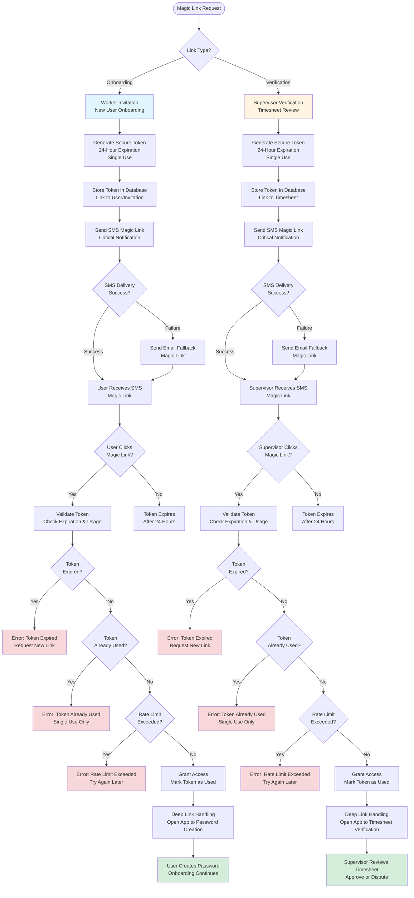
```mermaid
flowchart TD
    Start([Magic Link Request]) --> DetermineType{Link Type?}
    
    DetermineType -->|Onboarding| OnboardingFlow[Worker Invitation<br/>New User Onboarding]
    DetermineType -->|Verification| VerificationFlow[Supervisor Verification<br/>Timesheet Review]
    
    OnboardingFlow --> GenerateToken1[Generate Secure Token<br/>24-Hour Expiration<br/>Single Use]
    VerificationFlow --> GenerateToken2[Generate Secure Token<br/>24-Hour Expiration<br/>Single Use]
    
    GenerateToken1 --> StoreToken1[Store Token in Database<br/>Link to User/Invitation]
    GenerateToken2 --> StoreToken2[Store Token in Database<br/>Link to Timesheet]
    
    StoreToken1 --> SendSMS1[Send SMS Magic Link<br/>Critical Notification]
    StoreToken2 --> SendSMS2[Send SMS Magic Link<br/>Critical Notification]
    
    SendSMS1 --> CheckDelivery1{SMS Delivery<br/>Success?}
    SendSMS2 --> CheckDelivery2{SMS Delivery<br/>Success?}
    
    CheckDelivery1 -->|Success| UserReceives1[User Receives SMS<br/>Magic Link]
    CheckDelivery1 -->|Failure| SendEmail1[Send Email Fallback<br/>Magic Link]
    CheckDelivery2 -->|Success| UserReceives2[Supervisor Receives SMS<br/>Magic Link]
    CheckDelivery2 -->|Failure| SendEmail2[Send Email Fallback<br/>Magic Link]
    
    SendEmail1 --> UserReceives1
    SendEmail2 --> UserReceives2
    
    UserReceives1 --> ClickLink1{User Clicks<br/>Magic Link?}
    UserReceives2 --> ClickLink2{Supervisor Clicks<br/>Magic Link?}
    
    ClickLink1 -->|Yes| ValidateToken1[Validate Token<br/>Check Expiration & Usage]
    ClickLink2 -->|Yes| ValidateToken2[Validate Token<br/>Check Expiration & Usage]
    ClickLink1 -->|No| Expire1[Token Expires<br/>After 24 Hours]
    ClickLink2 -->|No| Expire2[Token Expires<br/>After 24 Hours]
    
    ValidateToken1 --> CheckExpired1{Token<br/>Expired?}
    ValidateToken2 --> CheckExpired2{Token<br/>Expired?}
    
    CheckExpired1 -->|Yes| ErrorExpired1[Error: Token Expired<br/>Request New Link]
    CheckExpired2 -->|Yes| ErrorExpired2[Error: Token Expired<br/>Request New Link]
    
    CheckExpired1 -->|No| CheckUsed1{Token<br/>Already Used?}
    CheckExpired2 -->|No| CheckUsed2{Token<br/>Already Used?}
    
    CheckUsed1 -->|Yes| ErrorUsed1[Error: Token Already Used<br/>Single Use Only]
    CheckUsed2 -->|Yes| ErrorUsed2[Error: Token Already Used<br/>Single Use Only]
    
    CheckUsed1 -->|No| CheckRateLimit1{Rate Limit<br/>Exceeded?}
    CheckUsed2 -->|No| CheckRateLimit2{Rate Limit<br/>Exceeded?}
    
    CheckRateLimit1 -->|Yes| ErrorRateLimit1[Error: Rate Limit Exceeded<br/>Try Again Later]
    CheckRateLimit2 -->|Yes| ErrorRateLimit2[Error: Rate Limit Exceeded<br/>Try Again Later]
    
    CheckRateLimit1 -->|No| GrantAccess1[Grant Access<br/>Mark Token as Used]
    CheckRateLimit2 -->|No| GrantAccess2[Grant Access<br/>Mark Token as Used]
    
    GrantAccess1 --> DeepLink1[Deep Link Handling<br/>Open App to Password Creation]
    GrantAccess2 --> DeepLink2[Deep Link Handling<br/>Open App to Timesheet Verification]
    
    DeepLink1 --> OnboardingComplete[User Creates Password<br/>Onboarding Continues]
    DeepLink2 --> VerificationComplete[Supervisor Reviews Timesheet<br/>Approve or Dispute]
    
    style OnboardingFlow fill:#e1f5ff
    style VerificationFlow fill:#fff4e1
    style ErrorExpired1 fill:#f8d7da
    style ErrorExpired2 fill:#f8d7da
    style ErrorUsed1 fill:#f8d7da
    style ErrorUsed2 fill:#f8d7da
    style ErrorRateLimit1 fill:#f8d7da
    style ErrorRateLimit2 fill:#f8d7da
    style OnboardingComplete fill:#d4edda
    style VerificationComplete fill:#d4edda
```

---

**Magic Link Authentication Sequence Diagram:**

*Type: sequenceDiagram, Source: `prd/epic-1.md`*

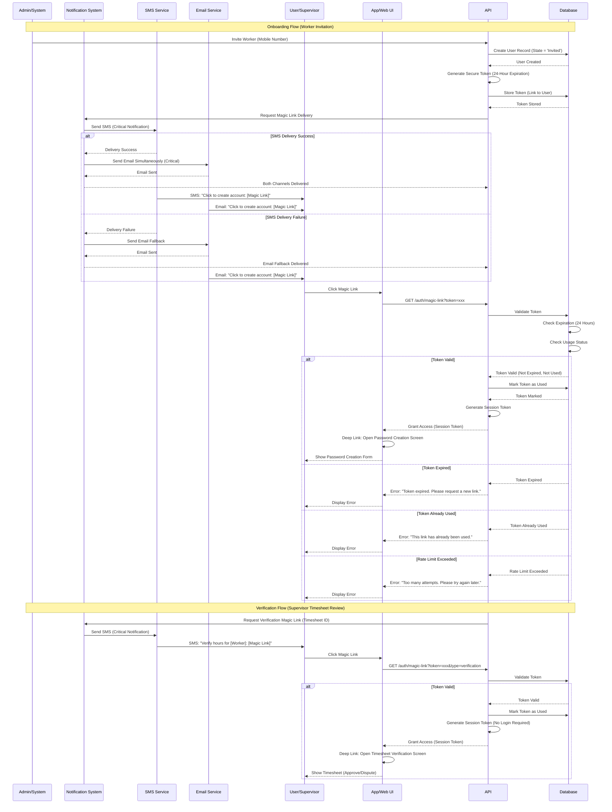
```mermaid
sequenceDiagram
    participant A as Admin/System
    participant NS as Notification System
    participant SMS as SMS Service
    participant Email as Email Service
    participant U as User/Supervisor
    participant UI as App/Web UI
    participant API as API
    participant DB as Database
    
    Note over A,DB: Onboarding Flow (Worker Invitation)
    A->>API: Invite Worker (Mobile Number)
    API->>DB: Create User Record (State = 'Invited')
    DB-->>API: User Created
    API->>API: Generate Secure Token (24-Hour Expiration)
    API->>DB: Store Token (Link to User)
    DB-->>API: Token Stored
    API->>NS: Request Magic Link Delivery
    NS->>SMS: Send SMS (Critical Notification)
    
    alt SMS Delivery Success
        SMS-->>NS: Delivery Success
        NS->>Email: Send Email Simultaneously (Critical)
        Email-->>NS: Email Sent
        NS-->>API: Both Channels Delivered
        SMS->>U: SMS: "Click to create account: [Magic Link]"
        Email->>U: Email: "Click to create account: [Magic Link]"
    else SMS Delivery Failure
        SMS-->>NS: Delivery Failure
        NS->>Email: Send Email Fallback
        Email-->>NS: Email Sent
        NS-->>API: Email Fallback Delivered
        Email->>U: Email: "Click to create account: [Magic Link]"
    end
    
    U->>UI: Click Magic Link
    UI->>API: GET /auth/magic-link?token=xxx
    
    API->>DB: Validate Token
    DB->>DB: Check Expiration (24 Hours)
    DB->>DB: Check Usage Status
    
    alt Token Valid
        DB-->>API: Token Valid (Not Expired, Not Used)
        API->>DB: Mark Token as Used
        DB-->>API: Token Marked
        API->>API: Generate Session Token
        API-->>UI: Grant Access (Session Token)
        UI->>UI: Deep Link: Open Password Creation Screen
        UI-->>U: Show Password Creation Form
    else Token Expired
        DB-->>API: Token Expired
        API-->>UI: Error: "Token expired. Please request a new link."
        UI-->>U: Display Error
    else Token Already Used
        DB-->>API: Token Already Used
        API-->>UI: Error: "This link has already been used."
        UI-->>U: Display Error
    else Rate Limit Exceeded
        DB-->>API: Rate Limit Exceeded
        API-->>UI: Error: "Too many attempts. Please try again later."
        UI-->>U: Display Error
    end
    
    Note over A,DB: Verification Flow (Supervisor Timesheet Review)
    API->>NS: Request Verification Magic Link (Timesheet ID)
    NS->>SMS: Send SMS (Critical Notification)
    SMS->>U: SMS: "Verify hours for [Worker]: [Magic Link]"
    
    U->>UI: Click Magic Link
    UI->>API: GET /auth/magic-link?token=xxx&type=verification
    
    API->>DB: Validate Token
    alt Token Valid
        DB-->>API: Token Valid
        API->>DB: Mark Token as Used
        API->>API: Generate Session Token (No Login Required)
        API-->>UI: Grant Access (Session Token)
        UI->>UI: Deep Link: Open Timesheet Verification Screen
        UI-->>U: Show Timesheet (Approve/Dispute)
    end
```

---

### From: `prd/epic-2.md`

**Enhanced Worker Onboarding Flow with State Transitions:**

*Type: flowchart, Source: `prd/epic-2.md`*

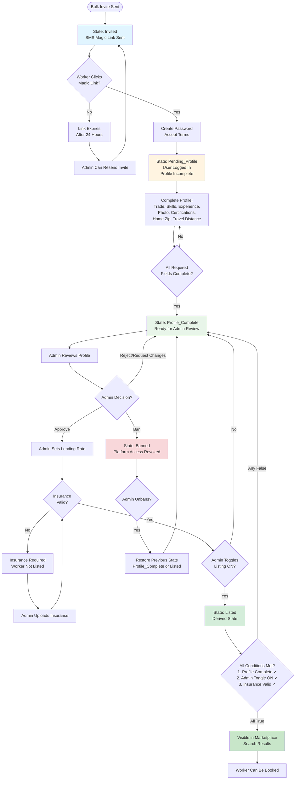
```mermaid
flowchart TD
    Start([Bulk Invite Sent]) --> Invited[State: Invited<br/>SMS Magic Link Sent]
    
    Invited --> ClickLink{Worker Clicks<br/>Magic Link?}
    ClickLink -->|Yes| CreatePassword[Create Password<br/>Accept Terms]
    ClickLink -->|No| Expired[Link Expires<br/>After 24 Hours]
    Expired --> Resend[Admin Can Resend Invite]
    Resend --> Invited
    
    CreatePassword --> PendingProfile[State: Pending_Profile<br/>User Logged In<br/>Profile Incomplete]
    
    PendingProfile --> CompleteProfile[Complete Profile:<br/>Trade, Skills, Experience,<br/>Photo, Certifications,<br/>Home Zip, Travel Distance]
    
    CompleteProfile --> ValidateProfile{All Required<br/>Fields Complete?}
    ValidateProfile -->|No| CompleteProfile
    ValidateProfile -->|Yes| ProfileComplete[State: Profile_Complete<br/>Ready for Admin Review]
    
    ProfileComplete --> AdminReview[Admin Reviews Profile]
    AdminReview --> AdminDecision{Admin Decision?}
    
    AdminDecision -->|Reject/Request Changes| ProfileComplete
    AdminDecision -->|Approve| SetRate[Admin Sets Lending Rate]
    
    SetRate --> CheckInsurance{Insurance<br/>Valid?}
    CheckInsurance -->|No| InsuranceWarning[Insurance Required<br/>Worker Not Listed]
    InsuranceWarning --> UploadInsurance[Admin Uploads Insurance]
    UploadInsurance --> CheckInsurance
    
    CheckInsurance -->|Yes| ToggleListing{Admin Toggles<br/>Listing ON?}
    ToggleListing -->|No| ProfileComplete
    ToggleListing -->|Yes| Listed[State: Listed<br/>Derived State]
    
    Listed --> CheckConditions{All Conditions Met?<br/>1. Profile Complete ✓<br/>2. Admin Toggle ON ✓<br/>3. Insurance Valid ✓}
    CheckConditions -->|All True| Visible[Visible in Marketplace<br/>Search Results]
    CheckConditions -->|Any False| ProfileComplete
    
    Visible --> Booked[Worker Can Be Booked]
    
    AdminDecision -->|Ban| Banned[State: Banned<br/>Platform Access Revoked]
    Banned --> Unban{Admin Unbans?}
    Unban -->|Yes| RestoreState[Restore Previous State<br/>Profile_Complete or Listed]
    RestoreState --> ProfileComplete
    
    style Invited fill:#e1f5ff
    style PendingProfile fill:#fff4e1
    style ProfileComplete fill:#e8f5e9
    style Listed fill:#d4edda
    style Visible fill:#c8e6c9
    style Banned fill:#f8d7da
```

---

**Worker Onboarding Sequence Diagram:**

*Type: sequenceDiagram, Source: `prd/epic-2.md`*

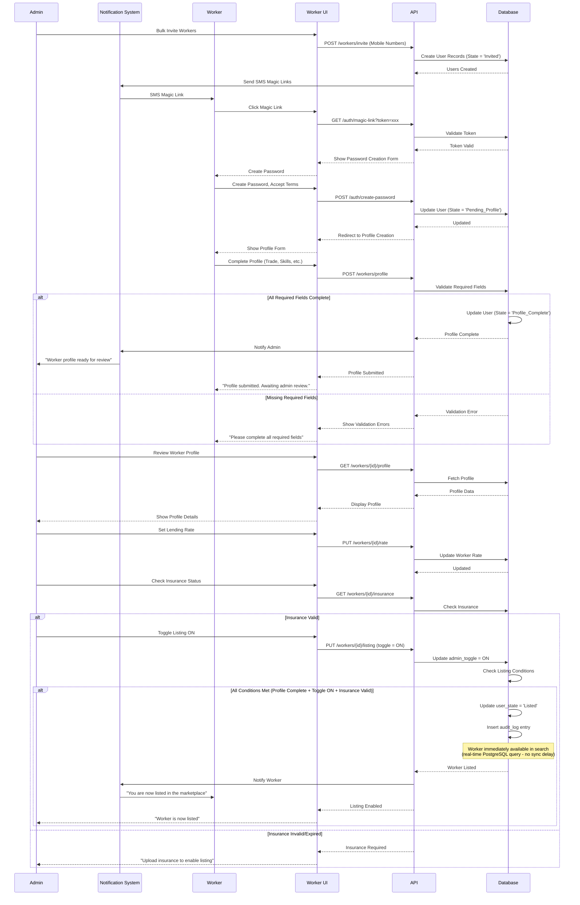
```mermaid
sequenceDiagram
    participant A as Admin
    participant NS as Notification System
    participant W as Worker
    participant UI as Worker UI
    participant API as API
    participant DB as Database
    
    A->>UI: Bulk Invite Workers
    UI->>API: POST /workers/invite (Mobile Numbers)
    API->>DB: Create User Records (State = 'Invited')
    DB-->>API: Users Created
    API->>NS: Send SMS Magic Links
    NS->>W: SMS Magic Link
    
    W->>UI: Click Magic Link
    UI->>API: GET /auth/magic-link?token=xxx
    API->>DB: Validate Token
    DB-->>API: Token Valid
    API-->>UI: Show Password Creation Form
    UI-->>W: Create Password
    
    W->>UI: Create Password, Accept Terms
    UI->>API: POST /auth/create-password
    API->>DB: Update User (State = 'Pending_Profile')
    DB-->>API: Updated
    API-->>UI: Redirect to Profile Creation
    UI-->>W: Show Profile Form
    
    W->>UI: Complete Profile (Trade, Skills, etc.)
    UI->>API: POST /workers/profile
    API->>DB: Validate Required Fields
    alt All Required Fields Complete
        DB->>DB: Update User (State = 'Profile_Complete')
        DB-->>API: Profile Complete
        API->>NS: Notify Admin
        NS->>A: "Worker profile ready for review"
        API-->>UI: Profile Submitted
        UI-->>W: "Profile submitted. Awaiting admin review."
    else Missing Required Fields
        DB-->>API: Validation Error
        API-->>UI: Show Validation Errors
        UI-->>W: "Please complete all required fields"
    end
    
    A->>UI: Review Worker Profile
    UI->>API: GET /workers/{id}/profile
    API->>DB: Fetch Profile
    DB-->>API: Profile Data
    API-->>UI: Display Profile
    UI-->>A: Show Profile Details
    
    A->>UI: Set Lending Rate
    UI->>API: PUT /workers/{id}/rate
    API->>DB: Update Worker Rate
    DB-->>API: Updated
    
    A->>UI: Check Insurance Status
    UI->>API: GET /workers/{id}/insurance
    API->>DB: Check Insurance
    alt Insurance Valid
        A->>UI: Toggle Listing ON
        UI->>API: PUT /workers/{id}/listing (toggle = ON)
        API->>DB: Update admin_toggle = ON
        DB->>DB: Check Listing Conditions
        alt All Conditions Met (Profile Complete + Toggle ON + Insurance Valid)
            DB->>DB: Update user_state = 'Listed'
            DB->>DB: Insert audit_log entry
            Note over DB: Worker immediately available in search<br/>(real-time PostgreSQL query - no sync delay)
            DB-->>API: Worker Listed
            API->>NS: Notify Worker
            NS->>W: "You are now listed in the marketplace"
            API-->>UI: Listing Enabled
            UI-->>A: "Worker is now listed"
        end
    else Insurance Invalid/Expired
        API-->>UI: Insurance Required
        UI-->>A: "Upload insurance to enable listing"
    end
```

---

**Company Onboarding Wizard Flow Diagram:**

*Type: flowchart, Source: `prd/epic-2.md`*

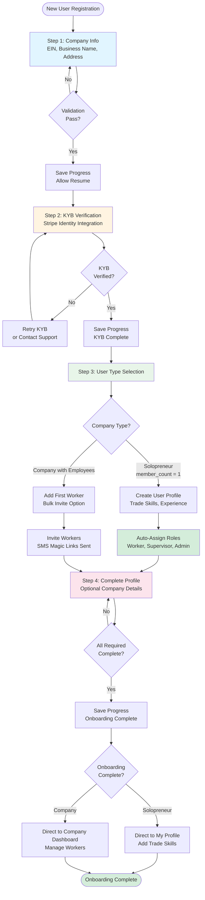
```mermaid
flowchart TD
    Start([New User Registration]) --> Step1[Step 1: Company Info<br/>EIN, Business Name, Address]
    
    Step1 --> Validate1{Validation<br/>Pass?}
    Validate1 -->|No| Step1
    Validate1 -->|Yes| SaveProgress1[Save Progress<br/>Allow Resume]
    
    SaveProgress1 --> Step2[Step 2: KYB Verification<br/>Stripe Identity Integration]
    Step2 --> Validate2{KYB<br/>Verified?}
    
    Validate2 -->|No| RetryKYB[Retry KYB<br/>or Contact Support]
    RetryKYB --> Step2
    Validate2 -->|Yes| SaveProgress2[Save Progress<br/>KYB Complete]
    
    SaveProgress2 --> Step3[Step 3: User Type Selection]
    Step3 --> CheckType{Company Type?}
    
    CheckType -->|Solopreneur<br/>member_count = 1| SolopreneurPath[Create User Profile<br/>Trade Skills, Experience]
    CheckType -->|Company with Employees| CompanyPath[Add First Worker<br/>Bulk Invite Option]
    
    SolopreneurPath --> AutoRoles[Auto-Assign Roles<br/>Worker, Supervisor, Admin]
    CompanyPath --> InviteWorkers[Invite Workers<br/>SMS Magic Links Sent]
    
    AutoRoles --> Step4[Step 4: Complete Profile<br/>Optional Company Details]
    InviteWorkers --> Step4
    
    Step4 --> Validate4{All Required<br/>Complete?}
    Validate4 -->|No| Step4
    Validate4 -->|Yes| SaveProgress4[Save Progress<br/>Onboarding Complete]
    
    SaveProgress4 --> CheckCompletion{Onboarding<br/>Complete?}
    CheckCompletion -->|Solopreneur| DirectToProfile[Direct to My Profile<br/>Add Trade Skills]
    CheckCompletion -->|Company| DirectToDashboard[Direct to Company Dashboard<br/>Manage Workers]
    
    DirectToProfile --> End([Onboarding Complete])
    DirectToDashboard --> End
    
    style Step1 fill:#e1f5ff
    style Step2 fill:#fff4e1
    style Step3 fill:#e8f5e9
    style Step4 fill:#fce4ec
    style AutoRoles fill:#d4edda
    style End fill:#d4edda
```

---

**Company Onboarding Sequence Diagram:**

*Type: sequenceDiagram, Source: `prd/epic-2.md`*

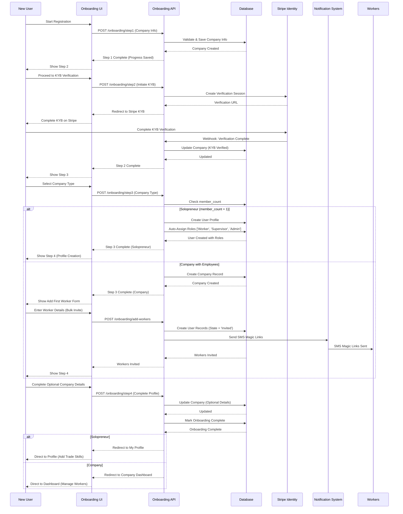
```mermaid
sequenceDiagram
    participant U as New User
    participant UI as Onboarding UI
    participant API as Onboarding API
    participant DB as Database
    participant Stripe as Stripe Identity
    participant NS as Notification System
    
    U->>UI: Start Registration
    UI->>API: POST /onboarding/step1 (Company Info)
    API->>DB: Validate & Save Company Info
    DB-->>API: Company Created
    API-->>UI: Step 1 Complete (Progress Saved)
    UI-->>U: Show Step 2
    
    U->>UI: Proceed to KYB Verification
    UI->>API: POST /onboarding/step2 (Initiate KYB)
    API->>Stripe: Create Verification Session
    Stripe-->>API: Verification URL
    API-->>UI: Redirect to Stripe KYB
    UI-->>U: Complete KYB on Stripe
    
    U->>Stripe: Complete KYB Verification
    Stripe->>API: Webhook: Verification Complete
    API->>DB: Update Company (KYB Verified)
    DB-->>API: Updated
    API-->>UI: Step 2 Complete
    UI-->>U: Show Step 3
    
    U->>UI: Select Company Type
    UI->>API: POST /onboarding/step3 (Company Type)
    API->>DB: Check member_count
    
    alt Solopreneur (member_count = 1)
        API->>DB: Create User Profile
        API->>DB: Auto-Assign Roles ['Worker', 'Supervisor', 'Admin']
        DB-->>API: User Created with Roles
        API-->>UI: Step 3 Complete (Solopreneur)
        UI-->>U: Show Step 4 (Profile Creation)
    else Company with Employees
        API->>DB: Create Company Record
        DB-->>API: Company Created
        API-->>UI: Step 3 Complete (Company)
        UI-->>U: Show Add First Worker Form
        U->>UI: Enter Worker Details (Bulk Invite)
        UI->>API: POST /onboarding/add-workers
        API->>DB: Create User Records (State = 'Invited')
        API->>NS: Send SMS Magic Links
        NS->>Workers: SMS Magic Links Sent
        DB-->>API: Workers Invited
        API-->>UI: Workers Invited
        UI-->>U: Show Step 4
    end
    
    U->>UI: Complete Optional Company Details
    UI->>API: POST /onboarding/step4 (Complete Profile)
    API->>DB: Update Company (Optional Details)
    DB-->>API: Updated
    API->>DB: Mark Onboarding Complete
    DB-->>API: Onboarding Complete
    
    alt Solopreneur
        API-->>UI: Redirect to My Profile
        UI-->>U: Direct to Profile (Add Trade Skills)
    else Company
        API-->>UI: Redirect to Company Dashboard
        UI-->>U: Direct to Dashboard (Manage Workers)
    end
```

---

**Insurance Expiration Timeline:**

*Type: gantt, Source: `prd/epic-2.md`*

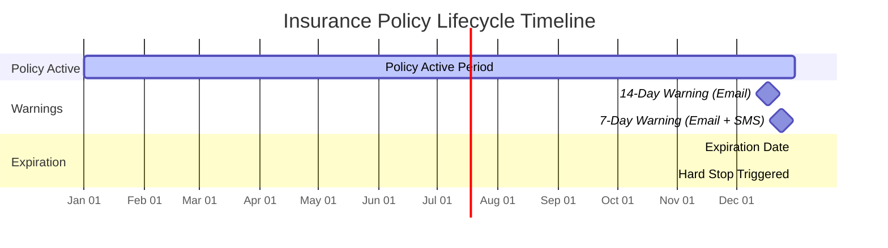
```mermaid
gantt
    title Insurance Policy Lifecycle Timeline
    dateFormat YYYY-MM-DD
    axisFormat %b %d
    
    section Policy Active
    Policy Active Period           :active, policy, 2026-01-01, 2026-12-31
    
    section Warnings
    14-Day Warning (Email)         :milestone, warn14, 2026-12-17, 0d
    7-Day Warning (Email + SMS)    :milestone, warn7, 2026-12-24, 0d
    
    section Expiration
    Expiration Date                :crit, expire, 2026-12-31, 0d
    Hard Stop Triggered            :crit, hardstop, 2026-12-31, 0d
```

---

**Insurance Gating and Hard Stop Flow:**

*Type: flowchart, Source: `prd/epic-2.md`*

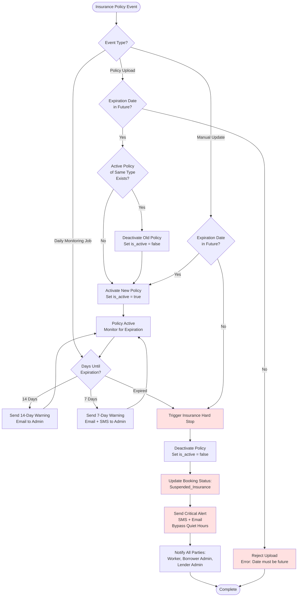
```mermaid
flowchart TD
    Start([Insurance Policy Event]) --> CheckEvent{Event Type?}
    
    CheckEvent -->|Policy Upload| ValidateUpload{Expiration Date<br/>in Future?}
    ValidateUpload -->|No| RejectUpload[Reject Upload<br/>Error: Date must be future]
    ValidateUpload -->|Yes| CheckActive{Active Policy<br/>of Same Type<br/>Exists?}
    
    CheckActive -->|Yes| DeactivateOld[Deactivate Old Policy<br/>Set is_active = false]
    CheckActive -->|No| ActivateNew[Activate New Policy<br/>Set is_active = true]
    DeactivateOld --> ActivateNew
    
    CheckEvent -->|Daily Monitoring Job| CheckExpiration{Days Until<br/>Expiration?}
    
    CheckExpiration -->|14 Days| Send14DayWarning[Send 14-Day Warning<br/>Email to Admin]
    CheckExpiration -->|7 Days| Send7DayWarning[Send 7-Day Warning<br/>Email + SMS to Admin]
    CheckExpiration -->|Expired| TriggerHardStop[Trigger Insurance Hard Stop]
    
    CheckEvent -->|Manual Update| ValidateManualUpdate{Expiration Date<br/>in Future?}
    ValidateManualUpdate -->|No| TriggerHardStop
    ValidateManualUpdate -->|Yes| ActivateNew
    
    TriggerHardStop --> DeactivatePolicy[Deactivate Policy<br/>Set is_active = false]
    DeactivatePolicy --> UpdateBookingStatus[Update Booking Status:<br/>Suspended_Insurance]
    UpdateBookingStatus --> SendCriticalAlert[Send Critical Alert<br/>SMS + Email<br/>Bypass Quiet Hours]
    SendCriticalAlert --> NotifyParties[Notify All Parties:<br/>Worker, Borrower Admin,<br/>Lender Admin]
    NotifyParties --> End([Complete])
    
    ActivateNew --> MonitorPolicy[Policy Active<br/>Monitor for Expiration]
    Send14DayWarning --> MonitorPolicy
    Send7DayWarning --> MonitorPolicy
    RejectUpload --> End
    
    MonitorPolicy --> CheckExpiration
    
    style TriggerHardStop fill:#ffe1e1
    style SendCriticalAlert fill:#ffe1e1
    style RejectUpload fill:#ffe1e1
    style UpdateBookingStatus fill:#ffe1e1
```

---

**Insurance Hard Stop Sequence Diagram:**

*Type: sequenceDiagram, Source: `prd/epic-2.md`*

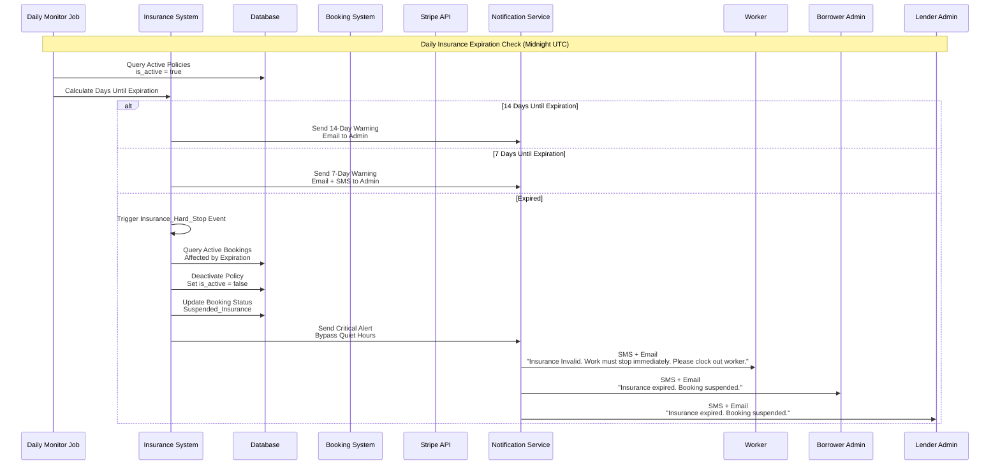
```mermaid
sequenceDiagram
    participant Monitor as Daily Monitor Job
    participant System as Insurance System
    participant DB as Database
    participant Booking as Booking System
    participant Stripe as Stripe API
    participant Notif as Notification Service
    participant Worker as Worker
    participant BorrowerAdmin as Borrower Admin
    participant LenderAdmin as Lender Admin
    
    Note over Monitor,LenderAdmin: Daily Insurance Expiration Check (Midnight UTC)
    
    Monitor->>DB: Query Active Policies<br/>is_active = true
    Monitor->>System: Calculate Days Until Expiration
    
    alt 14 Days Until Expiration
        System->>Notif: Send 14-Day Warning<br/>Email to Admin
    else 7 Days Until Expiration
        System->>Notif: Send 7-Day Warning<br/>Email + SMS to Admin
    else Expired
        System->>System: Trigger Insurance_Hard_Stop Event
        
        System->>DB: Query Active Bookings<br/>Affected by Expiration
        System->>DB: Deactivate Policy<br/>Set is_active = false
        
        System->>DB: Update Booking Status<br/>Suspended_Insurance
        
        System->>Notif: Send Critical Alert<br/>Bypass Quiet Hours
        Notif->>Worker: SMS + Email<br/>"Insurance Invalid. Work must stop immediately. Please clock out worker."
        Notif->>BorrowerAdmin: SMS + Email<br/>"Insurance expired. Booking suspended."
        Notif->>LenderAdmin: SMS + Email<br/>"Insurance expired. Booking suspended."
    end
```

---

**Insurance Gating and Expiration Workflow Diagrams**

*Type: stateDiagram-v2, Source: `prd/epic-2.md`, Section: Insurance Gating and Expiration Workflow Diagrams*

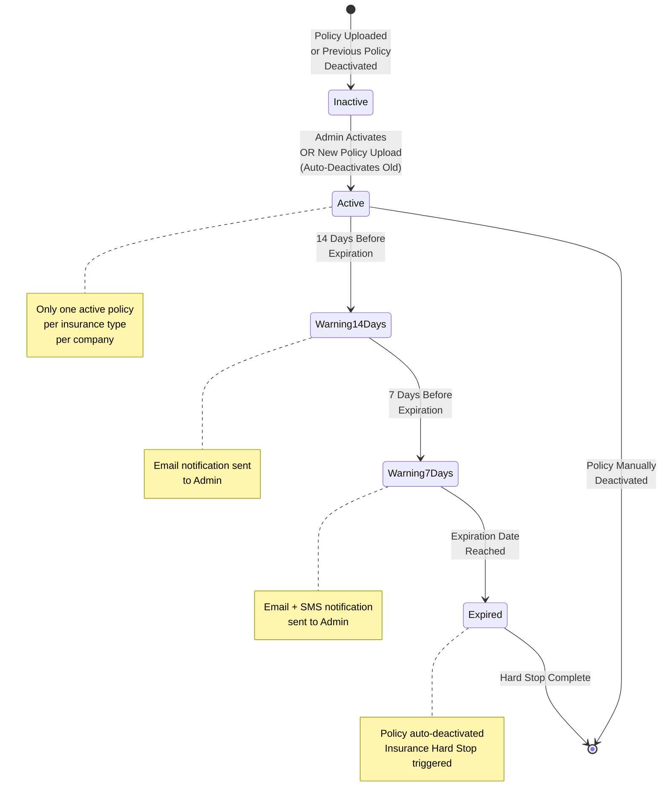
```mermaid
stateDiagram-v2
    [*] --> Inactive: Policy Uploaded<br/>or Previous Policy<br/>Deactivated
    
    Inactive --> Active: Admin Activates<br/>OR New Policy Upload<br/>(Auto-Deactivates Old)
    note right of Active
        Only one active policy
        per insurance type
        per company
    end note
    
    Active --> Warning14Days: 14 Days Before<br/>Expiration
    note right of Warning14Days
        Email notification sent
        to Admin
    end note
    
    Warning14Days --> Warning7Days: 7 Days Before<br/>Expiration
    note right of Warning7Days
        Email + SMS notification
        sent to Admin
    end note
    
    Warning7Days --> Expired: Expiration Date<br/>Reached
    note right of Expired
        Policy auto-deactivated
        Insurance Hard Stop triggered
    end note
    
    Expired --> [*]: Hard Stop Complete
    
    Active --> [*]: Policy Manually<br/>Deactivated
```

---

**Worker Onboarding Journey**

*Type: journey, Source: `prd/epic-2.md`, Section: Worker Onboarding Journey*

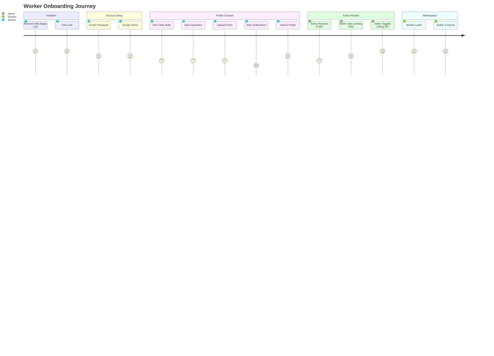
```mermaid
journey
    title Worker Onboarding Journey
    section Invitation
      Receive SMS Magic Link: 5: Worker
      Click Link: 5: Worker
    section Account Setup
      Create Password: 4: Worker
      Accept Terms: 4: Worker
    section Profile Creation
      Add Trade Skills: 3: Worker
      Add Experience: 3: Worker
      Upload Photo: 3: Worker
      Add Certifications: 2: Worker
      Submit Profile: 4: Worker
    section Admin Review
      Admin Reviews Profile: 3: Admin
      Admin Sets Lending Rate: 4: Admin
      Admin Toggles Listing ON: 5: Admin
    section Marketplace
      Worker Listed: 5: System
      Visible in Search: 5: System
```

---

**Worker State Machine Diagram:**

*Type: stateDiagram-v2, Source: `prd/epic-2.md`, Section: Worker State Machine*

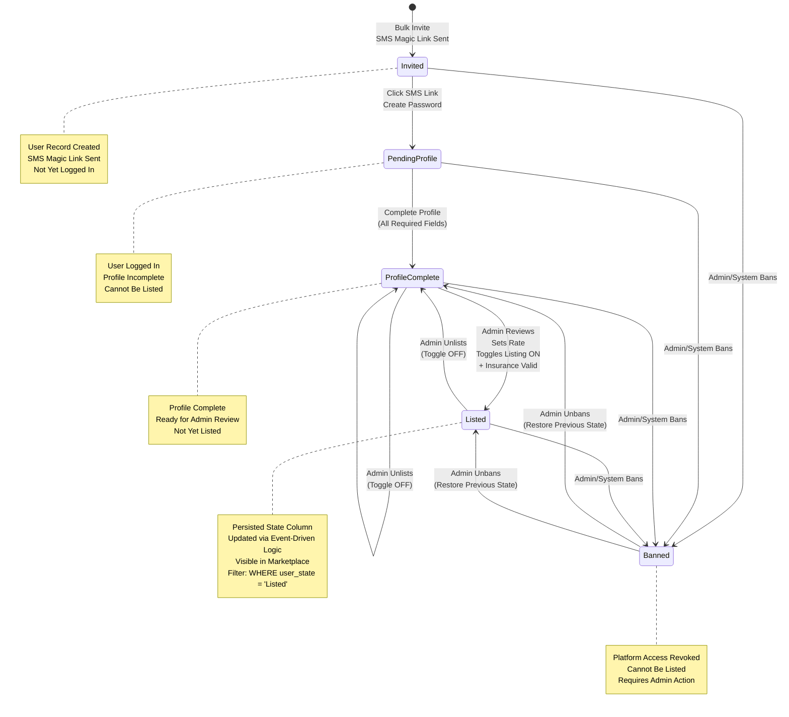
```mermaid
stateDiagram-v2
    [*] --> Invited: Bulk Invite<br/>SMS Magic Link Sent
    Invited --> PendingProfile: Click SMS Link<br/>Create Password
    Invited --> Banned: Admin/System Bans
    
    PendingProfile --> ProfileComplete: Complete Profile<br/>(All Required Fields)
    PendingProfile --> Banned: Admin/System Bans
    
    ProfileComplete --> Listed: Admin Reviews<br/>Sets Rate<br/>Toggles Listing ON<br/>+ Insurance Valid
    ProfileComplete --> ProfileComplete: Admin Unlists<br/>(Toggle OFF)
    ProfileComplete --> Banned: Admin/System Bans
    
    Listed --> ProfileComplete: Admin Unlists<br/>(Toggle OFF)
    Listed --> Banned: Admin/System Bans
    
    Banned --> ProfileComplete: Admin Unbans<br/>(Restore Previous State)
    Banned --> Listed: Admin Unbans<br/>(Restore Previous State)
    
    note right of Invited
        User Record Created
        SMS Magic Link Sent
        Not Yet Logged In
    end note
    
    note right of PendingProfile
        User Logged In
        Profile Incomplete
        Cannot Be Listed
    end note
    
    note right of ProfileComplete
        Profile Complete
        Ready for Admin Review
        Not Yet Listed
    end note
    
    note right of Listed
        Persisted State Column
        Updated via Event-Driven Logic
        Visible in Marketplace
        Filter: WHERE user_state = 'Listed'
    end note
    
    note right of Banned
        Platform Access Revoked
        Cannot Be Listed
        Requires Admin Action
    end note
```

---

### From: `prd/epic-3.md`

*Type: sequenceDiagram, Source: `prd/epic-3.md`*

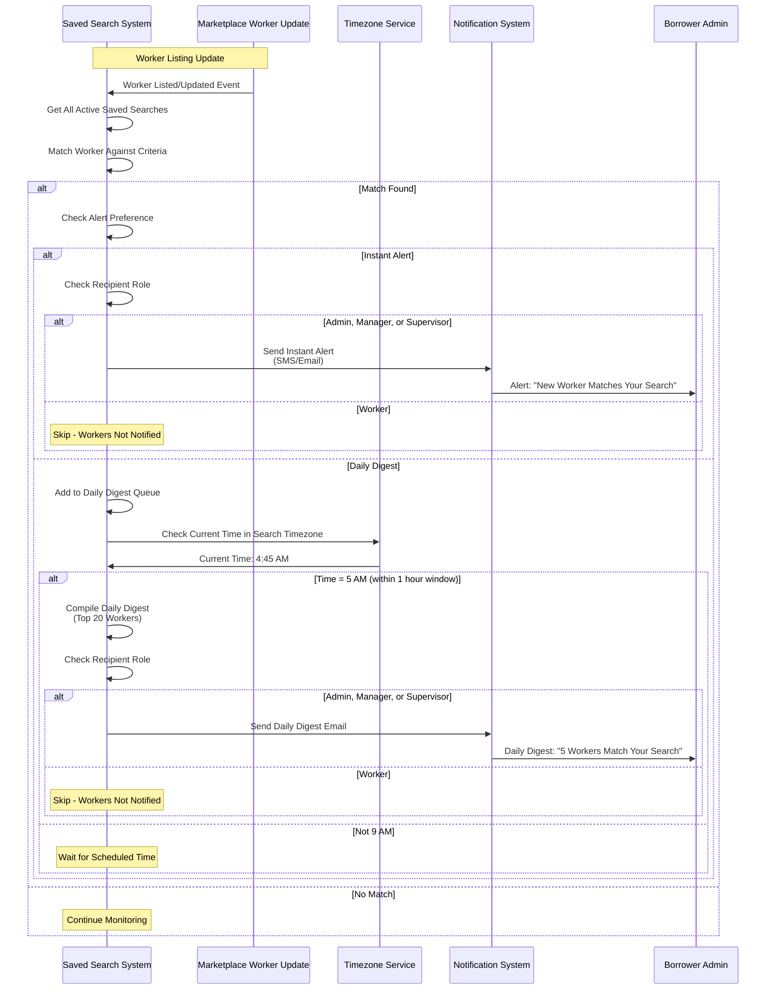
```mermaid
sequenceDiagram
    participant SS as Saved Search System
    participant MW as Marketplace Worker Update
    participant TZ as Timezone Service
    participant NS as Notification System
    participant B as Borrower Admin

    Note over SS,MW: Worker Listing Update
    MW->>SS: Worker Listed/Updated Event
    SS->>SS: Get All Active Saved Searches
    SS->>SS: Match Worker Against Criteria
    
    alt Match Found
        SS->>SS: Check Alert Preference
        
        alt Instant Alert
            SS->>SS: Check Recipient Role
            alt Admin, Manager, or Supervisor
                SS->>NS: Send Instant Alert<br/>(SMS/Email)
                NS->>B: Alert: "New Worker Matches Your Search"
            else Worker
                Note over SS: Skip - Workers Not Notified
            end
        else Daily Digest
            SS->>SS: Add to Daily Digest Queue
            SS->>TZ: Check Current Time in Search Timezone
            TZ->>SS: Current Time: 4:45 AM
            
            alt Time = 5 AM (within 1 hour window)
                SS->>SS: Compile Daily Digest<br/>(Top 20 Workers)
                SS->>SS: Check Recipient Role
                alt Admin, Manager, or Supervisor
                    SS->>NS: Send Daily Digest Email
                    NS->>B: Daily Digest: "5 Workers Match Your Search"
                else Worker
                    Note over SS: Skip - Workers Not Notified
                end
            else Not 9 AM
                Note over SS: Wait for Scheduled Time
            end
        end
    else No Match
        Note over SS: Continue Monitoring
    end
```

---

**Saved Search Alert Flow Diagrams:**

*Type: flowchart, Source: `prd/epic-3.md`, Section: Story 3.7: Saved Searches & Alerts {#story-37-saved-searches--alerts}*

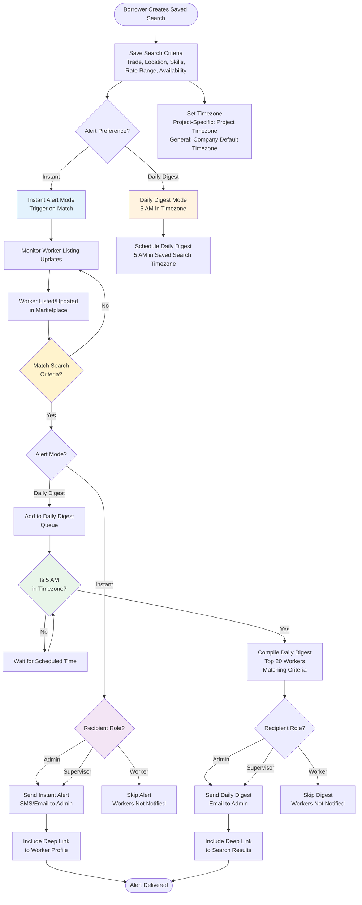
```mermaid
flowchart TD
    Start([Borrower Creates Saved Search]) --> SaveCriteria[Save Search Criteria<br/>Trade, Location, Skills,<br/>Rate Range, Availability]
    SaveCriteria --> SetPreference{Alert Preference?}
    
    SetPreference -->|Instant| InstantAlert[Instant Alert Mode<br/>Trigger on Match]
    SetPreference -->|Daily Digest| DailyDigest[Daily Digest Mode<br/>5 AM in Timezone]
    
    SaveCriteria --> SetTimezone[Set Timezone<br/>Project-Specific: Project Timezone<br/>General: Company Default Timezone]
    
    InstantAlert --> Monitor[Monitor Worker Listing Updates]
    DailyDigest --> Schedule[Schedule Daily Digest<br/>5 AM in Saved Search Timezone]
    
    Monitor --> WorkerUpdate[Worker Listed/Updated<br/>in Marketplace]
    WorkerUpdate --> MatchCheck{Match Search<br/>Criteria?}
    
    MatchCheck -->|No| Monitor
    MatchCheck -->|Yes| CheckInstant{Alert Mode?}
    
    CheckInstant -->|Instant| CheckRole{Recipient Role?}
    CheckInstant -->|Daily Digest| AddToDigest[Add to Daily Digest<br/>Queue]
    
    CheckRole -->|Admin| SendInstant[Send Instant Alert<br/>SMS/Email to Admin]
    CheckRole -->|Supervisor| SendInstant
    CheckRole -->|Worker| Skip[Skip Alert<br/>Workers Not Notified]
    
    AddToDigest --> CheckTime{Is 5 AM<br/>in Timezone?}
    CheckTime -->|No| Wait[Wait for Scheduled Time]
    CheckTime -->|Yes| CompileDigest[Compile Daily Digest<br/>Top 20 Workers<br/>Matching Criteria]
    
    CompileDigest --> CheckRoleDigest{Recipient Role?}
    CheckRoleDigest -->|Admin| SendDigest[Send Daily Digest<br/>Email to Admin]
    CheckRoleDigest -->|Supervisor| SendDigest
    CheckRoleDigest -->|Worker| SkipDigest[Skip Digest<br/>Workers Not Notified]
    
    SendInstant --> IncludeLink[Include Deep Link<br/>to Worker Profile]
    SendDigest --> IncludeLinkDigest[Include Deep Link<br/>to Search Results]
    
    IncludeLink --> Complete([Alert Delivered])
    IncludeLinkDigest --> Complete
    
    Wait --> CheckTime
    
    style InstantAlert fill:#e3f2fd
    style DailyDigest fill:#fff3e0
    style MatchCheck fill:#fff3cd
    style CheckRole fill:#f3e5f5
    style CheckTime fill:#e8f5e9
```

---

### From: `prd/epic-4.md`

**Weekly Payment Flow Diagram:**

*Type: flowchart, Source: `prd/epic-4.md`*

```mermaid
flowchart TD
    Start([Wednesday 10:00 AM<br/>Project Timezone]) --> QueryBookings[Query Active Bookings<br/>payment_type = Weekly_Progress<br/>status = Active]
    
    QueryBookings --> ForEach{For Each Booking}
    
    ForEach --> CheckDispute{Active Dispute<br/>or Pending<br/>Incident Report?}
    
    CheckDispute -->|Yes| SkipPayment[Skip Payment<br/>Status: Payment_Paused_Dispute]
    CheckDispute -->|No| CalculateAmount[Calculate Chargeable Amount<br/>Next Week's Shifts]
    
    CalculateAmount --> AttemptCharge[Attempt Stripe Charge<br/>Card on File]
    
    AttemptCharge --> PaymentResult{Payment<br/>Result?}
    
    PaymentResult -->|Success| PaymentSuccess[Payment Success]
    PaymentSuccess --> ExtendFunded[Extend Funded Period<br/>+7 days<br/>Status Remains Active]
    ExtendFunded --> NotifySuccess[Notify Borrower Admin:<br/>Payment Successful]
    NotifySuccess --> End2([End])
    
    PaymentResult -->|Failure| PaymentFailure[Payment Failure]
    PaymentFailure --> KeepActive[Status Remains Active<br/>No Status Change]
    KeepActive --> NotifyActionRequired[Action Required Notification<br/>SMS + Email to Borrower Admin<br/>Wednesday 10:00 AM]
    
    NotifyActionRequired --> Wait2PM[Wait Until 2:00 PM]
    
    Wait2PM --> Check2PM{Wednesday 2:00 PM<br/>Final Warning?}
    
    Check2PM -->|Yes - Still Unpaid| FinalWarning[Final Warning Notification<br/>SMS + Email to Borrower Admin]
    FinalWarning --> WaitMidnight[Wait Until 11:59 PM]
    
    Check2PM -->|No| WaitMidnight
    
    WaitMidnight --> CheckMidnight{Wednesday 11:59 PM<br/>Hard Cutoff?}
    
    CheckMidnight -->|Yes - Still Unpaid| HardCutoff[Hard Cutoff Triggered]
    
    HardCutoff --> ReleaseWorker[Release Worker:<br/>end_date = Sunday<br/>Status = Completed<br/>Cancel Future Shifts]
    ReleaseWorker --> NotifyRelease[Worker Released Notification<br/>SMS + Email to All Parties:<br/>Borrower Admin, Lender Admin, Worker]
    NotifyRelease --> End3([End])
    
    CheckMidnight -->|No| End4([End])
    
    SkipPayment --> End5([End])
    
    style Start fill:#e1f5ff
    style PaymentSuccess fill:#e1ffe1
    style PaymentFailure fill:#fff4e1
    style HardCutoff fill:#ffe1e1
    style NotifyRelease fill:#ffe1e1
```

---

**Weekly Payment Sequence Diagram:**

*Type: sequenceDiagram, Source: `prd/epic-4.md`*

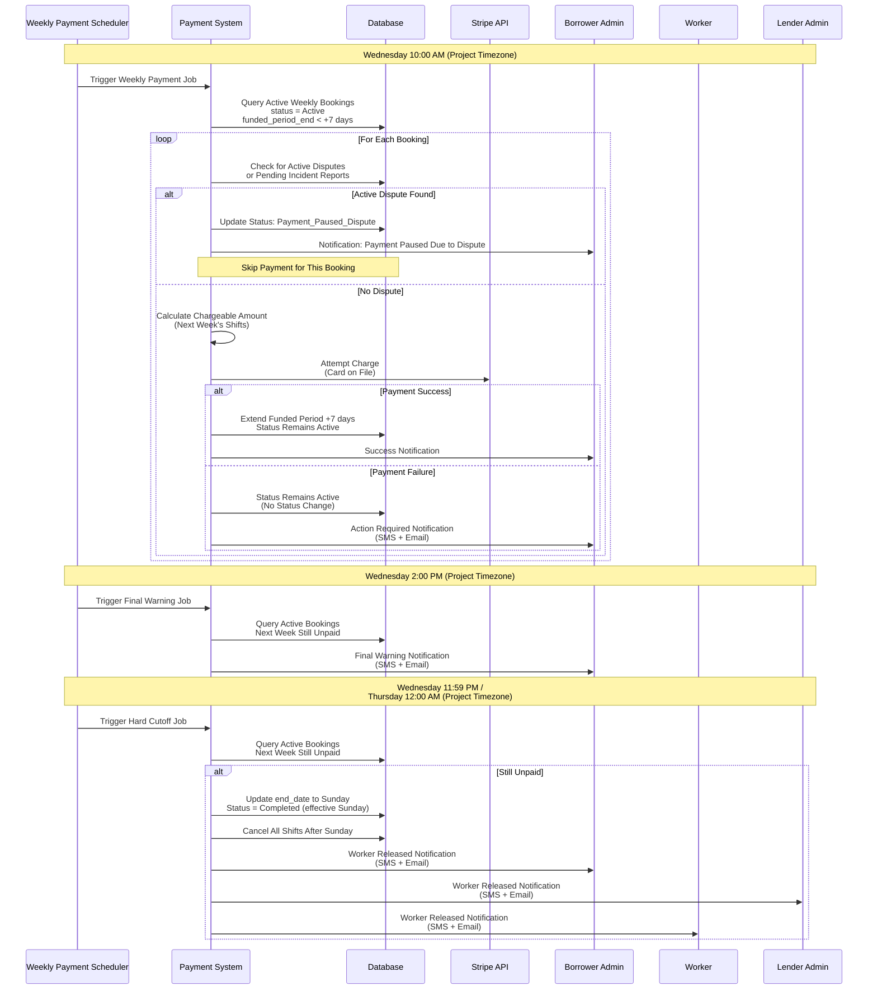
```mermaid
sequenceDiagram
    participant Scheduler as Weekly Payment Scheduler
    participant System as Payment System
    participant DB as Database
    participant Stripe as Stripe API
    participant Borrower as Borrower Admin
    participant Worker as Worker
    participant Lender as Lender Admin
    
    Note over Scheduler,Lender: Wednesday 10:00 AM (Project Timezone)
    
    Scheduler->>System: Trigger Weekly Payment Job
    System->>DB: Query Active Weekly Bookings<br/>status = Active<br/>funded_period_end < +7 days
    
    loop For Each Booking
        System->>DB: Check for Active Disputes<br/>or Pending Incident Reports
        
        alt Active Dispute Found
            System->>DB: Update Status: Payment_Paused_Dispute
            System->>Borrower: Notification: Payment Paused Due to Dispute
            Note over System,DB: Skip Payment for This Booking
        else No Dispute
            System->>System: Calculate Chargeable Amount<br/>(Next Week's Shifts)
            System->>Stripe: Attempt Charge<br/>(Card on File)
            
            alt Payment Success
                System->>DB: Extend Funded Period +7 days<br/>Status Remains Active
                System->>Borrower: Success Notification
            else Payment Failure
                System->>DB: Status Remains Active<br/>(No Status Change)
                System->>Borrower: Action Required Notification<br/>(SMS + Email)
            end
        end
    end
    
    Note over Scheduler,Lender: Wednesday 2:00 PM (Project Timezone)
    
    Scheduler->>System: Trigger Final Warning Job
    System->>DB: Query Active Bookings<br/>Next Week Still Unpaid
    System->>Borrower: Final Warning Notification<br/>(SMS + Email)
    
    Note over Scheduler,Lender: Wednesday 11:59 PM /<br/>Thursday 12:00 AM (Project Timezone)
    
    Scheduler->>System: Trigger Hard Cutoff Job
    System->>DB: Query Active Bookings<br/>Next Week Still Unpaid
    
    alt Still Unpaid
        System->>DB: Update end_date to Sunday<br/>Status = Completed (effective Sunday)
        System->>DB: Cancel All Shifts After Sunday
        System->>Borrower: Worker Released Notification<br/>(SMS + Email)
        System->>Lender: Worker Released Notification<br/>(SMS + Email)
        System->>Worker: Worker Released Notification<br/>(SMS + Email)
    end
```

---

**Booking Flow**

*Type: sequenceDiagram, Source: `prd/epic-4.md`, Section: Booking Flow*

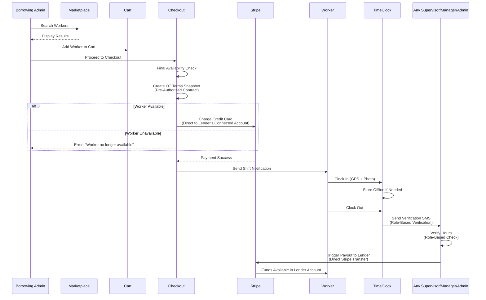
```mermaid
sequenceDiagram
    participant BorrowingAdmin as Borrowing Admin
    participant Marketplace
    participant Cart
    participant Checkout
    participant Stripe
    participant Worker
    participant TimeClock
    participant Verifier as Any Supervisor/Manager/Admin
    
    BorrowingAdmin->>Marketplace: Search Workers
    Marketplace-->>BorrowingAdmin: Display Results
    BorrowingAdmin->>Cart: Add Worker to Cart
    BorrowingAdmin->>Checkout: Proceed to Checkout
    Checkout->>Checkout: Final Availability Check
    Checkout->>Checkout: Create OT Terms Snapshot<br/>(Pre-Authorized Contract)
    alt Worker Available
        Checkout->>Stripe: Charge Credit Card<br/>(Direct to Lender's Connected Account)
    else Worker Unavailable
        Checkout-->>BorrowingAdmin: Error: "Worker no longer available"
    end
    Stripe-->>Checkout: Payment Success
    Checkout->>Worker: Send Shift Notification
    Worker->>TimeClock: Clock In (GPS + Photo)
    TimeClock->>TimeClock: Store Offline if Needed
    Worker->>TimeClock: Clock Out
    TimeClock->>Verifier: Send Verification SMS<br/>(Role-Based Verification)
    Verifier->>Verifier: Verify Hours<br/>(Role-Based Check)
    Verifier->>Stripe: Trigger Payout to Lender<br/>(Direct Stripe Transfer)
    Stripe->>Worker: Funds Available in Lender Account
```

---

**Booking Journey**

*Type: journey, Source: `prd/epic-4.md`, Section: Booking Journey*

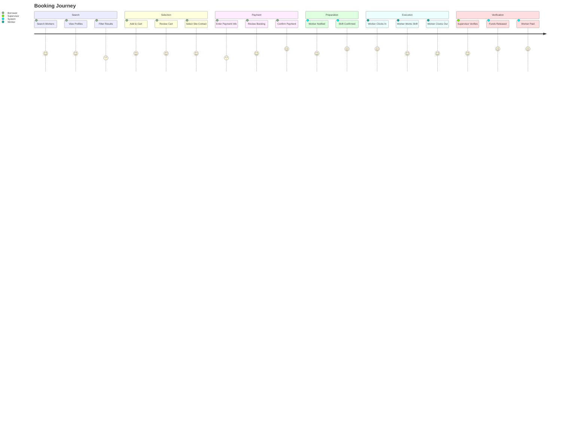
```mermaid
journey
    title Booking Journey
    section Search
      Search Workers: 4: Borrower
      View Profiles: 4: Borrower
      Filter Results: 3: Borrower
    section Selection
      Add to Cart: 4: Borrower
      Review Cart: 4: Borrower
      Select Site Contact: 4: Borrower
    section Payment
      Enter Payment Info: 3: Borrower
      Review Booking: 4: Borrower
      Confirm Payment: 5: Borrower
    section Preparation
      Worker Notified: 4: System
      Shift Confirmed: 5: System
    section Execution
      Worker Clocks In: 5: Worker
      Worker Works Shift: 4: Worker
      Worker Clocks Out: 4: Worker
    section Verification
      Supervisor Verifies: 4: Supervisor
      Funds Released: 5: System
      Worker Paid: 5: System
```

---

**Booking Status State Machine Diagram:**

*Type: stateDiagram-v2, Source: `prd/epic-4.md`, Section: Booking Status State Machine*

```mermaid
stateDiagram-v2
    [*] --> PendingPayment: Cart Created
    PendingPayment --> Confirmed: Payment Succeeds
    PendingPayment --> Cancelled: Payment Fails
    
    Confirmed --> Active: First Shift Starts
    Confirmed --> Cancelled: Cancellation Requested<br/>(Before Shifts Start)
    
    Active --> SuspendedInsurance: Insurance Expired/Revoked<br/>(Compliance Event)
    Active --> PaymentPausedDispute: Weekly Payment Check<br/>Detects Option A Dispute<br/>(Wednesday 10 AM)
    Active --> Disputed: Funds Held via Stripe<br/>(Disputed Shift - Stripe Escrow/Hold)
    Active --> Completed: All Shifts Verified<br/>OR Hard Cutoff<br/>(Wednesday 11:59 PM)
    Active --> Cancelled: Cancellation Requested<br/>or Option B Dispute Filed
    
    SuspendedInsurance --> Active: Insurance Renewed<br/>Booking Resumes<br/>(No Active Dispute)
    SuspendedInsurance --> PaymentPausedDispute: Option A Dispute Filed<br/>(Dispute Takes Precedence)
    SuspendedInsurance --> Cancelled: Option B Dispute Filed<br/>(Immediate)
    
    PaymentPausedDispute --> Active: Dispute Resolved<br/>Booking Continues
    PaymentPausedDispute --> SuspendedInsurance: Insurance Expires<br/>(Insurance Compliance Takes Precedence)
    PaymentPausedDispute --> Cancelled: Option B Dispute Filed<br/>or Cancellation
    
    Disputed --> Active: Dispute Resolved<br/>(Remaining Shifts)
    Disputed --> Completed: Dispute Resolved<br/>(All Shifts Complete)
    
    Completed --> [*]: Booking Complete
    Cancelled --> [*]: Booking Cancelled
    
    note right of PendingPayment
        Cart State
        Payment Not Processed
    end note
    
    note right of Confirmed
        Payment Successful
        Payment Processed via Stripe
    end note
    
    note right of Active
        Shifts In Progress
        Weekly Payments Active
        Pay or Release Model:
        - Wed 10 AM: Payment Attempt
        - Wed 2 PM: Final Warning
        - Wed 11:59 PM: Worker Released
        (Status remains Active until hard cutoff)
    end note
    
    note right of SuspendedInsurance
        Compliance Event: Insurance Failure
        Blocks Clock-In
        Independent of Payment Processing
    end note
    
    note right of Disputed
        Financial State
        Funds Held via Stripe Escrow/Hold
        (Stripe API Hold for Disputes)
        Booking Can Remain Active
        (Option A Disputes)
        OR Booking Cancelled
        (Option B Disputes)
    end note
    
    note right of PaymentPausedDispute
        Weekly Payment Paused
        Dispute/Incident Active
        Workers CAN Clock In
        (Only payment paused, not access)
    end note
```

---

**Site Contact & Verification Workflow:**

*Type: sequenceDiagram, Source: `prd/epic-4.md`, Section: Story 4.2: Site Contact & Verification {#story-42-site-contact-verification}*

```mermaid
sequenceDiagram
    participant Admin as Borrowing Admin
    participant System as System
    participant DB as Database
    participant SiteContact as Primary Site Contact
    participant Worker as Worker
    participant AnySupervisor as Any Supervisor/Manager/Admin
    
    Note over Admin,Worker: Booking Checkout Flow
    
    Admin->>System: Create Booking (Checkout)
    Admin->>System: Select Primary Site Contact<br/>from Company Members
    System->>DB: Set bookings.primary_site_contact_id
    System->>SiteContact: Send Notification:<br/>"You are Site Contact for [Booking]"
    System->>Worker: Send "Report To" Notification<br/>with Site Contact Name & Phone
    
    Note over Worker,AnySupervisor: Worker Clock-Out & Verification
    
    Worker->>System: Clock Out
    System->>DB: Create Timesheet (Pending_Verification)
    System->>SiteContact: SMS: "Verify hours for [Worker]"<br/>(Primary Notification)
    
    Note over AnySupervisor: Role-Based Verification
    
    alt Site Contact Available
        SiteContact->>System: Verify Timesheet
        System->>DB: Check: User.Company == Booking.Borrower_Company<br/>AND User.Role IN ('Supervisor', 'Manager', 'Admin')
        System->>DB: Record Verification
        System->>System: Release Funds
    else Site Contact Unavailable
        AnySupervisor->>System: Log In & Verify Timesheet
        System->>DB: Check: User.Company == Booking.Borrower_Company<br/>AND User.Role IN ('Supervisor', 'Manager', 'Admin')
        System->>DB: Record Verification
        System->>System: Release Funds
    end
```

---

**Weekly Payment System Flow Diagrams**

*Type: gantt, Source: `prd/epic-4.md`, Section: Weekly Payment System Flow Diagrams*

```mermaid
gantt
    title Weekly Payment Timeline (Project Timezone)
    dateFormat HH:mm
    axisFormat %I:%M %p
    
    section Wednesday
    Payment Attempt (10:00 AM)    :milestone, wed, 10:00, 0m
    Final Warning (2:00 PM)       :milestone, wed, 14:00, 0m
    Hard Cutoff (11:59 PM)        :milestone, crit, wed, 23:59, 0m
    
    section Thursday
    Worker Released (12:00 AM)    :crit, thu, 00:00, 0m
    Status: Completed (effective Sunday)  :crit, after thu, 00:00, 0m
```

---

### From: `prd/epic-5.md`

*Type: stateDiagram-v2, Source: `prd/epic-5.md`*

```mermaid
stateDiagram-v2
    [*] --> Idle: Worker Not Clocked In
    Idle --> ClockedIn: Clock In
    ClockedIn --> Working: Start Working
    Working --> OnBreak: Start Break/Lunch
    OnBreak --> Working: End Break/Lunch
    Working --> OnTravel: Start Travel Time
    OnTravel --> Working: End Travel Time
    Working --> ClockedOut: Clock Out
    ClockedOut --> PendingVerification: Timesheet Created
    ClockedOut --> PendingSupervisorVerification: Worker Retroactive Entry
    
    PendingVerification --> Verified: Supervisor Kiosk<br/>No Edits (Immediate)
    PendingVerification --> PendingWorkerReview: Supervisor Edits Time<br/>(Step 1)
    PendingVerification --> Verified: Supervisor Approves<br/>(Within 2 Hours)
    PendingVerification --> Verified: Auto-Approval<br/>(4 Hours After Clock-Out)
    PendingVerification --> Disputed: Supervisor Disputes
    
    PendingWorkerReview --> Verified: Worker Accepts<br/>OR Auto-Approve (4 Hours)
    PendingWorkerReview --> PendingSupervisorReevaluation: Worker Rejects & Comments<br/>(Step 2)
    PendingWorkerReview --> Disputed: Worker Disputes
    
    PendingSupervisorReevaluation --> Verified: Supervisor Corrects Time<br/>Worker Accepts
    PendingSupervisorReevaluation --> Disputed: Supervisor Files Dispute<br/>(Step 3 - Impasse)
    PendingSupervisorReevaluation --> Verified: Auto-Approve (4 Hours)
    
    PendingSupervisorVerification --> Verified: Supervisor Approves<br/>OR Auto-Approve (4 Hours)
    PendingSupervisorVerification --> Disputed: Supervisor Disputes
    
    Disputed --> Verified: Dispute Resolved<br/>(Settlement Accepted)
    Verified --> [*]: Funds Released
    Disputed --> [*]: Funds Held via Stripe Escrow/Hold
    
    note right of ClockedIn
        GPS may be unavailable during offline clock-in
        Supervisor verifies time based on physical presence
    end note
    
    note right of PendingVerification
        T+0: Site Contact Notified<br/>(Any Supervisor/Manager/Admin can verify)
        T+60m: Reminder to Supervisor & Borrowing Admin
        T+3h: Urgent Warning to Supervisor & Borrowing Admin
        T+4h: Auto-Approval
    end note
    
    note right of PendingWorkerReview
        Step 1: Supervisor Edited Time
        4-Hour Timer Resets to 4 Hours
        Worker Must Accept or Reject
    end note
    
    note right of PendingSupervisorVerification
        Worker Retroactive Entry
        4-Hour Timer from Submission Timestamp
        Supervisor Must Approve or Dispute
    end note
    
    note right of PendingSupervisorReevaluation
        Step 3: Worker Rejected Edit
        Supervisor Must Correct or File Dispute
        4-Hour Timer Resets to 4 Hours
    end note
```

---

**Negotiation Loop Summary:**

*Type: flowchart, Source: `prd/epic-5.md`*

```mermaid
flowchart TD
    ClockOut[Worker Clocks Out] --> SupervisorKiosk{Supervisor Kiosk<br/>Action?}
    
    SupervisorKiosk -->|No Edits<br/>Just Stop Shift| ImmediateVerify[Status: Verified<br/>Funds Released Immediately]
    
    SupervisorKiosk -->|Edits Time<br/>Adds Lunch/Adjusts Time<br/>MUST Add Note| SupervisorEdit[Status: Pending_Worker_Review<br/>Step 1<br/>Timer Resets to 4 Hours]
    SupervisorEdit --> WorkerNotification[Worker SMS:<br/>Supervisor updated your timesheet]
    WorkerNotification --> WorkerAction{Worker Action<br/>Step 2<br/>Within 4 Hours?}
    WorkerAction -->|Accept| Verified1[Status: Verified<br/>Funds Released]
    WorkerAction -->|Reject & Comment| SupervisorReeval[Status: Pending_Supervisor_Reevaluation<br/>Step 3<br/>Timer Resets to 4 Hours]
    SupervisorReeval --> SupervisorDecision{Supervisor Action<br/>Step 3<br/>Within 4 Hours?}
    SupervisorDecision -->|Correct Time| SupervisorEdit
    SupervisorDecision -->|File Dispute| Disputed1[Status: Disputed<br/>Funds Frozen]
    SupervisorDecision -->|No Action| AutoApprove3[Status: Verified<br/>Auto-Approve After 4 Hours]
    WorkerAction -->|Dispute| Disputed1
    WorkerAction -->|No Action| AutoApprove1[Status: Verified<br/>Auto-Approve After 4 Hours]
    
    ClockOut --> WorkerRetroactive{Worker Submits<br/>Retroactive Entry?}
    WorkerRetroactive -->|Yes| WorkerEntry[Status: Pending_Supervisor_Verification<br/>4-Hour Timer Starts]
    WorkerEntry --> SupervisorNotification[Supervisor SMS:<br/>Worker submitted manual entry]
    SupervisorNotification --> SupervisorAction{Supervisor Action<br/>Within 4 Hours?}
    SupervisorAction -->|Approve| Verified2[Status: Verified<br/>Funds Released]
    SupervisorAction -->|Dispute| Disputed2[Status: Disputed<br/>Funds Frozen]
    SupervisorAction -->|No Action| AutoApprove2[Status: Verified<br/>Auto-Approve After 4 Hours]
    
    style ImmediateVerify fill:#d4edda
    style Verified1 fill:#d4edda
    style Verified2 fill:#d4edda
    style AutoApprove1 fill:#d4edda
    style AutoApprove2 fill:#d4edda
    style Disputed1 fill:#f8d7da
    style Disputed2 fill:#f8d7da
```

---

**Dispute Resolution Flow Diagram:**

*Type: flowchart, Source: `prd/epic-5.md`*

```mermaid
flowchart TD
    Start([Timesheet Ready for Verification]) --> CheckWindow{Within 4-Hour<br/>Window?}
    
    CheckWindow -->|Yes| SupervisorAction{Supervisor Action?}
    CheckWindow -->|No| AutoApprove[Auto-Approval<br/>Funds Released<br/>Cannot Dispute]
    
    SupervisorAction -->|Approve| Approve[Funds Released<br/>Dispute Window Closed]
    SupervisorAction -->|Dispute| ForkModal[Fork in the Road Modal<br/>Supervisor MUST Choose]
    
    ForkModal --> OptionA{Option A:<br/>Dispute Shift Only<br/>Continue Employment?}
    ForkModal --> OptionB{Option B:<br/>End Booking & Dispute<br/>Termination?}
    
    OptionA -->|Selected| OptionAPath[Booking Status: Active<br/>Worker CAN Clock In<br/>Freeze Disputed Shift Funds Only]
    OptionB -->|Selected| OptionBPath[Booking Status: Cancelled<br/>Worker Released Immediately<br/>Total Freeze: Shift + Cancellation Penalty]
    
    OptionAPath --> NotifyPartiesA[Notify All Parties<br/>Lending Admin, Borrowing Admin, Worker]
    OptionBPath --> NotifyPartiesB[Notify All Parties<br/>Lending Admin, Borrowing Admin, Worker<br/>Booking Cancelled]
    
    NotifyPartiesA --> OpenChatA[Open Chat Interface<br/>Lending Admin & Borrowing Admin]
    NotifyPartiesB --> OpenChatB[Open Chat Interface<br/>Lending Admin & Borrowing Admin]
    
    OpenChatA --> InjectEvidenceA[System Injects Evidence<br/>GPS Data, Timestamps, Photos<br/>Supervisor Edit Notes, Worker Comments]
    OpenChatB --> InjectEvidenceB[System Injects Evidence<br/>GPS Data, Timestamps, Photos<br/>Supervisor Edit Notes, Worker Comments]
    
    InjectEvidenceA --> ChatResolutionA{Admins Agree<br/>in Chat?}
    InjectEvidenceB --> ChatResolutionB{Admins Agree<br/>in Chat?}
    
    ChatResolutionA -->|Yes| SuperAdminProcessA[Super Admin Processes Resolution<br/>Funds Released per Agreement]
    ChatResolutionB -->|Yes| SuperAdminProcessB[Super Admin Processes Resolution<br/>Funds Released per Agreement]
    
    ChatResolutionA -->|No| ContinueChatA[Chat Continues<br/>Booking Remains Active]
    ChatResolutionB -->|No| ContinueChatB[Chat Continues<br/>Booking Remains Cancelled]
    
    ContinueChatA --> ChatResolutionA
    ContinueChatB --> ChatResolutionB
    
    SuperAdminProcessA --> ResolvedA([Dispute Resolved<br/>Funds Released<br/>Booking Remains Active])
    SuperAdminProcessB --> ResolvedB([Dispute Resolved<br/>Funds Released<br/>Booking Remains Cancelled])
    
    style ForkModal fill:#fff3cd
    style OptionAPath fill:#e1f5ff
    style OptionBPath fill:#f8d7da
    style SettlementA fill:#d4edda
    style SettlementB fill:#d4edda
    style ResolvedA fill:#d4edda
    style ResolvedB fill:#d4edda
```

---

**Dispute Resolution Sequence Diagram:**

*Type: sequenceDiagram, Source: `prd/epic-5.md`*

```mermaid
sequenceDiagram
    participant S as Supervisor
    participant W as Worker
    participant BA as Borrowing Admin
    participant LA as Lending Admin
    participant DB as Database
    participant NS as Notification System
    participant Stripe
    
    Note over S,Stripe: Clock-Out Occurs
    W->>DB: Clock Out (Timesheet Created)
    DB->>NS: Notify Supervisor (SMS Deep Link)
    NS->>S: "Verify hours for [Worker]"
    
    alt Dispute Filed Within 4 Hours
        S->>DB: Click "Dispute" (Within 4-Hour Window)
        DB->>DB: Stop Auto-Approval Timer
        DB->>S: Display Fork Modal (MUST Choose Option A or B)
        
        alt Option A: Dispute Shift Only (Continue Employment)
            S->>DB: Select Option A
            DB->>DB: Booking Status: Active
            DB->>Stripe: Freeze Funds in Stripe Account<br/>(Disputed Shift Only)
            DB->>NS: Notify All Parties
            NS->>BA: SMS + Email: "Dispute Filed - Shift Only"
            NS->>LA: SMS + Email: "Dispute Filed - Shift Only"
            NS->>W: SMS + Email: "Timesheet Disputed - You can continue working"
            
            Note over DB: Open Chat Interface
            DB->>BA: Open Chat Interface
            DB->>LA: Open Chat Interface
            
            Note over DB: System Injects Evidence
            DB->>BA: System Message: "Supervisor Edited time to [Time]. Note: [Note]"
            DB->>BA: System Message: "GPS Data - [Location Link]"
            DB->>BA: System Message: "Clock-In Time: [Timestamp]"
            DB->>BA: System Message: "Clock-Out Time: [Timestamp]"
            DB->>LA: System Message: "Supervisor Edited time to [Time]. Note: [Note]"
            DB->>LA: System Message: "GPS Data - [Location Link]"
            DB->>LA: System Message: "Clock-In Time: [Timestamp]"
            DB->>LA: System Message: "Clock-Out Time: [Timestamp]"
            
            Note over BA,LA: Chat-Based Resolution
            alt Admins Agree in Chat
                BA->>DB: Send Chat Message: "I agree to [Resolution]"
                LA->>DB: Send Chat Message: "I agree"
                DB->>DB: Notify Super Admin: "Admins Agreed - Process Resolution"
                Note over DB: Super Admin Reviews Evidence<br/>and Processes Resolution
                DB->>Stripe: Process Resolution<br/>Transfer/Refund per Agreement<br/>(Direct Stripe API)
                Stripe->>DB: Resolution Complete
                DB->>NS: Notify Resolution
                NS->>BA: "Dispute Resolved - Funds Released"
                NS->>LA: "Dispute Resolved - Funds Released"
            else Chat Continues
                BA->>DB: Send Chat Message
                LA->>DB: Send Chat Message
                Note over DB: Chat Continues Until Agreement
            end
            
        else Option B: End Booking & Dispute (Termination)
            S->>DB: Select Option B
            DB->>DB: Booking Status: Cancelled Immediately
            DB->>DB: Remove Future Shifts
            DB->>DB: Calculate Cancellation Penalty
            DB->>Stripe: Freeze Funds in Stripe Account<br/>(Disputed Shift + Cancellation Penalty)
            DB->>NS: Notify All Parties
            NS->>BA: SMS + Email: "Dispute Filed - Booking Cancelled"
            NS->>LA: SMS + Email: "Dispute Filed - Booking Cancelled"
            NS->>W: SMS + Email: "Booking Cancelled - You are released"
            
            Note over DB: Open Chat Interface
            DB->>BA: Open Chat Interface
            DB->>LA: Open Chat Interface
            
            Note over DB: System Injects Evidence
            DB->>BA: System Message: "Supervisor Edited time to [Time]. Note: [Note]"
            DB->>BA: System Message: "GPS Data - [Location Link]"
            DB->>BA: System Message: "Clock-In Time: [Timestamp]"
            DB->>BA: System Message: "Clock-Out Time: [Timestamp]"
            DB->>LA: System Message: "Supervisor Edited time to [Time]. Note: [Note]"
            DB->>LA: System Message: "GPS Data - [Location Link]"
            DB->>LA: System Message: "Clock-In Time: [Timestamp]"
            DB->>LA: System Message: "Clock-Out Time: [Timestamp]"
            
            Note over BA,LA: Chat-Based Resolution
            alt Admins Agree in Chat
                BA->>DB: Send Chat Message: "I agree to [Resolution]"
                LA->>DB: Send Chat Message: "I agree"
                DB->>DB: Notify Super Admin: "Admins Agreed - Process Resolution"
                Note over DB: Super Admin Reviews Evidence<br/>and Processes Resolution
                DB->>Stripe: Process Resolution<br/>Transfer/Refund per Agreement<br/>(Direct Stripe API)
                Stripe->>DB: Resolution Complete
                DB->>NS: Notify Resolution
                NS->>BA: "Dispute Resolved - Funds Released"
                NS->>LA: "Dispute Resolved - Funds Released"
            else Chat Continues
                BA->>DB: Send Chat Message
                LA->>DB: Send Chat Message
                Note over DB: Chat Continues Until Agreement
            end
        end
    else Auto-Approval (No Dispute)
        Note over DB: 4 Hours Pass (No Dispute Filed)
        DB->>DB: Auto-Approve Timesheet
        DB->>Stripe: Trigger Payout to Lender<br/>(Direct Stripe Transfer)
        Stripe->>NS: Auto-Approval Notification
        NS->>W: "Timesheet auto-approved after 4 hours"
        Note over DB: Funds Permanently Released<br/>Cannot Be Disputed
    end
```

---

**Offline Time Clock Sync Flow Diagram:**

*Type: flowchart, Source: `prd/epic-5.md`*

```mermaid
flowchart TD
    Start([Worker Offline]) --> ClockEvent[Worker Clocks In/Out<br/>or State Transition]
    
    ClockEvent --> StoreLocal[Store Event Locally<br/>Device Storage<br/>Timestamp, GPS, Photo]
    
    StoreLocal --> DisplayMessage[Display to Worker:<br/>Saved to Device<br/>Will sync when online]
    
    DisplayMessage --> CheckConnection{Connection<br/>Restored?}
    
    CheckConnection -->|No| Wait[Continue Waiting<br/>Events Stored Locally]
    Wait --> CheckConnection
    
    CheckConnection -->|Yes| SyncTrigger[Automatic Sync Triggered<br/>Connection Detected]
    
    SyncTrigger --> ValidateEvents[Validate Offline Events<br/>Check Completeness]
    
    ValidateEvents --> CheckConflict{Conflict<br/>Detected?}
    
    CheckConflict -->|No Conflict| SyncToServer[Sync Events to Server<br/>Create Time Log Entries]
    CheckConflict -->|Conflict Detected| ConflictResolution[Conflict Resolution Workflow]
    
    ConflictResolution --> CheckConflictType{Conflict Type?}
    
    CheckConflictType -->|Supervisor Verified Before Sync| RejectSync[Reject Sync<br/>Notify Worker:<br/>Timesheet already verified]
    CheckConflictType -->|Multiple Devices| LastWriteWins[Last Write Wins<br/>Most Recent Sync Wins]
    CheckConflictType -->|Manual Reconstruction Exists| NotifySupervisor[Notify Supervisor<br/>Review Sync Data]
    
    RejectSync --> EndReject([Sync Rejected])
    LastWriteWins --> MarkResolved[Mark Conflict Resolved<br/>Log Resolution Method]
    NotifySupervisor --> SupervisorReview{Supervisor<br/>Review?}
    
    SupervisorReview -->|Accept Sync| AcceptSync[Accept Sync Data<br/>Update Timesheet]
    SupervisorReview -->|Reject Sync| RejectSync
    SupervisorReview -->|Merge Data| MergeData[Merge Sync Data<br/>Combine Information]
    
    AcceptSync --> SyncToServer
    MergeData --> SyncToServer
    MarkResolved --> SyncToServer
    
    SyncToServer --> UpdateDatabase[Update Database<br/>Time Log Entries Created]
    UpdateDatabase --> ClearLocal[Clear Local Storage<br/>Events Synced]
    
    ClearLocal --> SyncComplete([Sync Complete])
    
    style ConflictResolution fill:#fff3cd
    style SyncComplete fill:#d4edda
    style RejectSync fill:#f8d7da
```

---

**Offline Time Clock Sync Sequence Diagram:**

*Type: sequenceDiagram, Source: `prd/epic-5.md`*

```mermaid
sequenceDiagram
    participant W as Worker
    participant TC as Time Clock App
    participant Local as Local Storage
    participant API as API
    participant DB as Database
    participant S as Supervisor
    participant NS as Notification System
    
    Note over W,Local: Offline State
    W->>TC: Clock In (Offline)
    TC->>Local: Store Event Locally<br/>timestamp, GPS, photo
    Local-->>TC: Event Stored
    TC-->>W: "Saved to Device. Will sync when online."
    
    W->>TC: Clock Out (Offline)
    TC->>Local: Store Event Locally<br/>timestamp, GPS, photo
    Local-->>TC: Event Stored
    
    Note over W,Local: Connection Restored
    TC->>TC: Detect Connection
    TC->>API: Sync Offline Events
    
    API->>DB: Check Existing Time Logs<br/>for booking_id, worker_id
    
    alt No Existing Entries
        API->>DB: Create Time Log (Pending_Verification)
        DB-->>API: Time Log Created
        API-->>TC: Sync Success
        TC->>Local: Clear Local Storage
    else Conflict Detected
        API->>API: Detect Conflict Type
        
        alt Supervisor Verified Before Sync
            DB-->>API: Timesheet Already Verified
            API-->>TC: Reject Sync<br/>"Timesheet already verified. Sync not needed."
            TC-->>W: Display Message
        else Multiple Devices Sync Same Event
            API->>DB: Compare Timestamps (server_received_at)
            DB-->>API: Most Recent Sync Wins
            API->>DB: Mark Conflict Resolved (Last Write Wins)
            DB-->>API: Conflict Resolved
            API->>NS: Notify Supervisor
            NS->>S: "Time log conflict detected. Auto-resolved using most recent sync."
            API-->>TC: Sync Success (Conflict Resolved)
            TC->>Local: Clear Local Storage
        else Manual Reconstruction Exists
            DB-->>API: Manual Timesheet Exists
            API->>NS: Notify Supervisor
            NS->>S: "Sync conflict: Manual timesheet exists. Please review."
            S->>API: Review Sync Data
            alt Supervisor Accepts Sync
                API->>DB: Update Timesheet with Sync Data
                DB-->>API: Updated
                API-->>TC: Sync Success
                TC->>Local: Clear Local Storage
            else Supervisor Rejects Sync
                API-->>TC: Sync Rejected
                TC-->>W: "Sync rejected. Please contact supervisor."
            else Supervisor Merges Data
                API->>DB: Merge Sync Data with Manual Entry
                DB-->>API: Merged
                API-->>TC: Sync Success (Merged)
                TC->>Local: Clear Local Storage
            end
        end
    end
```

---

**Negotiation Loop Sequence Flow**

*Type: sequenceDiagram, Source: `prd/epic-5.md`, Section: Negotiation Loop Sequence Flow*

```mermaid
sequenceDiagram
    participant W as Worker
    participant TC as Time Clock
    participant SK as Supervisor Kiosk
    participant DB as Database
    participant NS as Notification System
    participant Stripe
    
    Note over W,SK: Path A: Supervisor Kiosk (No Edits - Happy Path)
    SK->>DB: Clock Out Worker (No Edits)
    DB->>DB: Status = Verified (Immediate)
    DB->>Stripe: Trigger Payout to Lender<br/>(Direct Stripe Transfer)
    Stripe->>NS: Funds Released
    NS->>W: SMS: "Your hours have been verified"
    
    Note over W,SK: Path B: Supervisor Edits Time (Step 1)
    SK->>DB: Clock Out Worker
    SK->>DB: Edit Time (Add Lunch/Adjust Clock-Out)<br/>MUST Add Note
    DB->>DB: Status = Pending_Worker_Review<br/>auto_approval_time = edit_timestamp + 4 hours<br/>Timer Resets to 4 Hours
    DB->>NS: Trigger Worker Notification
    NS->>W: SMS: "Supervisor updated your timesheet. Please review." + Deep Link
    
    alt Worker Accepts (Within 4 Hours) - Step 2
        W->>DB: Click "Accept"
        DB->>DB: Status = Verified
        DB->>Stripe: Trigger Payout to Lender<br/>(Direct Stripe Transfer)
        Stripe->>NS: Funds Released
        NS->>W: SMS: "Your hours have been verified"
    else Worker Rejects & Comments (Within 4 Hours) - Step 2
        W->>DB: Click "Reject"<br/>MUST Enter Comment
        DB->>DB: Status = Pending_Supervisor_Reevaluation<br/>Timer Resets to 4 Hours
        DB->>NS: Trigger Supervisor Notification
        NS->>SK: SMS: "Worker rejected your edit. Comment: [Comment]"
        
        alt Supervisor Corrects Time (Within 4 Hours) - Step 3
            SK->>DB: Adjust Time
            DB->>DB: Status = Pending_Worker_Review<br/>Timer Resets to 4 Hours
            Note over DB: Loop back to Step 2
        else Supervisor Files Dispute (Within 4 Hours) - Step 3
            SK->>DB: Click "File Dispute"
            DB->>DB: Status = Disputed
            DB->>Stripe: Hold Funds in Escrow
            Note over DB: Resolution Chat Opens
        else No Action (4 Hours Pass) - Step 3
            DB->>DB: Auto-Approve (auto_approval_time <= NOW())
            DB->>DB: Status = Verified
            DB->>Stripe: Trigger Payout to Lender<br/>(Direct Stripe Transfer)
        end
    else Worker Disputes (Within 4 Hours)
        W->>DB: Click "Dispute"
        DB->>DB: Status = Disputed
        DB->>Stripe: Freeze Funds in Stripe Account<br/>(Hold in Stripe)
        Note over DB: Resolution Chat Opens
    else No Action (4 Hours Pass) - Step 2
        DB->>DB: Auto-Approve (auto_approval_time <= NOW())
        DB->>DB: Status = Verified
        DB->>Stripe: Trigger Payout to Lender<br/>(Direct Stripe Transfer)
        Stripe->>NS: Auto-Approval Notification
        NS->>W: SMS: "Timesheet auto-approved after 4 hours"
    end
    
    Note over W,SK: Path C: Worker Retroactive Entry
    W->>TC: Submit Manual/Retroactive Entry
    TC->>DB: Create Timesheet Entry
    DB->>DB: Status = Pending_Supervisor_Verification<br/>auto_approval_time = submission_timestamp + 4 hours<br/>last_editor_id = worker_id
    DB->>NS: Trigger Supervisor Notification
    NS->>SK: SMS: "Worker submitted manual timesheet entry. Please verify." + Deep Link
    
    alt Supervisor Approves (Within 4 Hours)
        SK->>DB: Click "Approve"
        DB->>DB: Status = Verified
        DB->>Stripe: Trigger Payout to Lender<br/>(Direct Stripe Transfer)
        Stripe->>NS: Funds Released
        NS->>W: SMS: "Your hours have been verified"
    else Supervisor Disputes (Within 4 Hours)
        SK->>DB: Click "Dispute"
        DB->>DB: Status = Disputed
        DB->>Stripe: Freeze Funds in Stripe Account<br/>(Hold in Stripe)
        Note over DB: Resolution Chat Opens
    else No Action (4 Hours Pass)
        DB->>DB: Auto-Approve (auto_approval_time <= NOW())
        DB->>DB: Status = Verified
        DB->>Stripe: Trigger Payout to Lender<br/>(Direct Stripe Transfer)
        Stripe->>NS: Auto-Approval Notification
        NS->>W: SMS: "Timesheet auto-approved after 4 hours"
    end
    
    Note over DB: Timer Reset Logic<br/>Timer resets to 4 hours on each<br/>status change in Negotiation Loop
```

---

**Time Clock Verification Flow**

*Type: sequenceDiagram, Source: `prd/epic-5.md`, Section: Time Clock Verification Flow*

```mermaid
sequenceDiagram
    participant W as Worker
    participant TC as Time Clock
    participant DB as Database
    participant SC as Site Contact
    participant AS as Any Supervisor/Manager/Admin
    participant NS as Notification System
    participant Stripe

    Note over W,TC: Clock In Flow
    W->>TC: Clock In Request
    TC->>TC: Capture GPS Coordinates (optional)
    alt GPS Available
        TC->>DB: Store Clock-In (GPS coordinates captured)
    else GPS Unavailable/Failed
        TC->>DB: Store Clock-In (GPS coordinates = NULL)
    end
    TC->>W: Clock-In Confirmed
    TC->>NS: Trigger Clock-In Notification (T+0)
    NS->>SC: SMS: "Worker Clocked In" + Deep Link<br/>(Primary Site Contact)
    
    Note over SC,NS: Escalation Protocol (Tacit Approval)
    alt Site Contact Views Notification (T+0 to T+15m)
        SC->>NS: Click Deep Link / Open App
        NS->>DB: Record Clock-In Acknowledged Event
    else No View (T+15m)
        NS->>NS: Escalate to Borrowing Admin (T+15m)
    else No View (T+25m)
        NS->>NS: Escalate to Lending Admin (T+25m)
        Note over NS: Tacit Approval - Worker Stays Clocked In
    end
    
    Note over W,TC: Working State
    W->>TC: Working (Break/Lunch/Travel)
    TC->>DB: Update Time Log Status
    
    Note over W,TC: Clock Out Flow with Draft Mode
    W->>TC: Click "Stop Work"
    TC->>W: Enter Draft Mode<br/>Show Calculated Times<br/>Start/End/Break
    alt Worker Edits Draft
        W->>TC: Edit Draft (Optional)<br/>e.g., Fix Missed Break
    end
    W->>TC: Click "Submit"<br/>Clock Out Event
    TC->>TC: Capture GPS Coordinates (optional)
    TC->>DB: Create Timesheet (Pending_Verification)<br/>4-Hour Timer Starts
    TC->>W: Clock-Out Confirmed
    TC->>NS: Trigger Verification Notification
    NS->>SC: SMS: "Verify Hours" + Deep Link<br/>(Primary Notification - Critical - Bypasses Quiet Hours)
    alt Worker Edited in Draft Mode
        System->>SC: Display "Worker Edited" Badge<br/>or Visual Diff in Verification Card
    end
    
    Note over SC,Stripe: Verification Window (2-4 Hours)
    Note over AS: Role-Based Verification<br/>Any Supervisor/Manager/Admin in Borrower Company
    alt Site Contact Verifies (Within 2 Hours)
        SC->>DB: Check Role: User.Company == Booking.Borrower_Company<br/>AND User.Role IN ('Supervisor', 'Manager', 'Admin')
        SC->>DB: Approve Timesheet
        DB->>Stripe: Trigger Payout to Lender<br/>(Direct Stripe Transfer)
        Stripe->>NS: Funds Released
        NS->>W: SMS: "Your hours have been verified"
    else Site Contact Unavailable - Any Supervisor Verifies
        AS->>DB: Check Role: User.Company == Booking.Borrower_Company<br/>AND User.Role IN ('Supervisor', 'Manager', 'Admin')
        AS->>DB: Approve Timesheet
        DB->>Stripe: Trigger Payout to Lender<br/>(Direct Stripe Transfer)
        Stripe->>NS: Funds Released
        NS->>W: SMS: "Your hours have been verified"
    else No Verification (T+60m)
        NS->>NS: Reminder to Supervisor & Borrowing Admin (T+60m)
    else No Verification (T+3h)
        NS->>NS: Urgent Warning to Supervisor & Borrowing Admin (T+3h)
    else No Verification (T+4h)
        DB->>DB: Auto-Approve Timesheet
        DB->>Stripe: Trigger Payout to Lender<br/>(Direct Stripe Transfer)
        Stripe->>NS: Auto-Approval Notification
        NS->>W: SMS: "Timesheet auto-approved after 4 hours"
        Note over DB: Timesheet Status = Verified (Non-Reversible)
    end
    
    Note over W,TC: Offline Sync Flow
    alt Worker Offline During Clock-In/Out
        TC->>TC: Store Event Locally
        TC->>W: Display: "Saved to Device. Will sync when online."
        W->>TC: Connection Restored
        TC->>DB: Sync Offline Events
        DB->>DB: Create Timesheet Entry (Pending_Verification)
    end
```

---

**Timesheet Verification Timer Flow**

*Type: flowchart, Source: `prd/epic-5.md`, Section: Timesheet Verification Timer Flow*

```mermaid
flowchart TD
    ClockOut[Worker Clicks Submit<br/>Clock Out Event] --> CheckDispute{Dispute Filed<br/>Within 4 Hours?}
    
    CheckDispute -->|No Dispute| AutoApprovalTimer[Auto-Approval Timer<br/>4 Hours After Clock-Out]
    AutoApprovalTimer --> AutoApproved[Timesheet Auto-Approved<br/>Funds Released]
    
    CheckDispute -->|Dispute Filed| StopAutoTimer[Auto-Approval Timer<br/>Cancelled]
    StopAutoTimer --> ResolutionTimer[Resolution Timer<br/>3 Hours After Dispute Filed]
    ResolutionTimer --> CheckResolved{Dispute Resolved<br/>Within 3 Hours?}
    
    CheckResolved -->|Yes| FundsReleased[Funds Released<br/>Per Settlement]
    CheckResolved -->|No| CancelFutureShifts[Future Shifts Cancelled<br/>Penalties Frozen in Escrow]
```

---

### From: `prd/epic-6.md`

**Overtime Calculation Flow Diagram:**

*Type: flowchart, Source: `prd/epic-6.md`*

```mermaid
flowchart TD
    Start([Worker Clocks In/Out]) --> RecordHours[Record Hours Worked<br/>in time_log]
    RecordHours --> LoadSnapshot[Load OT Terms Snapshot<br/>from booking.ot_terms_snapshot]
    LoadSnapshot --> EvaluateRules{Evaluate OT Rules<br/>for Each Minute}
    
    EvaluateRules --> CheckDaily{Daily Rule?<br/>> 8h same day}
    EvaluateRules --> CheckWeekly{Weekly Rule?<br/>> 40h same week}
    EvaluateRules --> CheckWeekend{Weekend Rule?<br/>Sat/Sun}
    
    CheckDaily -->|True| UseOTRate[Bill at overtime_rate]
    CheckWeekly -->|True| UseOTRate
    CheckWeekend -->|True| UseOTRate
    CheckDaily -->|False| CheckOtherRules{Other Rules<br/>True?}
    CheckWeekly -->|False| CheckOtherRules
    CheckWeekend -->|False| CheckOtherRules
    
    CheckOtherRules -->|Any True| UseOTRate
    CheckOtherRules -->|All False| UseStandardRate[Bill at hourly_rate]
    
    UseOTRate --> CalculateCost[Calculate Total Cost<br/>per time_log entry]
    UseStandardRate --> CalculateCost
    
    CalculateCost --> AdjustFee[Calculate Service Fee<br/>30% of Total<br/>Including OT Premium]
    AdjustFee --> ProcessPayment[Process Payment<br/>with OT Rates]
    ProcessPayment --> Complete([Payment Complete<br/>OT Hours Billed])
    
    style UseOTRate fill:#d4edda
    style UseStandardRate fill:#e3f2fd
    style CalculateCost fill:#fff3cd
```

---

**Payment Flow**

*Type: flowchart, Source: `prd/epic-6.md`, Section: Payment Flow*

```mermaid
flowchart LR
    Payment["Borrower Payment<br/>Credit Card"] --> StripeConnect["Stripe Connect<br/>Connected Account"]
    StripeConnect --> Verification["Supervisor<br/>Verification"]
    Verification --> Payout["Stripe Payout<br/>T+2 Days or Instant"]
    Payout --> BankAccount["Lender Bank<br/>Account"]
    
    style Payment fill:#e1f5ff
    style StripeConnect fill:#fff4e1
    style Verification fill:#e8f5e9
    style Payout fill:#fce4ec
```

---

**Refund Logic Decision Tree**

*Type: flowchart, Source: `prd/epic-6.md`, Section: Refund Logic Decision Tree*

```mermaid
flowchart TD
    Start([Refund Request]) --> CheckFault{Fault Attribution?}
    
    CheckFault -->|Borrower Fault<br/>Convenience Cancellation| ScenarioA[Scenario A:<br/>Borrower Fault]
    CheckFault -->|Lender Fault<br/>No-Show/Trial Rejection| ScenarioB[Scenario B:<br/>Lender Fault]
    
    ScenarioA --> CalcA[Calculate Refund Amount<br/>Refund = Total Charge - Service Fee]
    CalcA --> RetainFee[Retain 30% Service Fee<br/>as Service Fee Revenue]
    RetainFee --> RefundA[Refund Labor Cost<br/>to Customer Card<br/>via Stripe API]
    
    ScenarioB --> CalcB[Calculate Refund Amount<br/>Refund = Total Charge<br/>100% Full Refund]
    CalcB --> AbsorbFee[Platform Absorbs<br/>Original Stripe Fee<br/>as Cost of Business]
    AbsorbFee --> RefundB[Refund 100% Total Charge<br/>to Customer Card<br/>via Stripe API]
    
    RefundA --> UpdateStatus[Update Booking Status:<br/>Refunded or<br/>Partially_Refunded]
    RefundB --> UpdateStatus
    UpdateStatus --> End([Refund Complete])
    
    style ScenarioA fill:#fff4e1,stroke:#e65100,stroke-width:2px
    style ScenarioB fill:#e8f5e9,stroke:#1b5e20,stroke-width:2px
    style RetainFee fill:#fff9c4,stroke:#f57f17,stroke-width:2px
    style AbsorbFee fill:#e0f2f1,stroke:#004d40,stroke-width:2px
    style End fill:#ffebee,stroke:#b71c1c,stroke-width:3px
```

---

### From: `prd/epic-list.md`

**Dependency Diagram**

*Type: graph, Source: `prd/epic-list.md`, Section: Dependency Diagram*

```mermaid
graph TD
    E1[Epic 1: Foundation<br/>& Core Infrastructure]
    E1_1[Epic 1.1: Project<br/>Management]
    E2[Epic 2: Worker<br/>Onboarding]
    E3[Epic 3: Marketplace<br/>& Search]
    E4[Epic 4: Booking &<br/>Payment Processing]
    E5[Epic 5: Time Tracking<br/>& Verification]
    E6[Epic 6: Financial<br/>Operations & Admin]
    E7[Epic 7: Super Admin<br/>Dashboard]
    
    E1 --> E1_1
    E1 --> E2
    E1 --> E7
    E1_1 --> E4
    E2 --> E3
    E3 --> E4
    E4 --> E5
    E5 --> E6
    
    style E1 fill:#e1f5ff
    style E1_1 fill:#e1f5ff
    style E2 fill:#fff4e1
    style E3 fill:#fff4e1
    style E4 fill:#e8f5e9
    style E5 fill:#e8f5e9
    style E6 fill:#fce4ec
    style E7 fill:#f3e5f5
```

---

### From: `prd/feature-blueprint.md`

**Domain Relationships and Dependencies Diagram:**

*Type: graph, Source: `prd/feature-blueprint.md`, Section: Cross-Domain Dependencies*

```mermaid
graph TB
    subgraph Identity["Identity Domain"]
        Auth[Authentication]
        Users[User Management]
        Companies[Company Management]
        Roles[RBAC]
    end
    
    subgraph Marketplace["Marketplace Domain"]
        Search[Worker Search]
        Profiles[Public Profiles]
        SavedSearches[Saved Searches]
        Availability[Availability Management]
    end
    
    subgraph Booking["Booking Domain"]
        Cart[Cart Management]
        Checkout[Checkout & Payment]
        BookingLifecycle[Booking Lifecycle]
        SiteContact[Site Contact Selection]
    end
    
    subgraph Fulfillment["Fulfillment Domain"]
        TimeClock[Time Clock]
        Verification[Verification Workflow]
        Disputes[Dispute Resolution]
        OfflineSync[Offline Sync]
    end
    
    subgraph Financial["Financial Domain"]
        StripeAPI[Stripe API Integration]
        Payments[Payment Processing]
        Payouts[Payouts]
        Refunds[Refund Logic]
    end
    
    subgraph PlatformAdmin["Platform Admin Domain"]
        SystemAdmin[System Admin Dashboard]
        Monitoring[Monitoring & Alerts]
        Config[System Configuration]
    end
    
    %% Dependencies (A → B means A depends on B)
    Marketplace --> Identity
    Booking --> Marketplace
    Booking --> Identity
    Booking --> Financial
    Fulfillment --> Booking
    Fulfillment --> Financial
    Financial --> Identity
    PlatformAdmin --> Identity
    PlatformAdmin --> Booking
    PlatformAdmin --> Financial
    
    %% Data Flow Indicators
    Identity -.->|"User Events"| Marketplace
    Booking -.->|"Payment Events"| Financial
    Fulfillment -.->|"Verification Events"| Financial
    Fulfillment -.->|"Time Log Events"| Booking
    
    style Identity fill:#e3f2fd
    style Marketplace fill:#f3e5f5
    style Booking fill:#fff3e0
    style Fulfillment fill:#e8f5e9
    style Financial fill:#fce4ec
    style PlatformAdmin fill:#f1f8e9
```

---

## Identity Domain

### From: `architecture/data-dictionary-identity.md`

**Worker State Machine Diagram:**

*Type: stateDiagram-v2, Source: `architecture/data-dictionary-identity.md`*

```mermaid
stateDiagram-v2
    [*] --> Invited: Bulk Invite
    Invited --> PendingProfile: Click SMS Link<br/>Create Password
    PendingProfile --> ProfileComplete: Complete Profile
    ProfileComplete --> Listed: Admin Reviews<br/>Sets Rate<br/>Toggles Listing ON
    ProfileComplete --> ProfileComplete: Admin Unlists
    Listed --> ProfileComplete: Admin Unlists
    Listed --> Banned: Admin/System Bans
    ProfileComplete --> Banned: Admin/System Bans
    PendingProfile --> Banned: Admin/System Bans
    Invited --> Banned: Admin/System Bans
    Banned --> ProfileComplete: Admin Unbans<br/>(Restore Previous State)
    Banned --> Listed: Admin Unbans<br/>(Restore Previous State)
    
    note right of Invited
        SMS Magic Link Sent
        User Record Created
    end note
    
    note right of Listed
        Persisted State Column
        Visible in Marketplace
        Search Results
        Filter: WHERE user_state = 'Listed'
    end note
```

---

### From: `prd/notifications-rbac-matrix.md`

**Clock-In Escalation Flow (Example Escalation Path):**

*Type: sequenceDiagram, Source: `prd/notifications-rbac-matrix.md`*

```mermaid
sequenceDiagram
    participant Worker as Worker
    participant System as Time Clock System
    participant Notif as Notification Service
    participant Supervisor as Supervisor
    participant Manager as Manager
    participant BorrowerAdmin as Borrower Admin
    participant DB as Database
    
    Worker->>System: Clock In
    System->>DB: Record Clock-In Time
    System->>Notif: Trigger Event: Clock-In (T+0)
    
    Notif->>Notif: Determine Recipients:<br/>Supervisor Role
    Notif->>Notif: Check Quiet Hours<br/>(Not Critical - No Bypass)
    Notif->>Supervisor: SMS + Deep Link<br/>Clock-In Notification
    
    Note over Notif,Supervisor: T+0: Supervisor Notified
    
    Supervisor->>System: View Clock-In (Optional)
    
    Note over Notif,BorrowerAdmin: T+15 Minutes: Escalation Check
    
    System->>DB: Check if Supervisor Viewed Clock-In
    alt Supervisor Has NOT Viewed
        System->>Notif: Trigger Event: Clock-In Escalation (T+15m)
        Notif->>Notif: Determine Recipients:<br/>Manager Role (Borrower Context)
        Notif->>Notif: Check Company Context:<br/>Borrower Context
        Notif->>Manager: SMS: Escalation Notification<br/>"Supervisor hasn't viewed clock-in"
        
        Note over Notif,BorrowerAdmin: T+25 Minutes: Second Escalation Check
        
        System->>DB: Check if Supervisor/Manager Viewed Clock-In
        alt Supervisor/Manager STILL Has NOT Viewed
            System->>Notif: Trigger Event: Clock-In Escalation (T+25m)
            Notif->>Notif: Determine Recipients:<br/>Borrower Admin Role
            Notif->>Notif: Check Company Context:<br/>Borrower Context
            Notif->>BorrowerAdmin: SMS: Escalation Notification<br/>"Supervisor/Manager hasn't viewed clock-in"
        else Supervisor/Manager Has Viewed
            Note over Notif: No Further Escalation
        end
    else Supervisor Has Viewed
        Note over Notif: No Escalation Needed
    end
```

---

**Context-Aware Routing Flow:**

*Type: flowchart, Source: `prd/notifications-rbac-matrix.md`*

```mermaid
flowchart TD
    Start([Notification Event Triggered]) --> GetBookingContext[Get Booking/Project Context]
    
    GetBookingContext --> IdentifyCompanies[Identify Companies:<br/>Borrower Company ID<br/>Lender Company ID]
    
    IdentifyCompanies --> QueryAdmins[Query Company_Member Table<br/>for Admin Roles]
    
    QueryAdmins --> CheckBorrowerAdmins{Admin in<br/>Borrower Company?}
    CheckBorrowerAdmins -->|Yes| BorrowerAdminList[Admin List:<br/>Borrower Context]
    CheckBorrowerAdmins -->|No| CheckLenderAdmins{Admin in<br/>Lender Company?}
    
    CheckLenderAdmins -->|Yes| LenderAdminList[Admin List:<br/>Lender Context]
    CheckLenderAdmins -->|No| SkipAdmin[Skip Admin Notification]
    
    BorrowerAdminList --> RouteBorrower[Route to Borrower Admins<br/>Based on Event Type]
    LenderAdminList --> RouteLender[Route to Lender Admins<br/>Based on Event Type]
    
    RouteBorrower --> DeliverNotifications[Deliver Notifications]
    RouteLender --> DeliverNotifications
    SkipAdmin --> DeliverNotifications
    
    DeliverNotifications --> End([Complete])
    
    style BorrowerAdminList fill:#e1f5ff
    style LenderAdminList fill:#e1ffe1
    style GetBookingContext fill:#fff4e1
```

---

**Critical Notification Bypass Logic:**

*Type: flowchart, Source: `prd/notifications-rbac-matrix.md`*

```mermaid
flowchart TD
    Start([Notification Event]) --> CheckEventType{Event Type?}
    
    CheckEventType -->|Incident Reported| Critical1[Critical: Bypass Quiet Hours]
    CheckEventType -->|Dispute Filed| Critical2[Critical: Bypass Quiet Hours]
    CheckEventType -->|Insurance Hard Stop| Critical3[Critical: Bypass Quiet Hours]
    CheckEventType -->|Timesheet Ready for Review| Critical4[Critical: Bypass Quiet Hours]
    CheckEventType -->|Other Event| Standard[Standard: Check Quiet Hours]
    
    Critical1 --> SimultaneousDelivery[Simultaneous Delivery:<br/>SMS + Email at Same Time]
    Critical2 --> SimultaneousDelivery
    Critical3 --> SimultaneousDelivery
    Critical4 --> SimultaneousDelivery
    
    Standard --> CheckQuietHours{Within Quiet Hours?}
    CheckQuietHours -->|Yes| QueueForLater[Queue for Delivery<br/>After Quiet Hours]
    CheckQuietHours -->|No| NormalDelivery[Normal Delivery:<br/>SMS, Email, or Push]
    
    SimultaneousDelivery --> Deliver[Deliver Immediately]
    NormalDelivery --> Deliver
    QueueForLater --> Wait[Wait Until Quiet Hours End]
    Wait --> Deliver
    
    Deliver --> End([Complete])
    
    style Critical1 fill:#ffe1e1
    style Critical2 fill:#ffe1e1
    style Critical3 fill:#ffe1e1
    style Critical4 fill:#ffe1e1
    style SimultaneousDelivery fill:#ffe1e1
```

---

**General Notification Flow:**

*Type: flowchart, Source: `prd/notifications-rbac-matrix.md`, Section: Notification Flow and Escalation Diagrams*

```mermaid
flowchart TD
    Start([Event Triggered]) --> DetermineEvent{Determine<br/>Notification Event Type}
    
    DetermineEvent --> CheckCritical{Is Critical<br/>Notification?}
    
    CheckCritical -->|Yes| BypassQuiet[Skip Quiet Hours Check]
    CheckCritical -->|No| CheckQuietHours{Within Quiet<br/>Hours?}
    
    CheckQuietHours -->|Yes| QueueNotification[Queue for Delivery<br/>After Quiet Hours]
    CheckQuietHours -->|No| DetermineRoles[Determine Recipient Roles]
    BypassQuiet --> DetermineRoles
    
    DetermineRoles --> CheckContext{Admin Role?}
    
    CheckContext -->|Yes| DetermineCompanyContext{Determine Company Context<br/>Borrower vs Lender}
    DetermineCompanyContext -->|Borrower| BorrowerAdmin[Route to Borrower Admin]
    DetermineCompanyContext -->|Lender| LenderAdmin[Route to Lender Admin]
    
    CheckContext -->|No| DirectRoute[Route Based on Role:<br/>Worker, Supervisor, etc.]
    
    BorrowerAdmin --> SelectChannel[Select Notification Channel]
    LenderAdmin --> SelectChannel
    DirectRoute --> SelectChannel
    
    SelectChannel --> CheckMultiChannel{Multi-Channel<br/>Required?}
    
    CheckMultiChannel -->|Yes - Critical| SimultaneousDelivery[Simultaneous Delivery:<br/>SMS + Email at Same Time]
    CheckMultiChannel -->|Yes - Standard| SequentialDelivery[Sequential Delivery:<br/>SMS, then Email, then Push]
    CheckMultiChannel -->|Single Channel| SingleChannel[Single Channel Delivery:<br/>SMS OR Email OR Push]
    
    SimultaneousDelivery --> Deliver[Deliver Notification]
    SequentialDelivery --> Deliver
    SingleChannel --> Deliver
    
    Deliver --> LogDelivery[Log Delivery Status]
    LogDelivery --> End([Complete])
    
    QueueNotification --> WaitForQuietHours[Wait Until Quiet Hours End]
    WaitForQuietHours --> DetermineRoles
    
    style BypassQuiet fill:#ffe1e1
    style SimultaneousDelivery fill:#ffe1e1
    style CheckCritical fill:#fff4e1
    style DetermineCompanyContext fill:#e1f5ff
```

---

### From: `prd/rbac-acceptance-criteria.md`

**RBAC Permission Matrix (Key Features):**

*Type: flowchart, Source: `prd/rbac-acceptance-criteria.md`*

```mermaid
flowchart LR
    subgraph Roles[" "]
        SA[System Admin]
        A[Admin]
        M[Manager]
        S[Supervisor]
        W[Worker]
    end
    
    subgraph CompanyMgmt["Company Management"]
        CM1[Create Company]
        CM2[Edit Company Profile]
        CM3[Invite Workers]
        CM4[Manage Members]
    end
    
    subgraph WorkerMgmt["Worker Management"]
        WM1[Create Profile]
        WM2[Edit Own Profile]
        WM3[Set Lending Rate]
        WM4[Toggle Listing]
    end
    
    subgraph Booking["Booking & Payment"]
        B1[Create Booking]
        B2[Cancel Booking]
        B3[Select Site Contact]
        B4[View Financials]
    end
    
    subgraph Verification["Time Tracking"]
        V1[Clock In/Out]
        V2[Verify Hours]
        V3[Dispute Timesheet]
        V4[View Timesheets]
    end
    
    SA -->|✅| CM1
    SA -->|✅| CM2
    SA -->|✅| CM3
    SA -->|✅| CM4
    SA -->|✅| WM1
    SA -->|✅| WM2
    SA -->|✅| WM3
    SA -->|✅| WM4
    SA -->|✅| B1
    SA -->|✅| B2
    SA -->|✅| B3
    SA -->|✅| B4
    SA -->|✅| V1
    SA -->|✅| V2
    SA -->|✅| V3
    SA -->|✅| V4
    
    A -->|✅| CM2
    A -->|✅| CM3
    A -->|✅| CM4
    A -->|✅| WM3
    A -->|✅| WM4
    A -->|✅| B1
    A -->|✅| B2
    A -->|✅| B3
    A -->|✅| B4
    A -->|❌| CM1
    A -->|❌| WM2
    A -->|❌| V2
    A -->|✅| V4
    
    M -->|❌| CM1
    M -->|❌| CM2
    M -->|✅| CM3
    M -->|✅| CM4
    M -->|❌| WM3
    M -->|✅| WM4
    M -->|✅| B1
    M -->|✅| B2
    M -->|✅| B3
    M -->|❌| B4
    M -->|✅| V2
    M -->|✅| V3
    M -->|✅| V4
    M -->|❌| V1
    
    S -->|❌| CM1
    S -->|❌| CM2
    S -->|❌| CM3
    S -->|❌| CM4
    S -->|❌| WM3
    S -->|❌| WM4
    S -->|❌| B1
    S -->|❌| B2
    S -->|✅| V2
    S -->|✅| V3
    S -->|✅| V4
    S -->|❌| V1
    
    W -->|✅| WM1
    W -->|✅| WM2
    W -->|✅| V1
    W -->|✅| V4
    W -->|❌| CM1
    W -->|❌| CM2
    W -->|❌| CM3
    W -->|❌| CM4
    W -->|❌| WM3
    W -->|❌| WM4
    W -->|❌| B1
    W -->|❌| B2
    W -->|❌| B3
    W -->|❌| B4
    W -->|❌| V2
    W -->|❌| V3
    
    style SA fill:#dc3545,color:#fff
    style A fill:#007bff,color:#fff
    style M fill:#6c5ce7,color:#fff
    style S fill:#28a745,color:#fff
    style W fill:#ffc107,color:#000
```

---

**Context-Aware RBAC (Borrower vs Lender):**

*Type: flowchart, Source: `prd/rbac-acceptance-criteria.md`*

```mermaid
flowchart TD
    Start([User Action Request]) --> GetContext[Get Company Context<br/>Borrower vs Lender]
    
    GetContext --> CheckRole{User Role?}
    
    CheckRole -->|Admin| CheckContext{Company Context?}
    CheckRole -->|Manager| CheckManagerContext{Company Context?}
    CheckRole -->|Supervisor| SupervisorPerms[Supervisor Permissions<br/>Verification Only]
    CheckRole -->|Worker| WorkerPerms[Worker Permissions<br/>Profile & Time Tracking]
    
    CheckContext -->|Borrower Admin| BorrowerAdmin[Borrower Admin Permissions:<br/>Create Booking, Cancel Booking,<br/>Assign Supervisor, View Financials]
    CheckContext -->|Lender Admin| LenderAdmin[Lender Admin Permissions:<br/>Set Lending Rate, Toggle Listing,<br/>Manage Workers, View Financials]
    
    CheckManagerContext -->|Borrower Manager| BorrowerManager[Borrower Manager Permissions:<br/>Create Booking, Cancel Booking,<br/>Assign Supervisor, Verify Hours]
    CheckManagerContext -->|Lender Manager| LenderManager[Lender Manager Permissions:<br/>Toggle Listing, Manage Workers,<br/>Invite Workers/Supervisors]
    
    BorrowerAdmin --> ApplyPermissions[Apply Context-Specific Permissions]
    LenderAdmin --> ApplyPermissions
    BorrowerManager --> ApplyPermissions
    LenderManager --> ApplyPermissions
    SupervisorPerms --> ApplyPermissions
    WorkerPerms --> ApplyPermissions
    
    ApplyPermissions --> CheckPermission{Permission<br/>Granted?}
    
    CheckPermission -->|Yes| Allow[Allow Action]
    CheckPermission -->|No| Deny[Deny Action<br/>Show Error Message]
    
    style BorrowerAdmin fill:#e1f5ff
    style LenderAdmin fill:#fff4e1
    style BorrowerManager fill:#d4c5f9
    style LenderManager fill:#e8d5ff
    style SupervisorPerms fill:#e8f5e9
    style WorkerPerms fill:#fce4ec
    style Allow fill:#d4edda
    style Deny fill:#f8d7da
```

---

**RBAC Role Hierarchy and Permission Matrix Visualization:**

*Type: graph, Source: `prd/rbac-acceptance-criteria.md`, Section: Overview*

```mermaid
graph TD
    SystemAdmin[System Admin<br/>Platform-Level Access] --> Admin[Admin<br/>Company-Level Access]
    Admin --> Manager[Manager<br/>Operational Management]
    Manager --> Supervisor[Supervisor<br/>Verification & On-Site]
    Admin --> Worker[Worker<br/>Profile & Time Tracking]
    
    SystemAdmin -.->|Can Override| Admin
    SystemAdmin -.->|Can Override| Manager
    SystemAdmin -.->|Can Override| Supervisor
    SystemAdmin -.->|Can Override| Worker
    
    style SystemAdmin fill:#dc3545,color:#fff
    style Admin fill:#007bff,color:#fff
    style Manager fill:#6c5ce7,color:#fff
    style Supervisor fill:#28a745,color:#fff
    style Worker fill:#ffc107,color:#000
```

---

## Booking Domain

### From: `architecture/blueprints/booking/supervisor-assignment.md`

**Initial Site Contact Selection**

*Type: sequenceDiagram, Source: `architecture/blueprints/booking/supervisor-assignment.md`, Section: Initial Site Contact Selection*

```mermaid
sequenceDiagram
    participant Borrower
    participant Checkout
    participant BookingAPI
    participant Database
    participant Notification
    participant Worker
    participant SiteContact
    
    Borrower->>Checkout: Select Primary Site Contact
    Checkout->>BookingAPI: POST /api/bookings<br/>(with primarySiteContactId)
    BookingAPI->>Database: INSERT INTO bookings<br/>(primary_site_contact_id)
    Database-->>BookingAPI: Booking Created
    BookingAPI->>Notification: Trigger Site Contact Assigned
    Notification->>SiteContact: Notification: "You are Site Contact for [Booking]"
    Notification->>Worker: SMS: "Report to [Site Contact Name], [Phone]"
    BookingAPI-->>Checkout: 201 Created
    Checkout-->>Borrower: Booking Confirmed
```

---

**Site Contact Change Workflow**

*Type: sequenceDiagram, Source: `architecture/blueprints/booking/supervisor-assignment.md`, Section: Site Contact Change Workflow*

```mermaid
sequenceDiagram
    participant Admin
    participant BookingAPI
    participant Database
    participant Notification
    participant Worker
    participant OldContact
    participant NewContact
    
    Admin->>BookingAPI: PUT /api/bookings/{id}<br/>(primarySiteContactId)
    BookingAPI->>Database: BEGIN TRANSACTION
    BookingAPI->>Database: SELECT current site contact
    alt Site Contact Change Required
        Database-->>BookingAPI: Current Site Contact Found
        BookingAPI->>Database: UPDATE bookings<br/>SET primary_site_contact_id = :new_id
        Database-->>BookingAPI: Site Contact Updated
        BookingAPI->>Notification: Trigger Site Contact Changed
        Notification->>Worker: SMS: "Site Contact updated.<br/>New contact: [Name], [Phone]"
        Notification->>NewContact: Notification: "You are now Site Contact for [Booking]"
        Notification->>OldContact: Notification: "You are no longer Site Contact for [Booking]"
    else Same Site Contact (Idempotent)
        Database-->>BookingAPI: Same Site Contact
        BookingAPI->>Database: No changes needed
    end
    BookingAPI->>Database: COMMIT TRANSACTION
    BookingAPI-->>Admin: 200 OK
```

---

### From: `architecture/blueprints/booking/weekly-payments.md`

**Weekly Payment Flow Diagram**

*Type: sequenceDiagram, Source: `architecture/blueprints/booking/weekly-payments.md`, Section: Weekly Payment Flow Diagram*

```mermaid
sequenceDiagram
    participant Inngest
    participant Booking
    participant Stripe
    participant Webhook
    participant Borrower
    participant Worker
    participant Lender
    
    Note over Inngest: Wednesday 10 AM<br/>(Project Timezone)
    Inngest->>Booking: Find Active Bookings<br/>status = Active
    Booking->>Booking: Check for Active Disputes<br/>or Pending Incident Reports
    alt Option A Dispute Active
        Booking->>Booking: Status = Payment_Paused_Dispute
        Note over Booking: Payment Skipped<br/>No Charge Attempted<br/>Booking Remains Active<br/>Worker CAN Clock In
    else No Dispute
        Booking->>Booking: Calculate Chargeable Amount<br/>Next Week's Shifts
        Booking->>Stripe: Charge Card on File<br/>(Merchant Initiated)
        Stripe->>Borrower: Charge Credit Card
        alt Payment Success
            Stripe->>Webhook: Payment Succeeded
            Webhook->>Booking: Extend Funded Period<br/>Status Remains Active
            Booking->>Borrower: Notify Payment Successful
        else Payment Fails
            Note over Booking: Status Remains Active<br/>No Status Change
            Booking->>Borrower: Notify Payment Failed<br/>Action Required
        end
    end
    
    Note over Inngest: Wednesday 2 PM<br/>(Project Timezone)
    Inngest->>Booking: Check for Unpaid Bookings<br/>Next Week Still Unpaid
    Booking->>Borrower: Final Warning Notification
    
    Note over Inngest: Wednesday 11:59 PM /<br/>Thursday 12:00 AM<br/>(Project Timezone)
    Inngest->>Booking: Check for Unpaid Bookings<br/>Next Week Still Unpaid
    alt Still Unpaid
        Booking->>Booking: Update end_date to Sunday<br/>Status = Completed (effective Sunday)
        Booking->>Booking: Cancel All Shifts<br/>After Sunday
        Booking->>Borrower: Worker Released Notification
        Booking->>Lender: Worker Released Notification
        Booking->>Worker: Worker Released Notification
    end
```

---

### From: `architecture/data-dictionary-booking.md`

**Booking Status Machine Diagram**

*Type: stateDiagram-v2, Source: `architecture/data-dictionary-booking.md`, Section: Booking Status Machine Diagram*

```mermaid
stateDiagram-v2
    [*] --> PendingPayment: Cart Created
    PendingPayment --> Confirmed: Payment Succeeds
    PendingPayment --> Cancelled: Payment Fails
    Confirmed --> Active: First Shift Starts
    Active --> SuspendedInsurance: Insurance Expired/Revoked<br/>(Compliance Event)
    SuspendedInsurance --> Active: Insurance Renewed<br/>Booking Resumes<br/>(No Active Dispute)
    SuspendedInsurance --> PaymentPausedDispute: Option A Dispute Filed<br/>(Dispute Takes Precedence)
    SuspendedInsurance --> Cancelled: Option B Dispute Filed<br/>(Immediate)
    Active --> PaymentPausedDispute: Weekly Payment Check<br/>Detects Option A Dispute<br/>(Wednesday 10 AM)
    PaymentPausedDispute --> Active: Dispute Resolved<br/>Payment Retry Triggered<br/>(Insurance Valid)
    PaymentPausedDispute --> SuspendedInsurance: Insurance Expires<br/>(Insurance Compliance Takes Precedence)
    Active --> Disputed: Supervisor Disputes<br/>(Option A: Shift Only)
    Active --> Cancelled: Supervisor Disputes<br/>(Option B: End Booking)
    Disputed --> Active: Dispute Resolved
    Active --> Completed: All Shifts Verified<br/>OR Hard Cutoff<br/>(Wednesday 11:59 PM)
    Active --> Cancelled: Cancellation Requested
    Confirmed --> Cancelled: Cancellation Requested
    
    note right of Active
        Shifts In Progress
        Weekly Payments Active
        Pay or Release Model:
        - Wed 10 AM: Payment Attempt
        - Wed 2 PM: Final Warning
        - Wed 11:59 PM: Worker Released
        (Status remains Active until hard cutoff)
    end note
    
    note right of SuspendedInsurance
        Compliance Event: Insurance Failure
        Blocks Clock-In
        Independent of Payment Processing
    end note
    
    note right of Disputed
        Financial State: Funds Frozen in Escrow
        Chat-Based Resolution Available
        Triggered by:
        - Timesheet Disputes (shift-level)
        - Incident Reports (shift-level)
        - Long-Term Booking Disputes
        Note: Option A disputes keep
        booking Active (worker can
        clock in). Option B disputes
        immediately cancel booking.
    end note
    
    note right of PaymentPausedDispute
        Weekly Payment Paused
        Active Dispute or Pending
        Incident Report Detected
        Prevents payment processing
        while relationship fractured
        Workers CAN Clock In
        (Only payment paused, not access)
    end note
```

---

## Fulfillment Domain

### From: `architecture/blueprints/fulfillment/time-tracking-verification.md`

**Time Log Status Lifecycle Diagram {#time-log-status-lifecycle-diagram}**

*Type: stateDiagram-v2, Source: `architecture/blueprints/fulfillment/time-tracking-verification.md`, Section: Time Log Status Lifecycle Diagram {#time-log-status-lifecycle-diagram}*

```mermaid
stateDiagram-v2
    [*] --> Working: Clock In
    Working --> Break: Start Break
    Break --> Working: End Break
    Working --> Lunch: Start Lunch
    Lunch --> Working: End Lunch
    Working --> TravelTime: Start Travel
    TravelTime --> Working: End Travel
    Working --> PendingVerification: Clock Out
    Break --> PendingVerification: Clock Out
    Lunch --> PendingVerification: Clock Out
    TravelTime --> PendingVerification: Clock Out
    Working --> PendingSupervisorVerification: Worker Retroactive Entry
    
    PendingVerification --> Verified: Supervisor Kiosk<br/>No Edits (Immediate)
    PendingVerification --> PendingWorkerReview: Supervisor Edits Time<br/>(Step 1)
    PendingVerification --> Verified: Supervisor Approves<br/>OR Auto-Approval (4 Hours)
    PendingVerification --> Disputed: Supervisor Disputes
    
    PendingWorkerReview --> Verified: Worker Accepts<br/>OR Auto-Approve (4 Hours)
    PendingWorkerReview --> PendingSupervisorReevaluation: Worker Rejects & Comments<br/>(Step 2)
    PendingWorkerReview --> Disputed: Worker Disputes
    
    PendingSupervisorReevaluation --> Verified: Supervisor Corrects Time<br/>Worker Accepts
    PendingSupervisorReevaluation --> Disputed: Supervisor Files Dispute<br/>(Step 3 - Impasse)
    PendingSupervisorReevaluation --> Verified: Auto-Approve (4 Hours)
    
    PendingSupervisorVerification --> Verified: Supervisor Approves<br/>OR Auto-Approve (4 Hours)
    PendingSupervisorVerification --> Disputed: Supervisor Disputes
    
    Disputed --> Verified: Dispute Resolved<br/>Settlement Accepted
    Verified --> [*]: Funds Released
    Disputed --> [*]: Funds Frozen in Escrow
    
    note right of PendingVerification
        T+0: Site Contact Notified<br/>(Any Supervisor/Manager/Admin can verify)
        T+60m: Reminder to Supervisor & Borrowing Admin
        T+3h: Urgent Warning to Supervisor & Borrowing Admin
        T+4h: Auto-Approval
    end note
    
    note right of PendingWorkerReview
        Step 1: Supervisor Edited Time
        4-Hour Timer Resets to 4 Hours
        Worker Must Accept or Reject
    end note
    
    note right of PendingSupervisorVerification
        Worker Retroactive Entry
        4-Hour Timer from Submission Timestamp
        Supervisor Must Approve or Dispute
    end note
    
    note right of PendingSupervisorReevaluation
        Step 3: Worker Rejected Edit
        Supervisor Must Correct or File Dispute
        4-Hour Timer Resets to 4 Hours
    end note
```

---

**Time Tracking Flow Diagram**

*Type: flowchart, Source: `architecture/blueprints/fulfillment/time-tracking-verification.md`, Section: Time Tracking Flow Diagram*

```mermaid
flowchart TD
    ClockIn["Worker Clocks In<br/>GPS + Photo"] --> OfflineCheck{"Offline?"}
    OfflineCheck -->|Yes| LocalStorage["Local Storage<br/>IndexedDB/SQLite"]
    OfflineCheck -->|No| ServerSync["Server Sync<br/>Immediate"]
    LocalStorage --> ConnectionRestored{"Connection<br/>Restored?"}
    ConnectionRestored -->|Yes| ServerSync
    ConnectionRestored -->|No| Wait["Wait for<br/>Connection"]
    Wait --> ConnectionRestored
    ServerSync --> CreatePendingVerification["Create Pending Verification Record"]
    CreatePendingVerification --> Working["Working State"]
    Working --> StopWork["Worker Clicks<br/>Stop Work"]
    StopWork --> DraftMode["Draft Mode<br/>Worker Reviews<br/>Start/End/Break Times"]
    DraftMode --> WorkerEdit{"Worker<br/>Edits?"}
    WorkerEdit -->|Yes| DraftEdit["Worker Edits Draft<br/>e.g., Fix Missed Break"]
    DraftEdit --> DraftMode
    WorkerEdit -->|No| Submit["Worker Clicks Submit<br/>Clock Out Event"]
    DraftMode --> Submit
    Submit --> PendingVerification["Pending Verification<br/>4-Hour Timer Starts"]
    PendingVerification --> SupervisorKiosk{Supervisor Kiosk<br/>Action?}
    SupervisorKiosk -->|No Edits| ImmediateVerify["Verified<br/>Funds Released"]
    SupervisorKiosk -->|Edits Time| PendingWorkerReview["Pending Worker Review<br/>Step 1: Supervisor Edited<br/>Timer Resets to 4 Hours"]
    PendingVerification --> SupervisorVerify["Any Supervisor/Manager/Admin Verifies<br/>(Role-Based)"]
    SupervisorVerify --> Verified["Verified<br/>Funds Released"]
    PendingWorkerReview --> WorkerAction{Worker Action<br/>Step 2}
    WorkerAction -->|Accept| Verified
    WorkerAction -->|Reject & Comment| PendingSupervisorReeval["Pending Supervisor Reevaluation<br/>Step 3: Worker Rejected<br/>Timer Resets to 4 Hours"]
    WorkerAction -->|No Action| AutoApprove1["Auto-Approve<br/>After 4 Hours"]
    AutoApprove1 --> Verified
    PendingSupervisorReeval --> SupervisorReeval{Supervisor<br/>Step 3 Action}
    SupervisorReeval -->|Correct Time| PendingWorkerReview
    SupervisorReeval -->|File Dispute| Disputed["Disputed<br/>Funds Frozen"]
    SupervisorReeval -->|No Action| AutoApprove2["Auto-Approve<br/>After 4 Hours"]
    AutoApprove2 --> Verified
    
    style ClockIn fill:#e1f5ff
    style LocalStorage fill:#fff4e1
    style DraftMode fill:#fff3cd
    style ImmediateVerify fill:#d4edda
    style Verified fill:#d4edda
    style Disputed fill:#f8d7da
```

---

**Verification & Fund Release Flow Diagram {#verification--fund-release-flow-diagram}**

*Type: sequenceDiagram, Source: `architecture/blueprints/fulfillment/time-tracking-verification.md`, Section: Verification & Fund Release Flow Diagram {#verification--fund-release-flow-diagram}*

```mermaid
sequenceDiagram
    participant Worker
    participant TimeClock
    participant SupervisorKiosk
    participant SMS
    participant Supervisor
    participant System
    participant Stripe
    
    Note over Worker,Stripe: Standard Clock-Out Flow with Draft Mode
    Worker->>TimeClock: Click "Stop Work"
    TimeClock->>Worker: Enter Draft Mode<br/>Show Calculated Times<br/>Start/End/Break
    Worker->>TimeClock: Edit Draft (Optional)<br/>e.g., Fix Missed Break
    Worker->>TimeClock: Click "Submit"<br/>Clock Out Event
    TimeClock->>System: Create Timesheet<br/>Status = Pending_Verification<br/>4-Hour Timer Starts
    System->>SMS: Send Deep Link to Supervisor
    SMS->>Supervisor: "Verify hours for [Worker]"<br/>(T+0: Primary Site Contact notified,<br/>but any Supervisor/Manager/Admin can verify)
    alt Worker Edited in Draft Mode
        System->>Supervisor: Display "Worker Edited" Badge<br/>or Visual Diff in Verification Card
    end
    
    alt Supervisor Kiosk - No Edits (Happy Path)
        Supervisor->>SupervisorKiosk: Clock Out Worker (No Edits)
        SupervisorKiosk->>System: Status = Verified (Immediate)
        System->>Stripe: Transfer to Lender's Connected Account
        Stripe->>SMS: Funds Released
        SMS->>Worker: "Your hours have been verified"
    else Supervisor Kiosk - Edits Time (Step 1)
        Supervisor->>SupervisorKiosk: Clock Out Worker
        Supervisor->>SupervisorKiosk: Edit Time (Add Lunch/Adjust)<br/>MUST Add Note
        SupervisorKiosk->>System: Status = Pending_Worker_Review<br/>auto_approval_time = edit_timestamp + 4 hours<br/>Timer Resets to 4 Hours
        System->>SMS: Trigger Worker Notification
        SMS->>Worker: "Supervisor updated your timesheet. Please review." + Deep Link
        
        alt Worker Accepts (Within 4 Hours) - Step 2
            Worker->>System: Click "Accept"
            System->>System: Status = Verified
            System->>Stripe: Transfer to Lender's Connected Account
            Stripe->>SMS: Funds Released
            SMS->>Worker: "Your hours have been verified"
        else Worker Rejects & Comments (Within 4 Hours) - Step 2
            Worker->>System: Click "Reject"<br/>MUST Enter Comment
            System->>System: Status = Pending_Supervisor_Reevaluation<br/>Timer Resets to 4 Hours
            System->>SMS: Trigger Supervisor Notification
            SMS->>Supervisor: "Worker rejected your edit. Comment: [Comment]"
            
            alt Supervisor Corrects Time (Within 4 Hours) - Step 3
                Supervisor->>System: Adjust Time
                System->>System: Status = Pending_Worker_Review<br/>Timer Resets to 4 Hours
                Note over System: Loop back to Step 2
            else Supervisor Files Dispute (Within 4 Hours) - Step 3
                Supervisor->>System: Click "File Dispute"
                System->>System: Status = Disputed
                System->>Stripe: Hold Funds in Escrow
                Note over System: Resolution Chat Opens
            else No Action (4 Hours Pass) - Step 3
                System->>System: Auto-Approve (auto_approval_time <= NOW())
                System->>System: Status = Verified
                System->>Stripe: Transfer to Lender's Connected Account
            end
        else Worker Disputes (Within 4 Hours)
            Worker->>System: Click "Dispute"
            System->>System: Status = Disputed
            System->>Stripe: Hold Funds in Escrow
            Note over System: Resolution Chat Opens
        else No Action (4 Hours Pass) - Step 2
            System->>System: Auto-Approve (auto_approval_time <= NOW())
            System->>System: Status = Verified
            System->>Stripe: Transfer to Lender's Connected Account
            Stripe->>SMS: Auto-Approval Notification
            SMS->>Worker: "Timesheet auto-approved after 4 hours"
        end
    else Supervisor Approves (Standard Flow)
        Supervisor->>System: Click "Approve"
        System->>Stripe: Transfer to Lender's Connected Account
        Stripe->>System: Payment Confirmed
        System->>Worker: Send "Hours Verified" SMS
    else Supervisor Disputes (Standard Flow)
        Supervisor->>System: Click "Dispute"
        System->>Stripe: Hold Funds in Escrow
        System->>System: Open Dispute Resolution
        Note over System: Chat-Based Resolution<br/>System Injects Evidence
    else No Action (Standard Flow - 4 Hours)
        Note over System: Notification Ladder:<br/>T+0: SMS to Supervisor<br/>T+60m: Reminder to Supervisor & Borrowing Admin<br/>T+3h: Urgent Warning to Supervisor & Borrowing Admin<br/>T+4h: Auto-Approve
        System->>System: Auto-Approve (4 hours after Clock-Out)
        System->>Stripe: Transfer to Lender's Connected Account
    end
    
    Note over Worker,Stripe: Worker Retroactive Entry Flow
    Worker->>TimeClock: Submit Manual/Retroactive Entry
    TimeClock->>System: Create Timesheet Entry
    System->>System: Status = Pending_Supervisor_Verification<br/>auto_approval_time = submission_timestamp + 4 hours<br/>last_editor_id = worker_id
    System->>SMS: Trigger Supervisor Notification
    SMS->>Supervisor: "Worker submitted manual timesheet entry. Please verify." + Deep Link
    
    alt Supervisor Approves (Within 4 Hours)
        Supervisor->>System: Click "Approve"
        System->>System: Status = Verified
        System->>Stripe: Transfer to Lender's Connected Account
        Stripe->>SMS: Funds Released
        SMS->>Worker: "Your hours have been verified"
    else Supervisor Disputes (Within 4 Hours)
        Supervisor->>System: Click "Dispute"
        System->>System: Status = Disputed
        System->>Stripe: Hold Funds in Escrow
        Note over System: Resolution Chat Opens
    else No Action (4 Hours Pass)
        System->>System: Auto-Approve (auto_approval_time <= NOW())
        System->>System: Status = Verified
        System->>Stripe: Transfer to Lender's Connected Account
        Stripe->>SMS: Auto-Approval Notification
        SMS->>Worker: "Timesheet auto-approved after 4 hours"
    end
    
    Note over Worker,Stripe: Force Clock Out Flow (Kiosk Mode)
    Supervisor->>SupervisorKiosk: Force Clock Out Worker
    SupervisorKiosk->>System: Calculate Clock-Out Time<br/>Status = Pending_Worker_Review<br/>auto_approval_time = force_clock_out_timestamp + 4 hours<br/>Timer Resets to 4 Hours
    System->>SMS: Trigger Worker Notification
    SMS->>Worker: "Your shift has been clocked out by [Supervisor Name].<br/>Please review and accept or reject this timesheet entry." + Deep Link
    
    alt Worker Accepts (Within 4 Hours)
        Worker->>System: Click "Accept"
        System->>System: Status = Verified
        System->>Stripe: Transfer to Lender's Connected Account
        Stripe->>SMS: Funds Released
        SMS->>Worker: "Your hours have been verified"
    else Worker Rejects & Comments (Within 4 Hours)
        Worker->>System: Click "Reject"<br/>MUST Enter Comment
        System->>System: Status = Pending_Supervisor_Reevaluation<br/>Timer Resets to 4 Hours
        System->>SMS: Trigger Supervisor Notification
        SMS->>Supervisor: "Worker rejected your Force Clock Out entry. Comment: [Comment]"
        
        alt Supervisor Corrects Time (Within 4 Hours)
            Supervisor->>System: Adjust Time
            System->>System: Status = Pending_Worker_Review<br/>Timer Resets to 4 Hours
            Note over System: Loop back to Worker Review
        else Supervisor Files Dispute (Within 4 Hours)
            Supervisor->>System: Click "File Dispute"
            System->>System: Status = Disputed
            System->>Stripe: Hold Funds in Escrow
            Note over System: Resolution Chat Opens
        else No Action (4 Hours Pass)
            System->>System: Auto-Approve (auto_approval_time <= NOW())
            System->>System: Status = Verified
            System->>Stripe: Transfer to Lender's Connected Account
        end
    else Worker Disputes (Within 4 Hours)
        Worker->>System: Click "Dispute"
        System->>System: Status = Disputed
        System->>Stripe: Hold Funds in Escrow
        Note over System: Resolution Chat Opens
    else No Action (4 Hours Pass)
        System->>System: Auto-Approve (auto_approval_time <= NOW())
        System->>System: Status = Verified
        System->>Stripe: Transfer to Lender's Connected Account
        Stripe->>SMS: Auto-Approval Notification
        SMS->>Worker: "Timesheet auto-approved after 4 hours"
    end
```

---

## Messaging Domain

### From: `architecture/blueprints/messaging/real-time-chat.md`

**Data Flow Example**

*Type: sequenceDiagram, Source: `architecture/blueprints/messaging/real-time-chat.md`, Section: Data Flow Example*

```mermaid
sequenceDiagram
    participant UserA as User A (Sender)
    participant Messaging as Messaging Module
    participant DB as Database
    participant Events as Event Bus
    participant Notifications as Notifications Module
    participant UserB as User B (Recipient)

    UserA->>Messaging: Send message
    Messaging->>DB: Save message to chat_messages
    Messaging->>Events: Emit chat.message.created
    Messaging->>UserA: Confirm message sent (WebSocket)
    
    Events->>Notifications: chat.message.created event
    Notifications->>Notifications: Check if User B is offline
    alt User B is offline
        Notifications->>Notifications: Check quiet hours
        Notifications->>UserB: Send SMS/Push notification
    end
```

---

### From: `architecture/data-dictionary-messaging.md`

**Data Flow Example:**

*Type: sequenceDiagram, Source: `architecture/data-dictionary-messaging.md`*

```mermaid
sequenceDiagram
    participant UserA as User A (Sender)
    participant Messaging as Messaging Module
    participant DB as Database
    participant Events as Event Bus
    participant Notifications as Notifications Module
    participant UserB as User B (Recipient)

    UserA->>Messaging: Send message
    Messaging->>DB: Save message to chat_messages
    Messaging->>Events: Emit chat.message.created
    Messaging->>UserA: Confirm message sent (WebSocket)
    
    Events->>Notifications: chat.message.created event
    Notifications->>Notifications: Check if User B is offline
    alt User B is offline
        Notifications->>Notifications: Check quiet hours
        Notifications->>UserB: Send SMS/Push notification
    end
```

---

## System Domain

### From: `architecture/blueprints/system/background-jobs.md`

**Timesheet Verification Timer Flow**

*Type: flowchart, Source: `architecture/blueprints/system/background-jobs.md`, Section: Timesheet Verification Timer Flow*

```mermaid
flowchart TD
    ClockOut[Worker Clicks Submit<br/>Clock Out Event] --> CheckDispute{Dispute Filed<br/>Within 4 Hours?}
    
    CheckDispute -->|No Dispute| NotificationLadder[Notification Ladder<br/>T+0: SMS to Supervisor<br/>T+60m: Reminder to Supervisor & Borrowing Admin<br/>T+3h: Urgent Warning to Supervisor & Borrowing Admin<br/>T+4h: Auto-Approval]
    NotificationLadder --> AutoApprovalTimer[Auto-Approval Timer<br/>4 Hours After Clock-Out]
    AutoApprovalTimer --> AutoApproved[Timesheet Auto-Approved<br/>Funds Released]
    
    CheckDispute -->|Dispute Filed| StopAutoTimer[Auto-Approval Timer<br/>Cancelled]
    StopAutoTimer --> ResolutionTimer[Resolution Timer<br/>3 Hours After Dispute Filed]
    ResolutionTimer --> CheckResolved{Dispute Resolved<br/>Within 3 Hours?}
    
    CheckResolved -->|Yes| FundsReleased[Funds Released<br/>Per Settlement]
    CheckResolved -->|No| CancelFutureShifts[Future Shifts Cancelled<br/>Penalties Frozen in Escrow]
```

---

## General Domain

### From: `architecture/repository-structure-development-standards.md`

**0. System Architecture Overview {#system-architecture-overview}**

*Type: graph, Source: `architecture/repository-structure-development-standards.md`, Section: 0. System Architecture Overview {#system-architecture-overview}*

```mermaid
graph TB
    subgraph Frontend["Frontend Layer"]
        PWA["Next.js PWA<br/>Mobile-Responsive"]
    end
    
    subgraph Backend["Backend Layer - Modular Monolith"]
        Identity["Identity Module<br/>Auth, Users, Companies"]
        Marketplace["Marketplace Module<br/>Search, Profiles"]
        Booking["Booking Module<br/>Transactions, Lifecycle"]
        Fulfillment["Fulfillment Module<br/>Time Clock, Verification"]
        Financial["Financial Module<br/>Stripe API Integration"]
        Notifications["Notifications Module<br/>Central Dispatch, Delivery"]
        Messaging["Messaging Module<br/>Conversation Engine"]
    end
    
    subgraph Database["Data Layer"]
        PostgreSQL["PostgreSQL<br/>Relational Database"]
        Redis["Redis<br/>Session & Cache"]
    end
    
    subgraph External["External Services"]
        Stripe["Stripe Connect<br/>Payments & KYC"]
        Twilio["Twilio<br/>SMS Delivery"]
        SendGrid["SendGrid<br/>Email"]
        S3["S3-Compatible<br/>File Storage"]
        Maps["Google Maps API<br/>GPS & Geofencing"]
    end
    
    PWA -->|"REST API"| Identity
    PWA -->|"REST API"| Marketplace
    PWA -->|"REST API"| Booking
    PWA -->|"REST API"| Fulfillment
    PWA -->|"REST API"| Notifications
    PWA -->|"WebSocket"| Messaging
    
    Identity --> PostgreSQL
    Marketplace --> PostgreSQL
    Booking --> PostgreSQL
    Fulfillment --> PostgreSQL
    Notifications --> PostgreSQL
    Messaging --> PostgreSQL
    
    Identity --> Redis
    Marketplace --> Redis
    Notifications --> Redis
    
    Booking -->|"Webhooks"| Stripe
    Booking -->|"API Calls"| Stripe
    Identity -->|"API Calls"| Stripe
    
    Notifications -->|"SMS API"| Twilio
    Notifications -->|"Email API"| SendGrid
    
    Fulfillment -->|"File Upload"| S3
    Identity -->|"File Upload"| S3
    
    Fulfillment -->|"GPS Coordinate Capture"| Maps
    
    Identity -.->|"Events"| Marketplace
    Messaging -.->|"Events"| Notifications
```

---

### From: `document-reference-map.md`

**Document Relationships**

*Type: graph, Source: `document-reference-map.md`, Section: Document Relationships*

```mermaid
graph TB
    subgraph PRD["PRD Documents"]
        PRDIndex[PRD Index]
        ExecutiveSummary[Executive Summary]
        Epics[Epic Documents]
        CustomerJourney[Customer Journey]
        Glossary[Glossary]
        RetentionPolicy[Data Retention Policy]
    end
    
    subgraph Architecture["Architecture Documents"]
        ArchIndex[Architecture Index]
        ArchBlueprints[Architecture Blueprints]
        Schema[Database Schema]
        DataDict[Data Dictionary]
    end
    
    subgraph UX["UX Documents"]
        UXIndex[UX Index]
        UXAnalysis[UX Analysis]
        Navigation[Navigation Structure]
        FrontEndSpec[Front-End Specification]
    end
    
    PRDIndex --> Epics
    PRDIndex --> ExecutiveSummary
    PRDIndex --> CustomerJourney
    PRDIndex --> Glossary
    PRDIndex --> RetentionPolicy
    
    Epics --> ArchBlueprints
    Epics --> DataDict
    Epics --> CustomerJourney
    
    ArchIndex --> ArchBlueprints
    ArchIndex --> Schema
    ArchIndex --> DataDict
    
    ArchBlueprints --> Epics
    ArchBlueprints --> Schema
    ArchBlueprints --> DataDict
    
    CustomerJourney --> Epics
    CustomerJourney --> UXAnalysis
    
    UXIndex --> UXAnalysis
    UXIndex --> Navigation
    UXIndex --> FrontEndSpec
```
