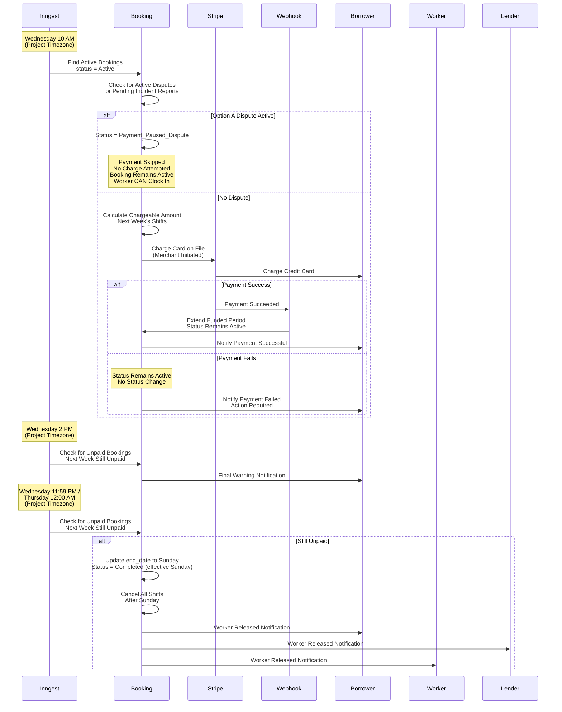

# Feature Blueprint: Weekly Progress Payments
**Domain:** Booking
**Related Epics:** [Epic 4: Booking & Payment Processing](../../../prd/epic-4.md)

## Requirement Reference

For detailed business rules, acceptance criteria, and context, see:
- [Epic 4.5: Weekly Progress Payment System](../../../prd/epic-4.md#story-45-weekly-progress-payment-system)

### Weekly Payment Flow Diagram

The following sequence diagram illustrates the "Wednesday Rule" weekly payment processing flow:



## Technical Strategy (The "How")

### Initial Upfront Charge Calculation (Mid-Week Start)

When a booking starts mid-week with Weekly Progress Payments:

1. **Calculate Remaining Current Week:**
   - Determine days remaining in current week (from booking start date to Sunday 23:59 in Project timezone)
   - Example: Booking starts Thursday → Remaining days = Thu, Fri, Sat, Sun (4 days)

2. **Calculate Following Week:**
   - Determine full following week (Monday 00:00 to Sunday 23:59)
   - Calculate remaining booking days after current week
   - **Critical Logic:** Charge = Remaining Current Week + Min(Full Following Week, Remaining Booking Days)
   - Example: 9-day booking starting Thursday = Charge Thu-Sun (4 days) + Min(7 days, 5 remaining) = 4 + 5 = 9 days ✓
   - This prevents overcharging for finite bookings that end mid-following-week

3. **Set Funded Period:**
   - `funded_period_end` = End of following week (or booking end_date if earlier)
   - Recurring "Wednesday Rule" cycle begins the Wednesday of that following week

### Inngest Cron Trigger Architecture

**Scheduled Workflow:** Inngest Cron Trigger initiates a durable workflow function
- **Trigger:** Inngest Cron Trigger configured to run hourly, checking each Project's timezone
- **Query Logic:** `SELECT bookings FROM projects WHERE project_timezone_hour == 10`
- **Time Calculation:** Inngest handles timezone-aware scheduling. When Project timezone hour == 10 AND day == Wednesday, Inngest triggers the "Wednesday Rule" workflow
- **Implementation:** Inngest Cron Trigger initiates a durable workflow function that handles the multi-step payment flow with built-in retries, delays, and step functions. This architecture is essential for Next.js (Serverless) environments which cannot run persistent cron listeners.

**Related Documentation:** For complete background job specifications including schedules, failure handling, and monitoring, see [Background Jobs Blueprint](../system/background-jobs.md#1-weekly-payment-processing).

### The Wednesday Rule (10 AM Project Time)

1. **Query Active Bookings:**
   ```sql
   SELECT b.*, p.timezone, p.jurisdiction_id
   FROM bookings b
   JOIN projects p ON b.project_id = p.id
   WHERE b.payment_type = 'Weekly_Progress'
     AND b.status = 'Active'
     AND b.funded_period_end < (CURRENT_TIMESTAMP + INTERVAL '7 days')
   ```

2. **Calculate Chargeable Amount:**
   - Determine next week's shifts (Monday 00:00 to Sunday 23:59 in Project timezone)
   - Calculate: `(hours_per_shift * worker_rate) + (hours_per_shift * worker_rate * 0.30)` for each shift (Service Fee is 30% of Worker Rate)
   - Total = Sum of all shift costs
   - **Overtime Calculation Note:** Weekly payment charges are calculated using standard `worker_rate` (hourly_rate) for upcoming shifts. Overtime calculations happen during `time_log` processing when actual hours are logged, not during weekly payment calculation. If a worker exceeds OT thresholds (daily > 8h, weekly > 40h, or weekend work) during the funded period, those hours are billed at `overtime_rate` from `bookings.ot_terms_snapshot` when the `time_log` entries are processed. The weekly payment secures funding for the upcoming week at standard rates, and OT premiums are applied automatically when actual hours are verified. See [Epic 6: Story 6.5](../../../prd/epic-6.md#story-65-overtime-rules-and-calculations) for complete overtime calculation rules.
   - **Explicit Rule:** Insurance validation runs independently via nightly monitoring jobs and manual updates. The payment loop does NOT check insurance validity - it only processes bookings that are currently `Active`. If a booking was suspended on Tuesday due to insurance failure (status changed to `Suspended_Insurance`), the query won't pick it up. See [Epic 2: Insurance Upload](../../../prd/epic-2.md#story-27-insurance-upload-and-lender-self-certification) for the Event-Driven Compliance Model.

3. **Dispute Check (The Relationship Check):** Before calculating chargeable amount, check for active disputes or pending incident reports on the booking:
   - Query `time_log` table for shifts with `status = 'Disputed'` that are not resolved
   - Check for pending incident reports (from Story 4.9: Incident Reporting)
   - **Explicit Rule:** Disputes are tracked at the shift level. Each dispute has a `dispute_option` field indicating Option A ("Dispute Shift Only") or Option B ("End Booking & Dispute").
   - **If Option A Dispute or Pending Option A Incident Report Detected:**
     - Update booking: `status = 'Payment_Paused_Dispute'`
     - Skip payment processing (do not proceed to charge calculation or Stripe payment intent creation)
     - **Critical:** Booking remains `Active` - workers CAN clock in. This status only pauses weekly payments, not worker access. There is no "Clock-In Block" or "Pause" for disputes - booking is either `Active` (work continues) or `Cancelled` (work stops).
     - Exit payment processing for this booking
   - **If Option B Dispute Detected:**
     - Booking is already `Cancelled` (per fork selection at dispute filing - Option B immediately cancels booking)
     - No payment processing occurs (cancelled bookings are excluded from weekly payment queries - query filters for status = `Active`)
     - Exit payment processing for this booking
   - **If No Active Dispute:** Proceed to charge calculation

4. **Stripe Card on File Charge (Merchant Initiated):**
   - Call Stripe API: `stripe.paymentIntents.create()` with `payment_method` from stored card on file
   - Amount: Total chargeable amount (in cents)
   - Customer: Borrower's Stripe Customer ID
   - Payment Method: Stored card on file (Merchant Initiated Transaction)
   - Metadata: `booking_id`, `funded_period_start`, `funded_period_end`
   - Store `payment_intent_id` in temporary `Pending_Payments` table with status `Pending`
   - **Payment Failure Handling:** If charge fails, booking status remains `Active`. Send "Action Required" notification to Borrower Admin. No status change occurs.

### The Settlement (Stripe Webhook)

**Webhook Endpoint:** `/webhooks/stripe`

1. **Listen for Event:** `payment_intent.succeeded`
2. **Idempotency Check:**
   - Query `pending_payments` table to check if payment intent already processed
   - If `status = 'Settled'`, skip processing (prevent duplicate entries)

3. **Webhook Processing:**
   - Extract `payment_intent_id` from webhook payload
   - Query `pending_payments` table to find associated booking
   - **Identify Weekly Payment Context:** Check if `pending_payments` record exists with this `payment_intent_id` and `payment_type = 'Weekly_Progress'` (or use metadata to differentiate weekly payments from initial booking payments)
   - **Atomic Transaction:**
     ```sql
     BEGIN;
     -- Update Booking
     UPDATE bookings 
     SET funded_period_end = :funded_period_end,
         status = 'Active'
     WHERE id = :booking_id;
     
     -- Mark Payment as Settled
     UPDATE pending_payments 
     SET status = 'Settled', settled_at = NOW()
     WHERE payment_intent_id = :payment_intent_id;
     COMMIT;
     ```
   - **Note:** Payment funds are already in Stripe (charged to borrower's card). Weekly progress payments use the same `payment_intent.succeeded` event as initial booking payments; the handler differentiates by checking the `pending_payments` record context.

### Webhook Failure Handling (Inngest Reconciliation Job)

**Scheduled Function:** Inngest scheduled function runs nightly at 2:00 AM UTC

1. **Query Pending Payments:**
   ```sql
   SELECT * FROM pending_payments 
   WHERE status = 'Pending' 
     AND created_at < (NOW() - INTERVAL '2 hours')
   ```

2. **Reconciliation Logic:**
   - For each pending payment, query Stripe API: `stripe.paymentIntents.retrieve(payment_intent_id)`
   - Check `status` field:
     - If `succeeded`: Webhook was missed. Process settlement transaction (same logic as webhook handler)
     - If `failed` or `canceled`: Update `Pending_Payments` status to `Failed`. Booking status remains `Active` (no status change). Send "Action Required" notification to Borrower Admin.
     - If still `processing`: Leave as-is, check again tomorrow

### The Wednesday Rule Timeline (Pay or Release Model)

The Wednesday Rule follows a simplified time-based "Pay or Release" model with three checkpoints:

1. **Wednesday 10:00 AM (Project Time) - Payment Attempt:**
   - Calculate cost for Next Week (Monday 00:00 to Sunday 23:59 in Project timezone)
   - Attempt to charge the card on file (Merchant Initiated Transaction)
   - **If Success:** Extend `funded_period_end` by 7 days. Booking status remains `Active`.
   - **If Failure:** Booking status remains `Active` (no status change). Send "Action Required" notification to Borrower Admin.

2. **Wednesday 2:00 PM (Project Time) - Final Warning:**
   - Check for active bookings where Next Week is still unpaid
   - Send "Final Warning" notification to Borrower Admin
   - Booking status remains `Active` (no status change)

3. **Wednesday 11:59 PM / Thursday 12:00 AM (Project Time) - Hard Cutoff:**
   - Check for active bookings where Next Week is still unpaid
   - **Action: Release the Worker**
     - Update Booking `end_date` to this coming Sunday (end of current week)
     - Change Booking Status to `Completed` (status change occurs immediately at hard cutoff; "effective Sunday" refers to the booking end date for display/billing purposes)
     - Cancel/Delete all shifts scheduled after this Sunday
     - This immediately makes the worker visible in search for next week (worker becomes available in search immediately, not waiting until Sunday)
   - **Notifications:** Send "Worker Released (Non-Payment)" alerts to Borrower Admin, Lender Admin, and Worker

**Timezone Handling:**
- All times use Project Timezone as authoritative source
- Display times converted to user's preferred timezone with project timezone indicator
- DST transitions handled automatically by timezone-aware libraries

**Payment Mechanism:**
- Uses Stripe "Card on File" (Merchant Initiated Transactions), not Stripe Subscriptions
- Payment method stored on Borrower's Stripe Customer record
- Charges processed directly via Stripe Payment Intents API

## Edge Cases & Failure Handling

### Webhook Retries
- **Stripe Retry Policy:** Stripe automatically retries webhooks up to 3 times over 3 days
- **Our Idempotency:** Each webhook processing checks `pending_payments` table for existing settled entry before processing
- **Manual Reconciliation:** Inngest scheduled function queries Stripe API for missed webhooks

### Timezone Handling

Timezone logic follows standard [Timezone Handling](../../timezone-handling.md) protocols.

### Dispute Check Edge Cases

**Edge Cases for Disputes During Weekly Payment Processing:**
- **Dispute Filed During Active Payment Processing (Wednesday 10 AM Window):** If a dispute is filed DURING the Wednesday 10 AM payment processing window (while payment is being attempted - after dispute check but before Stripe charge completes), the payment attempt is immediately cancelled, funds are not charged, and booking status transitions to `Payment_Paused_Dispute` (for Option A) or `Cancelled` (for Option B) based on the Fork in the Road decision. **Explicit Rule:** Disputes filed during active payment processing take immediate precedence. The payment attempt is aborted, no charge occurs, and the dispute workflow proceeds normally. This ensures disputes can be filed at any time without waiting for payment processing to complete. **Implementation:** Payment processing code must check for newly filed disputes after the initial dispute check and before finalizing the Stripe charge. If a dispute is detected mid-processing, abort the payment attempt immediately.
- **Dispute Filed After Payment Failure:** If an Option A dispute is filed after payment failure (between Wednesday 10 AM and Wednesday 11:59 PM), the booking status transitions to `Payment_Paused_Dispute` (dispute takes precedence over payment failure). Payment processing is skipped. If an Option B dispute is filed, booking immediately transitions to `Cancelled`.
- **Dispute Filed After Worker Release:** If an Option A dispute is filed after worker has been released (booking status = `Completed`), the dispute cannot be filed (booking is already completed). If an Option B dispute is filed, booking is already `Cancelled` or `Completed`, so no additional action is needed.
- **Multiple Option A Disputes:** If multiple Option A disputes exist on the same booking, payment processing is skipped (status remains `Payment_Paused_Dispute`). All disputed shifts' funds are frozen independently. Booking remains `Active`, workers CAN clock in for non-disputed shifts.
- **Dispute Resolved Before Hard Cutoff:** If an Option A dispute is resolved before Wednesday 11:59 PM hard cutoff, payment retry is triggered immediately via asynchronous background job. Booking status remains `Active` if payment succeeds, or remains `Active` if payment fails (no status change on payment failure).

### Dispute Resolution Payment Retry Trigger Logic

**Payment Retry Timing:**
- **Trigger Condition:** Payment retry is triggered when ALL Option A disputes are resolved (not when individual disputes resolve). If multiple Option A disputes exist and one resolves while others remain active, payment retry does NOT trigger until all disputes are resolved.
- **Execution Method:** Payment retry is processed asynchronously via background job (BullMQ queue: `dispute-resolution-payment-retry`). Dispute resolution workflow is not blocked by payment processing.
- **Immediate Execution:** Payment retry happens immediately when ALL disputes resolve (not waiting for Wednesday). If dispute resolves on Thursday, payment retry attempts immediately.
- **Payment Processing:** Uses same payment processing logic as weekly payment system (calculate chargeable amount, create Stripe payment intent, wait for webhook confirmation).

**Related Documentation:**
- See [Background Jobs Blueprint](../system/background-jobs.md#6-dispute-resolution-payment-retry) for complete job specification
- See [Epic 4: Story 4.5](../../../prd/epic-4.md#story-45-weekly-progress-payment-system) for payment retry timing rules
- See [Epic 5: Story 5.10](../../../prd/epic-5.md#story-510-dispute-resolution-chat-based-resolution) for dispute resolution workflow

### Insurance Expiration Mid-Week

**Explicit Rule:** Insurance expiration is handled independently via compliance events (nightly monitoring jobs or manual updates), NOT during payment processing. When insurance expires during an active booking, the system immediately triggers the `Insurance_Hard_Stop` event, which sets booking status to `Suspended_Insurance`. The Wednesday payment loop will not process bookings with status `Suspended_Insurance` - they are excluded from the query (status = `Active`).

### Insurance Hard Stop Workflow {#insurance-hard-stop-workflow}

See [Identity Data Dictionary](../../data-dictionary-identity.md) and [Epic 2: Insurance Upload](../../../prd/epic-2.md#story-27-insurance-upload-and-lender-self-certification) for the authoritative 'Insurance Hard Stop' workflow definition.

**Key Points:**
- **Independent Operation:** Insurance Hard Stop runs via nightly monitoring jobs or manual insurance updates, completely separate from payment processing
- **Immediate Suspension:** When insurance expires, booking status immediately changes to `Suspended_Insurance` (not `Active`)
- **Clock-In Blocking:** Workers cannot clock in if booking status is `Suspended_Insurance`
- **Payment Loop Exclusion:** Bookings with status `Suspended_Insurance` are excluded from Wednesday payment processing (query filters for status = `Active`)
- **Resumption:** When insurance is renewed, booking status automatically transitions from `Suspended_Insurance` back to `Active`, and workers can resume clocking in

### Subscription Expiration + Dispute Interaction {#subscription-expiration-dispute-interaction}

**Note:** In this section, "subscription" refers to the borrower's platform subscription (Bench subscription), not the Stripe payment method; weekly payments use Card on File (Merchant Initiated).

**Edge Case:** Subscription expiration during active Option A dispute.

**Behavior:**
- **Subscription Expires During Option A Dispute:** If subscription expires while booking has active Option A dispute (status = `Payment_Paused_Dispute`), the booking status remains `Payment_Paused_Dispute` (dispute takes precedence). The dispute remains active and tracked separately. Payment processing is skipped.
- **Subscription Renewal During Active Dispute:** When subscription is renewed during active dispute, booking status remains `Payment_Paused_Dispute` (not `Active`) until all disputes are resolved. Weekly payment processing remains paused while dispute is active.
- **Explicit Rule:** Dispute status takes precedence over subscription expiration for payment processing. When subscription is renewed, booking remains `Payment_Paused_Dispute` status (not `Active`) until all disputes are resolved through the dispute resolution workflow.

**Related Documentation:**
- See [Epic 4: Story 4.5](../../../prd/epic-4.md#story-45-weekly-progress-payment-system) for complete subscription expiration and dispute interaction rules
- See [Data Dictionary - Booking Domain](../../data-dictionary-booking.md) for edge cases documentation

### Mid-Week Cancellation Refund Calculation {#mid-week-cancellation-refund-calculation}

For Borrower Convenience cancellations during weekly progress payment bookings, the system uses a specific refund calculation formula that ensures Service Fee retention and proper fund distribution.

**Refund Formula (Borrower Convenience Cancellation):**

1. **Lender Payout Calculation:**
   - Lender receives: Actuals Worked (hours already verified/worked) + Cancellation Penalty
   - Cancellation Penalty: 50% rule for short-term bookings OR Notice Period forfeiture for long-term bookings
   - Example: If borrower cancels mid-week with 2 days worked and 3 days remaining, lender receives payment for 2 days worked + 50% penalty on first future day

2. **Service Fee Retention:**
   - Platform **RETAINS** the 30% Service Fee on the total transaction amount
   - Fee calculation: 30% of (Work + Penalty + Refunded portion)
   - The Service Fee is retained on all components of the transaction, not just the work portion
   - Example: If total transaction = $1,000 (work) + $140 (penalty) + $860 (refund), Service Fee = 30% of $2,000 = $600

3. **Borrower Refund Calculation:**
   - For Borrower Fault: Refund = Total Charge - Service Fee (30% retained, refunded to card via Stripe API)
   - For Lender Fault: Refund = Total Charge (100% full refund to card via Stripe API)

**Stripe-Native Refund Logic:**

All refunds are processed directly to the customer's payment method (card) via Stripe API.

- **Borrower Fault (Convenience Cancellation):** Service Fee (30%) is retained by the platform as revenue. Only the labor cost portion is refunded to the customer's card.
- **Lender Fault (No-Show/Trial Rejection):** Customer receives 100% full refund to their card, including both labor and Service Fee.

**Example Calculation (Borrower Fault):**

- **Booking Details:** 5-day booking, $280/day, cancelled mid-week after 2 days worked
- **Total Charge:** $1,400 (5 days × $280)
- **Actuals Worked:** $560 (2 days × $280)
- **Cancellation Penalty:** $140 (50% of first future day = 50% × $280)
- **Service Fee (30%):** 30% of ($560 + $140 + $700) = 30% of $1,400 = $420 (retained by platform)
- **Refund Amount:** $1,400 - $420 = $980 (refunded to borrower's card via Stripe API)

**Business Rule:** Service Fee retention applies to the entire transaction value, ensuring the platform retains its 30% fee on work, penalties, and refunded amounts combined. This maintains consistent fee retention across all cancellation scenarios.

**Reference:** For complete business rules and additional examples, see [Epic 6: Story 6.4 - Refund Logic](../../../prd/epic-6.md#story-64-refund-logic-stripe-native-processing).

### Concurrent Payment Attempts
- **Database Locking:** Use `SELECT ... FOR UPDATE` when querying booking for payment processing
- **Payment Intent Deduplication:** Check `Pending_Payments` table before creating new Stripe payment intent

### GPS Drift Handling
- Not applicable to this feature (handled by supervisor verification model)

## Data Model Impact

### Tables Modified

**Schema Reference:** See [schema-booking.md](../../schema-booking.md) for complete table definitions, indexes, constraints, and foreign keys.

**Key Tables:**
- `bookings` - `funded_period_end` (Timestamp, nullable) essential for determining when next charge is needed
- `pending_payments` - Tracks pending weekly payment charges awaiting Stripe webhook confirmation
- `insurance_policies` - Queried for `is_active = true` policies

## Schema Alignment

**Note:** This section documents alignment between this blueprint and the actual database schema defined in [schema-booking.md](../../schema-booking.md).

### Schema Elements Referenced

**Actual Schema Tables Used:**
- `bookings` - Contains `funded_period_end`, `status`, `payment_type`, `lender_company_id`, `borrower_company_id`
- `time_log` - Contains shift/clock records (NOT `Shifts` table - see note below)
- `pending_payments` - Tracks pending weekly payment charges
- `insurance_policies` - Contains insurance policy records with `expiration_date` and `is_active`
- `projects` - Contains `timezone` for timezone-aware calculations

### Conceptual vs. Actual Schema Differences

**"Shifts" Table Reference (Line 213):**
- **Blueprint Reference:** This blueprint mentions querying `Shifts` table to mark shifts as `Cancelled`
- **Actual Schema:** The schema uses `time_log` table, not `Shifts`
- **Clarification:** The term "Shifts" in this blueprint is a conceptual reference. In the actual implementation:
  - Shifts are represented as `time_log` records with `booking_id`, `clock_in_time`, `clock_out_time`, and `status`
  - **Future Shift Representation:** Future/scheduled shifts are represented as pre-created `time_log` records with future `clock_in_time` values. These records are created when the booking is confirmed or when shifts are scheduled, with `status = 'Working'` or another appropriate status until the worker actually clocks in. This allows the system to query and cancel future shifts before workers clock in.
  - To cancel future shifts, query `time_log` table: `SELECT * FROM time_log WHERE booking_id = ? AND clock_in_time >= ? AND status IN ('Working', 'Pending_Verification')`
  - Update `time_log.status` to reflect cancellation (status values: 'Working', 'Pending_Verification', 'Verified', 'Disputed' - cancellation may use a different status or separate cancellation tracking)
- **Implementation Note:** When insurance expires mid-week, the system should query `time_log` records for the booking that fall on/after the expiration date and mark them appropriately (exact status value depends on cancellation workflow implementation)

**Schema Alignment Verified:**
- ✅ `bookings.funded_period_end` - Exists in schema
- ✅ `bookings.status` - Exists in schema with correct ENUM values
- ✅ `bookings.payment_type` - Exists in schema with 'Full_Upfront' and 'Weekly_Progress' values
- ✅ `pending_payments` table - Exists in schema with correct structure
- ✅ `insurance_policies` table - Exists in schema with `expiration_date` and `is_active` fields
- ✅ `projects.timezone` - Exists in schema
