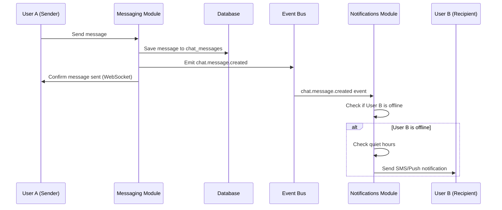

# Feature Blueprint: Real-Time Chat System

**Domain:** Messaging  
**Related Epics:** [Epic 4: Booking & Payment Processing](../../../prd/epic-4.md), [Epic 6: Financial Operations & Admin](../../../prd/epic-6.md)  
**Related Documentation:** [Messaging Domain Data Dictionary](../../data-dictionary-messaging.md)

---

## Requirement Reference

For detailed business rules and context, see:
- [Messaging Domain Data Dictionary](../../data-dictionary-messaging.md) - Messaging module architecture and business rules
- [Messaging Domain Schema](../../schema-messaging.md) - Database schema for chat tables
- [Repository Structure](../../repository-structure-development-standards.md) - Module structure and cross-module communication patterns

---

## Technical Strategy (The "How")

### Real-Time Communication Platform

**Decision:** Use Socket.io (or NestJS Gateway) for WebSocket-based real-time messaging with context-aware chat threads.

**Rationale:**
- Persistent WebSocket connections enable real-time bi-directional communication
- Room-based architecture maps naturally to chat channels
- Supports typing indicators and presence tracking
- Handles connection state for offline notification routing
- Scales with Redis adapter for multi-instance deployments

**Implementation:** See [Tech Stack](../../tech-stack.md) for Socket.io configuration.

---

## Chat Channel Management

**Purpose:** Create and manage context-aware chat threads linked to business entities (Bookings, Disputes).

**Workflow Steps:**

1. **Channel Creation:**
   - Channels are created automatically when first message is sent in a context
   - Context type determines channel scope (Booking, Dispute)
   - One channel per context (enforced by UNIQUE constraint on `context_type, context_id`)
   - Channel persists for lifetime of context entity

2. **Participant Management:**
   - Participants added automatically based on context
   - For Booking context: Worker, Supervisor, Borrower Admin, Borrower Manager, Lender Admin, Lender Manager
   - For Dispute context: All parties involved in dispute
   - Participants can be added/removed as business context changes

3. **Read Status Tracking:**
   - `last_read_at` timestamp tracks when user last viewed channel
   - Messages sent after `last_read_at` are considered unread
   - UI displays unread message counts based on this timestamp
   - Read receipts enable user engagement tracking

**Business Rules:**
- Channels are immutable once created (cannot change context)
- Participants are managed automatically based on business context
- Read status is updated when user views channel in UI
- Channel metadata includes context type and ID for filtering

---

## Message Delivery

**Purpose:** Send and receive messages in real-time with immutable history for legal compliance.

**Workflow Steps:**

1. **Message Creation:**
   - User sends message via WebSocket or REST API
   - Message content is sanitized but not modified after creation
   - Message saved to `chat_messages` table with `channel_id`, `sender_id`, `content`
   - `created_at` timestamp used for ordering

2. **Real-Time Delivery:**
   - Message saved to database first (ensures persistence)
   - WebSocket event emitted to channel room
   - All participants in channel receive message in real-time
   - Sender receives confirmation

3. **Cross-Module Communication:**
   - Messaging module emits `chat.message.created` event
   - Event payload includes: `channel_id`, `sender_id`, `recipient_id`, `message_preview`
   - Notifications module listens for this event
   - Notifications module checks if recipient is offline
   - If offline, Notifications module sends SMS/Push: "You have a new message from..."

4. **Immutable History:**
   - Messages are append-only (immutable once created)
   - Soft deletes (`is_deleted`, `deleted_at`) for UI only
   - Hard data remains in database for admin/legal purposes
   - Chat history serves as legal evidence for Disputes

**Business Rules:**
- Messages are ordered by `created_at` timestamp
- Content is stored as text (no file attachments in MVP)
- Soft-deleted messages hidden from normal UI views
- Admin views can see all messages including deleted ones
- Deleted messages remain in database for legal/compliance purposes

---

## WebSocket Connection Management

**Purpose:** Manage persistent WebSocket connections, rooms, and connection state.

**Connection Lifecycle:**

1. **Connection:**
   - User connects to WebSocket server
   - Server authenticates user (JWT token validation)
   - User joins rooms for all channels they participate in
   - Connection state tracked for offline notification routing

2. **Room Management:**
   - Channels map to WebSocket rooms
   - User joins room when viewing channel
   - User leaves room when navigating away
   - Messages broadcast to all users in room

3. **Presence Tracking:**
   - Track user online/offline status
   - Used by Notifications module to determine if SMS/Push needed
   - Typing indicators broadcast to room participants
   - Connection state updates in real-time

4. **Disconnection:**
   - User disconnects from WebSocket
   - Connection state updated (user marked offline)
   - Notifications module can now send SMS/Push for new messages
   - Reconnection restores room membership

**Connection State:**
- Online: User has active WebSocket connection
- Offline: User disconnected, notifications sent via SMS/Push
- Typing: User is typing (broadcast to room participants)

---

## Data Flow Example



---

## Architecture Principles

1. **Rule 1: Cross-Module Communication via Events**
   - Messaging module should **NEVER** import Twilio/SendGrid wrappers directly
   - Messaging module emits `chat.message.created` event
   - Notifications module handles all outbound delivery

2. **Rule 2: Immutable History**
   - Messages are append-only
   - Soft deletes are for UI only
   - Hard data remains for admin/legal purposes

3. **Rule 3: Context-Aware Threads**
   - Chat threads are linked to business entities (Bookings, Disputes)
   - Context provides business meaning to conversations
   - Enables filtering and organization by business entity

4. **Rule 4: Directory Structure**
   - Module structure reflects separation:
     ```
     /src/modules
       /messaging
         /gateways     <-- WebSocket logic
         /services     <-- Thread management
     ```

---

## Performance Optimization

### Database Indexes

**Critical Indexes for Messaging:**
- `chat_channels(context_type, context_id)` - Fast channel lookup
- `chat_participants(channel_id, user_id)` - Participant queries
- `chat_messages(channel_id, created_at DESC)` - Message history queries
- `chat_messages(channel_id, is_deleted, created_at DESC) WHERE is_deleted = false` - Active messages only

### WebSocket Scaling

**Multi-Instance Deployment:**
- Use Redis adapter for Socket.io
- Enables WebSocket connections across multiple server instances
- Room membership synchronized via Redis
- Message broadcasting works across instances

**Connection Limits:**
- Monitor active WebSocket connections
- Alert on connection pool exhaustion
- Implement connection rate limiting if needed

---

## Error Handling

All messaging operations implement comprehensive error handling:

- **Message Delivery Failures:** Retry logic for database writes
- **WebSocket Connection Failures:** Automatic reconnection with exponential backoff
- **Room Join Failures:** Fallback to REST API for message retrieval
- **Database Errors:** Transaction rollback, error logging, user notification

**Related Documentation:** See [Error Handling Blueprint](../system/error-handling.md) for complete error handling patterns.

---

## Related Documentation

- [Messaging Domain Data Dictionary](../../data-dictionary-messaging.md) - Messaging module architecture and business rules
- [Messaging Domain Schema](../../schema-messaging.md) - Database schema for chat tables
- [Repository Structure](../../repository-structure-development-standards.md) - Module structure and cross-module communication patterns
- [Notifications Domain Data Dictionary](../../data-dictionary-notifications.md) - Cross-module communication with notifications
- [Error Handling Blueprint](../system/error-handling.md) - Error handling patterns
- [Tech Stack](../../tech-stack.md) - Socket.io configuration
