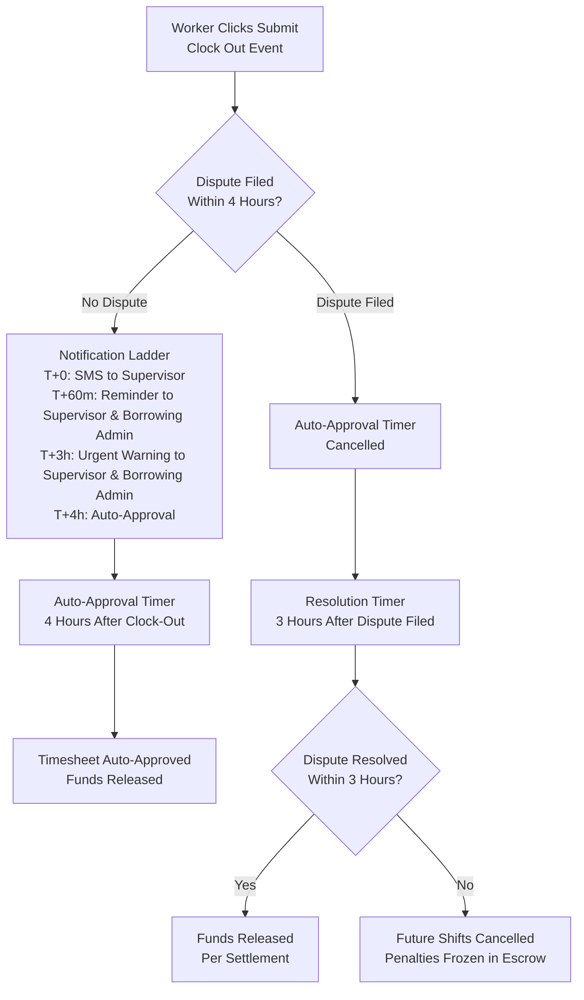

# Feature Blueprint: Background Jobs & Scheduled Tasks

**Domain:** System  
**Related Epics:** [Epic 4: Booking & Payment Processing](../../../prd/epic-4.md), [Epic 5: Time Tracking & Verification](../../../prd/epic-5.md), [Epic 6: Financial Operations & Admin](../../../prd/epic-6.md)

---

## Requirement Reference

For detailed business rules and context, see:
- [Weekly Payments Blueprint](../booking/weekly-payments.md) - Weekly payment processing details
- [Insurance Expiration Monitoring](../../data-dictionary-identity.md#insurance-policy) - Insurance validation workflows
- [Saved Searches & Alerts Blueprint](../marketplace/saved-searches-alerts.md) - Alert scheduling details

---

## Technical Strategy (The "How")

### Job Scheduling Platform

**Decision:** Use BullMQ (Redis) for queue-based job processing with rolling windows to prevent thundering herd issues.

**Rationale:**
- Prevents database connection pooling issues when processing thousands of jobs simultaneously
- Allows long-running processes without serverless timeout constraints
- Enables rate limiting and controlled concurrency to prevent API rate limits (e.g., Stripe API limits)
- Rolling window strategy prevents "thundering herd" when charging thousands of cards simultaneously
- Cron triggers can use Inngest or system cron to enqueue jobs, but execution uses BullMQ queues

**Implementation:** See [Tech Stack](../../tech-stack.md) for BullMQ configuration.

---

## Job Specifications

### 1. Weekly Payment Processing

**Purpose:** Process weekly progress payments for active bookings every Wednesday at 10 AM (Project timezone).

**Schedule:**
- **Trigger:** Cron Trigger (Inngest or system cron) runs hourly
- **Logic:** Checks each Project's timezone, triggers when Project timezone hour == 10 AND day == Wednesday
- **Timezone-Aware:** Each Project's timezone determines when 10 AM occurs
- **Decoupled Execution:** Cron trigger does NOT process payments directly. Instead, it enqueues job IDs into Redis/BullMQ queue (`weekly-payments` queue)

**Queue Architecture:**
- **Queue Name:** `weekly-payments`
- **Job Payload:** Each job contains `booking_id` and metadata needed for payment processing
- **Rolling Window Strategy:** Workers consume queue at controlled rate (e.g., 50 jobs/second)
  - Prevents "thundering herd" when charging thousands of cards simultaneously
  - Prevents Stripe API rate limits and database connection pool exhaustion
  - Queue configuration: BullMQ with concurrency limits and rate limiting

**Workflow Steps:**

**Phase 1: Job Enqueueing (Cron Trigger)**
1. Query active bookings with `payment_type = 'Weekly_Progress'` and `status = 'Active'`
   - **Note:** Bookings with `status = 'Payment_Paused_Dispute'` are excluded from this query as they have active disputes that prevent payment processing
   - **Note:** Bookings with `status = 'Suspended_Insurance'` are excluded from this query as insurance validation runs independently
2. For each eligible booking, enqueue job into `weekly-payments` queue with `booking_id` payload

**Phase 2: Job Processing (Queue Workers)**
3. Workers consume queue at controlled rate (50 jobs/second)
4. For each job:
   - Calculate `funded_period_end` for next week (Monday 00:00 to Sunday 23:59 in Project timezone)
   - **Dispute Check (The Relationship Check):** Check for active disputes or pending incident reports on the booking
     - Query `time_log` table for shifts with `status = 'Disputed'` that are not resolved
     - Check for pending incident reports (from Story 4.9: Incident Reporting)
     - **Explicit Rule:** Disputes are tracked at the shift level. Each dispute has a `dispute_option` field indicating Option A ("Dispute Shift Only") or Option B ("End Booking & Dispute").
        - **If Option A Dispute or Pending Option A Incident Report Detected:**
          - Update booking: `status = 'Payment_Paused_Dispute'`
          - Skip payment processing (do not proceed to charge attempt)
          - **Critical:** Booking remains `Active` - workers CAN clock in. This status only pauses weekly payments, not worker access. There is no "Clock-In Block" or "Pause" for disputes - booking is either `Active` (work continues) or `Cancelled` (work stops).
          - Exit job processing for this booking
        - **If Option B Dispute Detected:**
          - Booking is already `Cancelled` (per fork selection at dispute filing - Option B immediately cancels booking)
          - No payment processing occurs (cancelled bookings are excluded from weekly payment queries)
          - Exit job processing for this booking
     - **If No Active Dispute:** Proceed to charge calculation
   - **Explicit Rule:** Insurance validation runs independently via nightly monitoring jobs and manual updates. The payment loop does NOT check insurance validity - it only processes bookings that are currently `Active`. If a booking was suspended due to insurance failure (status = `Suspended_Insurance`), it is excluded from the payment query.
   - Calculate chargeable amount for next week's shifts
   - Create Stripe payment intent using Card on File (Merchant Initiated Transaction)
   - Store `pending_payments` record with status `Pending`
   - Wait for Stripe webhook confirmation
   - Process Stripe transfer to lender's Connected Account upon webhook success

**Failure Handling:**
- Payment failure: Booking status remains `Active` (no status change). Send "Action Required" notification to Borrower Admin.
- Retry logic: Automatic retry on transient failures (network, temporary Stripe issues)
- Hard cutoff: Handled by separate job (see Job 1.2 below)

**Monitoring:**
- Track payment success/failure rates
- Monitor payment failure notifications
- Alert on payment failures requiring manual intervention

**Related Documentation:** See [Weekly Payments Blueprint](../booking/weekly-payments.md) for complete workflow details.

**Note:** This job may trigger notifications (e.g., payment failure alerts). Notification delivery is handled by the Notifications module. See [Notification Delivery Blueprint](../notifications/notification-delivery.md) for details.

---

### 1.1. Weekly Payment Final Warning

**Purpose:** Send final warning notification to borrowers for unpaid weekly payments on Wednesday at 2 PM (Project timezone).

**Schedule:**
- **Trigger:** Cron Trigger (Inngest or system cron) runs hourly
- **Logic:** Checks each Project's timezone, triggers when Project timezone hour == 14 (2 PM) AND day == Wednesday
- **Timezone-Aware:** Each Project's timezone determines when 2 PM occurs

**Workflow Steps:**

1. Query active bookings with `payment_type = 'Weekly_Progress'` and `status = 'Active'`
   - Filter for bookings where `funded_period_end < (CURRENT_TIMESTAMP + INTERVAL '7 days')`
   - This identifies bookings where Next Week is still unpaid (payment failed at 10 AM)
   - **Note:** Only `Active` bookings are considered. Bookings in `Payment_Paused_Dispute` (Option A dispute active) are excluded and do not receive final warning.

2. For each unpaid booking:
   - Send "Final Warning" notification (SMS + Email) to Borrower Admin
   - Notification message: "Payment required for booking [ID]. Final warning - payment must be completed by end of day Wednesday to avoid worker release."

3. Log notification in `notification_log` table

**Failure Handling:**
- Notification delivery failures: Retry with exponential backoff
- If all retries fail: Log to dead letter queue for manual notification

**Monitoring:**
- Track final warning notification delivery rates
- Alert on notification delivery failures

**Related Documentation:** See [Weekly Payments Blueprint](../booking/weekly-payments.md) for complete workflow details.

**Note:** Notification delivery is handled by the Notifications module. See [Notification Delivery Blueprint](../notifications/notification-delivery.md) for details.

---

### 1.2. Weekly Payment Hard Cutoff (Worker Release)

**Purpose:** Release workers for unpaid weekly payments on Wednesday at 11:59 PM / Thursday 12:00 AM (Project timezone).

**Schedule:**
- **Trigger:** Cron Trigger (Inngest or system cron) runs hourly
- **Logic:** Checks each Project's timezone, triggers when Project timezone hour == 0 (12 AM) AND minute == 0 AND day == Thursday (i.e. midnight Thursday = end of day Wednesday cutoff)
- **Timezone-Aware:** Each Project's timezone determines when midnight occurs
- **Timing Clarification:** The *cutoff* is end-of-day Wednesday (no payment accepted after 11:59 PM Wednesday); the *job* runs at 12:00 AM Thursday so all unpaid bookings are processed at the start of the new day. This ensures all Wednesday payment attempts have completed before the hard cutoff is enforced.

**Workflow Steps:**

1. Query active bookings with `payment_type = 'Weekly_Progress'` and `status = 'Active'`
   - Filter for bookings where `funded_period_end < (CURRENT_TIMESTAMP + INTERVAL '7 days')`
   - This identifies bookings where Next Week is still unpaid (payment failed at 10 AM)
   - **Note:** Only `Active` bookings are considered. Bookings in `Payment_Paused_Dispute` (Option A dispute active) are excluded and are not released at midnight.

2. For each unpaid booking:
   - **Calculate Sunday Date:** Determine this coming Sunday (end of current week) in Project timezone
   - **Update Booking:**
     - Set `end_date` to this coming Sunday
     - Change `status` to `Completed` (status change occurs immediately at hard cutoff; "effective Sunday" refers to the booking end date for display/billing purposes)
   - **Cancel Future Shifts:** (Shifts are represented as `time_log` records; there is no separate "Shifts" table. See [Weekly Payments Blueprint](../booking/weekly-payments.md) Schema Alignment section for details.)
     - **Future Shift Representation:** Future/scheduled shifts are represented as pre-created `time_log` records with future `clock_in_time` values (created when booking is confirmed or when shifts are scheduled). These records have `status = 'Working'` or another appropriate status until the worker actually clocks in.
     - Query `time_log` table for shifts with `clock_in_time` > Sunday 23:59:59 AND `booking_id` = current booking
     - Update shift status to `Cancelled` (or appropriate cancellation status) for all matching future shifts
   - **Send Notifications:**
     - Send "Worker Released" notification (SMS + Email) to Worker
     - Send "Worker Released" notification (SMS + Email) to Borrower Admin
     - Send "Worker Released" notification (SMS + Email) to Lender Admin
     - Notification message: "Booking [ID] ended due to non-payment. Worker released effective [Sunday date]."

3. Log all actions in `audit_log` table with reason: "Weekly Payment Hard Cutoff - Worker Released"

**Failure Handling:**
- Database update failures: Retry with exponential backoff
- Shift cancellation failures: Log error, continue with booking update
- Notification delivery failures: Retry with exponential backoff
- If all retries fail: Log to dead letter queue for manual intervention

**Monitoring:**
- Track worker release counts
- Monitor notification delivery rates
- Alert on database update failures

**Related Documentation:** See [Weekly Payments Blueprint](../booking/weekly-payments.md) for complete workflow details.

**Note:** Notification delivery is handled by the Notifications module. See [Notification Delivery Blueprint](../notifications/notification-delivery.md) for details.

---

### 2. Insurance Expiration Monitoring {#2-insurance-expiration-monitoring}

**Purpose:** Monitor insurance policies and send expiration warnings to admins.

**Schedule:**
- **Trigger:** Inngest Daily Schedule (runs once per day)
- **Time:** Runs at midnight UTC, processes all active policies

**Workflow Steps:**
1. Query all active insurance policies (`is_active = true`)
2. Calculate days until expiration: `expiration_date - CURRENT_DATE`
3. **14-Day Warning:**
   - If expiration in 14 days and notification not already sent
   - Send email notification to Admin (both Borrower and Lender if applicable)
   - Log notification in `notification_log` table
4. **7-Day Warning:**
   - If expiration in 7 days and notification not already sent
   - Send email + SMS notification to Admin
   - Log notification in `notification_log` table
5. **Expiration Check:**
   - If expired and still active, deactivate policy
   - Trigger `Insurance_Hard_Stop` event for any active bookings affected by the expiration
   - Send critical alert to Admin and Manager (both Borrower and Lender context if applicable)
   - **Insurance Hard Stop Workflow:** When insurance expiration is detected, the system triggers `Insurance_Hard_Stop` event which: (1) Updates Booking Status to `Suspended_Insurance` for all affected active bookings (including bookings with status `Active`, `Payment_Paused_Dispute`, or `Disputed`), (2) Sends **Critical** SMS/Email notification (bypassing Quiet Hours) to Worker, Supervisor, Borrowing Admin, Borrowing Manager, Lending Admin, and Lending Manager with message: "Insurance Invalid. Work must stop immediately. Please clock out worker.", (3) Blocks clock-in for future shifts (workers cannot clock in if booking status is `Suspended_Insurance`). **Explicit Rule:** Insurance Hard Stop operates independently of payment processing and dispute resolution. This is a compliance event that immediately suspends bookings when insurance fails, regardless of payment timing or dispute status. The system does NOT cancel shifts or refund escrow - it suspends the booking to prevent work from continuing without valid insurance coverage. **Insurance Expiration During Active Dispute:** If insurance expires while a booking has an active Option A dispute (status = `Payment_Paused_Dispute` or `Active`), the booking status transitions to `Suspended_Insurance` (insurance compliance takes precedence). The dispute remains active and tracked separately. When insurance is renewed during an active dispute, booking status transitions to `Payment_Paused_Dispute` (not `Active`) until all disputes are resolved. Workers can clock in only after insurance is renewed AND all disputes are resolved. See [Epic 2: Story 2.7](../../../prd/epic-2.md#story-27-insurance-upload-and-lender-self-certification), [Epic 4: Story 4.5](../../../prd/epic-4.md#story-45-weekly-progress-payment-system), and [Epic 5: Story 5.10](../../../prd/epic-5.md#story-510-dispute-resolution-chat-based-resolution) for complete Insurance Hard Stop workflow details and dispute interaction rules.

**Failure Handling:**
- Notification delivery failures: Retry with exponential backoff
- If all retries fail: Log to dead letter queue for manual notification
- Policy deactivation: Automatic if expiration date passed

**Monitoring:**
- Monitor policies approaching expiration
- Alert on expired policies still marked active

**Related Documentation:** See [Insurance Policy Data Dictionary](../../data-dictionary-identity.md#insurance-policy) for insurance validation rules.

**Note:** Insurance expiration notifications are handled by the Notifications module. See [Notification Delivery Blueprint](../notifications/notification-delivery.md) for details.

---

### 3. Saved Search Alerts

**Purpose:** Send timezone-aware alerts to borrowers when workers matching saved search criteria become available.

**Schedule:**
- **Instant Alerts:** Triggered asynchronously on worker state change events
- **Daily Digest:** Inngest Cron Trigger runs hourly, checks if 5:00 AM in user's timezone

**Workflow Steps:**

**Instant Alerts:**
1. Worker state changes to `Listed` (becomes available)
2. Query all active saved searches matching worker criteria
3. For each matching saved search:
   - Check if instant alerts enabled
   - Check quiet hours settings
   - Send SMS/Email notification if outside quiet hours
   - Log notification in `notification_log` table

**Daily Digest:**
1. Inngest Cron Trigger runs hourly
2. For each timezone:
   - Check if current time is 5:00 AM in that timezone
   - Query saved searches with daily digest enabled for users in that timezone
   - Batch process matching workers found in last 24 hours
   - Send single digest email with all matches
   - Log notification in `notification_log` table

**Failure Handling:**
- Notification delivery failures: Retry with exponential backoff
- Batch processing failures: Process in smaller batches
- Timezone calculation errors: Fallback to UTC, log error

**Performance Considerations:**
- Cache worker profiles for faster matching
- Process saved searches in batches to avoid timeouts
- Use message queue for reliable notification delivery
- Rate limit notifications to prevent spam

**Error Handling:**
- **Query Failures:** If saved search alert query fails (database errors, extension unavailability, query timeout), log error with saved search ID and error details. Retry alert execution after delay (exponential backoff, max 3 retries). If all retries fail, skip alert for that execution cycle (instant alerts) or that day (daily digests). Users are NOT notified of query failures - failed alerts are silently skipped.
- **Database Failover Handling:** If primary database fails during alert execution:
  - **Retry After Failover:** Saved search alerts should retry after database failover completes (with exponential backoff). Wait for database recovery and retry alert execution.
  - **Maximum Retry Window:** Specify maximum retry window (e.g., 30 minutes) before alert is skipped. If database is unavailable for more than 30 minutes, skip alert for that execution cycle (instant alerts) or that day (daily digests).
  - **Monitoring:** Track alerts skipped due to database unavailability (count and duration) for operations team awareness.
- **Extension Failure Retry Logic:** If extension unavailability causes alert query to fail:
  - **Do NOT Retry Indefinitely:** Saved search alerts should NOT retry indefinitely for extension failures. Extensions are not transient issues - if extensions are unavailable, they require manual intervention.
  - **Maximum Retry Window:** Specify maximum retry window (e.g., 1 hour) before alert is skipped. If extensions remain unavailable after 1 hour, skip alert for that execution cycle (instant alerts) or that day (daily digests).
  - **Skip Immediately Option:** For instant alerts, consider skipping immediately on extension failure (do not wait for recovery) since extension failures require manual intervention. Daily digests can wait up to 1 hour for extension recovery.
  - **Monitoring:** Track alerts skipped due to extension failures (count and duration) for operations team awareness.
- **Extension Failure During Query Execution:** If extension fails during alert query execution (mid-query):
  - **Handle Same as Pre-Query Failures:** Mid-query extension failures should be handled the same as pre-query failures - log error, skip alert, and monitor for extension recovery.
  - **No Partial Results:** Do not send partial alert results if extension fails mid-query - skip alert entirely to avoid confusion.
- **Invalid Search Criteria:** If saved search contains invalid criteria (deleted zip code, invalid trade), query executes successfully but returns zero workers. Alert email should indicate "No new workers match your saved search criteria" rather than showing empty list. Consider implementing cleanup job to deactivate saved searches that consistently return zero results.
- **Notification Delivery Failures:** If SMS/email delivery fails for alert, retry with exponential backoff. If delivery fails after all retries, log error but don't block alert processing for other saved searches.
- **Replica Lag Handling:** Saved search alerts query the primary database (not replicas) to ensure accuracy. Since alerts are low-frequency operations, the additional load on primary is minimal and ensures alerts reflect current worker availability.
- **Availability Check Failures:** Saved search alerts use the same PostgreSQL query builder as main search engine, which includes real-time availability checks. If a worker matches search criteria but is not available for requested dates, the worker is automatically excluded from alert results (no error - expected behavior).
- **Batch Processing Failures:** If batch processing fails partway through (some alerts sent, others failed):
  - **Idempotency:** Use saved search ID + timestamp as idempotency key to prevent duplicate alerts if batch is retried
  - **Partial Batch Retry:** Retry only failed alerts individually (not entire batch) to avoid duplicate alerts for successfully sent alerts
  - **Monitoring:** Track batch processing failure rates and partial batch retry success rates

**Related Documentation:** See [Saved Searches & Alerts Blueprint](../marketplace/saved-searches-alerts.md) for complete implementation details, including edge case handling for invalid criteria, query failures, and availability checks.

**Note:** Saved search alert notifications are handled by the Notifications module. See [Notification Delivery Blueprint](../notifications/notification-delivery.md) for details.

---

### 4.5. Scheduled Bomb (Clock-Out Reminders)

**Purpose:** Send reminders to workers and supervisors if they haven't clocked out by the scheduled end time. Jobs are scheduled at Clock-In, not polled from database.

**Schedule:**
- **Trigger:** Event-driven - scheduled jobs created when worker clocks in
- **Execution:** Jobs scheduled for T+5m and T+30m after `Scheduled_End_Time` (calculated from Booking)
- **Queue:** BullMQ delayed jobs execute immediately when timers expire
- **Cancellation:** If worker clocks out normally, both jobs are cancelled immediately

**Workflow Steps:**

**Phase 1: Job Scheduling (On Clock-In)**
1. When worker clocks in, system calculates `Scheduled_End_Time` based on Booking's scheduled shift end time
2. Schedule Job A: T+5m after `Scheduled_End_Time` - Notification: "Are you still working?"
3. Schedule Job B: T+30m after `Scheduled_End_Time` - Notification: "Urgent: Clock Out."
4. Job payload includes: `time_log_id`, `booking_id`, `worker_id`, `supervisor_id`, `scheduled_end_time` (UTC), `reminder_5m_time` (UTC), `reminder_30m_time` (UTC)
5. Store job IDs in `time_log` table for cancellation tracking

**Phase 2: Job Execution (At Scheduled Times)**
1. **Job A (T+5m after Scheduled End):**
   - Check if worker has clocked out (if `time_log.clock_out_time` is not null, job exits - worker already clocked out)
   - If still clocked in, send SMS to Worker and Supervisor: "Are you still working? Please clock out if your shift has ended."
   - Log notification in `notification_log` table
2. **Job B (T+30m after Scheduled End):**
   - Check if worker has clocked out (if `time_log.clock_out_time` is not null, job exits - worker already clocked out)
   - If still clocked in, send SMS to Worker and Supervisor: "URGENT: Clock Out. Your scheduled shift ended 30 minutes ago."
   - Log notification in `notification_log` table

**Phase 3: Job Cancellation (On Normal Clock-Out)**
1. When worker clocks out normally (clicks "Submit" after Draft Mode), system cancels both scheduled reminder jobs
2. Query `time_log` for stored job IDs
3. Cancel jobs in BullMQ queue using job IDs
4. Mark jobs as cancelled in database

**Edge Cases - Clock-Out Timing:**
- **Early Clock-Out (Before Scheduled End Time):** If worker clocks out before `Scheduled_End_Time`, both Job A and Job B are cancelled immediately. Jobs are cancelled regardless of whether they have executed yet.
- **Clock-Out After Scheduled End But Before Job A (T+5m):** If worker clocks out after `Scheduled_End_Time` but before Job A executes (within 5 minutes), both Job A and Job B are cancelled. Job A will check `clock_out_time` before executing and exit if already clocked out.
- **Clock-Out After Job A But Before Job B (T+5m to T+30m):** If worker clocks out after Job A executes but before Job B executes, Job B is cancelled. Job B will check `clock_out_time` before executing and exit if already clocked out.
- **Clock-Out After Job B (T+30m+):** If worker clocks out after both jobs have executed, no cancellation is needed (jobs already completed). This is a late clock-out scenario.

**Explicit Rule:** Scheduled Bomb jobs are cancelled whenever worker clocks out normally, regardless of timing relative to scheduled end time or job execution. The cancellation check in job execution (checking `clock_out_time` before sending notification) provides a safety mechanism to prevent duplicate notifications even if cancellation fails.

**Edge Cases:**
- **Scheduled_End_Time Not Set:** If booking doesn't have `Scheduled_End_Time` set, Scheduled Bomb jobs are not scheduled. System logs warning but doesn't block clock-in. Worker can still clock in and work normally, but no reminder notifications will be sent.
- **Scheduled_End_Time Changes After Jobs Are Scheduled:** If the booking's `Scheduled_End_Time` changes after Scheduled Bomb jobs are already scheduled (e.g., supervisor updates shift end time), the system cancels existing jobs and reschedules new jobs based on the updated `Scheduled_End_Time`. If the new `Scheduled_End_Time` has already passed (current time > new Scheduled_End_Time), jobs are not rescheduled. **Explicit Rule:** Scheduled Bomb jobs must always reflect the current `Scheduled_End_Time` from the booking. If the scheduled end time changes, jobs are cancelled and rescheduled to match the new time.
- **Force Clock Out + Scheduled Bomb Interaction:** Force Clock Out cancels Scheduled Bomb jobs (same as normal clock-out). When supervisor performs Force Clock Out, system cancels both Job A and Job B immediately, just like normal clock-out.
- **Draft Mode + Scheduled Bomb Interaction:** Scheduled Bomb jobs are independent of Draft Mode. Jobs are scheduled at Clock-In based on Scheduled_End_Time. If worker is in Draft Mode, jobs remain active until worker clicks Submit (clock-out event). Jobs will execute if worker doesn't submit before Scheduled_End_Time + 5m or +30m.

**Failure Handling:**
- Notification delivery failures: Retry with exponential backoff
- Job cancellation failures: Log warning but don't block clock-out. Job execution checks `clock_out_time` as safety mechanism.
- If jobs cannot be scheduled: Log error, but don't block clock-in

**Related Documentation:** See [Epic 5: Story 5.7](../../../prd/epic-5.md#story-57-automated-reminders-confirmations) for business rules regarding Scheduled Bomb reminders.

**Note:** Scheduled Bomb notifications are handled by the Notifications module. See [Notification Delivery Blueprint](../notifications/notification-delivery.md) for details.

---

### 4. Timesheet Auto-Approval & Notification Ladder

**Purpose:** Automatically approve timesheets if supervisor doesn't verify within 4 hours after clock-out (when Worker clicks Submit). Includes notification ladder to escalate reminders.

**Schedule:**
- **Trigger:** Event-driven - scheduled jobs created when worker clicks "Submit" (Clock Out event)
- **Execution:** Multiple jobs scheduled for notification ladder: T+0, T+60m, T+3h, T+4h (auto-approval)
- **Queue:** BullMQ delayed jobs execute immediately when timers expire (no batch processing delay)

**Workflow Steps:**

**Phase 1: Job Scheduling (On Clock-Out - Worker Clicks Submit)**
1. When worker clicks "Submit" (Clock Out event), system calculates notification and auto-approval times:
   - T+0: Immediate notification to Supervisor
   - T+60m: Reminder to Supervisor & Borrowing Admin
   - T+3h: Urgent Warning to Supervisor & Borrowing Admin
   - T+4h: Auto-approval execution
2. Schedule delayed jobs in BullMQ queue (`timesheet-notifications` and `timesheet-auto-approval`) for exact expiration times (in UTC)
3. Job payload includes: `time_log_id`, `booking_id`, `clock_out_time` (UTC), notification times (UTC), `auto_approval_time` (UTC)
4. **Timer Start Event:** The 4-hour timer starts ONLY when: (1) A Worker successfully clicks "Submit" on their timesheet, OR (2) A Supervisor performs a "Force Clock Out" (for forgotten shifts).
5. **Fixed Duration:** Future edits do **not** reset the timer to a full 4 hours. The goal is resolution on the **Same Day**. **Exception:** If a Supervisor edits the timesheet with less than 1 hour remaining on the timer, extend the timer by exactly 1 hour to give the Worker a fair chance to review.
6. **Timezone Rule:** The `clock_out_time` is stored as UTC timestamp in the database. Auto-approval timer = `clock_out_utc + 4 hours` (UTC calculation). DST transitions do not affect the 4-hour calculation (always exactly 4 hours in UTC). Display times are converted to project timezone for user viewing, but all calculations use UTC internally. **Rationale:** Using UTC for calculations ensures consistent 4-hour intervals regardless of DST transitions, eliminating edge cases where DST "fall back" or "spring forward" could affect timer accuracy.

**Phase 2: Notification Ladder Execution**
1. **T+0 (Immediate):** Send SMS to Supervisor with Deep Link to verify (Critical notification, bypasses quiet hours)
   - **Early Verification Check:** Before sending notification, check if timesheet status is already `Verified`. If verified, skip notification and cancel remaining scheduled notifications (T+60m, T+3h, T+4h).
2. **T+60m:** Send SMS reminder to Supervisor & Borrowing Admin: "Timesheet pending verification for [Worker]. Please verify within 4 hours."
   - **Early Verification Check:** Before sending notification, check if timesheet status is already `Verified`. If verified, skip notification and cancel remaining scheduled notifications (T+3h, T+4h).
3. **T+3h:** Send SMS urgent warning to Supervisor & Borrowing Admin: "URGENT: Timesheet for [Worker] will auto-approve in 1 hour if not verified."
   - **Early Verification Check:** Before sending notification, check if timesheet status is already `Verified`. If verified, skip notification and cancel remaining scheduled notifications (T+4h).
4. **T+4h:** Auto-approval execution (see Phase 3)
   - **Early Verification Check:** Before executing auto-approval, check if timesheet status is already `Verified`. If verified, skip auto-approval and exit job.

**Phase 3: Auto-Approval Job Execution (At T+4h)**
1. When scheduled time arrives, job executes immediately
2. **Race Condition Check:** Check if a dispute has been filed (if dispute exists, this job should not execute - dispute timeout job takes over). **Explicit Rule:** Dispute filing always takes precedence over auto-approval, even if both events occur simultaneously. The auto-approval job must verify no dispute exists before executing.
3. Check if timesheet status is still `Pending_Verification` (supervisor may have verified in the meantime)
4. If still pending AND no dispute filed:
   - Auto-approve (set status to `Verified`)
   - Release funds from escrow via Stripe transfer to lender's Connected Account immediately
   - Send notification to worker: "Timesheet auto-approved after 4 hours. Supervisor did not verify within required timeframe."
   - Log auto-approval in `audit_log` table
5. If already verified OR dispute filed, job completes silently (no action needed)

**Failure Handling:**
- Fund release failures: Retry with exponential backoff
- If fund release fails after all retries: Log to dead letter queue, alert operations team
- Notification failures: Retry, but don't block auto-approval
- Job scheduling failures: If job cannot be scheduled, fallback to hourly cron check for timesheets with `clock_out_time <= (NOW() - INTERVAL '4 hours')` AND `status = 'Pending_Verification'`

**Related Documentation:** See [Epic 5: Story 5.9](../../../prd/epic-5.md#story-59-trial-period-and-auto-approval) for business rules regarding Auto-Approval and Dispute logic.

**Note:** Auto-approval notifications are handled by the Notifications module. See [Notification Delivery Blueprint](../notifications/notification-delivery.md) for details.

### Timesheet Verification Timer Flow

The system uses two distinct timers depending on supervisor action:

**Path A: No Dispute (Auto-Approval)**
- Auto-Approval Timer starts immediately when worker clicks "Submit" (Clock Out event)
- **Notification Ladder:** T+0 (SMS to Supervisor), T+60m (Reminder), T+3h (Urgent Warning), T+4h (Auto-Approval)
- Timer runs for exactly 4 hours (no exceptions for weekends/holidays)
- If no dispute filed within 4 hours, timesheet auto-approved and funds released
- This is the default behavior - most timesheets follow this path

**Path B: Dispute Filed (Resolution Timer)**
- If supervisor files dispute within 4-hour window, Auto-Approval Timer is cancelled
- Resolution Timer starts from `dispute_filed_at` timestamp
- Resolution Timer runs for exactly 3 hours
- If dispute unresolved after 3 hours, all future shifts are automatically cancelled
- Cancellation penalties are frozen in escrow until dispute resolution

---

### 5. Dispute Resolution Timeout (Resolution Timer)

**Purpose:** Automatically cancel all future shifts if a dispute is not resolved within 3 hours of filing (Path B: Active Dispute - Resolution Timer). This is distinct from the Auto-Approval timer and only runs when a dispute is filed.

**Schedule:**
- **Trigger:** Event-driven - scheduled job created when dispute is filed (within 3-hour window after clock-out)
- **Execution:** Job scheduled for exactly 3 hours after `dispute_filed_at` timestamp
- **Queue:** BullMQ delayed job executes immediately when timer expires (no batch processing delay)

**Workflow Steps:**

**Phase 1: Job Scheduling (On Dispute Filing)**
1. When dispute is filed, system records `dispute_filed_at` timestamp
2. Cancel any pending auto-approval job for the same timesheet (dispute stops auto-approval timer)
3. Calculate timeout expiration: `dispute_filed_at + 3 hours`
4. Schedule delayed job in BullMQ queue (`dispute-timeout`) for exact expiration time
5. Job payload includes: `dispute_id`, `booking_id`, `dispute_filed_at`, `timeout_expiration_time`

**Phase 2: Job Execution (At Timer Expiration)**
1. When scheduled time arrives, job executes immediately
2. Check dispute type (Option A vs Option B) by querying `disputes.dispute_option`:
   - **If Option B:** Booking already `Cancelled` (per fork selection at dispute filing - Option B immediately cancels booking when dispute is filed). Job exits immediately (no action needed - booking was cancelled when dispute was filed, worker already released, future shifts already removed).
   - **If Option A:** Proceed with timeout logic below
3. Check if dispute is still unresolved (status not in: `Settled`, `Resolved`, `Legal_Hold`)
4. If still unresolved (Option A only):
   - Query all future shifts for the booking (shifts with `shift_date > CURRENT_DATE` or `shift_date = CURRENT_DATE AND shift_start_time > CURRENT_TIME`)
   - Cancel all future shifts (set status to `Cancelled` with reason `Dispute_Timeout`)
   - **Disputed Cancellation Escrow:** Calculate cancellation penalties using standard rules (50% for short-term, notice period for long-term, based on 24-hour notice rule). **FROZEN in Escrow** (not paid to lender immediately, not refunded to borrower). These penalties are held in escrow along with the disputed shift funds until dispute resolution.
   - Refund any undisputed future escrow funds to borrower's payment method via Stripe API (per standard cancellation policy - only funds not subject to penalties)
   - Notify all parties (Borrowing Admin, Lending Admin, Worker) via SMS + Email: "Dispute unresolved after 3 hours. All future shifts cancelled until dispute is resolved."
   - Log cancellation in `audit_log` table with `dispute_id` reference
   - **Booking Status:** Booking status remains `Payment_Paused_Dispute` (if booking was in this status) or `Active` (if booking was Active), but future shifts are `Cancelled`. The `Payment_Paused_Dispute` status persists until ALL Option A disputes are resolved, ensuring weekly payment remains paused while any dispute is active. **Critical:** Booking remains `Active` - workers CAN still clock in for shifts that haven't been cancelled. There is no "Clock-In Block" for Option A disputes.
5. If dispute already resolved, job completes silently (no action needed)

**Edge Cases:**
- **Option B Dispute Timeout:** If an Option B dispute timeout job is scheduled but the booking was already cancelled when the dispute was filed, the job exits immediately (no action needed). This is a safety check to handle any edge cases where a timeout job might be scheduled before the cancellation completes.
- **Multiple Option A Disputes:** If multiple Option A disputes exist on the same booking, the timeout job processes each dispute independently. Future shifts are cancelled when ANY Option A dispute times out, but booking remains `Active` until ALL Option A disputes are resolved.
- **Option A + Option B Disputes:** If both Option A and Option B disputes exist (should not happen in normal flow, but possible in edge cases), Option B takes precedence - booking is already `Cancelled`, so timeout job exits immediately.

**Failure Handling:**
- Shift cancellation failures: Retry with exponential backoff
- If cancellation fails after all retries: Log to dead letter queue, alert operations team
- Notification failures: Retry, but don't block cancellation
- Job scheduling failures: If job cannot be scheduled, fallback to hourly cron check for disputes with `dispute_filed_at <= (NOW() - INTERVAL '3 hours')` AND `status NOT IN ('Settled', 'Resolved', 'Legal_Hold')`

**Integration with Weekly Payments:**
- Weekly payment processing (Wednesday 10 AM) checks for unresolved disputes (older than 3 hours)
- If unresolved dispute exists, future shifts are already cancelled (per this job), so payment is not processed for cancelled shifts
- Payment only processes for active, non-disputed shifts

**Related Documentation:** See [Epic 5: Story 5.10](../../../prd/epic-5.md#story-510-dispute-resolution-chat-based-resolution) for business rules regarding Dispute Timeouts.

**Note:** Dispute timeout notifications are handled by the Notifications module. See [Notification Delivery Blueprint](../notifications/notification-delivery.md) for details.

---

### 6. Dispute Resolution Payment Retry

**Purpose:** Automatically trigger weekly payment retry when all Option A disputes are resolved (asynchronous background job).

**Schedule:**
- **Trigger:** Event-driven - job enqueued when Option A dispute is resolved
- **Execution:** Asynchronous background job (BullMQ queue) - does NOT block dispute resolution workflow
- **Queue:** `dispute-resolution-payment-retry`

**Workflow Steps:**

**Phase 1: Job Enqueueing (On Dispute Resolution)**
1. When Option A dispute is resolved (status transitions to `Settled`, `Resolved`, or `Legal_Hold`), system checks if any other Option A disputes are still active on the same booking
2. **Critical Check:** If ALL Option A disputes are resolved (no active Option A disputes remain), enqueue payment retry job into `dispute-resolution-payment-retry` queue
3. If other Option A disputes are still active, do NOT enqueue job (payment retry only triggers when ALL disputes resolved)
4. Job payload includes: `booking_id`, `dispute_resolved_at`, `previous_status` (typically `Payment_Paused_Dispute`)

**Phase 2: Job Processing (Queue Workers)**
5. Workers consume queue at controlled rate (10 jobs/second)
6. For each job:
   - Query booking to verify no active Option A disputes exist (safety check - disputes may have been filed between resolution and job execution)
   - If active Option A disputes found, exit job (payment retry should not proceed)
   - Calculate chargeable amount for next week's shifts (same logic as weekly payment processing)
   - Create Stripe payment intent
   - Store `pending_payments` record with status `Pending`
   - Update booking status to `Active` (if payment succeeds) or keep status `Active` (if payment fails - no status change)
   - Wait for Stripe webhook confirmation
   - Process Stripe transfer to lender's Connected Account upon webhook success

**Payment Retry Timing:**
- **Immediate Execution:** Payment retry happens immediately when ALL disputes resolve (not waiting for Wednesday). If dispute resolves on Thursday, payment retry attempts immediately.
- **Asynchronous Processing:** Payment retry is processed asynchronously via background job, so dispute resolution workflow is not blocked by payment processing.
- **Multiple Disputes:** Payment retry only triggers when ALL Option A disputes are resolved. If multiple Option A disputes exist and one resolves while others remain active, payment retry does NOT trigger until all disputes are resolved.

**Failure Handling:**
- Payment failure: Booking status remains `Active` (no status change), "Action Required" notification sent
- Job processing failures: Retry with exponential backoff (up to 3 retries)
- If all retries fail: Log to dead letter queue for manual intervention

**Edge Cases:**
- **New Dispute Filed After Resolution:** If new Option A dispute is filed after payment retry job is enqueued but before execution, job exits immediately (safety check prevents payment during active dispute)
- **Multiple Disputes Resolving Simultaneously:** If multiple Option A disputes resolve simultaneously, only one payment retry job is enqueued (deduplication by `booking_id`)
- **Payment Retry Timing:** Payment retry attempts immediately when dispute resolves. If payment succeeds, booking status transitions to `Active`. If payment fails, booking status remains `Active` (no status change) and will be handled by the next Wednesday payment cycle.

**Monitoring:**
- Track payment retry success/failure rates after dispute resolution
- Monitor time between dispute resolution and payment retry completion
- Alert on payment retry failures requiring manual intervention

**Related Documentation:** 
- See [Epic 4: Story 4.5](../../../prd/epic-4.md#story-45-weekly-progress-payment-system) for payment retry timing rules
- See [Epic 5: Story 5.10](../../../prd/epic-5.md#story-510-dispute-resolution-chat-based-resolution) for dispute resolution workflow
- See [Weekly Payments Blueprint](../booking/weekly-payments.md) for payment processing details

**Note:** Payment retry notifications are handled by the Notifications module. See [Notification Delivery Blueprint](../notifications/notification-delivery.md) for details.

---

### 6. Cart Expiration

**Status:** Not needed with optimistic concurrency approach.

**Rationale:** The system uses optimistic concurrency for worker availability management. Workers remain visible in search results until booking is confirmed. There is no cart locking mechanism (no Redis locks, no 5-minute timers), so no cart expiration job is required. Final availability check occurs at checkout using database-level locking to prevent double-booking.

**Performance Considerations:**
- Use partial index on `locked_at` for fast queries
- Batch process expired locks
- Limit query to last 10 minutes to avoid scanning entire table

---

### 7. Magic Link Token Cleanup

**Purpose:** Clean up expired and unused magic link tokens.

**Schedule:**
- **Trigger:** Inngest Cron Trigger runs daily at 2:00 AM UTC
- **Logic:** Remove expired tokens and unused tokens older than 24 hours

**Workflow Steps:**
1. Query magic link tokens where:
   - `expires_at < NOW()` OR
   - (`used = false` AND `created_at < (NOW() - INTERVAL '24 hours')`)
2. Delete expired/unused tokens
3. Log cleanup statistics

**Performance Considerations:**
- Use partial index: `CREATE INDEX idx_magic_link_tokens_expired_unused ON magic_link_tokens(expires_at) WHERE used = false AND expires_at < NOW();`
- Batch delete to avoid long-running transactions

**Related Documentation:** See [Magic Link Onboarding Blueprint](../identity/magic-link-onboarding.md) for token management.

---

**Note:** Notification queue processing has been moved to the Notifications domain. See [Notification Delivery Blueprint](../notifications/notification-delivery.md) for complete notification processing specifications.

---

## Job Monitoring and Alerting

### Health Checks

**Monitoring Metrics:**
- Job execution success/failure rates
- Job execution duration
- Retry counts and success rates
- Dead letter queue size
- Notification delivery rates

### Alerting

**Critical Alerts:**
- Weekly payment processing failures (> 5% failure rate)
- Insurance expiration warnings not sent
- Auto-approval job failures
- Dead letter queue growth (> 100 items)

**Warning Alerts:**
- Job execution delays (> 5 minutes)
- High retry rates (> 20% of jobs)

---

## Error Handling

All background jobs implement comprehensive error handling:

- **Retry Logic:** Exponential backoff with jitter
- **Circuit Breakers:** Prevent cascade failures
- **Dead Letter Queue:** Manual review for failed operations
- **Logging:** Structured logs with correlation IDs
- **Monitoring:** Track success rates and alert on failures

**Related Documentation:** See [Error Handling Blueprint](./error-handling.md) for complete error handling patterns.

---

## Performance Optimization

### Database Indexes

**Critical Indexes for Background Jobs:**
- `pending_payments(status, created_at)` - Weekly payment queries
- `insurance_policies(company_id, is_active, expiration_date)` - Insurance monitoring
- `saved_searches(user_id, is_active)` - Saved search alerts
- `time_log(booking_id, status, clock_out_time)` - Auto-approval queries
- `disputes(booking_id, status, dispute_filed_at)` - Dispute timeout queries
- `magic_link_tokens(expires_at, used)` - Token cleanup

### Batch Processing

**Batch Size Limits:**
- Weekly payments: Process 100 bookings per batch
- Saved search alerts: Process 50 searches per batch

**Timeout Handling:**
- Jobs timeout after 5 minutes
- Partial results logged for continuation
- Failed batches retried with smaller batch size

---

## Related Documentation

- [Weekly Payments Blueprint](../booking/weekly-payments.md) - Weekly payment workflow
- [Insurance Policy Data Dictionary](../../data-dictionary-identity.md#insurance-policy) - Insurance validation
- [Saved Searches & Alerts Blueprint](../marketplace/saved-searches-alerts.md) - Alert scheduling
- [Notification Delivery Blueprint](../notifications/notification-delivery.md) - Notification processing (moved from this document)
- [Error Handling Blueprint](./error-handling.md) - Error handling patterns
- [Tech Stack](../../tech-stack.md) - Inngest configuration
