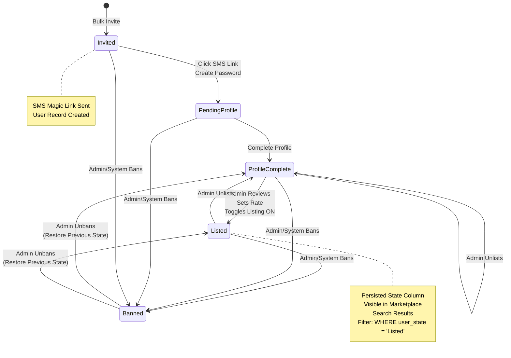

# Data Dictionary - Identity Domain

**Version:** 1.0  
**Last Updated:** January 2026  
**Part of:** [Data Dictionary](./data-dictionary.md)

This document contains business-focused descriptions of Identity domain entities, their relationships, state machines, and business rules. For technical schema definitions, SQL table structures, constraints, and indexes, see [schema.md](schema.md).

**ENUM Values:** All ENUM values referenced in this document (user_state, etc.) are defined in [schema.md](schema.md), which serves as the single source of truth for all technical ENUM definitions. This document provides business context and state machine transitions for these values.

---

## Identity Domain

### User

A human entity that interacts with the platform. Users can hold multiple roles within different Companies through the Company_Member junction table. The User-Company relationship is managed exclusively through the `Company_Member` table; users do NOT have a direct `Company_ID` foreign key.

> **Note:** For complete role definitions, capabilities, relationships, and business context, see [User Roles and Actors](../prd/user-roles-and-actors.md).

**Key Attributes:**
- Mobile number (primary identifier for Workers, unique, required for Workers)
- Email address (optional, unique when present)
- User state (marketplace listing status)
- Stripe identity ID for KYC verification when required

**Business Rules:**
- **Phone-First Authentication:** Mobile number is the primary, persistent identifier for Workers. Construction workers often do not use business emails, so their mobile number serves as their unique identifier.
- **Sequential Employment Support:** Because the mobile number is the unique ID, when a worker changes companies, they keep their Login (Phone + Password) and Reputation, but their "Active Company" context changes. The mobile number enables portability across companies.
- User must have either email OR mobile_number (enforced by database constraint)
- Mobile number must be unique across the platform
- Email must be unique when present
- User state tracks marketplace listing status
- Stripe identity ID is populated when strict identity verification is triggered (e.g., during withdrawal)

> **Note on Multi-Company Access:** While a User can belong to multiple companies, the API enforces a "Single Active Context." API requests are always scoped to the `company_id` present in the Auth Token. Cross-company data aggregation is not supported to ensure privacy and data security.

### Worker State Machine {#worker-state-machine}

The system tracks worker status through a defined state machine. The `User_State` field tracks the worker's marketplace listing status, while `Company_Member.status` tracks their membership status within a company.

**User State Values (Business States):**
- **Invited** - User record created via bulk invite, SMS magic link sent, but user has not yet logged in
- **Pending_Profile** - User has logged in but Worker Profile is incomplete
- **Profile_Complete** - Worker profile is complete and ready for Admin review
- **Listed** - Admin has reviewed profile, set lending rate, and toggled "List in Marketplace" to ON. Worker appears in marketplace search
- **Banned** - Worker has been banned from the platform

**Listing Toggle and State Updates:**
The `Listed` state is a **persisted column** (`users.user_state = 'Listed'`), not a derived status. The state is stored directly in the database column - it is NOT calculated on-the-fly during search queries or derived from event history. Listing is an **Event-Driven Update** that occurs when specific events trigger state changes:
- **When Admin toggles listing ON:** System validates worker is in `Profile_Complete` state and insurance is valid, then updates `user_state` to `Listed` (persisted via database transaction) and logs the change to `audit_log`
- **When Insurance Expires (detected by background job):** System updates `user_state` to `Profile_Complete` (persisted via database transaction) and logs the change to `audit_log` with reason: 'Insurance Expired'
- **When Profile becomes incomplete:** System updates `user_state` to `Pending_Profile` (persisted via database transaction) and logs the change to `audit_log` with reason: 'Profile Incomplete'
- **Search queries:** Simply filter by `WHERE user_state = 'Listed'` (simple column check, no on-the-fly calculation or event replay)
- The `audit_log` table provides a chronological audit trail for compliance and debugging, but the current state is always read from the `users.user_state` column, not from event history

**Listing Toggle Validation Rules:**
- Admin cannot toggle listing ON if worker is still in `Pending_Profile` or `Invited` state
- System validates that worker must be in `Profile_Complete` state before listing toggle can be enabled
- If worker profile becomes incomplete later (e.g., required fields removed), system automatically disables listing toggle (`admin_toggle = OFF`) and worker is removed from marketplace search
- Admin can unlist workers by toggling "List in Marketplace" to OFF (worker remains in `Profile_Complete` state but is removed from marketplace)
- Only workers in `Profile_Complete` state can transition to `Listed`

**State Transitions:**
```
Invited → (User clicks SMS link, creates password) → Pending_Profile
Pending_Profile → (User completes profile) → Profile_Complete
Profile_Complete → (Admin reviews, sets rate, toggles listing ON) → Listed
Profile_Complete → (Admin unlists worker) → Profile_Complete (can toggle back to Listed)
Listed → (Admin unlists worker) → Profile_Complete
Any State → (Admin/System bans worker) → Banned
Banned → (Admin unban action) → Profile_Complete or Listed (depending on previous state)
```

**Worker State Machine Diagram:**



**Note:** Unban is an admin action available for support scenarios to restore access to previously banned users.

**State Transition Validation Rules:**

The Worker State Machine includes comprehensive validation rules to prevent invalid state transitions and ensure data integrity:

**Valid State Transitions:**
- `[*]` → `Invited` (bulk invite)
- `Invited` → `Pending_Profile` (user clicks SMS link, creates password)
- `Invited` → `Banned` (admin/system bans)
- `Pending_Profile` → `Profile_Complete` (user completes profile)
- `Pending_Profile` → `Banned` (admin/system bans)
- `Profile_Complete` → `Listed` (admin reviews, sets rate, toggles listing ON)
- `Profile_Complete` → `Profile_Complete` (admin unlists worker)
- `Profile_Complete` → `Banned` (admin/system bans)
- `Listed` → `Profile_Complete` (admin unlists worker)
- `Listed` → `Banned` (admin/system bans)
- `Banned` → `Profile_Complete` (admin unbans, restores previous state)
- `Banned` → `Listed` (admin unbans, restores previous state)

**Invalid State Transitions (Explicitly Prevented):**
- `Listed` → `Invited` (cannot revert to invitation state)
- `Listed` → `Pending_Profile` (cannot revert to incomplete profile state)
- `Pending_Profile` → `Listed` (must complete profile first)
- `Profile_Complete` → `Invited` (cannot revert to invitation state)
- `Profile_Complete` → `Pending_Profile` (cannot revert to incomplete profile state)
- `Invited` → `Listed` (must complete profile and admin review first)
- `Invited` → `Profile_Complete` (must create password and complete profile first)
- Any state → Any state not explicitly listed in valid transitions above

**State Transition Validation:**
- All state transitions are validated at both database and application levels
- Invalid transitions are prevented with clear error messages
- Error message format: "Invalid state transition. Worker cannot be moved from [Current State] to [Target State]."
- **Listing Toggle Validation Error:** If admin attempts to list a worker who is not in `Profile_Complete` state (e.g., still `Invited` or `Pending_Profile`), system returns clear error message: "Worker profile must be complete before listing. Current state: [state]. Please ensure worker has completed profile creation." Invalid transitions are blocked and error message displayed to admin.

**Company_Member.status Values (Business States):**
- **Active** - User is an active member of the company
- **Invited** - User has been invited but not yet accepted
- **Suspended** - User's membership is temporarily suspended

**Suspended Member Logic:** Suspended members are automatically removed from active bookings and cannot be assigned to new bookings until status returns to Active.

**Relationship:** A User can have `User_State = Listed` while their `Company_Member.status = Active` for a specific company. The User_State applies globally to the user, while Company_Member.status is per-company relationship.

### User Preferences {#user-preferences}

User notification and timezone preferences for personalizing the user experience and respecting quiet hours.

**Key Attributes:**
- Timezone (IANA format, e.g., 'America/Chicago')
- Quiet hours start and end times
- Notification channel preferences (SMS, Email, Push)

**Business Rules:**
- One preferences record per user
- Quiet hours are used to determine when non-critical notifications should be delayed
- Timezone is essential for quiet hours calculation and time-based notifications
- Default notification channels are all enabled (SMS, Email, Push)
- Quiet hours are optional

**Usage:**
- Notification system checks quiet hours before sending non-critical notifications
- **Timezone Display Conversion:** Timezone used for converting booking times and other time-based data for display. When displaying booking times (shift start/end, availability windows, etc.), the system converts times from project timezone to user's preferred timezone. Timezone priority order for display: (1) User's `user_preferences.timezone` (if set), (2) Company default timezone (if user preference not set), (3) Project timezone (fallback). Note: Project timezone remains authoritative for all calculations and storage - display conversion is for user experience only.
- Timezone used for converting UTC timestamps to user's local time for notifications and general UI display
- Preferences can be updated by user at any time

### Company

An organization entity that can act as either a Borrower (hiring workers) or a Lender (providing workers) in the marketplace. Companies have configuration settings for billing policies, break/lunch rules, overtime authorization, and tax status.

**Terminology Clarification:**
- **Borrowing Company** = Company entity that hires workers (acts as Borrower in the marketplace)
- **Borrowing Admin** = User/admin role within a Borrowing Company (the person who manages bookings and operations)
- **Lending Company** = Company entity that provides workers (acts as Lender in the marketplace)
- **Lending Admin** = User/admin role within a Lending Company (the person who manages workers and bookings)
- **Note:** In user stories and journey diagrams, "borrower" and "lender" may be used in lowercase as standard user story format (e.g., "As a borrower,"). In all other documentation, use the full terminology (Borrowing Company, Borrowing Admin, Lending Company, Lending Admin) for clarity.

**Key Attributes:**
- Company name and identification (EIN)
- Default currency for transactions
- Billing policies (minimum billable hours, break/lunch requirements)
  - **Minimum Billable Hours Configuration:** `min_billable_hours` - The minimum shift duration requirement in order to hire a worker from a company. Each company configures their own value (e.g., 2 hours, 4 hours, 8 hours, etc.). The database default of 4 hours is merely a technical default that companies can override. See [Epic 6: Story 6.4](../prd/epic-6.md#story-64-refund-logic-stripe-native-processing) for complete definition and when it applies.
- **Break Policy Configuration:** Duration (minutes) and Frequency (hours) - e.g., 30-minute break every 6 hours
- **Lunch Policy Configuration:** Duration (minutes) and Frequency (hours) - e.g., 30-minute lunch every 6 hours
- **Overtime Authorization Settings:**
  - `ot_authorization_type`: 'Company_Default' (all workers use same setting) or 'Per_Worker' (each worker has own setting)
  - `ot_authorization_default`: 'OT_Authorized' or 'Strictly_No_OT' (used when type = 'Company_Default')
- **Trial Policy Configuration:** `trial_policy` - Options: 'None' (no trial period), '2_Hours', '4_Hours'. Default: '4_Hours'
- **No-Show Fee Configuration:** `no_show_fee_hours` - Lender-configurable no-show fee in hours (DECIMAL, default: 4.0). Used for both Supervisor No-Show and Worker No-Show scenarios
- Tax exemption status
- Strike count (reliability tracking)

**Business Rules:**
- EIN should be unique
- Strikes count is a read-only cached value
- **Minimum Billable Hours:** Applies in specific scenarios (cancellation during active shift, cancellation after shift start, involuntary early departure, borrower fault scenarios). Does NOT apply when worker completes full scheduled shift (bills actual hours worked) or voluntary early departure (bills actuals). See [Epic 6: Story 6.4](../prd/epic-6.md#story-64-refund-logic-stripe-native-processing) for complete definition and application rules.

**Break/Lunch Policy Configuration:**

**Business Rules Reference:** For complete break/lunch policy configuration and self-attestation model, see:
- [Epic 5: Story 5.2 - Break and Lunch Tracking](../prd/epic-5.md#story-52-break-and-lunch-tracking) - Lender self-attestation model
- [Epic 2: Story 2.9 - Lender Policy Configuration](../prd/epic-2.md#story-29-lender-policy-configuration) - Policy configuration and self-attestation

**Technical Implementation:**
- Lenders configure break/lunch policies in Company Settings
- Lenders must self-attest that their policies comply with local labor laws via Terms of Service acceptance
- **Self-Attestation Tracking:** Self-attestation is tracked in the `user_agreements` table with `agreement_type = 'Labor_Law_Compliance'`, providing an audit trail (timestamp, IP address, user agent) for compliance purposes. Self-attestation is required when policies are first configured and when they are updated.
- No database-level validation is performed - lenders accept full liability for their policy configuration
- Policies are enforced based purely on the *Lender's configured settings*, regardless of state laws
- **Multi-Jurisdiction Policies:** For companies using `company_break_lunch_policies` table with different policies per jurisdiction, self-attestation is required once globally (not per jurisdiction). The single self-attestation covers all jurisdictions where the company operates.

**Overtime Configuration:**

**Business Rules Reference:** For complete overtime calculation rules and pre-authorized contract model, see [Epic 6: Story 6.5 - Overtime Rules and Calculations](../prd/epic-6.md#story-65-overtime-rules-and-calculations).

**Technical Implementation:**
- `ot_rate_type` ENUM: 'No_OT' (no overtime), 'Custom_Rate' (lender defines custom OT rate)
- `ot_rule_daily` BOOLEAN: If true, apply OT rate after 8 hours/day (within a booking)
- `ot_rule_weekly` BOOLEAN: If true, apply OT rate after 40 hours/week (within a booking, Mon-Sun, Project Timezone)
- `ot_rule_weekend` BOOLEAN: If true, apply OT rate on Saturday/Sunday (within a booking, Project Timezone)
- These fields serve as defaults for workers in the lending company. Actual OT rates are stored in `worker_rates` table (`hourly_rate` and `overtime_rate`)
- At checkout, OT rules and rates are snapshotted into `bookings.ot_terms_snapshot` JSONB field (Pre-Authorized Contract model)
- OT calculation is booking-scoped (not aggregated across borrowers)

**Trial Policy:**

**Business Rules Reference:** For complete trial policy eligibility rules, see [Epic 6: Story 6.11 - Critical Business Rules Implementation](../prd/epic-6.md#story-611-critical-business-rules-implementation).

**Technical Implementation:**
- Trial option (reject button) is only available for the **first booking** between a specific Borrower and Worker
- It is active ONLY on the **first day** of that booking
- Once a booking has been completed between a Borrower and Worker, subsequent bookings between the same pair do not have trial period eligibility, even if the lender's trial policy is configured

**No-Show Fee:**

**Business Rules Reference:** For complete no-show fee calculation rules, see [Epic 6: Story 6.11 - Critical Business Rules Implementation](../prd/epic-6.md#story-611-critical-business-rules-implementation).

**Technical Implementation:**
- No-show fee is calculated as `no_show_fee_hours × worker_hourly_rate`
- Service Fee (30%) is calculated based only on the no-show amount, not the full shift value

### Company Member

A junction entity representing the Many-to-Many relationship between Users and Companies. Stores role assignments and membership status for each user-company pair.

**Key Attributes:**
- User-Company relationship
- Roles assigned to the user within the company (stored as JSONB array)
- Membership status

**Valid Role Values:**
- Roles are stored as JSONB array of strings in the `company_members.roles` field
- Valid role values: `['Admin', 'Manager', 'Supervisor', 'Worker']`
- Role hierarchy: System Admin > Company Admin > Manager > Supervisor > Worker
- Manager role bridges the gap between Admin (full company control) and Supervisor (field verification only)
- Manager can Book Workers (Demand) and List Workers (Supply) without Admin access to billing/Stripe

**Business Rules:**
- One membership record per user-company pair
- Role assignments are stored per company membership
- Role checking must always filter by both `user_id` AND `company_id`
- Manager role inherits Supervisor verification capabilities
- Manager permissions are context-aware (Borrower vs Lender) like Admin

> **Note:** For complete role definitions, role assignment rules, capabilities, and business context, see [User Roles and Actors](../prd/user-roles-and-actors.md). For technical implementation details of the Unified User Model, see [Unified User Model Blueprint](./blueprints/identity/unified-user-model.md).

### Insurance Policy

Insurance policy tracking for companies. Allows multiple policies per company (1-to-Many relationship). Companies can have both General Liability and Workers Compensation policies.

> **Note:** For complete insurance business rules including the 3-Day Gate, notification timing (14 days Email, 7 days Email+SMS), graceful hard stop logic, and borrower audit link requirement, see [Epic 2: Story 2.7](../prd/epic-2.md#story-27-insurance-upload-and-lender-self-certification). This section provides the entity definition and data model.

**Key Attributes:**
- Insurance type (General Liability or Workers Compensation)
- Expiration date
- Document storage
- Active status
- Self-certification flag

**Business Rules:**
- Only one policy of a specific insurance type per company can be active at a time
- Uploading a new policy automatically sets the previous one of the same type to inactive
- Lenders self-certify insurance data under penalty of fraud
- System Admin does NOT verify insurance documents - this is the responsibility of the Company Admin

### Insurance Gate Validation

**Business Rules Reference:**

For complete business rules including the 3-Day Gate, notification timing (14 days Email, 7 days Email+SMS), graceful hard stop logic, and borrower audit link requirement, see [Epic 2: Story 2.7](../prd/epic-2.md#story-27-insurance-upload-and-lender-self-certification). This section provides the technical implementation details.

**Technical Implementation:**

**Validation Logic:**
1. **Insurance Check Trigger:** During booking creation (checkout), system checks all active insurance policies for the lender company
2. **Booking Period Calculation:** System calculates `booking_end_date` for the booking being created
3. **3-Day Buffer Validation:** System validates that `insurance_policy.expiration_date >= booking_end_date + INTERVAL '3 days'` (calendar days)
4. **Gate Failure:** If insurance expires within 3 calendar days of booking end date, booking creation is blocked and error returned to user

**Database Schema:**
- **Table:** `insurance_policies` - Stores insurance policy records with `expiration_date` and `is_active` fields
- **Index:** `idx_insurance_policies_validation` - Composite index on `(company_id, is_active, expiration_date)` for efficient validation queries
- **Validation Query:** Uses composite index to filter active policies and validate expiration dates

**Validation Points:**
- **Booking Creation:** During booking checkout to ensure insurance coverage throughout booking period

**Explicit Rule - No Validation During Payment Processing:** Insurance validation does NOT occur during weekly payment processing. The Wednesday payment loop only processes bookings with status `Active` and assumes compliance. Insurance failures are handled via independent compliance events (nightly monitoring jobs or manual updates) that immediately suspend bookings with `Suspended_Insurance` status, which prevents them from being included in the payment query. See [Weekly Payments Blueprint](blueprints/booking/weekly-payments.md) for payment processing details.

**Error Handling:**
- If validation fails during booking creation, booking creation is blocked and error returned to user
- Error messages are defined in [Error Message Catalog](./error-message-catalog.md) (e.g., `INSURANCE_EXPIRED`, `INSURANCE_GATE_FAILED`)

**Insurance Hard Stop Technical Implementation:**
- **Event Trigger:** System triggers `Insurance_Hard_Stop` event immediately upon detection of insurance expiration or 3-Day Gate failure
- **Database Operations:** 
  - Updates `bookings.status` to `Suspended_Insurance` for all affected active bookings
  - Blocks clock-in for future shifts (workers cannot clock in if booking status is `Suspended_Insurance`)
  - **Explicit Rule:** The system does NOT cancel shifts or process refunds. Insurance suspension preserves booking data and allows resumption when insurance is renewed.
- **Notification Delivery:** Uses notification queue with Critical priority (bypasses Quiet Hours)
- **Worker Action:** System does NOT force auto-clock-out - worker manually clocks out upon receiving notification
- **Fallback Logic:** Standard "End of Shift" verification and dispute logic applies if worker fails to clock out
   - **Recovery:** Once insurance is renewed and validated, booking status automatically transitions based on dispute status:
     - **No Active Dispute:** Status transitions from `Suspended_Insurance` back to `Active`, workers can resume clocking in
     - **Option A Dispute Active:** Status transitions from `Suspended_Insurance` to `Payment_Paused_Dispute` (not `Active`) until all disputes are resolved. Workers can clock in only after insurance is renewed AND all disputes are resolved.
     - **Option B Dispute Active:** Booking is already `Cancelled` (Option B immediately cancels booking), so insurance renewal has no effect
   - **Independent Operation:** Insurance Hard Stop operates completely independently of payment processing. The Wednesday payment loop only processes bookings with status `Active` and assumes compliance.
   - **Dispute Interaction Rules:**
     - **Insurance Expiration During Option A Dispute:** Status transitions to `Suspended_Insurance` (insurance compliance takes precedence). Dispute remains active. When insurance renewed, status → `Payment_Paused_Dispute` (not `Active`) until disputes resolved.
     - **Insurance Expiration During Option B Dispute:** Booking already `Cancelled` (Option B immediately cancels), so insurance expiration has no effect - no status change occurs.

**Notification Tracking:**

The system tracks notification delivery to prevent duplicate notifications:

- **Notification Log:** All insurance notifications logged in `notification_log` table
- **Notification Status:** Track delivery status (`delivered`, `failed`, `email_sent`)
- **Deduplication:** System prevents duplicate notifications within 24-hour window
- **Retry Logic:** Failed SMS notifications retry with email fallback

**Implementation Requirements:**
- Insurance gate validation must occur during booking creation (checkout) before booking is confirmed
- All insurance validation failures must be logged with full context (policy ID, expiration date, booking end date, validation result)
- Notification timing must be calculated based on insurance expiration date, not booking dates
- Insurance validation must be idempotent (same inputs produce same validation result)
- System must support notification tracking to prevent duplicate alerts
- **Explicit Rule:** Insurance validation does NOT occur during weekly payment processing. Insurance failures are handled via independent compliance events (nightly monitoring jobs or manual updates) that immediately suspend bookings with `Suspended_Insurance` status.

**Validation Flow:**

1. **Insurance Expiration Monitoring:**
   - See [Background Jobs Blueprint](blueprints/system/background-jobs.md) for complete scheduled job specification including schedules, failure handling, and monitoring.
   - **Explicit Rule:** Insurance validation runs independently via nightly monitoring jobs and manual updates. Insurance failures are handled via compliance events that immediately suspend bookings with `Suspended_Insurance` status. The Wednesday payment loop does NOT check insurance validity - it only processes bookings that are currently `Active`. If a booking was suspended due to insurance failure (status = `Suspended_Insurance`), it is excluded from the payment query.

2. **Booking Creation Validation:**
   - Before creating booking, validate that lender has active insurance
   - Validate that insurance expiration date extends beyond booking end date (if applicable)
   - If validation fails: Block booking creation, return error to user

**Related Documentation:**
- See [Insurance Policy](#insurance-policy) for entity definition and data model
- See [Epic 2: Story 2.7](../prd/epic-2.md#story-27-insurance-upload-and-lender-self-certification) for complete insurance business rules and workflows
- See [Weekly Payments Blueprint](./blueprints/booking/weekly-payments.md) for payment processing details (insurance validation is independent of payment processing)

### Refresh Token

JWT refresh token storage for authentication. Enables secure token rotation and session management.

### Password Reset Token

Password reset token storage. Used for secure password recovery workflows.

### Magic Link Token

Magic link tokens for passwordless onboarding and verification. Supports multiple purposes including onboarding, verification, and password reset.

**Business Rules:**
- Token hash must be unique to prevent replay attacks
- QR codes expire after 24 hours

### Notification Log

Logs for SMS and email notifications. Tracks delivery status and fallback mechanisms.

### Onboarding Session

Tracks multi-step onboarding wizard progress. Stores step data and completion status.

**Business Rules:**
- Auto-expires after 30 days
- Supports 4-step onboarding process

### User Agreement

Tracks user agreement acceptance (tax exemption, insurance waiver, etc.). Maintains audit trail with timestamp, IP address, and user agent.

---

**Back to:** [Data Dictionary](./data-dictionary.md)
