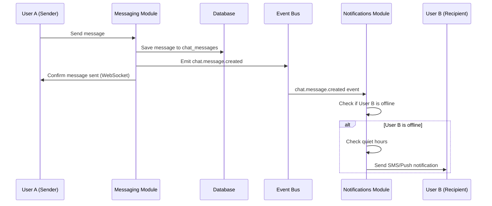

# Data Dictionary - Messaging Domain

**Version:** 1.0  
**Last Updated:** January 2026  
**Part of:** [Data Dictionary](./data-dictionary.md)

This document contains business-focused descriptions of Messaging domain entities, their relationships, and business rules. For technical schema definitions, SQL table structures, constraints, and indexes, see [schema-messaging.md](schema-messaging.md).

**ENUM Values:** All ENUM values referenced in this document are defined in [schema-messaging.md](schema-messaging.md), which serves as the single source of truth for all technical ENUM definitions. This document provides business context for these values.

---

## Messaging Domain

### Module Role: "Conversation Engine"

The Messaging module handles User-to-User communication through context-aware chat threads. It manages real-time WebSocket connections and maintains immutable chat history that serves as legal evidence for disputes.

**Core Responsibilities:**
1. **Context-Aware Threads:** Chat threads are not just between "User A and User B." They are linked to a **Context Entity** (e.g., `booking_id`, `dispute_id`).
2. **Real-Time Transport:** Managing WebSocket connections/rooms for bi-directional communication.
3. **Legal Evidence:** Chat history is immutable. It serves as legal evidence for disputes and is available in Super Admin dashboard for read-only access.

**Architecture Pattern:**
- **Real-Time & Stateful:** Requires persistent WebSocket connections
- **Context-Driven:** Threads are scoped to specific business entities (Bookings, Disputes)
- **Immutable History:** Messages are append-only with soft deletes for UI only
- **Event-Driven:** Emits events for cross-module communication (e.g., `chat.message.created`)

### Chat Channel

A conversation thread linked to a specific business context (e.g., a Booking or Dispute). Channels organize messages by their business context rather than just participant pairs.

**Key Attributes:**
- Context type (Booking, Dispute)
- Context ID (reference to the specific booking or dispute)
- Channel metadata

**Business Rules:**
- Channels are created automatically when first message is sent in a context
- One channel per context (e.g., one channel per booking)
- Channels persist for the lifetime of the context entity
- Context types are: 'Booking', 'Dispute'
- Future context types can be added as needed

**Usage:**
- Booking-related conversations are linked to specific bookings
- Dispute resolution conversations are linked to specific disputes
- Context provides business meaning to conversations
- Enables filtering and organization of conversations by business entity

**Example Scenarios:**
- Worker and Supervisor chat about a specific booking
- Borrower Admin and Lender Admin discuss a dispute
- All participants in a booking can see the conversation thread

### Chat Participant

Represents a user's membership in a chat channel. Tracks read status and participation.

**Key Attributes:**
- Channel reference
- User reference
- Last read timestamp

**Business Rules:**
- Multiple participants per channel
- Participants are added automatically based on context (e.g., booking participants)
- Last read timestamp tracks user engagement
- Participants can be added or removed as business context changes

**Usage:**
- Determines who can see and participate in a channel
- Tracks unread message counts
- Enables "read receipts" functionality
- Manages channel membership

**Read Status:**
- `last_read_at` timestamp indicates when user last viewed the channel
- Messages sent after `last_read_at` are considered unread
- UI can display unread message counts based on this timestamp

### Chat Message

An individual message within a chat channel. Messages are immutable for legal compliance and serve as evidence in disputes.

**Key Attributes:**
- Channel reference
- Sender reference
- Message content
- Timestamp
- Soft delete flags (for UI only)

**Business Rules:**
- **Append-Only Constraint:** Messages are immutable once created
- **Soft Deletes:** UI can mark messages as deleted (`is_deleted`, `deleted_at`), but data remains in database for admin/legal purposes
- **Hard Data Preservation:** Deleted messages are never physically removed from database
- **Legal Evidence:** Chat history serves as legal evidence for Disputes
- Messages are ordered by `created_at` timestamp

**Content Rules:**
- Message content is stored as text
- No file attachments in MVP (future enhancement)
- Content is sanitized but not modified after creation

**Soft Delete Behavior:**
- When user "deletes" a message in UI, `is_deleted` is set to `true` and `deleted_at` is set
- Deleted messages are hidden from normal UI views
- Admin views can see all messages including deleted ones
- Deleted messages remain in database for legal/compliance purposes

**Cross-Module Communication:**

The Messaging module emits events for other modules:

- **`chat.message.created` Event:**
  - Emitted when a new message is saved to database
  - Event payload includes: `channel_id`, `sender_id`, `recipient_id`, `message_preview`
  - Notifications module listens for this event
  - Notifications module checks if recipient is offline
  - If offline, Notifications module sends SMS/Push: "You have a new message from..."

**Architecture Principles:**

1. **Rule 1: Cross-Module Communication via Events**
   - Messaging module should **NEVER** import Twilio/SendGrid wrappers directly
   - Messaging module emits `chat.message.created` event
   - Notifications module handles all outbound delivery

2. **Rule 2: Immutable History**
   - Messages are append-only
   - Soft deletes are for UI only
   - Hard data remains for admin/legal purposes

3. **Rule 3: Directory Structure**
   - Module structure reflects separation:
     ```
     /src/modules
       /messaging
         /gateways     <-- WebSocket logic
         /services     <-- Thread management
     ```

**Real-Time Transport:**

- **WebSocket Connections:** Socket.io (or NestJS Gateway) manages persistent connections
- **Room Management:** Channels map to WebSocket rooms
- **Bi-Directional Events:** Real-time message delivery and typing indicators
- **Connection State:** Tracks user online/offline status for notification routing

**Data Flow Example:**



---

**Back to:** [Data Dictionary](./data-dictionary.md)
