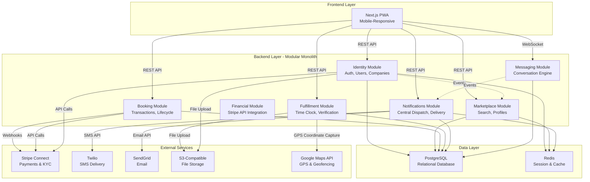

# F. Repository Structure & Development Standards

## 0. System Architecture Overview {#system-architecture-overview}

The following diagram illustrates the high-level architecture of the SmartBench system, showing the modular monolith structure with domain-driven vertical slicing, external services, and communication patterns:



## 1. Repository Structure: Monorepo with Domain-Driven Vertical Slicing

The project uses a monorepo structure to manage frontend, backend, and shared code in a single repository that uses **Domain-Driven Vertical Slicing** grouped by Domain.

**Decision:** Code in one module cannot directly import code from another module. Communication must happen via shared public interfaces or internal service events.

**Required Folder Structure:**
```
/src
  /modules
    /identity              <-- DOMAIN: Auth, Users, Companies, Roles
      /features
        /register-company
        /login
        /manage-members    <-- (Logic for User-Company-Role binding)
    
    /marketplace           <-- DOMAIN: Search, Public Profiles
      /features
        /search-workers
        /view-profile
        /geo-availability  <-- (Distance radius logic)
    
    /booking               <-- DOMAIN: The Transaction & Booking Lifecycle
      /features
        /create-booking
        /process-weekly-renewal  <-- (The "Wednesday Rule")
        /cancel-booking
    
    /fulfillment           <-- DOMAIN: Time Clock, Verification, GPS
      /features
        /clock-in-out      <-- (Offline logic lives here)
        /verify-timesheet
    
    /financials            <-- DOMAIN: Stripe API Integration, Payouts
      /features
        /deposit-funds
        /payout-lender
    
    /notifications         <-- DOMAIN: Central Dispatch, Delivery
      /queues              <-- BullMQ processors
      /providers           <-- Twilio/SendGrid logic
      /templates            <-- Email/SMS string interpolation
    
    /messaging             <-- DOMAIN: Conversation Engine
      /gateways            <-- WebSocket logic
      /services            <-- Thread management
```

This structure enables:
- Shared TypeScript types and interfaces
- Consistent code formatting and linting
- Simplified dependency management
- Easier refactoring across boundaries
- Clear domain boundaries for future microservice extraction

## 2. Service Architecture: Modular Monolith

For MVP, the system uses a **Modular Monolith** architecture with **Domain-Driven Vertical Slicing**. We deploy as a single unit (Monolith) for speed, but code is organized by Domain (Modules) with strict boundaries.

**Architecture Principles:**
- **Domain Modules:** Code organized by business domain (identity, marketplace, booking, fulfillment, financials, notifications, messaging)
- **Vertical Slicing:** Each feature contains all layers (API, business logic, data access) within its domain module
- **Module Boundaries:** Strict boundaries prevent direct imports between modules
- **Communication:** Modules communicate via shared public interfaces or internal service events
- **Future Extraction:** Specific domains (e.g., Billing, Messaging) can be extracted into Microservices later with minimal refactoring

**Cross-Module Communication Patterns:**
- **Messaging → Notifications:** Messaging module emits `chat.message.created` events. Notifications module listens and sends SMS/Push if recipient is offline.
- **Notifications Module Authority:** Notifications module is the sole authority on quiet hours logic and delivery timing. No other module should implement date/time logic for delivery.
- **Event-Driven Architecture:** Modules use internal service events for decoupled communication, preventing direct dependencies.

**Rationale:** Modular Monolith simplifies development, deployment, and debugging for MVP while maintaining clear domain boundaries. This allows us to scale specific domains independently later without a full codebase rewrite.

## 3. Testing Requirements

### Test Coverage Thresholds

**Minimum Coverage Requirements:**
- **Unit Tests:** 80% code coverage for all business logic modules
- **Integration Tests:** 60% coverage for API endpoints and database operations
- **E2E Tests:** Critical user workflows only (booking, verification, payment) - no percentage requirement for MVP

**Coverage Enforcement:**
- CI/CD pipeline fails if coverage drops below thresholds
- Coverage reports generated on every pull request
- Coverage gaps must be justified in code review comments

### Test Type Requirements

**Unit Tests (80% Coverage Required):**
- **Critical Business Logic:** Financial Calculator (Wednesday Rule logic), Overtime Calculator (Start-Day Rule, week boundary handling), Time tracking calculations
- **Domain Logic:** All domain model methods, validation logic, state machine transitions
- **Utility Functions:** Helper functions, formatters, validators
- **Test Location:** Co-located with source code: `src/modules/{domain}/features/{feature}/__tests__/`

**Integration Tests (60% Coverage Required):**
- **API Endpoints:** All REST API endpoints with request/response validation
- **Database Transactions:** Atomic operations, row locking, transaction rollbacks
- **External Service Integrations:** 
  - Stripe Payment Flow (webhook handling, reconciliation)
  - SMS/Email delivery (Twilio, SendGrid)
  - GPS coordinate capture (Google Maps API)
- **Cross-Module Communication:** Event-driven workflows, service boundaries
- **Test Location:** `src/modules/{domain}/features/{feature}/__tests__/integration/`

**E2E Tests (Critical Workflows Only):**
- **Required E2E Tests:**
  - Complete booking workflow (search → cart → checkout → payment)
  - Time clock workflow (clock in → work → clock out → verification)
  - Payment processing workflow (weekly progress payment → webhook → settlement)
  - Dispute resolution workflow (dispute → resolution → settlement)
- **Test Location:** `tests/e2e/`
- **Rationale:** Limited E2E scope for MVP to reduce maintenance overhead while ensuring critical paths work end-to-end

### Epic-Specific Test Requirements

**All Epics Must Include:**
- Unit tests for all business logic (80% coverage)
- Integration tests for all API endpoints (60% coverage)
- At least one E2E test for the primary user workflow in the epic

**Epic-Specific Requirements:**

**Epic 1 (Foundation):**
- Unit tests: Authentication logic, RBAC permission checks, Stripe transaction calculations
- Integration tests: Auth endpoints, company creation, Stripe account setup
- E2E test: User registration → company creation → Stripe account setup

**Epic 2 (Worker Onboarding):**
- Unit tests: Profile validation, insurance verification logic, roster management
- Integration tests: Worker profile API, insurance upload/verification, roster invites
- E2E test: Worker invite → profile completion → listing activation

**Epic 3 (Marketplace):**
- Unit tests: Search filtering logic, availability calculations, geo-distance calculations
- Integration tests: Search API, availability management, checkout availability validation
- E2E test: Worker search → filter → add to cart → checkout

**Epic 4 (Booking):**
- Unit tests: Booking state machine, payment calculations, supervisor assignment logic
- Integration tests: Booking creation, payment processing, Stripe webhook handling
- E2E test: Complete booking workflow (search → cart → checkout → payment)

**Epic 5 (Time Tracking):**
- Unit tests: Time clock logic, GPS coordinate capture, break/lunch tracking, overtime calculations
- Integration tests: Clock in/out API, verification workflows, offline sync
- E2E test: Time clock workflow (clock in → work → clock out → verification)

**Epic 6 (Financial Operations):**
- Unit tests: Refund calculations, overtime calculations, withdrawal processing
- Integration tests: Refund API, withdrawal API, Stripe payment processing
- E2E test: Payment → verification → fund release → withdrawal

**Epic 7 (Super Admin):**
- Unit tests: Admin permission checks, system statistics calculations
- Integration tests: Admin dashboard API, user/company management
- E2E test: Admin login → view statistics → manage company

### Test Quality Standards

**Test Design:**
- Use QA agent `*test-design` command to create test strategy before development
- Follow Given-When-Then structure for test documentation (not test code)
- Tests must be independent and parallel-safe
- No hard waits - use dynamic waiting strategies only
- Self-cleaning: Tests manage their own test data

**Test Execution:**
- All tests must pass before merging to main branch
- Flaky tests are not acceptable - fix or remove
- Test execution time: Unit tests < 5 seconds, Integration tests < 30 seconds, E2E tests < 2 minutes

**Test Maintenance:**
- Update tests when requirements change
- Remove obsolete tests
- Refactor tests when code is refactored

### Manual Testing

**Convenience Methods for Manual Testing:**
- Payment flow testing: Test Stripe webhook simulation endpoints
- SMS delivery testing: Test mode that logs SMS instead of sending
- GPS coordinate capture testing: Mock GPS coordinates for testing coordinate capture
- Time clock testing: Manual time adjustment for testing verification workflows

**Rationale:** Unit + Integration provides good coverage for MVP without the overhead of comprehensive E2E testing. Critical financial and time-tracking logic must be thoroughly tested. Manual testing methods enable rapid development iteration.

### Test Coverage Tools

**Coverage Reporting:**
- Use Jest/Vitest coverage tools for unit and integration tests
- Coverage reports generated in CI/CD pipeline
- Coverage badges displayed in repository README
- Coverage trends tracked over time

**Related Documentation:**
- [The Test Architect (QA Agent)](../../.bmad-core/user-guide.md#the-test-architect-qa-agent) - Test design and review processes
- [Test Design Task](../../.bmad-core/tasks/test-design.md) - Creating test strategies
- [Trace Requirements Task](../../.bmad-core/tasks/trace-requirements.md) - Verifying test coverage

## 4. Technology Stack & Infrastructure

For complete technology stack details including versions, infrastructure, and external services, see [Tech Stack](./tech-stack.md).
