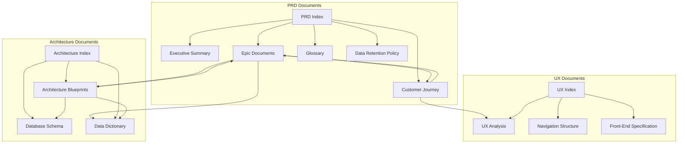

# Document Reference Map

**Purpose:** Visual reference map showing relationships between all SmartBench documentation and navigation guide for finding related information.

**Last Updated:** January 2026  
**Version:** 1.0

---

## Document Relationships

The following diagram shows the relationships between major document categories:

---

## Cross-Reference Patterns

### PRD Epic → Architecture Blueprint

**Pattern:** Epic documents reference architecture blueprints for technical implementation details.

**Examples:**
- Epic 1 → [Authentication System Blueprint](./architecture/blueprints/identity/authentication-system.md), [Unified User Model Blueprint](./architecture/blueprints/identity/unified-user-model.md)
- Epic 2 → [Identity Domain Blueprints](./architecture/blueprints/identity/index.md)
- Epic 3 → [Worker Search Engine Blueprint](./architecture/blueprints/marketplace/worker-search-engine.md), [Availability Management Blueprint](./architecture/blueprints/marketplace/availability-management.md), [Optimistic Concurrency Blueprint](./architecture/blueprints/marketplace/optimistic-concurrency.md)
- Epic 4 → [Weekly Payments Blueprint](./architecture/blueprints/booking/weekly-payments.md), [Optimistic Concurrency Blueprint](./architecture/blueprints/marketplace/optimistic-concurrency.md)
- Epic 5 → [Time Tracking Verification Blueprint](./architecture/blueprints/fulfillment/time-tracking-verification.md)
- Epic 6 → [Financial Architecture](./architecture/financial-architecture.md)
- All Epics → [Error Handling Blueprint](./architecture/blueprints/system/error-handling.md), [Background Jobs Blueprint](./architecture/blueprints/system/background-jobs.md)

### Architecture Blueprint → PRD Epic

**Pattern:** Architecture blueprints reference PRD epics for business context and requirements.

**Examples:**
- [Error Handling Blueprint](./architecture/blueprints/system/error-handling.md) → All Epics (cross-cutting concern)
- [Background Jobs Blueprint](./architecture/blueprints/system/background-jobs.md) → Epic 4, Epic 6 (weekly payments, insurance monitoring)
- [Weekly Payments Blueprint](./architecture/blueprints/booking/weekly-payments.md) → Epic 4, Epic 6
- [Worker Search Engine Blueprint](./architecture/blueprints/marketplace/worker-search-engine.md) → Epic 3
- [Time Tracking Verification Blueprint](./architecture/blueprints/fulfillment/time-tracking-verification.md) → Epic 5
- [Financial Architecture](./architecture/financial-architecture.md) → Epic 6
- [Authentication System Blueprint](./architecture/blueprints/identity/authentication-system.md) → Epic 1
- [Real-Time Chat Blueprint](./architecture/blueprints/messaging/real-time-chat.md) → Epic 3 (worker-client communication)

### Epic ↔ Epic

**Pattern:** Epics reference related epics for feature dependencies and workflows.

**Examples:**
- Epic 4 ↔ Epic 6 (Booking ↔ Financial Operations)
- Epic 4 ↔ Epic 5 (Booking ↔ Time Tracking)
- Epic 2 ↔ Epic 3 (Worker Onboarding ↔ Marketplace)

### Architecture Blueprint → Schema

**Pattern:** Architecture blueprints reference database schema documents for table structures, constraints, and technical database definitions.

**Examples:**
- [Weekly Payments Blueprint](./architecture/blueprints/booking/weekly-payments.md) → [Booking Domain Schema](./architecture/schema-booking.md), [Financial Domain Schema](./architecture/schema-financial.md)
- [Financial Architecture](./architecture/financial-architecture.md) → [Financial Domain Schema](./architecture/schema-financial.md)
- [Time Tracking Verification Blueprint](./architecture/blueprints/fulfillment/time-tracking-verification.md) → [Fulfillment Domain Schema](./architecture/schema-fulfillment.md)
- [Worker Search Engine Blueprint](./architecture/blueprints/marketplace/worker-search-engine.md) → [Marketplace Domain Schema](./architecture/schema-marketplace.md)
- [Authentication System Blueprint](./architecture/blueprints/identity/authentication-system.md) → [Identity Domain Schema](./architecture/schema-identity.md)
- [Real-Time Chat Blueprint](./architecture/blueprints/messaging/real-time-chat.md) → [Messaging Domain Schema](./architecture/schema-messaging.md)
- [Background Jobs Blueprint](./architecture/blueprints/system/background-jobs.md) → [Schema Index](./architecture/schema.md) (references multiple domains)

### PRD ↔ Data Dictionary

**Pattern:** PRD documents reference data dictionaries for entity definitions and state machines.

**Examples:**
- All Epics → [Data Dictionary](./architecture/data-dictionary.md)
- Epic 4 → [Booking Domain Data Dictionary](./architecture/data-dictionary-booking.md)
- Epic 5 → [Fulfillment Domain Data Dictionary](./architecture/data-dictionary-fulfillment.md)

---

## Navigation Guide

### Finding Feature Requirements

1. **Start with PRD Index** → [PRD Index](./prd/index.md)
2. **Navigate to Epic** → Epic documents contain user stories and acceptance criteria
3. **Check Related Documentation** → Each epic has a "Related Documentation" section
4. **Review Architecture Blueprints** → Technical implementation details

### Finding Technical Implementation

1. **Start with Architecture Overview** → [Architecture Overview](./architecture.md) for architectural decisions, or [Architecture Documentation Index](./architecture/index.md) for comprehensive navigation
2. **Navigate to Blueprint** → Domain-specific blueprints contain technical details
3. **Check Related Documentation** → Blueprints reference PRD epics for context
4. **Review Schema/Data Dictionary** → Database structure and entity definitions

### Finding User Experience Details

1. **Start with UX Index** → [UX Documentation Index](./ux/index.md)
2. **Review Customer Journey** → [Customer Journey](./prd/customer-journey.md) for user workflows
3. **Check Front-End Specification** → [Front-End Specification](./ux/front-end-specification.md) for UI details
4. **Review Navigation Structure** → [Navigation Structure](./ux/navigation-structure.md) for information architecture

### Finding Terminology Definitions

1. **Start with Glossary** → [Terminology Glossary](./prd/glossary.md)
2. **Check User Roles** → [User Roles and Actors](./prd/user-roles-and-actors.md) for role definitions
3. **Review Data Dictionary** → [Data Dictionary](./architecture/data-dictionary.md) for entity terminology

---

## Document Categories

### Requirements Documents (PRD)
- **Epic Documents:** Feature requirements and user stories
- **Customer Journey:** End-to-end user workflows
- **User Roles:** Role definitions and permissions
- **Glossary:** Terminology standardization

### Architecture Documents
- **Architecture Blueprints:** Technical implementation details
- **Database Schema:** SQL table definitions
- **Data Dictionary:** Business entity definitions
- **API Contracts:** API endpoint specifications
- **Test Strategy:** Comprehensive test strategy covering unit, integration, E2E, and performance testing
- **Deployment Runbook:** Deployment procedures, database migrations, rollback procedures, and troubleshooting

### UX Documents
- **UX Analysis:** User personas and goals
- **Navigation Structure:** Information architecture
- **Front-End Specification:** Design system and components

### Compliance Documents
- **Data Retention Policy:** Data retention and deletion workflows
- **Security Architecture:** Security and compliance requirements

---

## Quick Reference Links

### By Domain

**Identity & Authentication:**
- [Epic 1: Foundation](./prd/epic-1.md)
- [Authentication System Blueprint](./architecture/blueprints/identity/authentication-system.md)
- [Unified User Model Blueprint](./architecture/blueprints/identity/unified-user-model.md)

**Marketplace & Search:**
- [Epic 3: Marketplace & Search](./prd/epic-3.md)
- [Worker Search Engine Blueprint](./architecture/blueprints/marketplace/worker-search-engine.md)
- [Availability Management Blueprint](./architecture/blueprints/marketplace/availability-management.md)

**Booking & Payments:**
- [Epic 4: Booking & Payment Processing](./prd/epic-4.md)
- [Weekly Payments Blueprint](./architecture/blueprints/booking/weekly-payments.md)
- [Optimistic Concurrency Blueprint](./architecture/blueprints/marketplace/optimistic-concurrency.md)

**Time Tracking:**
- [Epic 5: Time Tracking & Verification](./prd/epic-5.md)
- [Time Tracking Verification Blueprint](./architecture/blueprints/fulfillment/time-tracking-verification.md)

**Financial Operations:**
- [Epic 6: Financial Operations & Admin](./prd/epic-6.md)
- [Financial Architecture](./architecture/financial-architecture.md)

**System Administration:**
- [Epic 7: Super Admin Dashboard](./prd/epic-7.md)
- [Data Retention Policy](./prd/data-retention-policy.md)

**System & Cross-Cutting:**
- [Error Handling Blueprint](./architecture/blueprints/system/error-handling.md) - Error handling patterns, retry policies, circuit breakers
- [Background Jobs Blueprint](./architecture/blueprints/system/background-jobs.md) - Scheduled jobs and task processing

**Messaging & Notifications:**
- [Real-Time Chat Blueprint](./architecture/blueprints/messaging/real-time-chat.md) - WebSocket-based messaging
- [Notifications Blueprints](./architecture/blueprints/notifications/index.md) - Notification delivery and preferences

**Development & Operations:**
- [Test Strategy](./architecture/test-strategy.md) - Comprehensive test strategy covering unit, integration, E2E, and performance testing
- [Deployment Runbook](./architecture/deployment-runbook.md) - Deployment procedures, database migrations, rollback procedures, and troubleshooting
- [Repository Structure & Development Standards](./architecture/repository-structure-development-standards.md) - Monorepo structure, modular monolith architecture, and testing requirements
- [Database Migrations](./architecture/database-migrations.md) - Zero-downtime migration strategy and rollback procedures

---

## Related Documentation

- [PRD Index](./prd/index.md) - Complete PRD navigation
- [Architecture Index](./architecture.md) - Complete architecture navigation
- [UX Documentation Index](./ux/index.md) - Complete UX navigation
- [Terminology Glossary](./prd/glossary.md) - Standardized terminology
