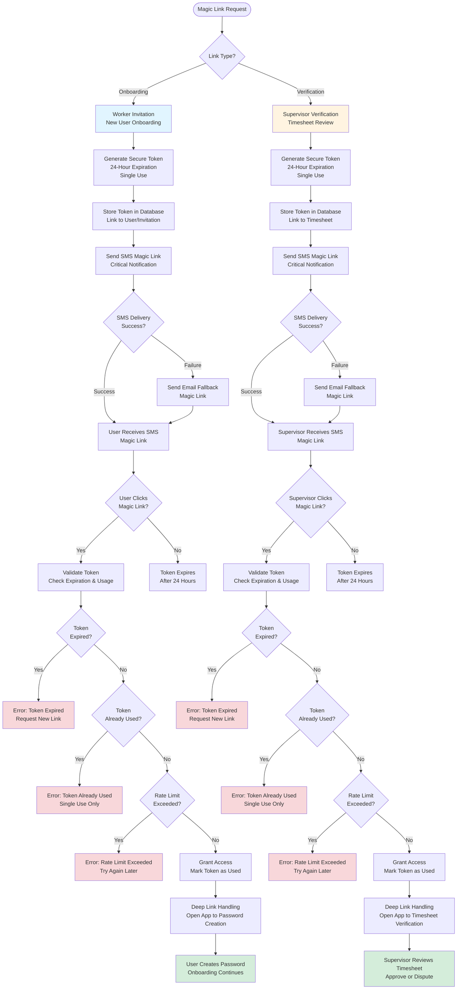
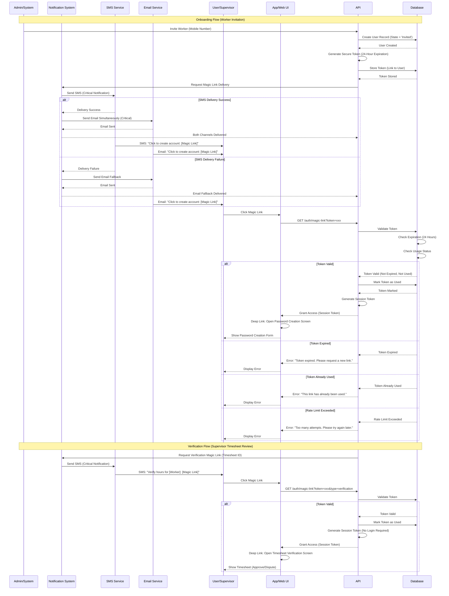

# Epic 1: Foundation & Core Infrastructure

**Epic Goal:** Establish the foundational infrastructure for SmartBench including project setup, authentication system, core database schema with Unified User Model, and direct Stripe payment processing. This epic delivers the technical foundation and basic company/user management capabilities required for all subsequent features.

> [!NOTE]
> **Implementation Tags:**
> - `[SUPABASE_HANDLED]` — This criterion is already handled by Supabase Auth internally. No custom implementation needed.
> - `[STRIPE_HANDLED]` — This criterion is already handled by Stripe Connect. No custom implementation needed.

> **Note:** For the complete system architecture diagram showing the modular monolith structure, domain modules, data layer, and external services, see [System Architecture Overview](../architecture/repository-structure-development-standards.md#system-architecture-overview) in the Architecture document.

## Story 1.1: Project Setup and Infrastructure {#story-11-project-setup-and-infrastructure}

As a developer,
I want the project initialized with proper structure, dependencies, and development environment,
so that the team can begin building features efficiently.

**Acceptance Criteria:**
1. Monorepo structure created with separate directories for frontend, backend, and shared code
2. Frontend framework initialized with PWA configuration per [Tech Stack](../architecture/tech-stack.md)
3. Backend framework configured per [Tech Stack](../architecture/tech-stack.md) - TypeScript only (no Python)
4. Database configured with connection pooling per [Tech Stack](../architecture/tech-stack.md)
5. ORM configured for database access per [Tech Stack](../architecture/tech-stack.md)
6. Validation library configured for shared validation schemas between frontend and backend per [Tech Stack](../architecture/tech-stack.md)
7. Environment variable management set up for development, staging, and production
8. Git repository initialized with .gitignore and initial commit
9. Basic CI/CD pipeline configured (linting, type checking, basic tests)
10. Development documentation created (README, setup instructions, architecture overview)

**Technical Reference:** See [Tech Stack](../architecture/tech-stack.md) for complete technology stack specifications including frameworks, libraries, versions, and infrastructure choices.

## Story 1.2: Database Schema - Core Tables {#story-12-database-schema-core-tables}

As a system architect,
I want the core database schema implemented with Company, User, and role management tables,
so that the Unified User Model can be properly implemented.

**Acceptance Criteria:**
1. Database schema implemented as defined in [Data Dictionary](../architecture/data-dictionary.md)
2. Database schema implemented to support Users, Companies, and Financial operations per [Database Schema](../architecture/schema.md)
3. All foreign key relationships properly defined per schema documentation
4. All indexes created per schema specifications
5. All constraints and business rules implemented per schema documentation
6. ORM schema definitions created for all tables with proper TypeScript types per [Tech Stack](../architecture/tech-stack.md)
7. Database migrations system configured per [Tech Stack](../architecture/tech-stack.md)
8. Seed data script created for development testing

**Technical Reference:** 
- [Database Schema](../architecture/schema.md) - Complete table definitions, constraints, indexes, and foreign keys
- [Data Dictionary](../architecture/data-dictionary.md) - Human-readable business entity definitions
- [Tech Stack](../architecture/tech-stack.md) - ORM and migration tool specifications

## Story 1.3: Authentication System {#story-13-authentication-system}

As a user,
I want to create an account and log in securely,
so that I can access the SmartBench platform.

**Acceptance Criteria:**
1. User registration creates Company and User records
2. `[SUPABASE_HANDLED]` Password hashing implemented using secure hashing algorithm — *Supabase Auth hashes passwords internally via bcrypt*
3. `[SUPABASE_HANDLED]` Secure token-based authentication implemented — *Supabase Auth issues JWTs automatically*
4. `[SUPABASE_HANDLED]` Login validates credentials and returns secure authentication token — *Supabase Auth `signInWithPassword()` / `signInWithOAuth()`*
5. Protected route middleware validates secure tokens
6. Role-based access control (RBAC) middleware checks user roles
7. `[SUPABASE_HANDLED]` Password reset flow implemented via email/SMS — *Supabase Auth `resetPasswordForEmail()`*
8. `[SUPABASE_HANDLED]` Session management handles token refresh — *Supabase Auth auto-refreshes sessions via `auth.refresh_tokens`*
9. **WebAuthn/Biometrics Fast Login:** After successful SMS Magic Link login, system prompts user "Enable TouchID/FaceID for faster login?"
10. `[SUPABASE_HANDLED]` **WebAuthn Enrollment:** User can enroll biometric credentials — *Supabase Auth MFA via `auth.mfa_factors`*
11. `[SUPABASE_HANDLED]` **WebAuthn Authentication:** Returning users can log in using biometrics — *Supabase Auth MFA via `auth.mfa_challenges`*
12. **SMS Fallback:** SMS Magic Links remain primary login method and required fallback recovery method
13. `[SUPABASE_HANDLED]` **WebAuthn Credential Management:** Users can view and revoke registered biometric credentials — *Supabase Auth MFA management APIs*

**Error Handling:**
User-facing error messages for authentication scenarios are defined in the [Error Message Catalog](../architecture/error-message-catalog.md). Key error scenarios include:
- Invalid credentials
- Account locked due to failed login attempts
- Session expiration
- Network errors during login
- Password reset failures
- WebAuthn enrollment failures

**Technical Reference:** See [Error Message Catalog](../architecture/error-message-catalog.md) for complete user-facing error messages and [Error Handling Blueprint](../architecture/blueprints/system/error-handling.md) for technical error handling implementation details.

## Story 1.4: Magic Link System {#story-14-magic-link-system}

As a user,
I want to receive secure, one-time-use links via SMS for onboarding and verification,
so that I can access specific features without remembering passwords.

**Acceptance Criteria:**
1. `[SUPABASE_HANDLED]` Magic link generation endpoint creates secure, time-limited tokens — *Supabase Auth `signInWithOtp()` generates magic links natively*
2. SMS integration for magic link delivery sends magic links to mobile numbers — *Requires Twilio config in Supabase Auth*
3. **SMS Delivery Failure Handling:** 
   - **Business Rule:** If SMS delivery fails, the system automatically attempts email delivery as fallback
   - **Critical Notifications:** For critical alerts (Magic Links and "Recall" notices), the system sends both SMS and Email simultaneously to maximize delivery reliability
   - **Non-Critical Notifications:** For non-critical notifications, SMS is attempted first, with email as fallback if SMS fails
   - **Technical Reference:** See [Notification Delivery Blueprint](../architecture/blueprints/notifications/notification-delivery.md) for complete technical implementation details including retry logic, error classification, and delivery failure handling
4. `[SUPABASE_HANDLED]` Magic link validation verifies token and grants access — *Supabase Auth `verifyOtp()` handles this*
5. `[SUPABASE_HANDLED]` Tokens expire after 24 hours or single use — *Supabase Auth OTP expiry is configurable*
6. Magic links work for onboarding (new user invitation) and verification (supervisor timesheet review)
7. Deep link handling opens app directly to relevant screen
8. `[SUPABASE_HANDLED]` Error handling for invalid/expired tokens — *Supabase Auth returns structured errors*
9. **Rate Limiting:** The system implements rate limiting to prevent abuse of magic link validation. Rate limiting applies to expired or invalid token validation attempts. When rate limit is exceeded, users receive an appropriate error message. **Technical Reference:** See [API Contracts - Rate Limiting](../architecture/api-contracts.md#rate-limiting) for complete rate limiting specifications.

**Magic Link Authentication Flow Diagram:**

The following diagrams illustrate the complete magic link authentication workflow for onboarding and verification:

**Magic Link Authentication Sequence Diagram:**

**Error Handling:**
User-facing error messages for magic link scenarios are defined in the [Error Message Catalog](../architecture/error-message-catalog.md). Key error scenarios include:
- Invalid or expired magic links
- Magic link already used
- SMS delivery failure (with email fallback)
- Email delivery failure
- Network errors during validation

**Technical Reference:** See [Error Message Catalog](../architecture/error-message-catalog.md) for complete user-facing error messages and [Error Handling Blueprint](../architecture/blueprints/system/error-handling.md) for technical error handling implementation details.

## Story 1.5: Direct Stripe Payment Infrastructure {#story-15-direct-stripe-payment-infrastructure}

As a system architect,
I want direct Stripe payment processing implemented with proper transaction tracking,
so that all financial transactions are accurately recorded and auditable.

**Architecture Context:** The MVP uses **Stripe Connect Express** (or **Stripe Connect Standard** where Express is unavailable in certain regions) with **Manual Payouts** configuration. All payments go directly to Stripe Connect Connected Accounts, and all refunds go directly back to customer payment methods via Stripe API. **Regional Considerations:** Stripe Connect Express is being deprecated in some regions in favor of Standard accounts. The implementation must verify that Manual Payout API controls are available in the chosen Connect type for the target region. For MVP (MN/WI), Express accounts support Manual Payouts. If expanding to regions where Express is unavailable, Standard accounts with Manual Payouts will be used.

**Acceptance Criteria:**
1. Stripe Connect Express integration configured with Manual Payouts for all Lender Connected Accounts
2. Payment processing: All payments go directly to Lender's Stripe Connect Connected Account via Stripe API
3. Refund processing: All refunds go directly to Borrower's payment method (card) via Stripe API
4. Booking record fields: System stores `total_amount`, `service_fee_amount`, and `worker_payout_amount` in `bookings` table
5. Booking status tracking: System uses `bookings.status` field for refund tracking ('Refunded', 'Partially_Refunded')
6. Financial calculations use Dinero.js library to prevent floating point errors
7. Monetary values stored as BIGINT (cents) in database, initialized as Dinero objects in application code
8. Transaction history queryable via Stripe API and `bookings` table records
9. Audit trail logging captures all financial state changes
10. **Service Fee Calculation:** Service Fee (30%) is calculated as 30% of Worker Rate, added on top of labor costs
11. **Service Fee Allocation:** The 30% Service Fee must use the financial library's allocation method to safely distribute fractional cents
12. **Payment Formula:** `Total Charge = (Worker Rate * Hours) + (Worker Rate * Hours * 0.30)`

**Related Documentation:**
- See [Financial Architecture](../architecture/financial-architecture.md) for complete Stripe-native implementation details
- See [Epic 6: Financial Operations & Admin](./epic-6.md) for payment processing and refund logic

## Story 1.6: Login-Time Company Context Resolution {#story-16-login-time-company-context-resolution}

As a User belonging to multiple companies,
I want the system to automatically resolve my company context at login time,
so that I am logged into the correct organization without manual selection (in most cases).

**Acceptance Criteria:**
1. **Login-Time Resolution:** When a user logs in, the system checks their `company_members` records for `Active` memberships.
2. **Single Active Membership:** If user has only one `Active` company membership, system logs them directly into that company context automatically.
3. **Sequential Employment:** If a worker moved from Company A to Company B:
   - Company A membership is `Inactive`
   - Company B membership is `Active`
   - System automatically logs them into Company B (no selection needed)
4. **Multiple Active Memberships (Edge Case):** If user has multiple `Active` memberships:
   - System shows a "Select Company" screen **once** immediately after login
   - User selects company, and that context is used for the session
   - This is an edge case - sequential employment model typically results in single active membership
5. **No Hot-Swapping:** The global header company switcher has been removed. To switch companies, users must log out and log back in. Company context is determined at login and stored in the JWT token's `companyId` claim.
6. **Cart Isolation:** "Shopping Carts" are persisted server-side linked to `company_id`. Each company context maintains its own independent cart. When a user logs out and logs back into a different company, the appropriate cart is loaded. See [Epic 4: Booking Cart Management](./epic-4.md#story-41-booking-cart-management) for complete cart persistence details.

**Technical Reference:** See [Authentication System Blueprint](../architecture/blueprints/identity/authentication-system.md) for login-time resolution implementation details.

---

## Related Documentation

- [Epic 1.1: Project Management](./epic-1-1.md) - Project creation and management
- [Epic 2: Worker Onboarding & Profile Management](./epic-2.md) - Worker profile creation and company onboarding
- [Architecture Blueprint: Authentication System](../architecture/blueprints/identity/authentication-system.md) - JWT authentication and session management
- [Architecture Blueprint: Magic Link Onboarding](../architecture/blueprints/identity/magic-link-onboarding.md) - SMS magic link system
- [Architecture Blueprint: Unified User Model](../architecture/blueprints/identity/unified-user-model.md) - User-company relationship model
- [Architecture Blueprint: Error Handling](../architecture/blueprints/system/error-handling.md) - Error handling patterns and user messages
- [Data Dictionary: Identity Domain](../architecture/data-dictionary-identity.md) - User and company entity definitions
- [Customer Journey](./customer-journey.md) - End-to-end user journeys

---