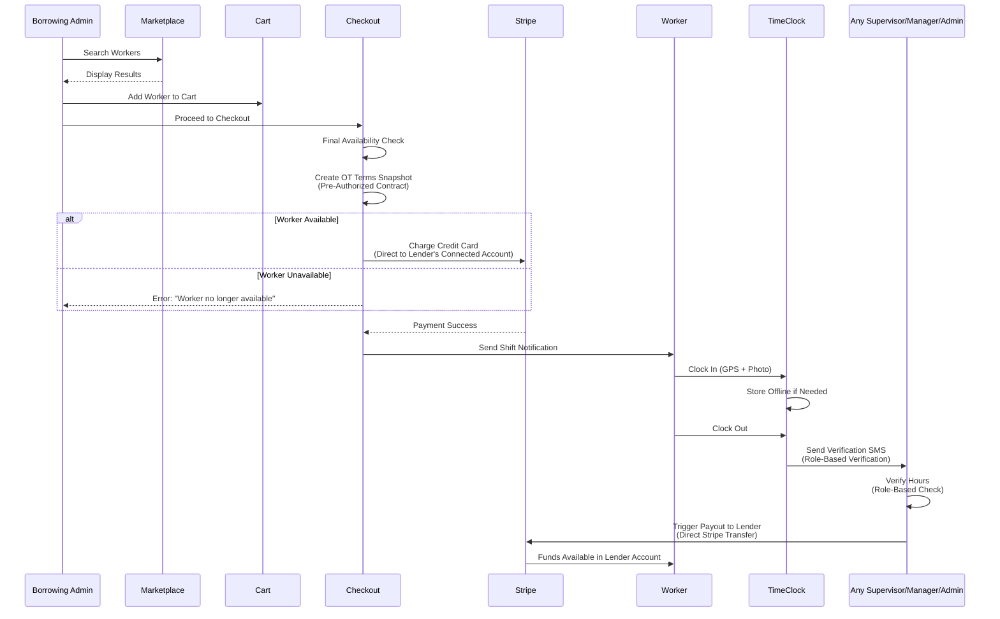
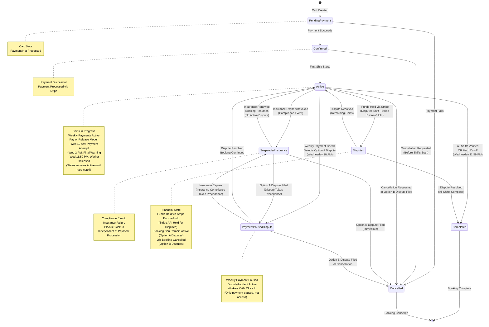
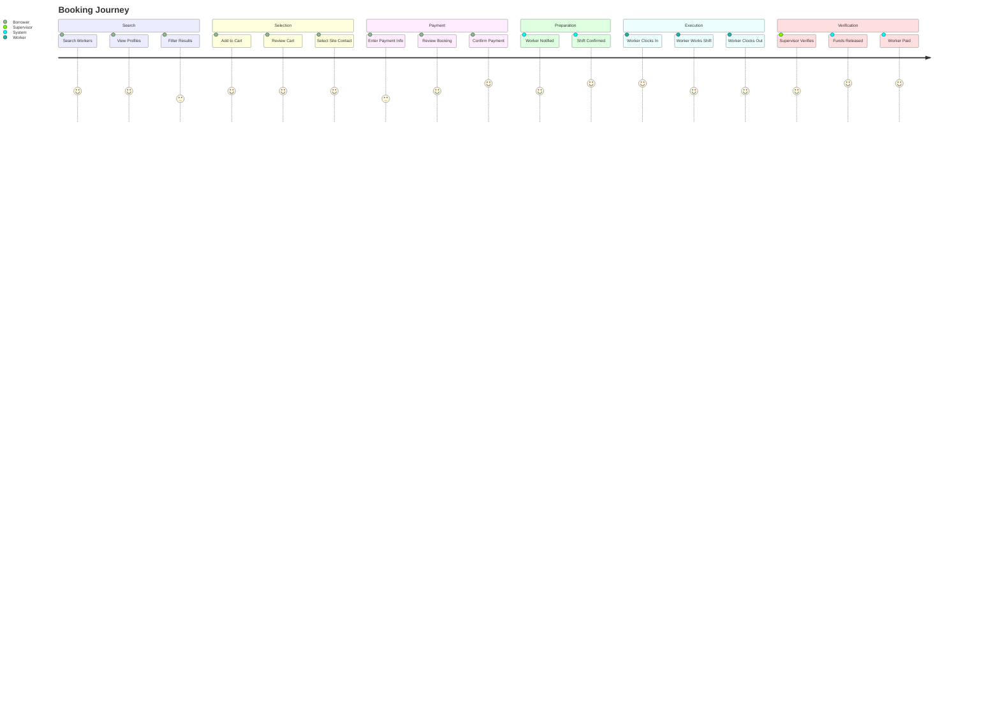
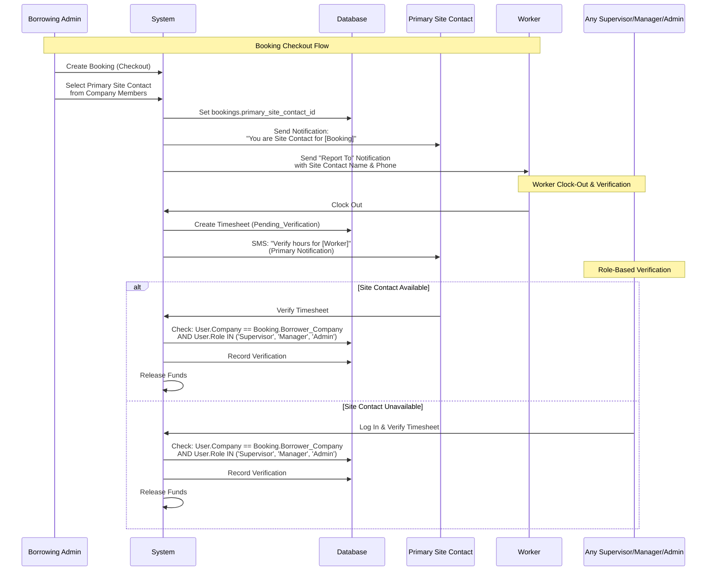
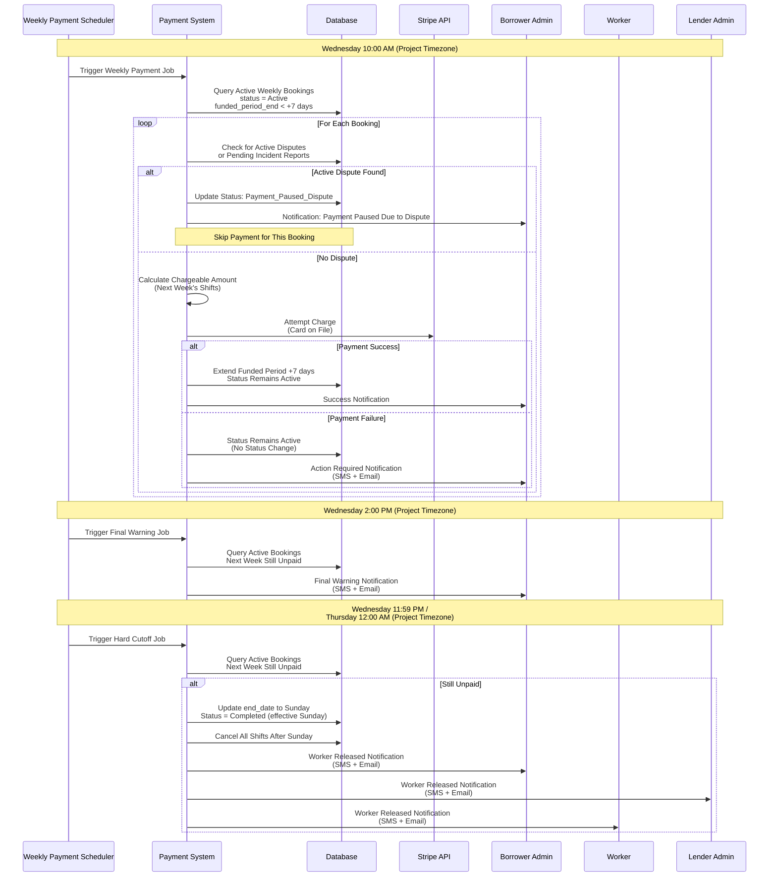

# Epic 4: Booking & Payment Processing

**Epic Goal:** Implement the complete booking workflow from cart to payment, including direct Stripe payment processing, site contact selection, and booking confirmations. This epic delivers the core transaction functionality that enables Borrowing Companies to book workers and process payments securely.

## Booking Flow

The following sequence diagram illustrates the complete booking workflow from search to payment to verification to payout:



## Booking Status State Machine

See [Booking Domain Data Dictionary](../architecture/data-dictionary-booking.md#booking-status-state-machine) for the authoritative State Machine diagram, valid transitions, and business rules.

**Booking Status State Machine Diagram:**



**Invalid Transitions (Explicitly Prevented):**
- `Cancelled` → `Active` (cancelled bookings cannot be reactivated)
- `Cancelled` → `Confirmed` (cancelled bookings cannot transition to confirmed)
- `Completed` → `Active` (completed bookings cannot return to active)
- `Suspended_Insurance` → `Pending_Payment` (contract already executed)

## Booking Journey

The following journey diagram shows the complete booking workflow from search to shift completion:



## Story 4.1: Booking Cart Management {#story-41-booking-cart-management}

As a Borrowing Admin or Manager,
I want to add workers to a cart and manage my selections,
so that I can book multiple workers in a single transaction.

**Acceptance Criteria:**
1. Borrowing Admin and Manager can add workers to cart from search results
2. Cart displays: Worker info (name, trade, rate), Booking dates, Total cost calculation
3. **Cart as Selection List:** The cart is a simple selection list with no reservation power. Workers remain visible in search results even when added to carts. Adding a worker to a cart does not prevent other borrowers from seeing or booking that worker.
4. **Final Availability Check at Checkout:** When Borrowing Admin or Manager proceeds to checkout, the system performs a final availability check for all workers in the cart immediately before payment processing. **Explicit Rule:** This is the only point where availability is validated and double-booking is prevented. The check uses database-level locking (SELECT FOR UPDATE) to ensure atomicity.
5. **Optimistic Concurrency:** If two borrowers attempt to book the same worker simultaneously, the first to complete payment wins. The second borrower receives an error: "Worker no longer available" and must select a different worker or try again later.
6. Borrowing Admin and Manager can remove workers from cart
7. **Cart Persistence and Synchronization:** Cart state must be synchronized across devices and sessions. **Server-Side Authority:** Cart state is stored server-side (in `cart_items` table) and is the single source of truth. All cart operations (add, remove, update) are processed on the server. **Device Synchronization:** When a user logs in from a new device or refreshes the application, the cart is loaded from the server (not merged with any local state). The server's cart state is authoritative, and any local cart state on the new device is replaced with the server state. **Multi-Device Behavior:** If the same user is active on multiple devices simultaneously, cart operations are processed in order by the server. **Conflict Resolution:** Last-write-wins for conflicts. The most recent server-side operation (by timestamp) determines the final cart state. Concurrent operations from multiple devices are serialized by database transactions, ensuring atomicity. **Example Scenario:** (1) Borrowing Admin adds Worker A to cart on mobile device at 10:00:00, (2) Borrowing Admin switches to desktop and refreshes at 10:00:05, (3) Cart loads from server showing Worker A, (4) Borrowing Admin adds Worker B on desktop at 10:00:10, (5) Cart on both devices now shows Worker A and Worker B (server state is synchronized). **Multi-Company Context:** Each company context maintains its own independent cart. When switching between company contexts, each company's cart is preserved independently. Switching back to a company restores the cart exactly as it was. **Example:** User John is Admin in Company A and Company B. Company A cart has 2 workers. Company B cart is empty. Switching to Company B shows empty cart. Switching back to Company A restores 2 workers. See [Epic 1: Multi-Company Context Switching](./epic-1.md#story-16-multi-company-context-switching) for complete context switching details.
8. Cart shows company name (revealed when worker is added to cart)
9. Workers remain visible in search results even when in another user's cart

**Error Handling:**
- **Worker No Longer Available at Checkout:** If final availability check fails (worker already booked by another borrower), show error: "Worker [Name] is no longer available. Please remove from cart and select a different worker." Cart item marked as unavailable with visual indicator. Checkout is blocked until Borrowing Admin removes unavailable workers.
- **Network Error:** If cart operations fail due to network error, show toast: "Network error. Please check your connection and try again." Retry button provided.
- **Concurrent Booking Conflict:** If two borrowers attempt to book the same worker simultaneously, the first to complete payment succeeds. The second receives error: "Worker no longer available" and must select a different worker.
- **Invalid Cart State:** If cart contains invalid data (e.g., invalid booking dates, unavailable workers), show inline validation error: "Cart contains invalid items. Please remove and try again."

## Story 4.2: Site Contact & Verification {#story-42-site-contact-verification}

As a Borrowing Admin or Manager,
I want to designate a primary site contact for each booking,
so that workers know who to contact for operational issues, while allowing any authorized supervisor to verify hours.

**Site Contact & Verification Workflow:**

The following diagram illustrates the simplified workflow separating operational contact (Site Contact) from verification authority (role-based):



**Key Concepts:**
1. **Site Contact (Operational):** The person the worker calls for operational issues (gate codes, running late, site access)
2. **Verification Authority (Role-Based):** ANY user with `Supervisor`, `Manager`, or `Admin` role in the Borrowing Company can verify timesheets
3. **Separation of Concerns:** Site Contact is for communication; Verification is open to all authorized roles

**Acceptance Criteria:**
1. **Primary Site Contact Selection:**
   - During checkout, Borrower MUST select a `Primary Site Contact` from their company member list
   - Site Contact selection is required before payment processing
   - Site Contact can be any company member (not limited to Supervisor role)
   - System stores `primary_site_contact_id` in `bookings` table
2. **Site Contact Management:**
   - Site Contact is editable by Company Admins and Managers at any time (even after booking creation)
   - When Site Contact is changed, Worker receives notification: "Site Contact updated. New contact: [Name], [Phone]"
   - Site Contact change does not affect verification authority (any Supervisor/Manager/Admin can still verify)
3. **Worker UI Requirements:**
   - Worker's dashboard must display the Site Contact's Name and Phone Number
   - Display includes a "Call" button for direct phone contact
   - Site Contact information is visible throughout the booking lifecycle
   - Site Contact info is included in booking confirmation SMS/Email to Worker
4. **Verification Logic (Role-Based):**
   - **Primary Notification:** When Worker clocks out, Primary Site Contact receives SMS with verification link
   - **Verification Authority:** ANY user with `Supervisor`, `Manager`, or `Admin` role in the Borrowing Company can verify the timesheet
   - **Verification Permission Check:** System validates: `User.Company == Booking.Borrower_Company AND User.Role IN ('Supervisor', 'Manager', 'Admin')`
   - **No Assignment Required:** Verification does not require specific supervisor assignment - it is role-based
   - **Multiple Verifiers:** If Site Contact is unavailable, any other Supervisor, Manager, or Admin in the company can log in and verify
5. **Notification Flow:**
   - Primary notification sent to `bookings.primary_site_contact_id` when Worker clocks out
   - Notification includes deep link to verification interface
   - If Site Contact doesn't verify within 2 hours, Borrowing Admin is alerted (per Story 5.7)
   - If still not verified within 4 hours, system auto-approves (per Story 5.9)
6. **Payment Processing:**
   - Primary Site Contact selection required before payment processing
   - Payment proceeds immediately after Site Contact selection - no pending states or blocking
   - Site Contact must be a member of the Borrower Company (enforced at application level)

**Technical Reference:** See [Data Dictionary](../architecture/data-dictionary.md) and [Database Schema](../architecture/schema-booking.md) for Site Contact data model and verification query logic.

## Story 4.3: Checkout and Payment Processing

As a Borrowing Admin or Manager,
I want to complete booking checkout with payment,
so that workers are confirmed and funds are secured.

**Acceptance Criteria:**
1. Checkout flow: Cart Review → **Project Selection** → Site Contact Selection → **Policy Acknowledgment** → Payment → Confirmation
2. **Project Selection Step (Required):** Borrowing Admin or Manager must select an existing project or create a new project before proceeding to site contact selection. System validates that a project is selected and prevents booking creation without a project. If Borrowing Company has no projects, system prompts to create one. Project selection is required - bookings cannot exist without a project (projects are parent entities for all bookings per Epic 1.1). **Note:** Manager can create bookings but cannot create projects (Admin only). Manager must select an existing project. **Timezone Handling Rules:**
   - **Project Timezone is Authoritative:** Project timezone is authoritative for all booking times. All shift start/end times, availability windows, and time-based calculations use the project's timezone as the source of truth.
   - **Storage Rule:** All shift start/end times are stored in project timezone. While timestamps are stored in UTC in the database, all time-based calculations and business logic use the project's timezone.
   - **Display Conversion:** All times are automatically converted for viewing by all users (workers, supervisors, borrowers) into their preferred timezone. Timezone priority order: (1) User's `user_preferences.timezone` (if set), (2) Company default timezone (if user preference not set), (3) Project timezone (fallback).
   - **UI Display Format:** UI displays times in user's timezone with indicator showing project timezone. **Display Format Pattern:** "7:00 AM (Your Time - PST) / 9:00 AM (Project Time - CST)" where the user's preferred timezone is shown first, followed by the project timezone as reference. Project timezone is always shown as reference to ensure clarity across all users. **Examples:** (1) Borrower company in PST, project in CST, worker in EST: Borrower sees "7:00 AM (Your Time - PST) / 9:00 AM (Project Time - CST)", Worker sees "10:00 AM (Your Time - EST) / 9:00 AM (Project Time - CST)", Supervisor in MST sees "8:00 AM (Your Time - MST) / 9:00 AM (Project Time - CST)". (2) All times displayed consistently with both user's timezone and project timezone visible, ensuring all parties understand timing regardless of their location. This ensures all users see times in their local context while maintaining project timezone as the source of truth for scheduling and calculations.
   - **Multi-Timezone Bookings:** If booking spans multiple timezones (e.g., project in MN but worker listed in WI, or worker travels from MN to WI), the project timezone is used as the primary timezone for the booking. All shift times are stored and calculated in project timezone, with conversion applied for display purposes only. Worker and supervisor see times converted to their preferred timezone, but the underlying booking times remain in project timezone.
   - **DST (Daylight Saving Time) Handling:** During DST transitions, project timezone remains consistent (no double-counting or missing hours). System uses timezone-aware date/time handling libraries that handle DST automatically. Shift durations and time calculations are not affected by DST transitions - the project timezone provides a consistent reference point.
   - **Implementation Details:** For complete timezone handling implementation details, library selection, conversion patterns, DST handling, and best practices, see [Timezone Handling](../architecture/timezone-handling.md).
   - **Example - Multi-Timezone Display:**
     - **Project:** Located in Minneapolis, MN (CST - America/Chicago)
     - **Worker:** Lives in Milwaukee, WI (CST - America/Chicago, same timezone in this case)
     - **Supervisor:** Based in New York, NY (EST - America/New_York)
     - **Shift:** 7:00 AM - 3:00 PM in Project Timezone (CST)
     - **Worker View:** "7:00 AM - 3:00 PM (Your Time) / 7:00 AM - 3:00 PM (Project Time - CST)"
     - **Supervisor View:** "8:00 AM - 4:00 PM (Your Time) / 7:00 AM - 3:00 PM (Project Time - CST)"
     - **Storage:** Shift stored as 7:00 AM - 3:00 PM CST (converted to UTC for database storage)
3. **Policy Acknowledgment Step:** Borrower must view and acknowledge Lender's specific policies before confirming booking:
   - Display Lender's Break Policy (duration and frequency)
   - Display Lender's Lunch Policy (duration and frequency)
   - Display Lender's Overtime Authorization setting (OT Authorized or Strictly No OT)
   - Borrower must check "I acknowledge and accept the Lender's policies" checkbox
   - Policy acknowledgment is recorded for audit purposes
   - **OT Policy Acknowledgment Scope:** OT policy acknowledgment applies to the **specific booking only** (not all future bookings). If lender changes OT policy after booking is created, the acknowledgment for that specific booking remains valid. For long-term bookings, the OT policy acknowledged at booking creation applies to all shifts in that booking until the booking ends or is cancelled. **Explicit Rule:** Policy acknowledgment is booking-specific, not company-wide or perpetual.
   - **Policy Change During Active Booking:** If lender changes OT policy (e.g., from "OT Authorized" to "Strictly No OT") during an active booking, the system: (1) Notifies borrower admin via SMS/Email of policy change, (2) Displays warning in booking details: "Lender has changed OT policy. Original policy acknowledged at booking creation still applies to this booking.", (3) Original acknowledged policy remains in effect for the active booking, (4) New policy applies only to future bookings created after the policy change. **Explicit Rule:** Policy changes do not affect active bookings - original acknowledgment remains valid for the duration of the active booking.
4. **Overtime Terms Snapshot (Pre-Authorized Contract Model):** Before payment processing, the system must create and populate the `bookings.ot_terms_snapshot` JSONB field with the Pre-Authorized Contract terms. **Explicit Rule:** This snapshot must be populated at checkout - booking creation is blocked if `ot_terms_snapshot` is null. The snapshot includes:
   - **OT Rules from Lender Company:** System snapshots the Lender's OT rules from `companies` table: `ot_rule_daily` (boolean), `ot_rule_weekly` (boolean), `ot_rule_weekend` (boolean)
   - **Worker's Overtime Rate:** System snapshots the worker's `overtime_rate` (custom dollar amount) from `worker_rates` table. **Critical:** The `overtime_rate` is a specific dollar amount (e.g., $52.50) configured by the lender, NOT a calculated multiplier (e.g., NOT 1.5x of hourly rate)
   - **Snapshot Structure:** `{ "daily_rule": boolean, "weekly_rule": boolean, "weekend_rule": boolean, "ot_rate": number }`
   - **Validation:** If `company.ot_rate_type = 'Custom_Rate'` and `worker_rates.overtime_rate` is null, booking creation is blocked with error: "Worker must have overtime rate configured for this company."
   - **Business Purpose:** The snapshot ensures OT terms cannot change mid-booking, even if the Lender's company settings change later. All OT calculations during time tracking use this snapshot, not current company settings. See [Epic 6: Story 6.5](../prd/epic-6.md#story-65-overtime-rules-and-calculations) for complete overtime calculation rules.
5. **Tax Calculation:** The system uses `NullTaxProvider` which returns $0.00 tax for all bookings. **Tax Exemption Certification:** Tax exemption declaration functionality is deferred to post-MVP. Minnesota does not charge sales tax for temporary labor services, and MVP is limited to Minnesota. Tax exemption declaration will be implemented when expanding to states that require tax collection. See [Tax Adapter Blueprint](../architecture/blueprints/financial/tax-adapter.md) for implementation details.
6. **Payment:** System charges the full booking total to Borrower's credit card via Stripe Connect Express. Payment goes directly to Lender's Stripe Connect Connected Account.
7. Funds flow directly to Lender's Stripe Connect Express Connected Account (with Manual Payouts configuration)
8. Payment transaction recorded in `bookings` table with `total_amount`, `service_fee_amount`, and `worker_payout_amount` fields
9. See [Financial Architecture](../architecture/financial-architecture.md) for Stripe Connect payment processing implementation details.
10. **Worker Availability Management:** **Explicit Rule:** Workers remain visible in search results until booking is confirmed (status = 'Confirmed'). Final availability check occurs at checkout (immediately before payment) using database-level locking (`SELECT FOR UPDATE`) to prevent double-booking. If payment fails, the worker becomes available again immediately (transaction rollback). If payment succeeds, the booking is confirmed and the worker becomes unavailable in search results. The worker availability is NOT tied to the 'Active' status, which only occurs when the first shift starts. This ensures worker availability is protected throughout the entire payment processing flow using optimistic concurrency.
11. **Booking Creation and Payment Failure Workflow:** The system handles different payment failure scenarios with distinct workflows to ensure proper error handling, user experience, and data consistency:
    - **Card Decline (Payment Method Issue):** Booking is created with status `Pending_Payment` → Payment attempt fails due to card decline → Status transition to `Cancelled` (with audit log entry) → Worker becomes available again immediately (transaction rollback) → User can update payment method and retry (creates new booking)
    - **Stripe API Outage (Service Unavailable):** Booking is **NOT created** → Cart is preserved (no locking mechanism) → User receives error: "Payment processing temporarily unavailable. Please try again." → User can manually retry payment (booking will be created on successful retry) → Worker remains visible to other users until booking is confirmed
    - **Network Error (Transient Failure):** Booking is created with status `Pending_Payment` → Payment attempt fails due to network error → Status transition to `Cancelled` (with audit log entry) → Worker becomes available again immediately (transaction rollback) → User can retry payment (creates new booking)
    - **Payment Success:** Booking is created with status `Pending_Payment` → Payment succeeds → Status transition to `Confirmed` (with audit log entry) → Worker becomes unavailable in search results (booking confirmed) → Booking is confirmed and worker is notified
    **Explicit Rule:** Bookings are only created when payment processing can be attempted. If Stripe API is unavailable (circuit breaker open), the booking is not created and the cart is preserved to allow retry without losing the booking configuration.
11. **Payment Failure Handling:** Payment failure handling differs based on booking status and payment context:
    - **Initial Payment Failure (`Pending_Payment` status):** Status transition to `Cancelled` (with audit log entry recording reason: 'Payment Failed'). Worker becomes available again immediately (transaction rollback). User can update payment method and retry (creates new booking with new `Pending_Payment` status).
    - **Weekly Payment Failure (`Active` status):** Booking status remains `Active` (no status change). "Action Required" notification sent to Borrower Admin. See Epic 4, Story 4.5 for complete weekly payment failure handling including final warning and hard cutoff timing.
    **Explicit Rule:** Payment failure outcomes depend on the current booking status. Initial payment failures result in cancellation, while weekly payment failures keep status `Active` until hard cutoff. All status transitions are logged to `audit_log` with `previous_value`, `new_value`, and `reason` in the metadata.
13. Payment failure handling: No automatic retries, user can manually retry
14. Double-booking prevention: System validates worker availability at moment of payment confirmation
15. Booking confirmed only after successful payment

**Error Handling:**
User-facing error messages for booking and payment scenarios are defined in the [Error Message Catalog](../architecture/error-message-catalog.md). Key error scenarios include:
- Payment failures
- Insufficient funds
- Booking conflicts (worker unavailable)
- Insurance validation failures
- Missing project selection
- Missing site contact selection
- Network errors during payment
- Payment service unavailability
- Transaction timeouts

**Technical Reference:** See [Error Message Catalog](../architecture/error-message-catalog.md) for complete user-facing error messages and [Error Handling Blueprint](../architecture/blueprints/system/error-handling.md) for technical error handling implementation details.

## Story 4.4: Direct Stripe Payment Processing {#story-44-direct-stripe-payment-processing}

As a system,
I want to process payments directly through Stripe,
so that financial transactions are handled securely and efficiently.

**Acceptance Criteria:**
1. When booking paid, payment goes directly to Lender's Stripe Connect Connected Account
2. Payment transaction recorded in `bookings` table with `total_amount`, `service_fee_amount`, and `worker_payout_amount` fields
3. System must ensure payment processing atomicity - payment either fully succeeds or fully fails
4. Funds accumulate in Lender's Stripe Connect balance until manual withdrawal
5. Booking status updated to `Confirmed` upon successful payment
6. Payment history tracked via Stripe API and `bookings` table records
7. All refunds processed directly to customer's payment method via Stripe API

## Story 4.5: Weekly Progress Payment System {#story-45-weekly-progress-payment-system}

As a Borrowing Admin,
I want to use weekly progress payments for long-term bookings,
so that I don't have to pay the entire amount upfront.

#### Payment Options and Week Definition
1. For bookings exceeding one week, Borrower can choose: Full Upfront OR Weekly Progress Payments
2. **Week Definition:** A "Week" is Monday 00:00 to Sunday 23:59 in Project Timezone
3. **Mid-Week Start Calculation (The Wednesday Threshold):**
   *   **Goal:** Minimize upfront costs while ensuring no work days are performed without secured funding.
   *   **Logic:** The calculation depends on whether the booking starts *before* or *after* the weekly Wednesday payment run.
   *   **Early Week Starts (Mon, Tue, Wed):** Charge **Remainder of Current Week Only**. The automated "Wednesday Rule" will run immediately (or within 2 days) to secure the following week.
       *   *Example (Monday Start):* Charge Mon-Sun (7 Days). Borrower is charged again on Wednesday for Week 2.
   *   **Late Week Starts (Thu, Fri, Sat, Sun):** Charge **Remainder of Current Week + Full Next Week**. This is necessary because the Wednesday trigger for next week has already passed; failing to bundle would result in unfunded work days (Mon-Wed) the following week.
       *   *Example (Thursday Start):* Charge Thu-Sun (4 Days) + Next Week (7 Days) = 11 Days Total. Next charge occurs *next* Wednesday.
   *   **Edge Case (Sunday Start):** Treated as "Late Week." Charge Sunday (1 Day) + Next Week (7 Days) = 8 Days Total.
4. **Booking Ends Mid-Week:** The initial upfront calculation handles the final partial week. The "Wednesday Rule" only runs if there is a *full* subsequent week to fund
5. Initial Charge: Week 1 paid fully upfront at checkout
6. Recurring Engine: System automatically detects upcoming week for active long-term bookings and processes payments automatically
7. **"Wednesday Rule" (Weds 10 AM Project Time):** The Wednesday Rule triggers at 10 AM in the Project's local timezone to charge for the upcoming week
8. **Dispute Check (The Relationship Check):** Before attempting the Wednesday charge, the system checks for any Active Disputes or Pending Incident Reports on the booking.
   *   **If Option A Dispute Active (Dispute Shift Only):** The Weekly Payment is **SKIPPED**. The Booking Status transitions to `Payment_Paused_Dispute`. No charge is attempted for the future week while the current relationship is fractured. **Critical:** Booking remains `Active` and workers CAN clock in for future shifts. The `Payment_Paused_Dispute` status ONLY affects weekly payment processing - it does NOT block clock-in. This ensures workers are never trapped in a booking they cannot work on.
   *   **If Option B Dispute Active (End Booking & Dispute):** The booking is already `Cancelled` (per fork selection), so no payment processing occurs. Weekly payment query will not pick up cancelled bookings.
   *   **If Dispute Filed During Payment Processing:** If a dispute is filed DURING the Wednesday 10 AM payment processing window (while payment is being attempted), the payment attempt is immediately cancelled, funds are not charged, and booking status transitions to `Payment_Paused_Dispute` (for Option A) or `Cancelled` (for Option B) based on the Fork in the Road decision. **Explicit Rule:** Disputes filed during active payment processing take immediate precedence. The payment attempt is aborted, no charge occurs, and the dispute workflow proceeds normally. This ensures disputes can be filed at any time without waiting for payment processing to complete.
   *   **If Dispute Resolved (Resume):** If the dispute is resolved and the booking continues (Option A), the system checks if any other Option A disputes are still active. If ALL Option A disputes are resolved, the system triggers payment retry logic asynchronously (background job) and status transitions back to `Active`. **Payment Retry Timing:** Payment retry is triggered immediately when ALL disputes resolve (not waiting for Wednesday). The payment retry happens asynchronously via a background job, so dispute resolution is not blocked by payment processing. If dispute resolves on Thursday, payment retry attempts immediately (not waiting until next Wednesday). **Explicit Rule:** Payment retry only triggers when ALL Option A disputes are resolved. If multiple Option A disputes exist and one resolves while others remain active, payment retry does NOT trigger until all disputes are resolved.
   *   **Explicit Rule:** `Payment_Paused_Dispute` only applies to Option A disputes where the booking remains `Active`. Option B disputes result in immediate cancellation, so no payment pause is needed. **Worker Access:** Workers CAN clock in during `Payment_Paused_Dispute` status - this status only pauses weekly payments, not worker access.
9. **Payment Processing (Simplified Loop):** The Wednesday payment loop processes bookings with status `Active`. The loop assumes compliance - if a booking was suspended on Tuesday due to insurance failure (status changed to `Suspended_Insurance`), the query won't pick it up (status is `Suspended_Insurance`, not `Active`). **The payment loop is simplified to three core steps with NO insurance validation:** (1) **Query Active Bookings** (status = `Active`), (2) **Calculate chargeable amount** for next week's shifts, (3) **Attempt Stripe charge** (Card on File, Merchant Initiated). **Explicit Rule - No Insurance Validation in Payment Loop:** Insurance validation runs completely independently via nightly monitoring jobs and manual updates. The payment loop does NOT check insurance validity - it only processes bookings that are currently `Active`. If a booking is `Active`, the system assumes it is compliant. Insurance failures are handled via compliance events that immediately suspend bookings (status → `Suspended_Insurance`), which prevents them from being included in the payment query. See [Epic 2: Insurance Upload](./epic-2.md#story-27-insurance-upload-and-lender-self-certification) for the Event-Driven Compliance Model where insurance failures immediately suspend bookings independently of payment timing. **Pre-Payment Checks (Separate from Core Loop):** Before processing the payment loop, the system performs separate checks: (1) **Dispute Check:** If active dispute or pending incident report exists, payment is skipped and status transitions to `Payment_Paused_Dispute`. (2) **Payment Method Check:** Card on file is verified before weekly payment attempt. If no card on file or card invalid, payment is not attempted. These checks are pre-conditions that prevent the payment loop from executing, but are not part of the core payment processing steps.
10. **The Settlement:** Payment settlement occurs via system automation. System handles processing failures and ensures no duplicate transactions
11. **The Wednesday Rule Timeline (Pay or Release Model):** The Wednesday Rule follows a simplified time-based "Pay or Release" model with three checkpoints:
    *   **Wednesday 10:00 AM (Project Time) - Payment Attempt:**
        *   Calculate cost for Next Week (Monday 00:00 to Sunday 23:59 in Project timezone)
        *   Attempt to charge the card on file (Merchant Initiated Transaction)
        *   **If Success:** Extend `funded_period_end` by 7 days. Booking status remains `Active`.
        *   **If Failure:** Booking status remains `Active` (no status change). Send "Action Required" notification to Borrower Admin.
    *   **Wednesday 2:00 PM (Project Time) - Final Warning:**
        *   Check for active bookings where Next Week is still unpaid
        *   Send "Final Warning" notification to Borrower Admin
        *   Booking status remains `Active` (no status change)
    *   **Wednesday 11:59 PM / Thursday 12:00 AM (Project Time) - Hard Cutoff:**
        *   Check for active bookings where Next Week is still unpaid
        *   **Action: Release the Worker**
            *   Update Booking `end_date` to this coming Sunday (end of current week)
            *   Change Booking Status to `Completed` (status change occurs immediately at hard cutoff; "effective Sunday" refers to the booking end date for display/billing purposes)
            *   Cancel/Delete all shifts scheduled after this Sunday
            *   This immediately makes the worker visible in search for next week (worker becomes available in search immediately, not waiting until Sunday)
        *   **Notifications:** Send "Worker Released (Non-Payment)" alerts to Borrower Admin, Lender Admin, and Worker (Worker is included so they know they have been released; see [Notifications & RBAC Matrix](./notifications-rbac-matrix.md)).
    *   **Timezone Handling:** All times use Project Timezone as authoritative source. Display times converted to user's preferred timezone with project timezone indicator.
    *   **Payment Mechanism:** Uses Stripe "Card on File" (Merchant Initiated Transactions), not Stripe Subscriptions. Payment method stored on Borrower's Stripe Customer record. Charges processed directly via Stripe Payment Intents API.
    *   **Manual Payment Retry:** If payment fails at Wednesday 10 AM, Borrower Admin can manually retry payment at any time before the hard cutoff. If retry succeeds, `funded_period_end` is extended and booking continues normally. If retry fails, booking status remains `Active` until hard cutoff. **Explicit Rule:** Manual payment retry does NOT check insurance validity. Insurance validation runs independently via compliance events. If booking status is `Suspended_Insurance`, the payment retry will not be available (booking is suspended for compliance reasons, not payment reasons).
    *   **Payment Retry During Active Option A Dispute:** If booking has active Option A dispute (status = `Payment_Paused_Dispute`), the "Retry Payment" button is available in the UI. **Payment Success During Dispute:** If payment retry succeeds while dispute is active, payment is accepted and funds are held via Stripe escrow/hold, but booking status remains `Payment_Paused_Dispute` (not `Active`) until all disputes are resolved. Weekly payment processing remains paused while dispute is active. **Payment Failure During Dispute:** If payment retry fails while dispute is active, booking status remains `Payment_Paused_Dispute`, no status change occurs. **User Messaging:** When payment succeeds but dispute remains active, the UI displays: "Payment successful. Your booking remains paused due to an active dispute. Please resolve the dispute to resume normal operations." **Explicit Rule:** Payment success during active dispute does not resolve the dispute or change booking status. The booking remains in `Payment_Paused_Dispute` until all disputes are resolved through the dispute resolution workflow (settlement, evidence review, or legal hold). All funds are held via Stripe's escrow/hold functionality.
12. **Mid-week Cancellation:** If a booking is cancelled mid-week, the "current" day is paid (plus penalties based on 24-hour notice rule), and all *future* days of that funded week are refunded according to 24-hour notice rule directly to the Borrower's payment method via Stripe API. **24-Hour Notice Integration:** Notice period = Time from cancellation timestamp to start time of next scheduled shift (in project timezone). If cancellation occurs during active shift (worker clocked in), that shift is paid 100% (lending company's minimum billable hours apply - see [Epic 6: Story 6.4](../prd/epic-6.md#story-64-refund-logic-stripe-native-processing) for definition) and penalty applies only to next scheduled shift. **Explicit Rules:** (1) Current day is defined as the day containing the cancellation timestamp (in project timezone). For shifts spanning midnight, the day containing shift start time is the "current day" for that shift. (2) If cancellation occurs ≥ 24 hours before next shift start: Current day paid 100% (no penalty), future days refunded 100% via Stripe API. (3) If cancellation occurs < 24 hours before next shift start: Current day paid 100% PLUS late cancellation penalty (50% of first day rate to lender), first future day subject to 50% penalty (remaining future days refunded 100% via Stripe API). (4) Mid-week cancellation refunds are processed immediately upon cancellation via Stripe API. Future days of current funded week are refunded to borrower's payment method per 24-hour notice rule. See [Epic 6: Refund Logic](./epic-6.md#story-64-refund-logic-stripe-native-processing) for complete refund calculation details including all edge cases. **Explicit Example - Partial Week Cancellation After Weekly Payment:** If a borrower cancels on Thursday of Week 2 (Week 2 was already paid on Wednesday), the system: (1) Calculates refund for remaining days of Week 2 (Thu-Sun) per standard refund logic (24-hour notice rule applies), (2) Prevents Week 3 payment (booking cancelled before next Wednesday payment date, so no charge is attempted for Week 3), (3) Processes refund immediately upon cancellation via Stripe API. **Example Scenario:** Long-term booking with weekly payments. Week 2 payment processed Wednesday 10 AM. Borrower cancels Thursday 2 PM. Week 2 remaining days (Thu-Sun) are refunded per 24-hour notice rule via Stripe API. Week 3 payment (scheduled for next Wednesday) is prevented - no charge is attempted because booking is cancelled.
13. **Funded Period Tracking:** System tracks the end of the funded period to determine when the next weekly charge is needed and which shifts are covered by the current funding period. **Explicit Rule:** The funded period ends at the end of the last day of the funded week (23:59:59) in project timezone.
15. **Dispute Resolution for Long-Term Bookings:** Disputes can be filed during long-term booking notice periods (recall scenarios) or during active weekly payment periods. Supervisor must choose Option A or Option B at the moment of dispute filing (see [Story 5.10: Dispute Resolution](./epic-5.md#story-510-dispute-resolution-chat-based-resolution)). **Dispute During Notice Period:** If dispute is filed during a long-term booking's notice period, supervisor chooses Option A or Option B. If Option A selected, disputed amount (notice period pay) is frozen in escrow, remaining undisputed future funds are refunded to Borrowing Company immediately, booking remains `Active`. If Option B selected, booking is cancelled immediately with total freeze. **Dispute During Weekly Payment Period:** If dispute spans multiple weeks, supervisor chooses Option A or Option B. If Option A selected, dispute applies to specific disputed shift(s) only, booking remains `Active`, weekly payment processing may be paused (see Acceptance Criteria #8). If Option B selected, booking is cancelled immediately, no payment processing occurs. **Weekly Payment Processing:** For Option A disputes, weekly payment processing may be paused (`Payment_Paused_Dispute` status) until dispute resolved. For Option B disputes, booking is already cancelled so no payment processing occurs. **Explicit Rule:** Long-term booking disputes use the same "Fork in the Road" workflow as timesheet disputes - supervisor must choose Option A (continue) or Option B (terminate) at the moment of dispute filing.
16. **Dispute Check During Weekly Payment:** Before processing Wednesday 10 AM payment, system checks for active disputes. If Option A dispute exists (booking remains `Active`), payment is skipped and status transitions to `Payment_Paused_Dispute`. **Critical:** This status change does NOT affect worker clock-in access - workers can continue clocking in for future shifts. The booking remains `Active` in terms of worker access. If Option B dispute exists, booking is already `Cancelled` so no payment processing occurs. Payment only processes for active, non-disputed bookings. **Explicit Rule:** Weekly payment processing handles Option A disputes by pausing payment (status → `Payment_Paused_Dispute`), but this does NOT block clock-in. Option B disputes are already cancelled so no processing is needed. Workers are never trapped in a booking they cannot work on.

#### Weekly Payment System Flow Diagrams

The following diagrams illustrate the complete weekly payment workflow, including dispute checks and hard cutoff logic:

```mermaid
gantt
    title Weekly Payment Timeline (Project Timezone)
    dateFormat HH:mm
    axisFormat %I:%M %p
    
    section Wednesday
    Payment Attempt (10:00 AM)    :milestone, wed, 10:00, 0m
    Final Warning (2:00 PM)       :milestone, wed, 14:00, 0m
    Hard Cutoff (11:59 PM)        :milestone, crit, wed, 23:59, 0m
    
    section Thursday
    Worker Released (12:00 AM)    :crit, thu, 00:00, 0m
    Status: Completed (effective Sunday)  :crit, after thu, 00:00, 0m
```

**Weekly Payment Flow Diagram:**

```mermaid
flowchart TD
    Start([Wednesday 10:00 AM<br/>Project Timezone]) --> QueryBookings[Query Active Bookings<br/>payment_type = Weekly_Progress<br/>status = Active]
    
    QueryBookings --> ForEach{For Each Booking}
    
    ForEach --> CheckDispute{Active Dispute<br/>or Pending<br/>Incident Report?}
    
    CheckDispute -->|Yes| SkipPayment[Skip Payment<br/>Status: Payment_Paused_Dispute]
    CheckDispute -->|No| CalculateAmount[Calculate Chargeable Amount<br/>Next Week's Shifts]
    
    CalculateAmount --> AttemptCharge[Attempt Stripe Charge<br/>Card on File]
    
    AttemptCharge --> PaymentResult{Payment<br/>Result?}
    
    PaymentResult -->|Success| PaymentSuccess[Payment Success]
    PaymentSuccess --> ExtendFunded[Extend Funded Period<br/>+7 days<br/>Status Remains Active]
    ExtendFunded --> NotifySuccess[Notify Borrower Admin:<br/>Payment Successful]
    NotifySuccess --> End2([End])
    
    PaymentResult -->|Failure| PaymentFailure[Payment Failure]
    PaymentFailure --> KeepActive[Status Remains Active<br/>No Status Change]
    KeepActive --> NotifyActionRequired[Action Required Notification<br/>SMS + Email to Borrower Admin<br/>Wednesday 10:00 AM]
    
    NotifyActionRequired --> Wait2PM[Wait Until 2:00 PM]
    
    Wait2PM --> Check2PM{Wednesday 2:00 PM<br/>Final Warning?}
    
    Check2PM -->|Yes - Still Unpaid| FinalWarning[Final Warning Notification<br/>SMS + Email to Borrower Admin]
    FinalWarning --> WaitMidnight[Wait Until 11:59 PM]
    
    Check2PM -->|No| WaitMidnight
    
    WaitMidnight --> CheckMidnight{Wednesday 11:59 PM<br/>Hard Cutoff?}
    
    CheckMidnight -->|Yes - Still Unpaid| HardCutoff[Hard Cutoff Triggered]
    
    HardCutoff --> ReleaseWorker[Release Worker:<br/>end_date = Sunday<br/>Status = Completed<br/>Cancel Future Shifts]
    ReleaseWorker --> NotifyRelease[Worker Released Notification<br/>SMS + Email to All Parties:<br/>Borrower Admin, Lender Admin, Worker]
    NotifyRelease --> End3([End])
    
    CheckMidnight -->|No| End4([End])
    
    SkipPayment --> End5([End])
    
    style Start fill:#e1f5ff
    style PaymentSuccess fill:#e1ffe1
    style PaymentFailure fill:#fff4e1
    style HardCutoff fill:#ffe1e1
    style NotifyRelease fill:#ffe1e1
```



**Weekly Payment Sequence Diagram:**



**Key Features Visualized:**
1. **Timeline:** Wednesday 10 AM payment attempt, 2 PM final warning, 11:59 PM hard cutoff (worker release)
2. **Simplified Payment Loop:** Query Active Bookings → Calculate Amount → Charge Stripe (assumes compliance)
3. **Dispute Pause:** Payment skipped if active dispute or pending incident report exists
4. **Payment Flow:** Success path extends funded period; failure path keeps status `Active` until hard cutoff
5. **Pay or Release Model:** Three checkpoints - payment attempt, final warning, worker release
6. **Hard Cutoff:** Automatic worker release if unpaid by Wednesday 11:59 PM (status → `Completed`, end_date set to Sunday)
7. **Notification Escalation:** Action Required (Wednesday 10 AM) → Final Warning (Wednesday 2 PM) → Worker Released (Wednesday 11:59 PM) to all parties
9. **Insurance Independence:** Insurance validation runs independently via nightly jobs. If booking was suspended on Tuesday due to insurance, payment query won't pick it up (status is `Suspended_Insurance`, not `Active`)

**Technical Handling:** For detailed timing logic, edge cases (e.g., system clock drift, race conditions), and exact cutoff behavior, see [Weekly Payments Blueprint](../architecture/blueprints/booking/weekly-payments.md#the-wednesday-rule-timeline-pay-or-release-model).

## Story 4.6: Booking Confirmation

As a Borrowing Admin and worker,
I want to receive booking confirmation details,
so that I know the booking is confirmed and have all necessary information.

**Acceptance Criteria:**
1. Email: Detailed confirmation email to Borrowing Admin with booking details, worker info, supervisor contact
2. SMS: Confirmation SMS to Worker with: Job site address, Supervisor name and phone, Start time and date, Expected duration, What to bring, Weather dependency status
3. PDF: Downloadable booking confirmation PDF
4. Confirmation includes: Booking ID, Dates, Worker details, Supervisor contact, Site address, Rate, Total cost
5. Confirmation sent immediately upon successful payment

## Story 4.7: Shift Notification {#story-47-shift-notification}

As a worker,
I want to be notified when I'm booked for a shift,
so that I know where to report and when.

**Acceptance Criteria:**
1. Trigger: When payment successful (booking payment processed via Stripe)
2. Worker receives SMS: "You are booked at [Address] for [Dates]. Report to [Supervisor Name]."
3. SMS includes deep link to booking details in app
4. Worker can view full booking details in app
5. Notification sent within 1 minute of payment confirmation

## Story 4.8: Lender Recall Workflow

As a lender admin,
I want to recall a worker from a long-term booking with proper notice,
so that I can bring my worker back when needed while maintaining contractual obligations.

**Acceptance Criteria:**
1. Lending Admin can initiate recall from booking management dashboard for active long-term bookings
2. **Recall Wizard:** Convert the recall action into a 3-step modal:
   - Step 1: Select Date (System calculates 3-day buffer and displays adjusted end date)
   - Step 2: Select Reason (dropdown with predefined reasons: Worker needed elsewhere, Company emergency, Performance issue, Other)
   - Step 3: Preview Refund Amount (shows calculated refund for cancelled shifts based on Stripe-native refund logic)
3. System validates `recall_notice_days` (minimum 3 full business days from current date). Business days = Monday-Friday excluding holidays. System uses project jurisdiction holiday calendar to determine business days. **Explicit Rule:** Recall notice period = 3 full business days (Monday-Friday excluding holidays). Holidays are excluded from the count, and the notice period extends to the next business day after the holiday. **Example:** If recall issued Friday, and the following Monday is a holiday, the 3 business days = Tuesday, Wednesday, Thursday (Monday excluded). Example: If recall issued Friday and Monday is not a holiday, 3 business days = Monday, Tuesday, Wednesday (excluding weekends).
4. Recall triggers "Recall Notice Issued" notification to Borrowing Admin (SMS + Email) with notice period and adjusted end date
5. Booking `end_date` automatically adjusted to: `current_date + recall_notice_days` (business days calculation)
6. Future shifts beyond adjusted end_date are automatically cancelled
7. Funds for cancelled shifts automatically refunded to Borrowing Company payment method via Stripe API. **Explicit Rule:** Recall-initiated cancellations result in 100% refund to Borrowing Company payment method (card) via Stripe API for all cancelled future shifts. No cancellation fee applies. This is a lender-initiated cancellation, so there is no penalty to the Borrowing Company.
8. Lender does NOT receive "Reliability Strike" (recall is contractual right for long-term bookings)
9. Worker notified of recall and final shift date via SMS
10. UI shows "Recall Notice Issued" status on booking with adjusted end date
11. Booking status remains "Active" until adjusted end_date, then transitions to "Completed"
12. Recall cannot be initiated for bookings with `payment_type = 'Full_Upfront'` and fixed end dates (only applies to long-term indefinite bookings)

**Edge Cases - Recall Notice Period + Dispute Interactions:**
- **Dispute Timeout During Recall Notice Period:** If Option A dispute times out (3 hours) while recall notice period is still active, all future shifts are cancelled (per standard dispute timeout behavior), but the recall notice period end date does NOT change. Notice period pay remains held until dispute is resolved. The booking remains in `Payment_Paused_Dispute` status (not `Active`) until all disputes are resolved. **Explicit Rule:** Dispute timeout cancels future shifts, but recall notice period end date remains unchanged. Notice period pay is held until dispute resolution.
- **Multiple Option A Disputes During Recall Notice Period:** If multiple Option A disputes are filed during notice period, the first dispute holds notice period pay. Subsequent disputes do NOT affect already-held notice period pay - each dispute tracks its own disputed shift funds independently. All disputes must resolve before booking status transitions from `Payment_Paused_Dispute` to `Active`. **Explicit Rule:** Multiple disputes during notice period hold funds independently. Notice period pay held by first dispute remains held until all disputes are resolved.
- **Dispute Resolution Before Notice Period Ends:** If Option A dispute resolves before recall notice period ends, the booking continues normally with remaining notice period days. The recall end date remains unchanged - worker continues until recall end date. Dispute resolution does NOT cancel the recall. **Explicit Rule:** Dispute resolution does not cancel recall. If dispute resolves before notice period ends, booking continues until recall end date. Recall end date is not affected by dispute resolution timing.

## Story 4.9: Incident Reporting & Termination (Fast-Track Dispute) {#story-49-incident-reporting-termination}

As a Borrowing Admin or Manager,
I want to terminate a booking immediately for cause (safety/performance),
so that I can remove a problematic worker without paying standard notice/cancellation penalties.

**Fast-Track Dispute:** Incidents are defined as a **"Fast-Track Dispute"** that skips the Negotiation Loop entirely. Filing an Incident immediately triggers the **Fork in the Road** and sets the status to `Disputed` (for Option A) or `Cancelled` (for Option B).

**Migration Note:** Fast-Track Dispute replaces the previous Finite Edit Protocol workflow. For details on the Simplified MVP refactor and removed concepts, see [Architecture Index - Migration Notes](../architecture/index.md#migration-notes).

**Acceptance Criteria:**
1. "End Booking" flow presents decision tree: "End for Convenience" vs. "End for Cause."
2. "End for Cause" requires mandatory **Incident Report** with required inputs:
   - **Severity:** `Warning` or `Critical` (required selection)
   - **Type:** `Injury`, `Property_Damage`, `Tardiness`, `Workmanship`, `Conduct` (required selection)
   - **Notes:** Text field (required)
   - Optional photos
3. **Incident Report Logic (Severity-Based):**
   - **If Severity == Warning:** Log incident, Notify Admins (Borrowing Admin and Lending Admin), Booking remains **Active**. Worker can continue working. No fund freeze. **Explicit Rule:** Warning-level incidents are logged for record-keeping but do not trigger dispute workflow or fund freeze.
   - **If Severity == Critical:** Trigger **Fork in the Road** (see below). **Explicit Rule:** Only Critical incidents trigger the Fork in the Road decision and fund freeze.
4. **Early Release Logic - Incident Report Fork in the Road (Critical Only):** When "End for Cause" is selected with **Critical** Incident Report, the system presents the same "Fork in the Road" modal as timesheet disputes (see [Story 5.10: Dispute Resolution](./epic-5.md#story-510-dispute-resolution-chat-based-resolution)). The supervisor MUST choose one of two paths:
   - **Option A: "Keep Worker" (Continue Employment):** Used when the incident is serious but the relationship can continue. Booking Status remains `Active`, worker can clock in for future shifts, only current shift funds frozen in Escrow. **CRITICAL CHANGE:** If Option A is chosen for a Critical incident, the **Lending Admin** receives an Urgent Alert (SMS + Email, bypasses quiet hours) and has the right to **VETO** this decision and Recall/Cancel the worker immediately to protect their liability. **Veto Workflow:** (1) Lending Admin receives Urgent Alert: "Critical incident reported for [Worker]. Borrower chose to keep worker. You have the right to veto and recall worker immediately.", (2) Lending Admin can click "Veto & Recall Worker" button in alert, (3) System immediately cancels booking (status → `Cancelled`), releases worker, removes future shifts, (4) Funds frozen via Stripe escrow/hold (disputed shift + cancellation penalty), (5) Dispute resolution workflow proceeds with both parties. **Explicit Rule:** Lending Admin veto right applies only to Critical incidents where Option A (Keep Worker) was selected. The veto must be exercised within 24 hours of the incident report, after which the Option A decision stands. **Edge Case - Veto During Active Shift:** If Lending Admin vetoes while worker is clocked in for a shift (status = "Working"), the system: (1) Automatically clocks out worker immediately, (2) Sets active shift's time_log status to `Disputed`, (3) Cancels booking immediately, (4) Freezes active shift funds + cancellation penalty via Stripe escrow/hold, (5) Worker becomes available in search immediately (real-time availability via PostgreSQL query - no sync delay). **Explicit Rule:** Lending Admin veto during active shift follows the same immediate termination logic as Option B dispute during active shift - worker is automatically clocked out and shift is marked as Disputed.
   - **Option B: "End Booking & Dispute" (Termination):** Used for serious performance issues, safety incidents, or when termination is required. Booking Status immediately transitions to `Cancelled`, worker is released, future shifts removed, Total Freeze (Current Shift + Cancellation Penalty) held in Escrow. **Explicit Rule:** Incident report triggers the same "Fork in the Road" decision as timesheet disputes - supervisor must choose Option A (continue) or Option B (terminate) at the moment of filing. Only Critical incidents trigger this fork.
4. **Supervisor-First Workflow (Job Site Safety Protocol):** When terminating for cause, the system must ensure the Supervisor/Admin/Manager handles the termination conversation in person before any system action occurs. **UI Requirement:** When terminating for cause, the app must display a confirmation modal asking: *"Has the worker been notified to stop working?"* The system action (booking termination, fund freeze, dispute initiation) triggers only *after* the user confirms verbal notification. **Explicit Rule:** The Supervisor/Admin/Manager must handle the termination conversation directly with the worker. The system does not break the news to the worker via automated text - human-to-human communication is required for job site safety.
5. **Passive Worker Notification (Status Update Only):** After the Supervisor/Admin/Manager confirms verbal notification, the system sends a passive confirmation SMS to the worker. **SMS Text:** "Your booking status has been updated to Ended. Please ensure you are clocked out." **Explicit Rule:** This SMS is informational only - it is a passive status update, not the termination notification itself. The Supervisor/Manager/Admin handles the actual termination conversation. The system SMS serves only to confirm the booking status change and remind the worker to clock out if still on-site.
6. System calculates the "Penalty Amount" (Short-Term) or "Notice Period Amount" (Long-Term) **only for "End for Convenience" scenarios**. For "End for Cause" with incident report, amount is calculated but held via Stripe escrow/hold pending dispute resolution.
7. **Escrow Handling Based on Fork Selection:**
   - **Option A (Dispute Shift Only):** Only the current shift funds are held via Stripe escrow/hold. Booking remains `Active`, worker can continue working.
   - **Option B (End Booking & Dispute):** Total Freeze applies - ALL associated funds are held via Stripe escrow/hold (Current Shift value + Cancellation Penalty for future days). Booking is `Cancelled` immediately. See [Story 6.4: Refund Logic](../prd/epic-6.md#story-64-refund-logic-stripe-native-processing) for complete Total Freeze rule details.
8. Lending Admin receives full Incident Report and Dispute Notification.
9. **Incident Report → Dispute Resolution Workflow:** When incident report is filed, system automatically initiates dispute resolution workflow (see [Story 5.10: Dispute Resolution](./epic-5.md#story-510-dispute-resolution-chat-based-resolution)). **Workflow Steps:** (1) Incident Report filed → Funds held via Stripe escrow/hold, (2) Both parties receive notification with incident report details, (3) Resolution Chat interface opens (same as timesheet disputes), (4) System injects evidence into chat (incident report details, photos, timestamps), (5) Admins communicate in chat to resolve, (6) Super Admin processes resolution based on chat agreement. **Explicit Rule:** Incident reports trigger the same chat-based dispute resolution as timesheet disputes. All funds are held via Stripe's escrow/hold functionality.
10. **Escrow Handling for Incident-Related Cancellations:** Funds held in Stripe escrow for incident-related cancellations follow the same escrow rules as timesheet disputes. Funds remain frozen until: (a) Admins agree in chat and Super Admin processes resolution, or (b) Super Admin manually resolves based on evidence review. **Explicit Rule:** Incident report escrow handling is identical to timesheet dispute escrow handling - no special rules apply. **Note:** A "Concede" button is not implemented in MVP - all resolutions require Super Admin processing after admins agree in chat.
11. **Booking Status Transitions (Critical Incidents Only):**
   - **Option A (Keep Worker):** Booking Status remains `Active`. The disputed shift is in `Disputed` status (funds held via Stripe escrow/hold), but worker can clock in for future shifts. Other shifts continue normally (`Pending_Verification` or `Verified`). **Lending Admin Veto:** If Lending Admin exercises veto right (within 24 hours), booking status immediately transitions to `Cancelled`, worker released, funds frozen. **Edge Case - Veto During Active Shift:** If Lending Admin vetoes while worker is clocked in for a shift (status = "Working"), the system automatically clocks out worker immediately, sets active shift's time_log status to `Disputed`, cancels booking immediately, freezes active shift funds + cancellation penalty via Stripe escrow/hold, and worker becomes available in search immediately. This matches Option B dispute behavior during active shifts.
   - **Option B (End Booking & Dispute):** Booking Status immediately transitions to `Cancelled`. Worker is released, all future shifts removed. Disputed shift funds and cancellation penalty held via Stripe escrow/hold until dispute resolved.
   - **Warning-Level Incidents:** Booking Status remains `Active`. No fund freeze, no dispute workflow. Incident is logged for record-keeping.
   - **Explicit Rule:** A booking is either `Active` (work continues) or `Cancelled` (work stops). There is no middle ground for disputes. The fork decision determines the booking status immediately. Only Critical incidents trigger the fork.
12. **"Cancel Remaining Shifts" Button (Option A Only):** If Option A is selected, the Incident Report/Dispute UI includes an explicit "Cancel Remaining Shifts" button that allows the Borrowing Admin to manually trigger cancellation of future shifts. **Button Availability:** This button is shown only when: (1) Option A dispute is active (booking status = `Payment_Paused_Dispute` or `Active` with active Option A dispute), (2) Future shifts exist that can be cancelled, (3) Dispute is for Option A (not Option B - if Option B was selected, booking is already cancelled so button is not shown). **Button Availability for Timesheet Disputes:** The "Cancel Remaining Shifts" button is available for all Option A disputes (both incident reports and timesheet disputes), not just incident reports. **Cancellation Policy:** When "Cancel Remaining Shifts" is clicked during Option A dispute, standard cancellation policy applies (50% penalty for short-term bookings, notice period forfeiture for long-term bookings, based on 24-hour notice rule). **Cancellation Penalty Escrow:** Cancellation penalties are **HELD via Stripe escrow/hold** (not paid to lender immediately, not refunded to borrower). Both disputed shift funds and held cancellation penalties are resolved together in dispute resolution chat. **Dispute Resolution Interaction:** If future shifts are cancelled via this button, and then dispute resolves: (1) Cancellation remains in effect (cancelled shifts are not restored), (2) Held cancellation penalties are released per dispute resolution outcome (chat agreement or Super Admin decision). If dispute resolution favors borrower, cancellation penalties may be refunded. If dispute resolution favors lender, cancellation penalties are paid to lender. **Explicit Rule:** The "Cancel Remaining Shifts" button applies standard cancellation policy, but penalties are held via Stripe escrow/hold (not paid immediately) until dispute resolution. This ensures both disputed shift funds and cancellation penalties are resolved together in the dispute resolution workflow. All funds are held via Stripe's escrow/hold functionality.
13. **Concurrent Incident Report + Timesheet Dispute:** If an incident report is filed (Option A) and the same shift also has a timesheet dispute (Option A), these are treated as **separate disputes** that both affect weekly payment processing. Both disputes must be resolved before weekly payment processing resumes. Example: Shift 1 has incident report (Option A) → Booking status = `Payment_Paused_Dispute`. Same Shift 1 also has timesheet dispute (Option A) → Booking remains `Payment_Paused_Dispute` (no change). Both disputes must resolve before payment retry is triggered. The dispute resolution chat interface shows both disputes separately, and each can be resolved independently. **Explicit Rule:** Multiple disputes on the same shift are tracked separately but both affect weekly payment - booking remains `Payment_Paused_Dispute` until ALL disputes are resolved.
14. **Incident Filed During Draft Mode:** Incidents can be filed at any time (during or after shift), including during Draft Mode. This is different from disputes which cannot be filed during Draft Mode. Incident reports are independent of timesheet submission status. **Explicit Rule:** Incident reports can be filed regardless of timesheet status (Working, Draft Mode, Pending_Verification, etc.). Unlike disputes which require timesheet submission, incident reports are independent workflow events that can occur at any point during or after a shift.
15. **Incident Filed During Negotiation Loop:** If a Critical incident is filed while a timesheet is in Negotiation Loop status (`Pending_Worker_Review` or `Pending_Supervisor_Reevaluation`), the incident report takes precedence and the Negotiation Loop is terminated. **Explicit Rule:** (1) The 4-hour auto-approval timer for the Negotiation Loop is immediately cancelled, (2) The timesheet status transitions to `Disputed` (for Option A) or the booking is cancelled (for Option B) based on the Fork in the Road decision, (3) Funds are held via Stripe escrow/hold per the incident report workflow, (4) The dispute resolution chat opens with system-injected evidence including both the incident report details and any Negotiation Loop history (supervisor edits, worker rejections, etc.). **Rationale:** Incident reports are "Fast-Track Disputes" that skip the Negotiation Loop entirely. If an incident occurs during an active negotiation, the safety/conduct issue takes precedence over the time calculation dispute.

---

## Related Documentation

- [Epic 1.1: Project Management](./epic-1-1.md) - Project creation and management (required for bookings)
- [Epic 3: Marketplace & Search](./epic-3.md) - Worker search and cart functionality
- [Epic 5: Time Tracking & Verification](./epic-5.md) - Supervisor verification workflows
- [Epic 6: Financial Operations & Admin](./epic-6.md) - Refund logic, Stripe payment processing, and financial operations
- [Architecture Blueprint: Weekly Payments](../architecture/blueprints/booking/weekly-payments.md) - Technical implementation of weekly progress payments
- [Financial Architecture](../architecture/financial-architecture.md) - Stripe-native payment processing implementation
- [Architecture Blueprint: Error Handling](../architecture/blueprints/system/error-handling.md) - Error handling patterns and user messages
- [Data Dictionary: Booking Domain](../architecture/data-dictionary-booking.md) - Booking entity definitions and state machines
- [Customer Journey: Borrower Journey](./customer-journey.md#borrower-journey) - End-to-end borrower booking workflow

---king workflow

---kflow

---