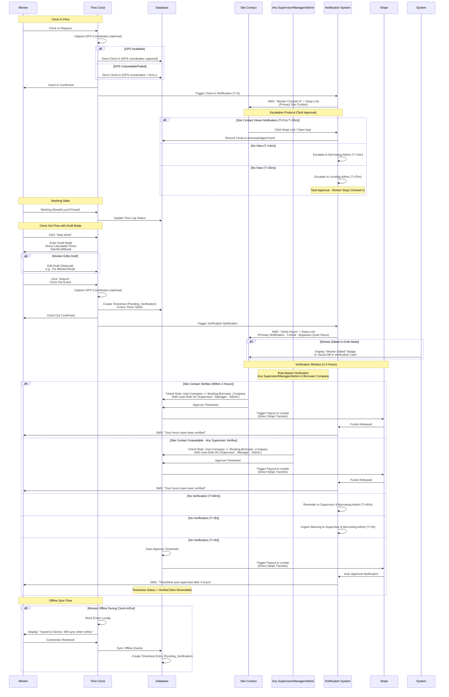
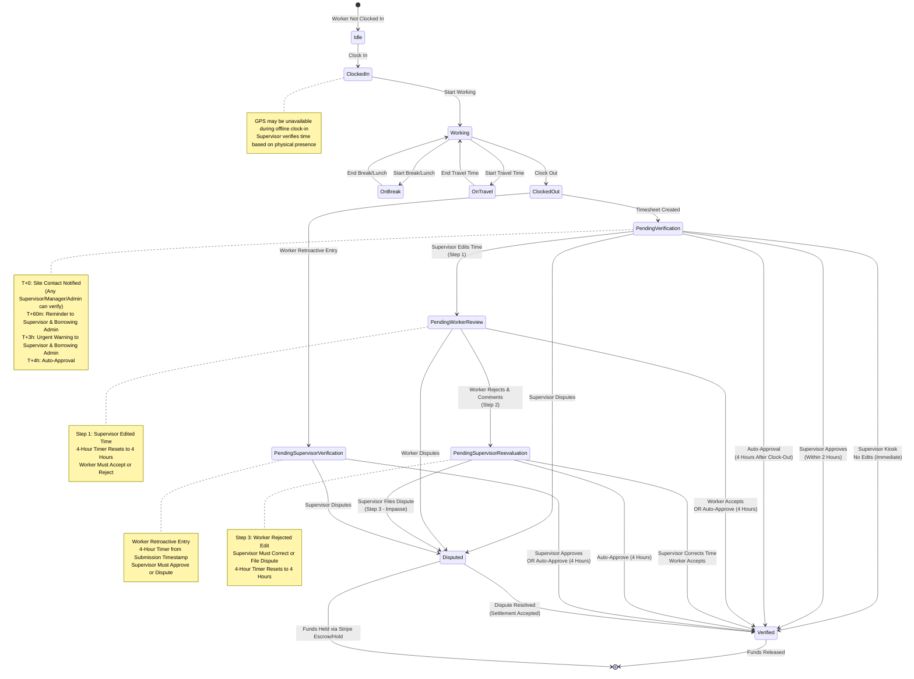
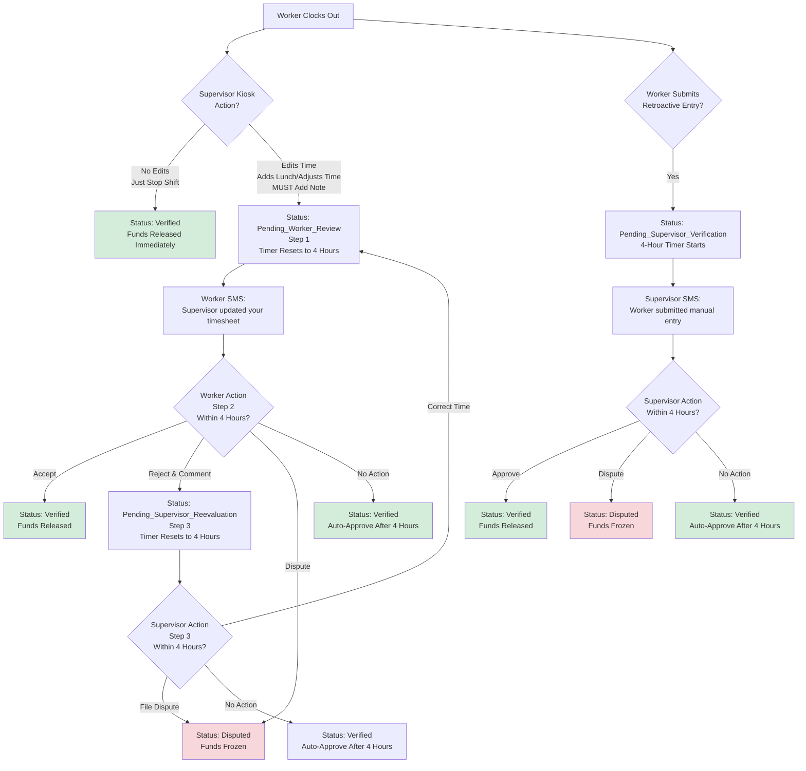
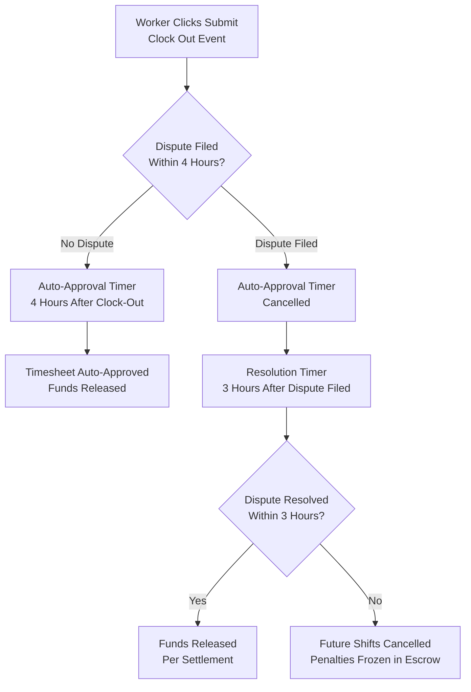
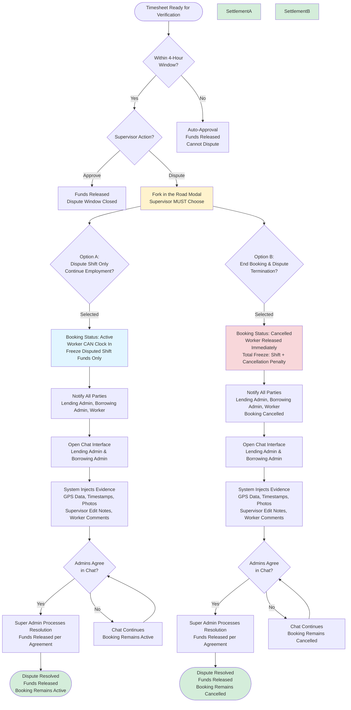
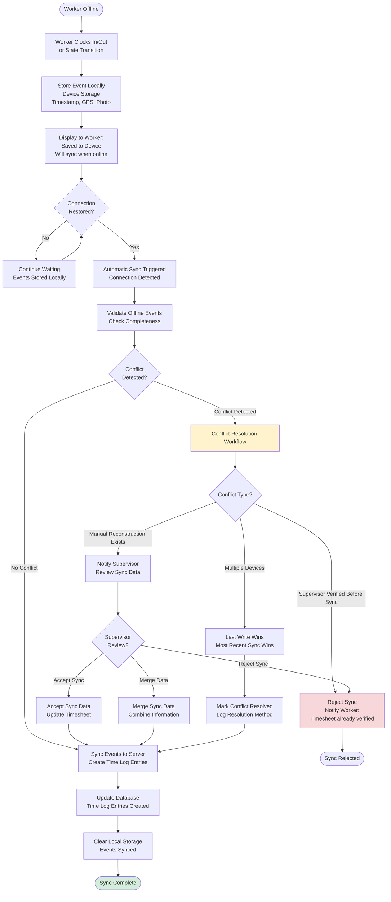
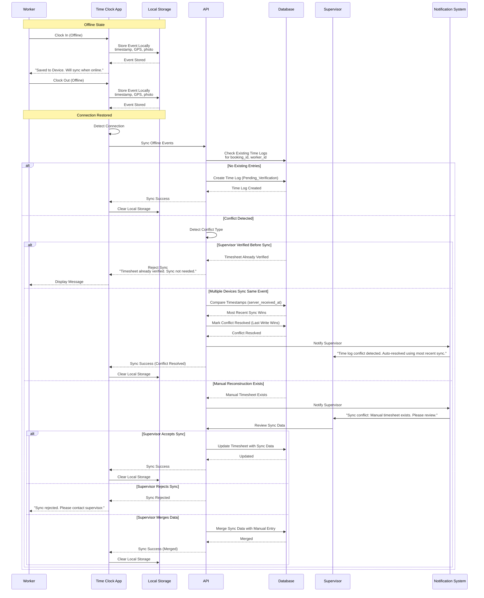

# Epic 5: Time Tracking & Verification

**Epic Goal:** Build a comprehensive time tracking system with GPS coordinate capture, break/lunch tracking, offline support, and supervisor verification workflows. This epic delivers the operational layer that ensures accurate time recording and trust between borrowers and lenders.

## Time Tracking Flow

For the complete offline time clock flow diagram showing sync and verification, see [Time Tracking Verification Blueprint](../architecture/blueprints/fulfillment/time-tracking-verification.md#time-tracking-flow-diagram).

## Time Log Status Lifecycle

For the complete time log status lifecycle diagram showing all state transitions, see [Time Tracking Verification Blueprint](../architecture/blueprints/fulfillment/time-tracking-verification.md#time-log-status-lifecycle-diagram).

## Time Clock Verification Flow

The following diagrams illustrate the complete time clock verification workflow, including clock-in/out flow, GPS coordinate capture, offline sync, supervisor verification, escalation protocols, and fund release triggers:

### Negotiation Loop Sequence Flow

The following sequence diagram illustrates the Negotiation Loop workflow when data is changed:

```mermaid
sequenceDiagram
    participant W as Worker
    participant TC as Time Clock
    participant SK as Supervisor Kiosk
    participant DB as Database
    participant NS as Notification System
    participant Stripe
    
    Note over W,SK: Path A: Supervisor Kiosk (No Edits - Happy Path)
    SK->>DB: Clock Out Worker (No Edits)
    DB->>DB: Status = Verified (Immediate)
    DB->>Stripe: Trigger Payout to Lender<br/>(Direct Stripe Transfer)
    Stripe->>NS: Funds Released
    NS->>W: SMS: "Your hours have been verified"
    
    Note over W,SK: Path B: Supervisor Edits Time (Step 1)
    SK->>DB: Clock Out Worker
    SK->>DB: Edit Time (Add Lunch/Adjust Clock-Out)<br/>MUST Add Note
    DB->>DB: Status = Pending_Worker_Review<br/>auto_approval_time = edit_timestamp + 4 hours<br/>Timer Resets to 4 Hours
    DB->>NS: Trigger Worker Notification
    NS->>W: SMS: "Supervisor updated your timesheet. Please review." + Deep Link
    
    alt Worker Accepts (Within 4 Hours) - Step 2
        W->>DB: Click "Accept"
        DB->>DB: Status = Verified
        DB->>Stripe: Trigger Payout to Lender<br/>(Direct Stripe Transfer)
        Stripe->>NS: Funds Released
        NS->>W: SMS: "Your hours have been verified"
    else Worker Rejects & Comments (Within 4 Hours) - Step 2
        W->>DB: Click "Reject"<br/>MUST Enter Comment
        DB->>DB: Status = Pending_Supervisor_Reevaluation<br/>Timer Resets to 4 Hours
        DB->>NS: Trigger Supervisor Notification
        NS->>SK: SMS: "Worker rejected your edit. Comment: [Comment]"
        
        alt Supervisor Corrects Time (Within 4 Hours) - Step 3
            SK->>DB: Adjust Time
            DB->>DB: Status = Pending_Worker_Review<br/>Timer Resets to 4 Hours
            Note over DB: Loop back to Step 2
        else Supervisor Files Dispute (Within 4 Hours) - Step 3
            SK->>DB: Click "File Dispute"
            DB->>DB: Status = Disputed
            DB->>Stripe: Hold Funds in Escrow
            Note over DB: Resolution Chat Opens
        else No Action (4 Hours Pass) - Step 3
            DB->>DB: Auto-Approve (auto_approval_time <= NOW())
            DB->>DB: Status = Verified
            DB->>Stripe: Trigger Payout to Lender<br/>(Direct Stripe Transfer)
        end
    else Worker Disputes (Within 4 Hours)
        W->>DB: Click "Dispute"
        DB->>DB: Status = Disputed
        DB->>Stripe: Freeze Funds in Stripe Account<br/>(Hold in Stripe)
        Note over DB: Resolution Chat Opens
    else No Action (4 Hours Pass) - Step 2
        DB->>DB: Auto-Approve (auto_approval_time <= NOW())
        DB->>DB: Status = Verified
        DB->>Stripe: Trigger Payout to Lender<br/>(Direct Stripe Transfer)
        Stripe->>NS: Auto-Approval Notification
        NS->>W: SMS: "Timesheet auto-approved after 4 hours"
    end
    
    Note over W,SK: Path C: Worker Retroactive Entry
    W->>TC: Submit Manual/Retroactive Entry
    TC->>DB: Create Timesheet Entry
    DB->>DB: Status = Pending_Supervisor_Verification<br/>auto_approval_time = submission_timestamp + 4 hours<br/>last_editor_id = worker_id
    DB->>NS: Trigger Supervisor Notification
    NS->>SK: SMS: "Worker submitted manual timesheet entry. Please verify." + Deep Link
    
    alt Supervisor Approves (Within 4 Hours)
        SK->>DB: Click "Approve"
        DB->>DB: Status = Verified
        DB->>Stripe: Trigger Payout to Lender<br/>(Direct Stripe Transfer)
        Stripe->>NS: Funds Released
        NS->>W: SMS: "Your hours have been verified"
    else Supervisor Disputes (Within 4 Hours)
        SK->>DB: Click "Dispute"
        DB->>DB: Status = Disputed
        DB->>Stripe: Freeze Funds in Stripe Account<br/>(Hold in Stripe)
        Note over DB: Resolution Chat Opens
    else No Action (4 Hours Pass)
        DB->>DB: Auto-Approve (auto_approval_time <= NOW())
        DB->>DB: Status = Verified
        DB->>Stripe: Trigger Payout to Lender<br/>(Direct Stripe Transfer)
        Stripe->>NS: Auto-Approval Notification
        NS->>W: SMS: "Timesheet auto-approved after 4 hours"
    end
    
    Note over DB: Timer Reset Logic<br/>Timer resets to 4 hours on each<br/>status change in Negotiation Loop
```

## Story 5.1: Time Clock - Basic Clock In/Out {#story-51-time-clock-basic-clock-inout}

As a worker,
I want to clock in and out for shifts with GPS coordinate capture,
so that my time is accurately recorded.

**Acceptance Criteria:**
1. Worker accesses Time Clock via User Login
2. **"One-Button" Dashboard:** If `User_State = Working` (active shift), the app must default/redirect to the Time Clock view immediately upon load, hiding standard navigation to focus on "Clock Out" or "Start Lunch."
3. Clock In: GPS coordinate capture (optional, 500m radius from job site for reference), Project Photo required
4. **GPS Capture Failure Handling:** If GPS fails or is unavailable, the worker can still clock in. The Supervisor sees that GPS was not captured but can verify the time as normal based on their physical presence.
5. **Confidence Feedback:** When clocking in Offline, UI must display a clear animation: "Saved to Device. Will sync when online."
6. Time Clock States: Clock In → Working → Clock Out
7. Clock Out: GPS coordinate capture (optional), Project Photo optional
8. Time entries are recorded with all relevant details. See [Data Dictionary](../architecture/data-dictionary.md) for time_log schema.
9. GPS coordinates are captured when available (optional - supervisor verification is the source of truth)
10. If GPS capture fails but worker proceeds with clock-in, timesheet is created normally for Supervisor verification

**Error Handling:**
User-facing error messages for time tracking scenarios are defined in the [Error Message Catalog](../architecture/error-message-catalog.md). Key error scenarios include:
- GPS capture failures (optional - does not prevent clock-in)
- Photo upload failures
- Network errors during clock-in/out
- Clock-in conflicts (overlapping shifts)
- Clock-out without clock-in
- Offline sync failures

**Technical Reference:** See [Error Message Catalog](../architecture/error-message-catalog.md) for complete user-facing error messages and [Error Handling Blueprint](../architecture/blueprints/system/error-handling.md) for technical error handling implementation details.

## Story 5.2: Break and Lunch Tracking {#story-52-break-and-lunch-tracking}

As a worker,
I want to log breaks and lunch periods,
so that billable hours are calculated correctly based on company policy.

**Acceptance Criteria:**
1. Break/Lunch States: Start Break/Lunch (Unpaid) → End Break/Lunch
2. Worker must physically interact with app: Clock In → Start Lunch → End Lunch → Clock Out
3. System enforces break/lunch logging if shift exceeds thresholds
4. Break Policy: Required after X hours (default: 6), Duration (default: 30 min), Paid/Unpaid (default: unpaid) - configurable per company
5. Lunch Policy: Required after X hours (default: 6), Duration (default: 30 min), Paid/Unpaid (default: unpaid) - configurable separately from breaks
6. System warns if break/lunch not logged for shifts exceeding thresholds
7. Billable Hours Calculation: (Total Duration) - (Unpaid Break Durations)
8. **Lender Self-Attestation Model:** Policies are enforced based purely on the *Lender's configured settings*, regardless of state laws. The system does NOT validate policies against state minimums. Lenders must self-attest that their policies comply with local labor laws via Terms of Service acceptance. The lender accepts full liability for their policy configuration. No database blocking occurs - lenders can set any values for Break/Lunch parameters.
9. Policies are displayed to borrowers during booking checkout for acknowledgment. Borrowers see the lender's configured policies and accept them as part of the booking agreement.

## Story 5.3: Travel Time Tracking {#story-53-travel-time-tracking}

As a worker,
I want to log travel time between job sites,
so that I'm compensated for travel between locations.

**Acceptance Criteria:**
1. **Travel Time Eligibility:** Travel time is ONLY paid when a worker is assigned to two different projects for the same borrower company. Travel to one partial day project or one full day project does NOT include travel time. **Explicit Rule:** Travel time is only billable when moving between two different projects for the same borrower.
2. Travel Time (Travel Mode): Worker leaves Site A for Site B
3. Status: Travel Mode (Time Clock)
4. Travel Time Billing: Travel time billed at Standard Hourly Rate (not OT rate)
5. **Travel Cost:** Travel is billed at the Standard Hourly Rate. It is not a separate line item fee, it is just "Hours"
6. **Travel Time Assignment:** Travel time must be assigned to one timesheet in the same way that a break or lunch is assigned to one timesheet. **Explicit Rule:** Travel time is linked to a specific timesheet and cannot span multiple timesheets.
7. **OT Impact:** Travel hours count toward daily and weekly overtime thresholds within the booking. Travel time is considered "hours worked" under FLSA. Travel hours are treated the same as labor hours for overtime calculation - if travel time satisfies OT rules (daily > 8h, weekly > 40h, or weekend), it is billed at `overtime_rate` from the booking's `ot_terms_snapshot`. See [Epic 6: Overtime Rules](./epic-6.md#story-65-overtime-rules-and-calculations) for complete overtime calculation rules.
8. Distance radius visible prior to booking; Borrowers accept travel cost when booking distant worker
9. Travel time is logged and tracked separately from work segments. See [Data Dictionary](../architecture/data-dictionary.md) for time_log schema.
10. Travel segments tracked separately from work segments

## Story 5.4: Worker Time Self-Correction {#story-54-worker-time-self-correction}

As a worker,
I want to edit my time segments before submission,
so that I can correct mistakes like forgetting to clock out for lunch.

**Acceptance Criteria:**
1. Workers can edit time segments before submission to Supervisor
2. Edit capability: Add missing break/lunch, adjust clock in/out times
3. Supervisor Verification Card displays two data sets: 1) System Time (actual GPS-stamped logs), 2) Submitted Time (worker's edited version)
4. Visual Diff: If Worker edited time, changes highlighted (e.g., "System: No Lunch" vs "Submitted: 30m Lunch")
5. Edit history tracked for audit purposes
6. Worker can submit edited timesheet to Supervisor

## Story 5.5: Offline Time Clock {#story-55-offline-time-clock}

As a worker,
I want the time clock to work when I'm offline,
so that I can clock in/out even in areas with poor connectivity.

**Acceptance Criteria:**
1. Time clock stores clock-in/out events locally when offline
2. Travel Time state transitions stored locally
3. Automatic sync when connection restored
4. Conflict Resolution (Trust but Audit): App accepts offline timestamp
5. When syncing offline events, the system creates a standard timesheet entry for Supervisor review
6. GPS and project photo stored locally, uploaded on sync
7. User notified if sync fails, manual retry option
11. **Device Loss Before Sync - Manual Admin Override Workflow:** If device is lost or destroyed before sync occurs, offline time clock data is considered lost and requires manual admin override. **Explicit Workflow:** (1) Worker reports device loss to supervisor immediately, (2) Supervisor contacts System Admin with evidence (photos of lost device, witness statements, shift documentation, etc.), (3) System Admin reviews evidence in System Admin dashboard, (4) System Admin manually creates time log entry using reconstruction form (see Story 5.11 for reconstruction details), (5) Manual entries are clearly marked in audit trail with `reconstruction_reason` field set to "Device Loss", (6) Manual entries display "Manually Reconstructed - Device Loss" badge in UI, (7) Audit trail includes: Who created reconstruction (System Admin), Who approved (both parties), Timestamps, Original sync failure reason (device loss), Evidence provided. **Note:** This workflow is separate from Story 5.11 (Supervisor Override & Reconstruction) which handles supervisor-initiated reconstructions. Device loss reconstructions require System Admin intervention and evidence review. **Process Documentation:** The manual admin override process is documented in System Admin dashboard with step-by-step instructions and evidence requirements.
12. **Visual Verify Offline Protocol:** When a worker clocks out offline, the system implements a "Visual Verify" protocol for supervisor physical verification. **Offline Clock-Out Requirements:** (1) Worker clocks out offline, capturing Timestamp + GPS + **Mandatory Photo**, (2) Data is saved to Local Storage (IndexedDB) with `sync_status = 'pending'`, (3) UI displays a persistent "Visual Verification" screen showing "Clocked Out: [Time] - Pending Sync" (e.g., "Clocked Out: 5:00 PM - Pending Sync"), (4) Supervisor can physically view this screen on the worker's device to verify the clock-out time, (5) When the worker regains internet connection, the app automatically syncs the offline entry to the server, (6) **Post-Sync Supervisor Notification:** After successful sync, the supervisor receives a notification to verify the timesheet digitally (notification sent AFTER sync completes, not before), (7) Timesheet enters `Pending_Verification` status after sync, triggering standard verification workflow. **Explicit Rule:** Photo capture is mandatory for offline clock-out. The Visual Verification screen remains visible until sync completes, allowing supervisor to physically verify the clock-out time before digital verification occurs.

## Story 5.7: Automated Reminders & Confirmations

As a system,
I want to send automated reminders and confirmations,
so that workers and supervisors are prepared and responsive.

**Acceptance Criteria:**
1. Pre-Shift Reminders: T-Minus 16 Hours: "Reminder" notification to Worker, T-Minus 1 Hour: "Confirmation" Deep Link to Worker, T-Minus 30 Minutes: If Worker has not clicked link, "Urgent Alert" to Lending Admin and Borrowing Admin
2. **Tacit Approval Clock-In Protocol (Start of Shift):** When Worker Clocks In, Primary Site Contact immediately receives SMS with "Clock-In" notification and deep link (T+0). If Site Contact does not view the "Clock-In" notification within **15 minutes**, system escalates via SMS to **Borrowing Admin** (T+15m). If still not viewed within **25 minutes**, system escalates via SMS to **Lending Admin** (T+25m). Failure to eject worker within 25 minutes = **"Tacit Approval"** of attendance. Worker remains clocked in if no action taken. **Critical Requirement:** System must track "Clock-In Acknowledged" event whenever the deep link is clicked or the app is opened. This event is permanent proof for dispute resolution and must include: `time_log_id`, `user_id` (who acknowledged), `acknowledged_at`, `acknowledgment_method` (deep_link_clicked, app_opened). This evidence is available in Super Admin dashboard (read-only) and is injected into dispute resolution chat as system messages.
3. Post-Shift: When Worker Clocks Out, Primary Site Contact immediately receives SMS with deep link to verify hours. **Critical Notification:** This "Verify Now" SMS must be classified as **Critical** and must bypass any user-defined "Quiet Hours." The Site Contact must be woken up if necessary, because money is about to move. **Note:** While Site Contact receives the primary notification, ANY Supervisor, Manager, or Admin in the Borrowing Company can verify the timesheet (role-based verification).
4. **SMS Delivery Failure Handling:** If SMS service returns a delivery error, the system immediately sends the notification via **Email** as fallback. Critical alerts (Magic Links and "Recall" notices) trigger both SMS and Email by default
5. **Scheduled Bomb (Clock-Out Reminders):** The system schedules reminder jobs at Clock-In, not polling. **Logic:** (1) At Clock-In: System calculates `Scheduled_End_Time` (based on Booking), (2) Schedule Job A (T+5m after Scheduled End): Notification to Worker/Supervisor "Are you still working?", (3) Schedule Job B (T+30m after Scheduled End): Notification to Worker/Supervisor "Urgent: Clock Out.", (4) Cancellation: If Worker clocks out normally, cancel Job A and Job B. **Explicit Rule:** Reminder jobs are scheduled at Clock-In based on Booking's scheduled end time, not polled from database. Jobs are cancelled immediately upon normal clock-out. **Edge Case - Scheduled_End_Time Changes:** If the booking's `Scheduled_End_Time` changes after Scheduled Bomb jobs are already scheduled (e.g., supervisor updates shift end time), the system cancels existing jobs and reschedules new jobs based on the updated `Scheduled_End_Time`. If the new `Scheduled_End_Time` has already passed, jobs are not rescheduled. **Explicit Rule:** Scheduled Bomb jobs must always reflect the current `Scheduled_End_Time` from the booking. If the scheduled end time changes, jobs are cancelled and rescheduled to match the new time.
6. **End of Shift Verification Escalation (Notification Ladder):** When Worker clicks "Submit" on timesheet (Clock Out event), the 4-hour auto-approval timer starts. **Notification Ladder:** (1) T+0 (Clock Out): SMS to Supervisor with Deep Link to verify, (2) T+60m: SMS to Supervisor & Borrowing Admin (Reminder), (3) T+3h: SMS to Supervisor & Borrowing Admin (Urgent Warning), (4) T+4h: Auto-Approval Execution (Status becomes `Verified`, Funds Released). **Auto-Approval Notification:** When auto-approval occurs, system sends notification: "Timesheet auto-approved after 4 hours. Supervisor did not verify within required timeframe." **Explicit Rule:** Auto-approval occurs exactly 4 hours after clock-out (when Worker clicks Submit) regardless of day/time (weekends, holidays included). Once a timesheet is auto-approved, it cannot be reversed or disputed.
7. After Verification: Worker receives SMS notification "Your hours have been verified"
8. All notifications include deep links to relevant screens

## Story 5.8: Supervisor Verification Workflow {#story-58-supervisor-verification-workflow}

As a supervisor or admin,
I want to verify worker hours quickly and easily,
so that funds can be released promptly.

**Acceptance Criteria:**
1. **Draft Mode (Time Clock Review):** Workers must review their time *before* it is sent to the Supervisor. **New UX Flow:** (1) Worker clicks "Stop Work", (2) App enters **Draft Mode** - Worker is shown the calculated Start/End/Break times, (3) Worker can **Edit** this draft (e.g., fix missed break), (4) Worker clicks **Submit** (This is the "Clock Out" event for the database). **UI Requirement:** If the worker edited the timesheet in Draft Mode, the Supervisor's Verification Card must display a **"Worker Edited" Badge** or visual diff highlighting the change. **Edge Cases:** (1) **Multiple Edits in Draft Mode:** Workers can edit multiple times in Draft Mode before submitting. Only the final submitted version is sent to supervisor. Each edit overwrites the previous draft. (2) **Worker Never Clicks Submit:** If worker enters Draft Mode but never clicks Submit, worker remains in Draft Mode indefinitely. Scheduled Bomb jobs remain active (based on Scheduled_End_Time, not Draft Mode status). Timesheet never enters Pending_Verification status until Submit is clicked. (3) **Draft Mode + Scheduled Bomb Interaction:** Scheduled Bomb jobs are independent of Draft Mode. Jobs are scheduled at Clock-In based on Scheduled_End_Time. If worker is in Draft Mode, jobs remain active until worker clicks Submit (clock-out event). Jobs will execute if worker doesn't submit before Scheduled_End_Time + 5m or +30m.
2. **Force Clock Out (Forgotten Shifts):** If a worker forgets to clock out, a Supervisor, Manager, or Admin can perform a "Force Clock Out" action. **Force Clock Out Workflow:** (1) Supervisor/Manager/Admin accesses the active timesheet for a worker who is still clocked in, (2) Supervisor clicks "Force Clock Out" button, (3) System calculates clock-out time as current time (or supervisor can specify clock-out time), (4) **CRITICAL - Negotiation Loop Requirement:** System creates timesheet entry with status `Pending_Worker_Review` (NOT `Pending_Verification`), (5) **4-Hour Timer Starts:** The 4-hour auto-approval timer starts from the Force Clock Out timestamp and resets to 4 hours (same as Negotiation Loop Step 1), (6) Worker receives notification: "Your shift has been clocked out by [Supervisor Name]. Please review and accept or reject this timesheet entry." (7) **Worker Must Accept or Reject:** Worker must click "Accept" (verify) or "Reject" (dispute) the supervisor's Force Clock Out entry. If worker accepts, status transitions to `Verified` and funds are released. If worker rejects, status transitions to `Pending_Supervisor_Reevaluation` (Negotiation Loop Step 3), requiring supervisor to correct or file dispute. (8) **No Auto-Verification:** Force Clock Out entries MUST NOT auto-verify. They require worker review through the Negotiation Loop workflow. **Explicit Rule:** Force Clock Out transitions to `Pending_Worker_Review` status and uses the existing Negotiation Loop logic. The worker must Accept or Reject the supervisor's entry - there is no auto-verification path for Force Clock Out. **Authorization:** Force Clock Out requires Supervisor, Manager, or Admin role in the Borrowing Company (same role-based check as verification). **Edge Cases:** (1) **Force Clock Out on Timesheet in Negotiation Loop:** Force Clock Out can only be performed on timesheets in "Working" status (worker still clocked in). If timesheet is already in Pending_Verification or Negotiation Loop states (Pending_Worker_Review, Pending_Supervisor_Verification, Pending_Supervisor_Reevaluation), Force Clock Out is not available (button is hidden/disabled). (2) **Force Clock Out After Worker Already Clocked Out:** Force Clock Out is only available when worker is still clocked in (status = Working). If worker already clocked out, option is not available (button is hidden/disabled). (3) **Force Clock Out + Scheduled Bomb Interaction:** Force Clock Out cancels Scheduled Bomb jobs (same as normal clock-out). When supervisor performs Force Clock Out, system cancels both Job A and Job B immediately, just like normal clock-out. (4) **Force Clock Out While Worker is in Draft Mode:** If supervisor performs Force Clock Out while worker is actively in Draft Mode (has clicked "Stop Work" but hasn't clicked "Submit" yet), the system uses the calculated times from clock-in (ignoring any draft edits the worker may have made). Worker receives notification: "Your shift has been clocked out by [Supervisor Name]. Your draft edits were not saved. Please review your timesheet." **Explicit Rule:** Force Clock Out overrides Draft Mode - any draft edits are discarded and the system uses calculated times from clock-in timestamp. The timesheet enters `Pending_Worker_Review` status with calculated times, not draft times, requiring worker to Accept or Reject.
3. SMS Deep Link: Triggered when Worker clicks "Submit" (Clock Out event) OR when Supervisor performs Force Clock Out, Primary Site Contact receives SMS: "Verify hours for [Worker]." Deep Link opens Web App directly to specific timesheet card. **Note:** While Site Contact receives the primary notification, ANY user with `Supervisor`, `Manager`, or `Admin` role in the Borrowing Company can verify the timesheet (role-based verification).
3. **Role-Based Verification:** System validates verification permission by checking: `User.Company == Booking.Borrower_Company AND User.Role IN ('Supervisor', 'Manager', 'Admin')`. No specific supervisor assignment required - verification is open to all authorized roles in the company.
4. Frictionless Verify: Any authorized Supervisor/Manager/Admin sees "Approve" or "Dispute" buttons
5. **Batch Verification:** The Verification Dashboard must support a "Select All" -> "Verify Selected" action for high-volume days. Batch verification is limited to 50 timesheets per batch to prevent performance issues.
6. Photo Evidence: Project Photo (job site conditions/progress) visible to Supervisor in Verification Card
7. No login required if clicking from secure SMS token (Token expires in 24h)
8. Supervisor sees: System Time (GPS-stamped), Submitted Time (worker's edited version if applicable), Visual diff if worker made edits (including "Worker Edited" Badge if worker edited in Draft Mode)
8. **Reason Code Dropdown (Early Departure):** If worker left early, Supervisor/Manager/Admin must select reason code: `Task Complete` → Bills Actuals (voluntary, worker finished task), `Sent Home (Performance)` → Bills company's configured minimum billable hours (involuntary, supervisor sent home), `Worker Walked Off / Emergency` → Bills Actuals (voluntary, worker left). This reason code is used by the billing calculation engine to determine if minimum billable hours apply. **Explicit Rule:** Reason codes must align with business rules: Voluntary = Actuals, Involuntary = Company's configured minimum billable hours (see [Epic 6: Story 6.4](../prd/epic-6.md#story-64-refund-logic-stripe-native-processing) for definition).
9. One-click approval releases funds immediately
10. Dispute button opens Resolution Chat

**Error Handling:**
User-facing error messages for verification and dispute scenarios are defined in the [Error Message Catalog](../architecture/error-message-catalog.md). Key error scenarios include:
- Verification token expiration
- Verification timeout
- Network errors during verification
- Fund release failures
- Dispute creation failures

**Technical Reference:** See [Error Message Catalog](../architecture/error-message-catalog.md) for complete user-facing error messages and [Error Handling Blueprint](../architecture/blueprints/system/error-handling.md) for technical error handling implementation details.

**Verification Journey:**

For the complete technical sequence diagram showing system internals, see [Time Tracking Verification Blueprint](../architecture/blueprints/fulfillment/time-tracking-verification.md#verification--fund-release-flow-diagram).

### Negotiation Loop Flows

The time tracking system implements Negotiation Loop logic to ensure fairness when data is changed by either party. Verification must follow the Negotiation Loop if data is changed.

#### A. The Supervisor Kiosk Flow (Happy Path)

**Scenario:** Supervisor clocks a worker out via Supervisor Kiosk and makes NO edits to the calculated hours (e.g., just hits "Stop Shift").

**Flow:**
1. Supervisor clocks worker out via Supervisor Kiosk
2. System calculates hours automatically
3. Supervisor does NOT edit any time data
4. **Status Transition:** `Pending_Verification` → `Verified` (immediate)
5. **Timer Cancellation:** Any existing 4-hour auto-approval timer is cancelled
6. **Funds Released:** Funds are released immediately to Lender's Stripe Connected Account
7. **Notification:** Worker receives SMS: "Your hours have been verified"

**Explicit Rule:** If Supervisor makes NO edits during the Kiosk flow, the status becomes `Verified` immediately and funds are released without requiring worker approval.

**Kiosk Flow on Existing Pending Timesheet:**
- When supervisor uses Kiosk to interact with a timesheet already in `Pending_Verification`:
  - If supervisor makes NO edits (just views/approves) → Status: `Verified` (immediate, cancels 4-hour timer)
  - If supervisor makes edits → Status: `Pending_Worker_Review` (4-hour timer resets to 4 hours)
- If timesheet is already in Negotiation Loop state (`Pending_Worker_Review` or `Pending_Supervisor_Reevaluation`), supervisor can only take actions appropriate to the current step.

#### B. The Negotiation Loop (3-Step Verification)

**Scenario:** Supervisor clocks worker out via Supervisor Kiosk and **edits the time** (e.g., adds a missing lunch break, changes clock-out time).

**The Negotiation Loop:**

**Step 1 (Supervisor Review):**
- Worker clocks out → Status: `Pending_Verification`
- Supervisor can **Approve** (Done) or **Edit Time**
- If **Edit Time**: Supervisor changes hours and **MUST** add a note. Status → `Pending_Worker_Review`
- Timer: 4-hour auto-approval timer **resets** to 4 hours when status changes to `Pending_Worker_Review`

**Step 2 (Worker Action):**
- Worker receives the edit
- **Option A (Accept):** Status → `Verified`. Funds Released.
- **Option B (Reject & Comment):** Worker clicks Reject and **MUST** enter a text explanation. Status → `Pending_Supervisor_Reevaluation`
- **Option C (File Dispute):** Worker can choose to file a dispute instead of accepting or rejecting. Clicking "Dispute" immediately cancels the 4-hour auto-approval timer, transitions status to `Disputed`, holds funds via Stripe escrow/hold, and opens resolution chat with Fork in the Road decision (Option A or Option B)
- Timer: 4-hour auto-approval timer **resets** to 4 hours when status changes to `Pending_Supervisor_Reevaluation` (if worker rejects) OR is cancelled immediately if worker files dispute

**Step 3 (Supervisor Re-Evaluation):**
- Supervisor sees the rejection and comment
- **Path A (Correction):** Supervisor agrees. They revert/adjust time. Status → `Pending_Worker_Review` (loops back to Step 2 - worker must accept the correction)
- **Path B (Impasse):** Supervisor disagrees. They click **"File Dispute"**. Status → `Disputed`
- **Loop Continuation:** If supervisor corrects time (Path A), the loop returns to Step 2. The worker can accept, reject again (returning to Step 3), or file a dispute. This can continue indefinitely - there is no limit to the number of loops. The only constraint is the 4-hour auto-approval timer that resets on each status transition, ensuring eventual resolution if parties don't respond.

**Explicit Rules:**
- Timer starts from the **edit timestamp**, not the clock-out time
- **Timer Reset:** The 4-hour auto-approval timer **resets** to 4 hours whenever the status changes to `Pending_Worker_Review` or `Pending_Supervisor_Reevaluation`. This ensures parties have time to respond to the negotiation.
- **No Loop Limit:** The Negotiation Loop can continue indefinitely - there is no limit to the number of iterations between Step 2 and Step 3. Each status transition resets the timer to full 4 hours, ensuring fairness while preventing infinite loops (timer ensures eventual resolution if parties don't respond).
- If Worker does not respond within 4 hours, Supervisor's edits are accepted (Auto-Approve)
- Auto-approval occurs exactly 4 hours after the status change timestamp
- **Verified Status Lock:** Once a timesheet reaches `Verified` status and funds are released, it CANNOT be edited. Status is final. If corrections are needed after verification, a new timesheet entry (correction/adjustment) must be created with separate financial reconciliation logic.
- **Edit Definition:** An "edit" that triggers the Negotiation Loop is defined as any change to `clock_in_time`, `clock_out_time`, `break_duration`, or `lunch_duration` that results in a different billable hours calculation. Changes exceeding 1 minute threshold account for rounding. Comments, notes, project photo changes, and status updates that don't affect time calculation do NOT trigger the Negotiation Loop.

#### C. The Worker Retroactive Flow

**Scenario:** Worker submits a manual/retroactive entry (due to bad signal, device loss, or other reason).

**Flow:**
1. Worker submits manual/retroactive timesheet entry
2. **Conflict Detection:** If an active timesheet exists for the same booking/shift:
   - System detects the conflict
   - Existing timesheet transitions to `Pending_Supervisor_Verification` (cancelling any active 4-hour timer)
   - Worker's submission data merges/replaces existing timesheet data
   - Supervisor notified: "Worker submitted a correction to their timesheet. Please verify."
3. **Status Transition:** Status = `Pending_Supervisor_Verification`
4. **Notification:** Supervisor receives SMS: "Worker submitted manual timesheet entry. Please verify." (includes deep link)
5. **Timer:** A 4-hour Auto-Approval timer starts **from the timestamp of the submission**
6. **Outcome Options:**
   - **Supervisor Approves:** Supervisor clicks "Approve" → Status = `Verified` → Funds Released
   - **Supervisor Disputes:** Supervisor clicks "Dispute" → Status = `Disputed` → Funds Frozen → Resolution Chat opens
   - **Auto-Approve:** If Supervisor does not dispute within 4 hours → Status = `Verified` → Funds Released (Silence = Consent)

**Explicit Rules:**
- Timer starts from the **submission timestamp**
- **Timer Cancellation:** When a worker submits a retroactive entry while an active timesheet exists in `Pending_Verification` status, the original 4-hour auto-approval timer MUST be cancelled immediately. The existing timesheet transitions to `Pending_Supervisor_Verification` with a new 4-hour timer starting from the submission timestamp.
- If Supervisor does not dispute within 4 hours, Worker's entry is accepted (Auto-Approve)
- Auto-approval occurs exactly 4 hours after the submission timestamp
- **Worker Edit Prevention at Step 1:** Workers cannot edit timesheets in `Pending_Verification` status (Step 1). Only Supervisor can edit from this status. If worker attempts to edit, system returns error: "Cannot edit timesheet in Pending_Verification. Supervisor must approve, edit, or dispute first."
- **Dispute During Negotiation Loop:** Filing a dispute while in `Pending_Worker_Review`, `Pending_Supervisor_Reevaluation`, or `Pending_Supervisor_Verification` immediately cancels the 4-hour auto-approval timer, transitions status to `Disputed`, holds funds via Stripe escrow/hold, and opens resolution chat.
- **Dispute Filed During Draft Mode:** Disputes cannot be filed while worker is in Draft Mode (before clicking "Submit"). The supervisor must wait until the worker clicks "Submit" and the timesheet enters `Pending_Verification` status before filing a dispute. **Explicit Rule:** Disputes can only be filed on timesheets in `Pending_Verification` status or during Negotiation Loop states (`Pending_Worker_Review`, `Pending_Supervisor_Reevaluation`, `Pending_Supervisor_Verification`). Draft Mode timesheets are not yet submitted and cannot be disputed.

**Negotiation Loop Summary:**

## Story 5.9: Trial Period and Auto-Approval

As a system,
I want to implement trial period and auto-approval logic,
so that quality is guaranteed and funds are released predictably.

**Acceptance Criteria:**
1. **Trial Period Configuration:** Trial period is configured by the Lender in their Company Profile/Settings. Options: `None` (no trial period), `2_Hours`, `4_Hours`. Default: `4_Hours`. **Trial Period Scope:** Trial period is cumulative across the entire booking (Work + Travel). Unpaid lunch does not count toward the timer. Hours accumulate across all shifts until the configured trial period duration is reached. Trial period does not reset between weeks. **Explicit Rule:** Trial period is cumulative across entire booking. Hours accumulate across all shifts until the configured trial period duration is reached, regardless of week boundaries.
2. **Trial Eligibility Rule (The "First Date" Logic):** The Trial option (reject button) is ONLY available for the **first booking** between a specific Borrower and Worker. It is active ONLY on the **first day** of that booking. **Explicit Rule:** Trial period eligibility is based on the Borrower-Worker pair relationship. Once a booking has been completed between a Borrower and Worker, subsequent bookings between the same pair do not have trial period eligibility, even if the lender's trial policy is configured.
3. Timer counts actual billable minutes (not clock time). Example: If lender's trial policy is 4 hours, worker works 2 hours Monday and 2 hours Tuesday. Trial expires immediately when the clock hits 2 hours on Tuesday (cumulative total = 4 hours). Example: Worker works 2 hours Monday, 2 hours Tuesday, then doesn't work again until next week. Trial period continues across weeks - hours accumulate until the configured trial period duration is reached.
4. Rejection must occur *while* the cumulative timer is < configured trial period duration AND within the first day of the first booking between the Borrower-Worker pair
5. Supervisor sees "Reject Worker" button within trial period (only on first day of first booking between Borrower-Worker pair)
6. **"Risk-Free" Full Refund:** If a Trial Rejection occurs, the Borrower receives a **100% Full Refund** (Original Charge) to their payment method via Stripe API. The Platform absorbs the original Stripe processing fee as a cost of doing business. **No-Show Fee Exception:** If supervisor doesn't show AND worker is rejected in trial period, the no-show fee takes precedence over trial rejection refund. In this case: (1) No-show fee (configured hours at worker rate) is paid to lender, (2) Remaining amount (after no-show fee deduction) is refunded to borrower (not 100% refund). See [Story 5.12: Partial Crew No-Shows and Supervisor No-Show Protocol](#story-512-partial-crew-no-shows-and-supervisor-no-show-protocol) for no-show fee details. **Rule:** Trial rejection = 100% full refund to payment method via Stripe API (lender fault scenario) UNLESS no-show fee applies.
7. **Path A: Silence (Auto-Approval):** If 4 hours pass after Clock-Out (when Worker clicks "Submit") with NO Supervisor interaction (no dispute filed), the system **Auto-Approves** the timesheet and releases funds. Status = `Verified`. The auto-approval timer runs independently and cannot be stopped once started unless a dispute is filed. **Default Behavior:** The default behavior is auto-approval after 4 hours. This is the standard outcome unless a supervisor manually disputes the timesheet within the 4-hour window. **Hard 4-Hour Settlement Window:** Auto-approval timer is exactly **4 hours** after Clock-Out (Submit event). No exceptions for weekends, holidays, or "Sleep Mode." The timer is ruthless - funds move immediately when it expires. **Explicit Rule:** Auto-approval occurs exactly 4 hours after clock-out (Submit event) if no dispute is filed within that window. Once auto-approved, funds are permanently released and cannot be disputed. Example: If worker clicks Submit Friday 5 PM (project timezone), auto-approval occurs Friday 9 PM (4 hours later in project timezone, weekend included). **Timezone Rule:** The `clock_out_time` is stored as UTC timestamp in the database. Auto-approval timer = `clock_out_utc + 4 hours` (UTC calculation). DST transitions do not affect the 4-hour calculation (always exactly 4 hours in UTC). Display times are converted to project timezone for user viewing, but all calculations use UTC internally. **Rationale:** Using UTC for calculations ensures consistent 4-hour intervals regardless of DST transitions, eliminating edge cases where DST "fall back" or "spring forward" could affect timer accuracy. **Timer Start Event:** The 4-hour timer starts ONLY when: (1) A Worker successfully clicks "Submit" on their timesheet, OR (2) A Supervisor performs a "Force Clock Out" (for forgotten shifts). **Fixed Duration:** Future edits do **not** reset the timer to a full 4 hours. The goal is resolution on the **Same Day**. **Exception:** If a Supervisor edits the timesheet with less than 1 hour remaining on the timer, extend the timer by exactly 1 hour to give the Worker a fair chance to review. **Race Condition Handling:** If a dispute is filed at the exact moment the auto-approval timer expires (T+4h), the dispute takes precedence. The auto-approval job checks dispute status before executing and exits if a dispute exists. **Explicit Rule:** Dispute filing always takes precedence over auto-approval, even if both events occur simultaneously. The auto-approval job must verify no dispute exists before executing.
8. **Immediate Settlement:** If the timer expires, funds move *immediately*. We do not wait for a nightly batch job. The system schedules an auto-approval job for exactly 4 hours after clock-out (in UTC), and the job executes immediately when the timer expires.
9. **Auto-Approval Notification:** When auto-approval occurs, system sends notification to worker: "Timesheet auto-approved after 4 hours. Supervisor did not verify within required timeframe." This notification is sent immediately upon auto-approval, regardless of quiet hours, business hours, weekends, or holidays. The system does not delay notifications based on time of day.
10. **Non-Reversible Auto-Approval:** Once a timesheet is auto-approved, it cannot be reversed or disputed. Funds are permanently released and the timesheet status is final. **Explicit Rule:** Auto-approved timesheets are final and cannot be disputed by supervisors or reversed by the system.
11. **End of Shift Escalation Integration (Notification Ladder):** This auto-approval logic integrates with Story 5.7 notification ladder: (1) T+0 (Clock Out): SMS to Supervisor with Deep Link, (2) T+60m: SMS to Supervisor & Borrowing Admin (Reminder), (3) T+3h: SMS to Supervisor & Borrowing Admin (Urgent Warning), (4) T+4h: Auto-Approval Execution (Status becomes `Verified`, Funds Released)

### Timesheet Verification Timer Flow

The system uses two distinct timers depending on supervisor action:

**Path A: No Dispute (Auto-Approval)**
- Auto-Approval Timer starts immediately when worker clicks "Submit" (Clock Out event)
- Timer runs for exactly 4 hours (no exceptions for weekends/holidays)
- **Notification Ladder:** T+0 (SMS to Supervisor), T+60m (Reminder to Supervisor & Borrowing Admin), T+3h (Urgent Warning to Supervisor & Borrowing Admin), T+4h (Auto-Approval Execution)
- If no dispute filed within 4 hours, timesheet auto-approved and funds released
- This is the default behavior - most timesheets follow this path

**Path B: Dispute Filed (Resolution Timer)**
- If supervisor files dispute within 4-hour window, Auto-Approval Timer is cancelled
- Resolution Timer starts from `dispute_filed_at` timestamp
- Resolution Timer runs for exactly 3 hours
- If dispute unresolved after 3 hours, all future shifts are automatically cancelled
- Cancellation penalties are frozen via Stripe escrow/hold until dispute resolution

## Story 5.10: Dispute Resolution - Chat-Based Resolution {#story-510-dispute-resolution-chat-based-resolution}

As a supervisor and worker,
I want to resolve timesheet disputes through chat-based communication with system-injected evidence,
so that issues can be resolved fairly through direct communication between admins.

#### Dispute Types and Fork in the Road
1. **Timesheet Disputes (The "Math"):** Disputes are for disagreements on hours worked, break times, or time calculations. Trigger: Supervisor clicks "Reject/Dispute" on timesheet *within* the 4-hour window after clock-out (when Worker clicks Submit) **OR** Dispute filed during long-term booking notice period or cancellation **OR** Dispute filed from Step 3 of Negotiation Loop (`Pending_Supervisor_Reevaluation` status - Impasse). **Explicit Rule:** For timesheet disputes, Supervisor must click "Dispute" *within* the 4-hour window after clock-out (Submit event) to stop the auto-approval timer. If dispute is filed after auto-approval has occurred, it cannot be disputed. **Note:** Incident Reports (The "Behavior") are separate - see [Story 4.9: Incident Reporting](./epic-4.md#story-49-incident-reporting-termination) for safety, conduct, and attendance incidents.
2. **The Dispute Trigger (Fork in the Road):** When a Supervisor clicks "Dispute" (after the negotiation steps failed), the UI must present a modal with two mandatory options. The supervisor MUST select one of these paths before the dispute can be filed. **Explicit Rule:** The fork decision is mandatory and must be made at the moment of dispute filing - cannot be deferred. Option selection is required - cannot proceed without choosing A or B.
   - **Option A: "Dispute Shift Only" (Continue Employment)**
     *   **Context:** Used for disagreements on hours/breaks where the relationship is still good.
     *   **Booking Status:** Remains `Active`.
     *   **Worker Access:** Worker **CAN** clock in for future shifts.
     *   **Financials:** Freeze ONLY the funds associated with the specific disputed `time_log` via Stripe escrow/hold (funds held via Stripe, not released until dispute resolved).
   - **Option B: "End Booking & Dispute" (Termination)**
     *   **Context:** Used for performance issues, no-shows, or safety incidents.
     *   **Booking Status:** Immediately transitions to `Cancelled`.
     *   **Worker Access:** Worker is released. Future shifts are removed. Worker becomes available in search.
     *   **Worker Marketplace Availability:** Worker becomes available in search immediately when Option B is selected (real-time availability via PostgreSQL query - no sync delay). Since search queries check availability directly against the `bookings` table in real-time, the worker appears in search results immediately after the booking status transitions to `Cancelled`. There is no index sync delay or dual-write scenario - search and booking operations use the same database source of truth. **Explicit Rule:** Worker becomes available in search immediately upon Option B selection with real-time availability (no sync delay).
     *   **Financials (Total Freeze):** The system must calculate and freeze: `Cost of Disputed Shift` + `Cancellation Penalty` (based on the standard Cancellation Policy in Epic 6).
     *   *Note:* The Cancellation Penalty is held via Stripe escrow/hold until the dispute is resolved (Lender accepts the reason OR Borrower agrees to pay the fee).
3. Constraint: Once Supervisor verifies shift (or auto-approval hits), funds permanently released. Dispute can only hold funds currently via Stripe escrow/hold (current day's shift). **Explicit Rule:** Auto-approved timesheets cannot be disputed or reversed. Once auto-approval occurs (4 hours after clock-out when Worker clicks Submit), funds are permanently released and the timesheet is final. **Auto-Approval Timer Cancellation:** Filing a dispute *within* the 4-hour window after clock-out (Submit event) stops the auto-approval timer immediately. The dispute timeout job (Resolution Timer) takes over.
4. Action: Funds for that shift held via Stripe escrow/hold immediately (only if shift not yet verified/released). **Explicit Rule:** A booking is either `Active` (work continues) or `Cancelled` (work stops). There is no middle ground for disputes.

#### Chat-Based Dispute Resolution

**System-Injected Evidence:** When a dispute is filed, the system immediately injects all relevant evidence as system messages in the chat stream **before** the chat interface is opened. The evidence injection occurs at the moment the dispute is filed, ensuring all evidence is available when Company Admins (Lending Admin and Borrowing Admin) access the chat interface. The system automatically opens the chat interface for both admins after evidence injection is complete. Evidence is injected as system messages in the chat stream:
- **Negotiation Loop History (For Disputes Filed from Negotiation Loop):** If a dispute is filed from Negotiation Loop Step 3 (`Pending_Supervisor_Reevaluation` - Impasse) or Step 2 (`Pending_Worker_Review` - Worker files dispute), the system injects the complete Negotiation Loop history as chronological system messages: (1) **Step 1 - Supervisor Edit:** "System: Supervisor Edited time to [Time]. Note: [Note]" (with timestamp), (2) **Step 2 - Worker Rejection (if applicable):** "System: Worker Rejected. Comment: [Comment]" (with timestamp), (3) **Step 3 - Supervisor Correction (if looped back):** "System: Supervisor Corrected time to [Time]. Note: [Note]" (with timestamp), (4) **Additional Rejections/Corrections:** If the loop continued multiple times, all iterations are shown chronologically, (5) **Final Impasse:** "System: Supervisor filed dispute after [X] negotiation attempts" (if filed from Step 3) OR "System: Worker filed dispute after supervisor edit" (if filed from Step 2). **Explicit Rule:** The full Negotiation Loop history ensures admins can see the complete negotiation attempt before the dispute was filed, providing context for why the parties could not reach agreement.
- **Supervisor Edit Evidence (For Direct Disputes):** If supervisor files dispute directly from `Pending_Verification` (without Negotiation Loop), system message shows: "Supervisor Edited time to [Time]. Note: [Note]" OR "Supervisor filed dispute without edits"
- **Worker Rejection Evidence (For Direct Disputes):** If worker files dispute directly (not from Negotiation Loop), system message shows: "Worker filed dispute" (no rejection comment if no Negotiation Loop occurred)
- **GPS Data Evidence:** System message with clickable link to GPS map showing clock-in/out locations and verification status
- **Photo Evidence:** System message with project photos as clickable thumbnails
- **Timesheet Data Evidence:** System message showing complete timesheet information (Clock-In, Clock-Out, Break, Lunch durations)
- **Clock-In Acknowledged Evidence:** System message showing when supervisor acknowledged clock-in notification. Message shows: "System: Clock-In Acknowledged by [Supervisor Name] at [Timestamp] via [Method: deep_link_clicked/app_opened]"

**Note:** For disputes originating from incident reports, the following additional evidence is injected:
- **Incident Report Evidence:** System message showing incident details: "System: Incident Report - Severity: [Severity], Type: [Type], Notes: [Notes], Reported at: [Timestamp]"
- **Incident Photos:** System message with incident photos as clickable thumbnails (if photos were attached)

**Chat-Based Negotiation:** Both admins communicate directly in the chat interface to negotiate resolution. Evidence is visible to both parties through system-injected messages. No separate Evidence Locker UI component exists - all evidence appears in the chat stream.

**Resolution Process:** 
- Admins discuss and negotiate in chat
- When admins reach agreement, they communicate the resolution in chat
- Super Admin is notified when admins agree
- Super Admin reviews evidence (read-only access via Super Admin dashboard) and processes the resolution
- Funds are released per agreement via direct Stripe API (transfer/refund)

**Funds Status:** Funds remain frozen in Stripe escrow/hold until Super Admin processes the resolution based on chat agreement. There is no automated settlement offer acceptance or legal hold mechanism - all resolutions require Super Admin processing after admins agree in chat.
9. Lending Admin notified immediately when dispute filed
10. **Dispute Resolution Process:**
   - **Option A (Dispute Shift Only):** When Option A is selected:
     - Booking Status remains `Active`
     - Worker can clock in for future shifts
     - Only the disputed `time_log` funds are held via Stripe escrow/hold
     - Dispute resolution proceeds through chat-based interface with system-injected evidence
     - Dispute can remain unresolved indefinitely - booking continues normally with only disputed shift funds frozen
   - **Option B (End Booking & Dispute):** When Option B is selected:
     - Booking Status immediately transitions to `Cancelled`
     - Worker is released immediately - future shifts are removed, worker becomes available in search
     - **Worker Marketplace Availability:** Worker becomes available in search immediately when Option B is selected (real-time availability via PostgreSQL query - no sync delay). Since search queries check availability directly against the `bookings` table in real-time, the worker appears in search results immediately after the booking status transitions to `Cancelled`. There is no index sync delay or dual-write scenario - search and booking operations use the same database source of truth. **Explicit Rule:** Worker becomes available in search immediately upon Option B selection with real-time availability (no sync delay).
     - Total Freeze: System calculates and freezes `Cost of Disputed Shift` + `Cancellation Penalty` (based on standard Cancellation Policy in Epic 6)
     - Cancellation Penalty is held via Stripe escrow/hold until dispute is resolved
     - Dispute resolution chat negotiates release of both: (1) Disputed Shift funds, (2) Frozen Cancellation Penalty
     - Resolution Methods: Dispute is considered resolved when: (a) Admins agree in chat and Super Admin processes resolution, or (b) Super Admin manually resolves based on evidence review. **Note:** A "Concede" button is not implemented in MVP - all resolutions require Super Admin processing after admins agree in chat.
11. **System Admin Role:** System Admin provides read-only access to all evidence (GPS logs, photos, chat history) for any dispute via the Super Admin dashboard. System Admin can manually resolve disputes based on evidence review, but does not participate in the chat interface. See [Epic 7: Story 7.9](./epic-7.md#story-79-super-admin-evidence-view) for complete Super Admin evidence viewing capability.
12. **Long-Term Booking Disputes:** Disputes can be filed during long-term booking notice periods (after recall notice) or during active weekly payment periods. **Dispute During Notice Period:** If dispute filed during notice period, supervisor must choose Option A or Option B. If Option A selected, disputed amount (notice period pay) is frozen via Stripe escrow/hold, remaining undisputed future funds are refunded to borrower immediately. If Option B selected, booking is cancelled immediately with total freeze. **Dispute During Weekly Payment Period:** If dispute spans multiple weeks, supervisor must choose Option A or Option B. If Option A selected, dispute applies to specific disputed shift(s) only, booking remains Active. If Option B selected, booking is cancelled immediately. **Weekly Payment Processing:** For Option A disputes, weekly payment processing is **paused** (status `Payment_Paused_Dispute`); workers may continue to work and clock in for non-disputed shifts. No weekly charge is attempted until all Option A disputes are resolved. For Option B disputes, booking is already cancelled so no payment processing occurs. Disputed shift funds are held separately - remaining shifts follow standard payment processing. **Explicit Rule:** Long-term booking disputes use the same "Fork in the Road" workflow as timesheet disputes - supervisor must choose Option A (continue) or Option B (terminate) at the moment of dispute filing. See [Story 4.5: Weekly Progress Payment System](./epic-4.md#story-45-weekly-progress-payment-system) for weekly payment dispute interaction details.
    
    **Example Scenario - Dispute During Long-Term Booking Notice Period:**
    - **Context:** Long-term booking with recall notice issued (3 business days notice). Worker has 2 days remaining in notice period.
    - **Scenario:** Supervisor files dispute on current shift during notice period.
    - **Option A Selected:** Booking remains `Active`, disputed shift funds frozen via Stripe escrow/hold, notice period pay for remaining 2 days frozen via Stripe escrow/hold, worker can continue working for remaining notice period days, weekly payment processing paused (`Payment_Paused_Dispute` status) if dispute active during Wednesday payment check.
    - **Option B Selected:** Booking immediately transitions to `Cancelled`, worker released, all future shifts removed, total freeze (disputed shift + cancellation penalty for remaining notice period days) held via Stripe escrow/hold until dispute resolved. Worker becomes available in search immediately (real-time availability via PostgreSQL query - no sync delay).
    - **Resolution:** Same dispute resolution workflow applies (chat-based interface with system-injected evidence). If Option A and dispute resolves before notice period ends, booking continues normally. If Option A and dispute unresolved when notice period ends, booking transitions to `Completed` but dispute resolution continues.
    
    **Edge Cases - Recall Notice Period + Dispute Interactions:**
    - **Dispute Timeout During Recall Notice Period:** If Option A dispute times out (3 hours) while recall notice period is still active, all future shifts are cancelled (per standard dispute timeout behavior), but the recall notice period end date does NOT change. Notice period pay remains frozen via Stripe escrow/hold until dispute is resolved. The booking remains in `Payment_Paused_Dispute` status (not `Active`) until all disputes are resolved. **Explicit Rule:** Dispute timeout cancels future shifts, but recall notice period end date remains unchanged. Notice period pay is frozen via Stripe escrow/hold until dispute resolution.
    - **Multiple Option A Disputes During Recall Notice Period:** If multiple Option A disputes are filed during notice period, the first dispute freezes notice period pay via Stripe escrow/hold. Subsequent disputes do NOT affect already-frozen notice period pay - each dispute tracks its own disputed shift funds independently. All disputes must resolve before booking status transitions from `Payment_Paused_Dispute` to `Active`. **Explicit Rule:** Multiple disputes during notice period freeze funds independently. Notice period pay frozen by first dispute remains frozen until all disputes are resolved.
    - **Dispute Resolution Before Notice Period Ends:** If Option A dispute resolves before recall notice period ends, the booking continues normally with remaining notice period days. The recall end date remains unchanged - worker continues until recall end date. Dispute resolution does NOT cancel the recall. **Explicit Rule:** Dispute resolution does not cancel recall. If dispute resolves before notice period ends, booking continues until recall end date. Recall end date is not affected by dispute resolution timing.
13. **Financial Logic Branching:**
    - **Option A (Dispute Shift Only):** Freezes only that specific shift's funds in Escrow. Booking status remains `Active`. Worker can clock in for future shifts. Does not affect future shifts or booking status.
    - **Option B (End Booking & Dispute):** Immediately cancels booking. Calculates and freezes `Cost of Disputed Shift` + `Cancellation Penalty` (based on standard Cancellation Policy in Epic 6). Both amounts held via Stripe escrow/hold until dispute resolved. Worker is released immediately, future shifts removed. Worker becomes available in search immediately (real-time availability via PostgreSQL query - no sync delay).
    - **Explicit Rule:** The fork decision determines booking status immediately - Option A = Active, Option B = Cancelled. There is no middle ground or "pause" state for disputes.
14. **Edge Cases and Multiple Disputes:**
    - **Multiple Option A Disputes:** If multiple Option A disputes are filed on the same booking (e.g., Shift 1 disputed, then Shift 2 disputed), the booking remains `Active` and workers CAN clock in for shifts that haven't been cancelled. Each disputed shift's funds are frozen independently. Weekly payment processing is paused (`Payment_Paused_Dispute` status) if any Option A dispute is active, but this does NOT block clock-in.
    - **New Dispute Filed When Booking Has `Disputed` Status:** `Disputed` is a financial state indicating funds are frozen, not a booking status that blocks new disputes. New disputes can be filed on different shifts even if booking has `Disputed` status (indicating other shifts have disputed funds). Multiple disputes on different shifts are tracked independently. Booking status `Disputed` is informational (financial state), not a blocker for new disputes. **Explicit Rule:** A booking can have multiple disputes on different shifts. The `Disputed` status indicates that at least one shift has disputed funds frozen, but new disputes can still be filed on other shifts. Each dispute is tracked independently and affects weekly payment processing only if it's an Option A dispute.
    - **Partial Dispute Resolution (Multiple Option A Disputes):** If multiple Option A disputes exist and one resolves while others remain active, the booking status remains `Payment_Paused_Dispute` until ALL Option A disputes are resolved. Example: Shift 1 dispute resolves, but Shift 2 dispute is still active → Booking remains `Payment_Paused_Dispute`, weekly payment remains paused. Only when ALL Option A disputes resolve does the system trigger payment retry logic and transition status back to `Active`.
    - **Dispute Timeout with Multiple Disputes:** If multiple Option A disputes exist and one times out (3 hours) while others are still active, the timeout cancels all future shifts, but the booking status remains `Payment_Paused_Dispute` (not `Active`) until ALL disputes are resolved. Example: Shift 1 dispute times out (future shifts cancelled), but Shift 2 dispute is still active → Booking remains `Payment_Paused_Dispute`, weekly payment remains paused until Shift 2 dispute resolves.
    - **Dispute Timeout (3 Hours):** If an Option A dispute is not resolved within 3 hours, all future shifts are automatically cancelled, but the booking status remains `Payment_Paused_Dispute` (if booking was in this status) or `Active` (if booking was Active) for dispute resolution purposes. Workers cannot clock in for cancelled future shifts, but the booking remains in its current status until all disputes are resolved. The `Payment_Paused_Dispute` status persists even after timeout to ensure weekly payment remains paused while any dispute is active. This ensures dispute resolution can continue even after future shifts are cancelled.
    - **Option B Dispute During Weekly Payment Period:** If an Option B dispute is filed, the booking immediately transitions to `Cancelled`, so no weekly payment processing occurs (cancelled bookings are excluded from weekly payment queries). The dispute timeout job does not run for Option B disputes since the booking is already cancelled.
    - **Dispute Resolution During Payment Pause:** If an Option A dispute resolves while booking is in `Payment_Paused_Dispute` status, the system checks if any other Option A disputes are still active. If ALL Option A disputes are resolved, the system triggers payment retry logic asynchronously (background job) and status transitions back to `Active`. **Payment Retry Timing:** Payment retry is triggered immediately when ALL disputes resolve (not waiting for Wednesday). If dispute resolves on Thursday, payment retry attempts immediately. The payment retry happens asynchronously via a background job, so dispute resolution is not blocked by payment processing. If payment succeeds, booking continues normally. If payment fails, booking status remains `Active` (no status change) and will be handled by the next Wednesday payment cycle. **Explicit Rule:** Payment retry only triggers when ALL Option A disputes are resolved. If multiple Option A disputes exist and one resolves while others remain active, payment retry does NOT trigger until all disputes are resolved.
    - **Dispute Filed During Payment Failure:** If an Option A dispute is filed while booking has payment failure (status remains `Active`), the booking status transitions to `Payment_Paused_Dispute` immediately. This pauses weekly payment processing while the dispute is active. If the dispute resolves before the hard cutoff (Wednesday 11:59 PM), payment retry is triggered. If the dispute is still active when hard cutoff occurs, the booking remains in `Payment_Paused_Dispute` status until all disputes are resolved. The hard cutoff does not apply while a dispute is active - the booking remains in `Payment_Paused_Dispute` until all disputes are resolved.
    - **Dispute Filed During `Suspended_Insurance` Status:** If a dispute is filed while booking is in `Suspended_Insurance` status (insurance expired/revoked), the supervisor must choose Option A or Option B. **Option A Selected:** Booking status transitions to `Payment_Paused_Dispute` (dispute takes precedence over insurance suspension for payment processing). The dispute remains active, and if insurance is renewed during the dispute, booking status transitions to `Payment_Paused_Dispute` (not `Active`) until all disputes are resolved. Workers cannot clock in until insurance is renewed AND all disputes are resolved. **Option B Selected:** Booking immediately transitions to `Cancelled`, worker released, total freeze (disputed shift + cancellation penalty). Worker becomes available in search immediately (real-time availability via PostgreSQL query - no sync delay). Insurance renewal has no effect since booking is already cancelled. **Explicit Rule:** Insurance suspension and disputes are independent concerns. When both exist, dispute resolution takes precedence for payment processing, but insurance must be renewed before workers can clock in.
    - **Insurance Expiration During Active Dispute:** If insurance expires while a booking has an active Option A dispute (status = `Payment_Paused_Dispute` or `Active`), the system triggers `Insurance_Hard_Stop` event. **Status Transition:** Booking status transitions to `Suspended_Insurance` (insurance compliance takes precedence). The dispute remains active and tracked separately. **Worker Access:** Workers cannot clock in (insurance suspension blocks clock-in regardless of dispute status). **Payment Processing:** Weekly payment processing remains paused (dispute prevents payment, and `Suspended_Insurance` status also excludes booking from payment queries). **Insurance Renewal:** When insurance is renewed during an active dispute, booking status transitions to `Payment_Paused_Dispute` (not `Active`) until all disputes are resolved. Workers can clock in only after insurance is renewed AND all disputes are resolved. **Explicit Rule:** Insurance compliance and dispute resolution are independent. Insurance expiration during dispute results in `Suspended_Insurance` status, and insurance renewal returns booking to `Payment_Paused_Dispute` (not `Active`) until disputes resolve.
    - **Payment Retry During Active Dispute:** If a borrower manually retries payment (outside Wednesday payment cycle) while booking has an active Option A dispute (status = `Payment_Paused_Dispute`), the payment retry is processed. **If Payment Succeeds:** Payment is accepted and funds are held via Stripe escrow/hold, but booking status remains `Payment_Paused_Dispute` (not `Active`) until all disputes are resolved. Weekly payment processing remains paused while dispute is active. **If Payment Fails:** Booking status remains `Payment_Paused_Dispute`, no status change occurs. **Explicit Rule:** Payment success during active dispute does not resolve the dispute or change booking status. The booking remains in `Payment_Paused_Dispute` until all disputes are resolved through the chat-based dispute resolution workflow (admins agree in chat, Super Admin processes resolution).
    - **Dispute Filed During Active Shift (Worker Clocked In):** Disputes can be filed while a worker is currently clocked in for a shift. **Option A Selected During Active Shift:** (1) Worker can continue working (no automatic clock-out), (2) Active shift's time_log status is set to `Disputed` when worker clocks out, (3) Only active shift funds are frozen via Stripe escrow/hold when worker clocks out. The dispute resolution workflow proceeds normally after clock-out. **Option B Selected During Active Shift:** (1) Worker is automatically clocked out immediately, (2) Active shift's time_log status is set to `Disputed` immediately, (3) Booking is cancelled immediately, (4) Active shift funds + cancellation penalty are frozen via Stripe escrow/hold, (5) Worker becomes available in search immediately (real-time availability via PostgreSQL query - no sync delay). **Explicit Rule:** Disputes can be filed during active shifts. Option A allows worker to continue, Option B immediately clocks out worker and cancels booking.
    - **Option B Dispute on Already-Cancelled Booking:** If a supervisor attempts to file an Option B dispute on a booking that is already `Cancelled` (e.g., from a previous Option B dispute or manual cancellation), the system returns an error: "Booking is already cancelled. Cannot file dispute on cancelled booking." Option A disputes also cannot be filed on cancelled bookings - the booking must be in `Active` or a valid status (e.g., `Suspended_Insurance`, `Payment_Paused_Dispute`) to file a dispute. **Explicit Rule:** Disputes (both Option A and Option B) cannot be filed on already-cancelled bookings. The booking must be in a valid status that allows disputes.
14. **Lender vs. Borrower Actions:**
    - **If Borrower cancels future shifts separately (outside dispute):** Standard cancellation policy applies (50% penalty for short-term, notice period for long-term). If Incident Report filed, dispute resolution applies instead of automatic penalty.
    - **If Lender cancels future shifts:** 100% refund of future days to Borrower (no penalty, but may incur Reliability Strike).
    - **"Cancel Remaining Shifts" Button During Option A Dispute:** If "Cancel Remaining Shifts" button is clicked during active Option A dispute, standard cancellation policy applies (50% penalty for short-term, notice period for long-term, based on 24-hour notice rule). Cancellation penalties are **FROZEN in Escrow** (not paid to lender immediately, not refunded to borrower). Both disputed shift funds and frozen cancellation penalties are resolved together in dispute resolution chat. If dispute resolves, frozen cancellation penalties are released per dispute resolution outcome. **Explicit Rule:** Cancellation penalties during active Option A dispute are frozen via Stripe escrow/hold until dispute resolution, matching the behavior of dispute timeout (3-hour resolution timer).

**Dispute Resolution Flow Diagram:**

The following diagrams illustrate the complete chat-based dispute resolution workflow from initiation through chat negotiation and Super Admin processing:

**Dispute Resolution Sequence Diagram:**

```mermaid
sequenceDiagram
    participant S as Supervisor
    participant W as Worker
    participant BA as Borrowing Admin
    participant LA as Lending Admin
    participant DB as Database
    participant NS as Notification System
    participant Stripe
    
    Note over S,Stripe: Clock-Out Occurs
    W->>DB: Clock Out (Timesheet Created)
    DB->>NS: Notify Supervisor (SMS Deep Link)
    NS->>S: "Verify hours for [Worker]"
    
    alt Dispute Filed Within 4 Hours
        S->>DB: Click "Dispute" (Within 4-Hour Window)
        DB->>DB: Stop Auto-Approval Timer
        DB->>S: Display Fork Modal (MUST Choose Option A or B)
        
        alt Option A: Dispute Shift Only (Continue Employment)
            S->>DB: Select Option A
            DB->>DB: Booking Status: Active
            DB->>Stripe: Freeze Funds in Stripe Account<br/>(Disputed Shift Only)
            DB->>NS: Notify All Parties
            NS->>BA: SMS + Email: "Dispute Filed - Shift Only"
            NS->>LA: SMS + Email: "Dispute Filed - Shift Only"
            NS->>W: SMS + Email: "Timesheet Disputed - You can continue working"
            
            Note over DB: Open Chat Interface
            DB->>BA: Open Chat Interface
            DB->>LA: Open Chat Interface
            
            Note over DB: System Injects Evidence
            DB->>BA: System Message: "Supervisor Edited time to [Time]. Note: [Note]"
            DB->>BA: System Message: "GPS Data - [Location Link]"
            DB->>BA: System Message: "Clock-In Time: [Timestamp]"
            DB->>BA: System Message: "Clock-Out Time: [Timestamp]"
            DB->>LA: System Message: "Supervisor Edited time to [Time]. Note: [Note]"
            DB->>LA: System Message: "GPS Data - [Location Link]"
            DB->>LA: System Message: "Clock-In Time: [Timestamp]"
            DB->>LA: System Message: "Clock-Out Time: [Timestamp]"
            
            Note over BA,LA: Chat-Based Resolution
            alt Admins Agree in Chat
                BA->>DB: Send Chat Message: "I agree to [Resolution]"
                LA->>DB: Send Chat Message: "I agree"
                DB->>DB: Notify Super Admin: "Admins Agreed - Process Resolution"
                Note over DB: Super Admin Reviews Evidence<br/>and Processes Resolution
                DB->>Stripe: Process Resolution<br/>Transfer/Refund per Agreement<br/>(Direct Stripe API)
                Stripe->>DB: Resolution Complete
                DB->>NS: Notify Resolution
                NS->>BA: "Dispute Resolved - Funds Released"
                NS->>LA: "Dispute Resolved - Funds Released"
            else Chat Continues
                BA->>DB: Send Chat Message
                LA->>DB: Send Chat Message
                Note over DB: Chat Continues Until Agreement
            end
            
        else Option B: End Booking & Dispute (Termination)
            S->>DB: Select Option B
            DB->>DB: Booking Status: Cancelled Immediately
            DB->>DB: Remove Future Shifts
            DB->>DB: Calculate Cancellation Penalty
            DB->>Stripe: Freeze Funds in Stripe Account<br/>(Disputed Shift + Cancellation Penalty)
            DB->>NS: Notify All Parties
            NS->>BA: SMS + Email: "Dispute Filed - Booking Cancelled"
            NS->>LA: SMS + Email: "Dispute Filed - Booking Cancelled"
            NS->>W: SMS + Email: "Booking Cancelled - You are released"
            
            Note over DB: Open Chat Interface
            DB->>BA: Open Chat Interface
            DB->>LA: Open Chat Interface
            
            Note over DB: System Injects Evidence
            DB->>BA: System Message: "Supervisor Edited time to [Time]. Note: [Note]"
            DB->>BA: System Message: "GPS Data - [Location Link]"
            DB->>BA: System Message: "Clock-In Time: [Timestamp]"
            DB->>BA: System Message: "Clock-Out Time: [Timestamp]"
            DB->>LA: System Message: "Supervisor Edited time to [Time]. Note: [Note]"
            DB->>LA: System Message: "GPS Data - [Location Link]"
            DB->>LA: System Message: "Clock-In Time: [Timestamp]"
            DB->>LA: System Message: "Clock-Out Time: [Timestamp]"
            
            Note over BA,LA: Chat-Based Resolution
            alt Admins Agree in Chat
                BA->>DB: Send Chat Message: "I agree to [Resolution]"
                LA->>DB: Send Chat Message: "I agree"
                DB->>DB: Notify Super Admin: "Admins Agreed - Process Resolution"
                Note over DB: Super Admin Reviews Evidence<br/>and Processes Resolution
                DB->>Stripe: Process Resolution<br/>Transfer/Refund per Agreement<br/>(Direct Stripe API)
                Stripe->>DB: Resolution Complete
                DB->>NS: Notify Resolution
                NS->>BA: "Dispute Resolved - Funds Released"
                NS->>LA: "Dispute Resolved - Funds Released"
            else Chat Continues
                BA->>DB: Send Chat Message
                LA->>DB: Send Chat Message
                Note over DB: Chat Continues Until Agreement
            end
        end
    else Auto-Approval (No Dispute)
        Note over DB: 4 Hours Pass (No Dispute Filed)
        DB->>DB: Auto-Approve Timesheet
        DB->>Stripe: Trigger Payout to Lender<br/>(Direct Stripe Transfer)
        Stripe->>NS: Auto-Approval Notification
        NS->>W: "Timesheet auto-approved after 4 hours"
        Note over DB: Funds Permanently Released<br/>Cannot Be Disputed
    end
```

## Story 5.11: Rating System {#story-511-rating-system}

As a supervisor and worker,
I want to rate each other after bookings complete,
so that the marketplace maintains quality and trust.

**Acceptance Criteria:**
1. **Rating Trigger and Timing:** Ratings are collected after the final shift of a booking is verified AND after funds are released. For single-day bookings: Rating prompt appears after shift verification and fund release. For multi-day bookings (2+ days for same borrower): Ratings are collected only after the final shift is verified and funds are released - no ratings are collected after intermediate shifts. This ensures ratings reflect the complete booking experience and are only requested after payment is complete. If a person works for 2+ days for the same borrower, ratings should only be collected after the final shift and after funds are released for that final shift. **Explicit Rule:** Ratings are collected only after booking completes (all shifts verified and funds released). Cancelled bookings do not trigger rating collection.
2. Rating Dimensions: Punctuality (1-5 stars), Attitude (1-5 stars), Effort (1-5 stars), Teamwork (1-5 stars), Skills - Multi-Skill Rating
3. Skills Rating: Supervisor rates each skill that was actually used on job. **Explicit Rule:** Skills rating is collected once per booking (after final shift). Supervisor rates all skills used across the entire booking, not per shift.
4. Display: Aggregate score (average of all dimensions), Individual dimension scores, Skills breakdown: "Carpentry: 5/5 (3 ratings), Painting: 4.5/5 (2 ratings)". **Explicit Rule:** Minimum 3 ratings required before displaying skill badges to prevent misleading single-rating badges.
5. Ratings visible in marketplace
6. Reciprocity: Worker can rate Supervisor/Company (separate rating, not performance-based)
7. Worker rates: Communication, Site Conditions, Treatment, Would Work Again
8. Ratings stored and aggregated for worker profiles
9. **Lender Metric: "Fulfillment Score"** - Inverse of Cancellation Rate. High score means Lender rarely cancels confirmed bookings. Calculation: `(1 - (Cancelled Bookings / Total Confirmed Bookings)) * 100`. Display "Reliable Partner" badge for top tier Lenders (e.g., >95% fulfillment score)
10. **Borrower Metric: "Fast Verifier"** - Average time between Worker Clock Out and Supervisor Verification. Calculation: `AVG(verified_at - clock_out_time)` across all verified shifts. Display badge visible to Lenders when receiving booking request. Badge tiers: "Fast Verifier" (< 2 hours average), "Quick Approver" (< 4 hours average). *Why:* Incentivizes Borrowers to approve hours quickly so Lenders get paid faster
11. **Metrics Replace Generic Badges:** These specific behavior-driving metrics replace generic "badges" where they conflict. System prioritizes showing actionable metrics (On-Time Reliability, Fulfillment Score, Fast Verifier) over generic star ratings in marketplace displays

## Story 5.12: Partial Crew No-Shows and Supervisor No-Show Protocol {#story-512-partial-crew-no-shows-and-supervisor-no-show-protocol}

As a system,
I want to handle no-show scenarios gracefully,
so that bookings can continue when possible and fees are applied appropriately.

**Acceptance Criteria:**
1. Partial Crew No-Shows: If crew of 4 booked and Worker D does not clock in, system does NOT automatically cancel rest of week for Worker D
2. Interactive notification sent to Lending Admin: "Worker D did not clock in. Do you want to cancel the remainder of their booking?"
3. Options: Keep (Booking remains active) or Cancel (Remaining shifts released, Borrower refunded for future days)
4. **Supervisor No-Show Protocol (1-Hour Rule):** Worker arrives, Clocks In (GPS coordinates captured if available), takes Project Photo
5. Worker clicks "Supervisor Absent" button in app
6. System immediately sends SMS/Push with Deep Links to: Borrowing Admin, Lending Admin, Assigned Supervisor
7. **Timer Logic:** The "1-Hour Rule" timer is calculated from the **Scheduled Shift Start Time**, not the moment the worker clicks the button. (e.g., If shift starts at 8:00, the worker can leave at 9:00, regardless of when they clicked "Supervisor Absent"). **Explicit Rule:** Timer starts from Scheduled Shift Start Time, not button click time.
8. Resolution Paths: Path A (Supervisor Arrives): Supervisor clicks link and Verifies worker, Timer stops; Path B (Borrower Dismissal): Borrowing Admin/Manager/Supervisor clicks "Instruct Worker to Leave", System Warning: "Clicking this will apply the No-Show Fee ([configured hours] Hours)", Borrower confirms, Worker notified to leave, Fee processed; Path C (Timer Expires): 1 Hour passes from Scheduled Shift Start Time, Worker notified "You may leave. No-Show fee authorized", Worker clocks out, System processes No-Show Fee (Paid to Lender)
9. **No-Show Fee Configuration:** The No-Show penalty is configured by the Lender in their Company Profile/Settings (`no_show_fee_hours`). Default: 4.0 hours. The fee is calculated as: `no_show_fee_hours × worker_hourly_rate`. **Explicit Rule:** No-show fee is lender-configurable, not hardcoded.
10. **Service Fee Calculation:** If a No-Show fee is charged, the Service Fee (30%) is calculated based **only** on the No-Show amount, not the full shift value. **Explicit Rule:** Service Fee = 30% of no-show fee amount, not 30% of full shift value.
11. **Worker No-Show (Borrower Protection) - Early Warning:** Leverage the "T-1 Hour Confirmation" notification (see Story 5.7). If a worker fails to confirm the T-1 Hour Confirmation notification *and* does not clock in by Shift Start + 15 minutes, the system triggers the "Worker No-Show" escalation immediately (instead of waiting an hour). **Explicit Rule:** Worker No-Show detection uses T-1 Hour Confirmation status and clock-in timing. If worker fails to confirm AND doesn't clock in by Shift Start + 15m, escalation triggers immediately.

## Story 5.11: Supervisor Override & Reconstruction

As a supervisor,
I want to manually edit or create timesheet entries when corrections are needed or devices are lost,
so that workers can be paid accurately while protecting lenders through verification protocols.

**Acceptance Criteria:**
1. **Supervisor Override:** If a Supervisor manually edits a timesheet (to correct errors) or creates a new entry (for a lost phone/no-show device), the system triggers the **Inverse Verification Protocol**.
2. **State Transition:** The timesheet status moves to `Pending_Lender_Review`.
3. **Lender Notification:** The Lender Admin receives an immediate alert: "Supervisor modified [Worker]'s timesheet. Please review."
4. **Inverse 4-Hour Timer:** A 4-hour auto-approval timer starts.
   *   **Silence:** If the Lender takes no action, the Supervisor's edit is **Auto-Approved**, and funds are released.
   *   **Dispute:** The Lender can click "Dispute" to freeze funds and open the Resolution Chat.
5. **Audit:** All Supervisor edits are flagged `Manual_Override` in the audit log for liability tracking.
6. Admin UI allows manual entry of timesheet data for bookings where offline sync is impossible (device lost, corrupted data, sync failure)
7. Manual reconstruction form includes: Booking ID, Worker ID, Date, Clock In Time, Clock Out Time, Break/Lunch durations, Travel Time (if applicable)
8. System flags reconstructed timesheets in audit trail with `reconstruction_reason` field
9. Reconstruction available only if sync impossible (system validates that offline sync has failed or device is confirmed lost)
10. Reconstructed timesheets display "Manually Reconstructed" badge in UI
11. Audit trail includes: Who created reconstruction, Who approved (both parties), Timestamps, Original sync failure reason
12. **Dispute Handling:** If either party disputes reconstruction, timesheet enters standard dispute workflow (Story 5.10). **Explicit Rule:** Manual reconstruction approval does not prevent subsequent disputes. Disputes on reconstructed timesheets follow standard dispute resolution workflow. If dispute is filed, funds are held via Stripe escrow/hold (if not already released). Both parties communicate in chat with system-injected evidence. Dispute holds funds via Stripe escrow/hold until resolved through chat-based resolution or Super Admin manual resolution. See [Story 5.10: Dispute Resolution](./epic-5.md#story-510-dispute-resolution-chat-based-resolution) for complete dispute resolution workflow.

**Offline Time Clock Sync Flow Diagram:**

The following diagrams illustrate the complete offline time clock sync workflow including conflict detection and resolution:

**Offline Time Clock Sync Sequence Diagram:**

## Story 5.13: Offline Sync Conflict Resolution {#story-513-offline-sync-conflict-resolution}

As a system,
I want to detect and resolve conflicts when offline time logs sync to the server,
so that duplicate or conflicting time entries are handled correctly and workers are paid accurately.

**Acceptance Criteria:**
1. **Conflict Detection Scenarios:**
   - Worker clocks in offline, then supervisor verifies before sync completes
   - Two devices try to sync the same time log entry
   - Multiple sync attempts for the same time log with different timestamps
   - Device syncs after manual timesheet reconstruction has been created
   - **Worker Offline Entry + Supervisor Manual Entry Conflict:** Worker creates an offline clock-out entry (stored in `time_log_offline_sync` with `sync_status = 'pending'`) AND Supervisor creates a manual entry (Force Clock Out) for the same shift/booking. System flags a "Sync Conflict" when the worker's offline entry syncs to the server and detects an existing `time_log` entry created by the supervisor's Force Clock Out action. **Conflict Resolution Requirement:** The Supervisor must resolve this conflict by reviewing both entries side-by-side and selecting which entry to keep, merging data if appropriate, or requesting worker correction. **Explicit Rule:** This conflict type requires supervisor intervention - it cannot be auto-resolved using "Last Write Wins" because both entries represent valid but conflicting records (worker's offline entry vs supervisor's manual entry).

2. **Conflict Detection Algorithm:**
   - System compares incoming sync events against existing time_log entries for the same booking_id and worker_id
   - Detects conflicts by comparing: event_type, device_timestamp, and device_id
   - Flags conflicts when: same event type exists with different timestamps, or multiple devices sync same event
   - **Worker Offline + Supervisor Manual Conflict Detection:** When a worker's offline entry syncs, the system checks for existing `time_log` entries for the same `booking_id` and `worker_id` with overlapping time periods. If a `time_log` entry exists that was created via Force Clock Out (indicated by `last_editor_id` being a supervisor/manager/admin user and status being `Pending_Worker_Review`), the system flags a "Sync Conflict" and requires supervisor resolution. The conflict is detected by comparing the offline entry's `device_timestamp` (clock-out time) against the existing `time_log.clock_out_time` - if they differ by more than 2 minutes, a conflict is flagged.

3. **Resolution Rules:**
   - **Last Write Wins (Default):** Most recent sync (by server_received_at timestamp) takes precedence
   - **Conflict Flag:** Conflicting entries are marked with `conflict_status = 'Resolved_Last_Write_Wins'` in audit trail
   - **Supervisor Override:** Supervisor can manually review and override conflict resolution via conflict resolution UI
   - **Manual Resolution Workflow:** Supervisor sees both conflicting entries, can select which one to keep, or merge data if appropriate

4. **Conflict Notification:**
   - System notifies Supervisor when conflict is detected: "Time log conflict detected for [Worker] on [Date]. Please review."
   - Notification includes deep link to conflict resolution interface
   - Lending Admin also receives notification if conflict cannot be auto-resolved

5. **Conflict Resolution UI:**
   - Supervisor sees side-by-side comparison of conflicting entries
   - Displays: Device ID, Timestamp, GPS coordinates, Photo evidence for each conflicting entry
   - Options: "Accept Entry A", "Accept Entry B", "Merge Data", "Request Worker Correction"
   - Resolution action is logged in audit trail with timestamp and user ID

6. **Audit Trail:**
   - All conflict detections logged with: conflict_id, conflicting_entry_ids, detection_timestamp, resolution_method, resolved_by, resolution_timestamp
   - Conflict resolution history visible in timesheet audit log
   - System tracks: Who resolved, When resolved, Resolution method (Auto/Manual), Which entry was kept

7. **Edge Cases:**
   - If supervisor verifies before sync completes: Sync event is rejected, system notifies worker "Timesheet already verified. Sync not needed." **Explicit Rule:** Supervisor verification before sync is final, but supervisor can review and adjust if sync contains significant discrepancies. If sync contains data that would change verification outcome (e.g., different clock-in time), supervisor is notified and can review. Supervisor has access to sync data in verification interface and can adjust verification if discrepancies are significant.
   - If manual reconstruction exists: Incoming sync is flagged as conflict, requires supervisor review to determine if sync should override reconstruction
   - If conflict cannot be resolved automatically: Timesheet status remains "Pending_Verification" until supervisor manually resolves

8. **Timeout and Escalation Rules:**
   - **Initial Notification:** When conflict is detected, Supervisor is notified immediately via SMS/Email with deep link to conflict resolution interface
   - **First Escalation (24 Hours):** If conflict remains unresolved for 24 hours after initial notification, system escalates to Borrowing Admin via SMS/Email notification: "Time log conflict for [Worker] on [Date] has been unresolved for 24 hours. Please review and resolve." Notification includes deep link to conflict resolution interface
   - **Second Escalation (48 Hours Total):** If conflict remains unresolved for 48 hours total (24 hours after Borrowing Admin notification), system automatically resolves using "Last Write Wins" algorithm (most recent sync timestamp takes precedence)
   - **Auto-Resolution Fallback:** When auto-resolution occurs, system: (1) Applies "Last Write Wins" algorithm to resolve conflict, (2) Flags resolution in audit trail with `resolution_method = 'Auto_Resolved_Timeout'`, (3) Notifies all parties (Worker, Supervisor, Borrowing Admin, Lending Admin) via SMS/Email: "Time log conflict for [Worker] on [Date] has been automatically resolved using most recent sync data. Review resolution in timesheet audit log." (4) Updates timesheet status to allow verification to proceed
   - **Escalation Notification Sequence:** Each escalation stage triggers notifications to all relevant parties:
     - **Stage 1 (0 hours):** Supervisor notified (SMS + Email)
     - **Stage 2 (24 hours):** Borrowing Admin notified (SMS + Email), Supervisor receives reminder notification
     - **Stage 3 (48 hours):** All parties notified of auto-resolution (Worker, Supervisor, Borrowing Admin, Lending Admin via SMS + Email)
   - **Notification Deep Links:** All notifications include deep links to conflict resolution interface or timesheet audit log for review
   - **Audit Trail for Escalations:** System logs all escalation events: `escalation_stage`, `escalated_at`, `escalated_to`, `auto_resolved_at` (if applicable). Escalation history visible in timesheet audit log
   - **Manual Override After Auto-Resolution:** If parties disagree with auto-resolution, Supervisor or Borrowing Admin can manually override the auto-resolution within 7 days. Manual override requires justification and is logged in audit trail. **Explicit Rule:** Auto-resolution can be manually overridden within 7 days of auto-resolution. After 7 days, auto-resolution is final unless legal action is initiated.

---

## Related Documentation

- [Epic 4: Booking & Payment Processing](./epic-4.md) - Booking creation and site contact selection
- [Epic 6: Financial Operations & Admin](./epic-6.md) - Fund release and financial operations
- [Architecture Blueprint: Time Tracking Verification](../architecture/blueprints/fulfillment/time-tracking-verification.md) - Time tracking and verification technical implementation
- [Architecture Blueprint: Error Handling](../architecture/blueprints/system/error-handling.md) - Error handling patterns and user messages
- [Data Dictionary: Fulfillment Domain](../architecture/data-dictionary-fulfillment.md) - Time log entity definitions and state machines
- [Customer Journey: Worker Journey](./customer-journey.md#worker-journey) - End-to-end worker time tracking workflow

---