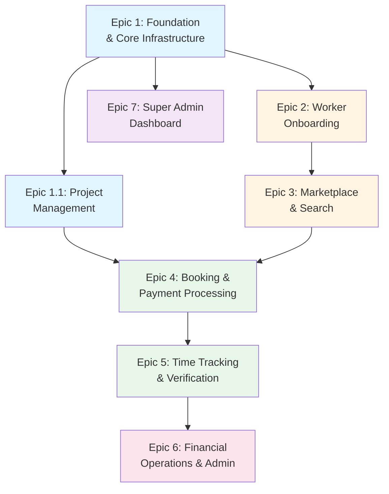

# Epic List

1. **Epic 1: Foundation & Core Infrastructure** - Establish project setup, authentication, company/user management, and basic database schema with direct Stripe payment processing.

1.1. **Epic 1.1: Project Management** - Enable borrowers to create, edit, and manage projects. Projects are persistent entities that exist independent of bookings and serve as the parent entity for all bookings.

2. **Epic 2: Worker Onboarding & Profile Management** - Enable workers to create profiles, admins to manage rosters, and system to handle insurance verification and worker listing.

3. **Epic 3: Marketplace & Search** - Build worker search engine with filters and availability management to enable borrowers to find and evaluate workers.

4. **Epic 4: Booking & Payment Processing** - Implement booking workflow, direct Stripe payment processing, and site contact selection.

5. **Epic 5: Time Tracking & Verification** - Build time clock with GPS coordinate capture, break/lunch tracking, offline support, and supervisor verification workflows.

6. **Epic 6: Financial Operations & Admin** - Complete financial operations including direct Stripe payouts, refunds, overtime calculations, and company dashboard.

7. **Epic 7: Super Admin Dashboard** - Enable platform owners to manage the platform globally, view system-wide statistics, manage users and companies, and handle critical platform operations.

---

## Epic Dependencies and Critical Path

### Dependency Diagram

The following diagram illustrates the dependencies between epics and identifies the critical path for MVP delivery:

### Critical Path for MVP

**Critical Path:** Epic 1 → Epic 1.1 → Epic 2 → Epic 3 → Epic 4 → Epic 5 → Epic 6

This path represents the minimum sequence required to deliver a complete end-to-end user workflow:
1. **Epic 1:** Establish authentication, companies, and Stripe Connect infrastructure
2. **Epic 1.1:** Enable project creation (required for bookings)
3. **Epic 2:** Enable worker profiles (required for marketplace)
4. **Epic 3:** Enable worker search and booking (required for marketplace flow)
5. **Epic 4:** Enable booking creation and payment (core transaction)
6. **Epic 5:** Enable time tracking and verification (fulfillment)
7. **Epic 6:** Enable financial operations completion (withdrawals, refunds)

**Total Critical Path Duration:** Sequential execution of 7 epics (cannot be parallelized)

### Parallel Development Opportunities

**Epic 7 (Super Admin Dashboard)** can be developed in parallel with Epics 2-6:
- **Dependencies:** Only requires Epic 1 (users, companies, authentication)
- **Parallel Start:** Can begin after Epic 1 is complete
- **No Blocking:** Does not block critical path
- **Value:** Provides platform management capabilities independently

**Epic 6 (Financial Operations)** can partially overlap with Epic 5:
- **Dependencies:** Requires Epic 1 (payment infrastructure), Epic 4 (bookings), Epic 5 (time logs)
- **Partial Parallel:** Some features (withdrawals, dashboard) can start after Epic 4
- **Full Parallel:** Complete Epic 6 requires Epic 5 completion for overtime calculations

### Epic Dependency Details

**Epic 1: Foundation & Core Infrastructure**
- **Dependencies:** None (foundational epic)
- **Provides:** Authentication, user/company management, Stripe Connect infrastructure, database schema
- **Blocks:** All other epics

**Epic 1.1: Project Management**
- **Dependencies:** Epic 1 (requires authentication, companies)
- **Provides:** Project creation and management (parent entity for bookings)
- **Blocks:** Epic 4 (bookings require projects)

**Epic 2: Worker Onboarding & Profile Management**
- **Dependencies:** Epic 1 (requires authentication, companies)
- **Provides:** Worker profiles, roster management, insurance verification
- **Blocks:** Epic 3 (marketplace needs worker profiles to search)

**Epic 3: Marketplace & Search**
- **Dependencies:** Epic 2 (requires worker profiles)
- **Provides:** Worker search engine, availability management, optimistic concurrency for booking
- **Blocks:** Epic 4 (bookings require marketplace/search functionality)

**Epic 4: Booking & Payment Processing**
- **Dependencies:** Epic 1 (payment infrastructure), Epic 1.1 (projects), Epic 3 (marketplace)
- **Provides:** Booking workflow, payment processing, site contact selection
- **Blocks:** Epic 5 (time tracking requires bookings)

**Epic 5: Time Tracking & Verification**
- **Dependencies:** Epic 4 (requires bookings)
- **Provides:** Time clock, GPS coordinate capture, verification workflows, time logs
- **Blocks:** Epic 6 (financial operations need time logs for calculations)

**Epic 6: Financial Operations & Admin**
- **Dependencies:** Epic 1 (payment infrastructure), Epic 4 (bookings), Epic 5 (time logs)
- **Provides:** Withdrawals, refunds, overtime calculations, company dashboard
- **Blocks:** None (completes MVP)

**Epic 7: Super Admin Dashboard**
- **Dependencies:** Epic 1 (users, companies, authentication)
- **Provides:** Platform administration, system statistics, user/company management
- **Blocks:** None (can be developed in parallel)

### Development Strategy Recommendations

**Sequential Execution (Recommended for MVP):**
- Follow critical path: Epic 1 → 1.1 → 2 → 3 → 4 → 5 → 6
- Epic 7 can run in parallel starting after Epic 1
- Ensures each epic builds on solid foundation
- Reduces integration risk

**Parallel Execution (Faster but Higher Risk):**
- Epic 1 must complete first (blocks everything)
- Epic 7 can start after Epic 1
- Epic 6 can partially start after Epic 4 (withdrawals, dashboard)
- Requires careful coordination and integration testing
- Higher risk of rework if dependencies change

**Hybrid Approach (Balanced):**
- Critical path remains sequential: Epic 1 → 1.1 → 2 → 3 → 4 → 5 → 6
- Epic 7 runs in parallel after Epic 1
- Epic 6 features that don't require Epic 5 can start early (withdrawals, basic dashboard)
- Epic 6 features requiring Epic 5 wait for completion (overtime calculations, refunds based on time logs)

---