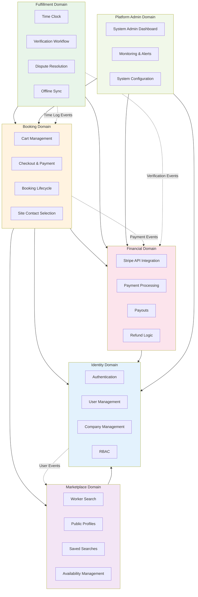

# Feature Blueprint

**Purpose:** High-level overview of all features and domains in the SmartBench platform, showing how features relate to each other and support user goals.

**Last Updated:** January 2026  
**Version:** 1.0

---

## Overview

SmartBench is a B2B construction labor marketplace organized into six core domains. Each domain contains features that work together to enable companies to lend and borrow workers securely and efficiently.

## Domain Architecture

The platform is built using **Domain-Driven Vertical Slicing** architecture, with each domain containing related features that can be independently developed and potentially extracted into microservices later.

### 1. Identity Domain

**Purpose:** User and company management, authentication, and access control.

**MVP Features:**
- **User Management:** Unified User Model supporting solopreneurs and multi-company users ✅ MVP
- **Company Management:** Company creation, KYB verification, and company profiles ✅ MVP
- **Authentication:** JWT-based auth, passwordless magic links, OAuth2 (Stripe Connect) ✅ MVP
- **Role-Based Access Control (RBAC):** Admin, Manager, Supervisor, Worker roles with context-aware permissions ✅ MVP
- **Onboarding:** Multi-step company onboarding wizard, bulk roster invites, worker profile creation ✅ MVP
- **Insurance Management:** Insurance policy upload, verification, expiration tracking, and gating ✅ MVP

**Post-MVP Features:**
- WebAuthn/Passkeys biometric authentication (post-SMS login) - Deferred to post-MVP
- Multi-factor authentication (MFA) beyond SMS - Deferred to post-MVP
- Advanced RBAC with custom roles and permissions - Deferred to post-MVP

**Related Epics:** [Epic 1: Foundation & Core Infrastructure](./epic-1.md), [Epic 2: Worker Onboarding & Profile Management](./epic-2.md)

**Technical Reference:** [Identity Domain Blueprints](../architecture/blueprints/identity/index.md)

---

### 2. Marketplace Domain

**Purpose:** Worker discovery, search, and availability management.

**MVP Features:**
- **Worker Search Engine:** Comprehensive search with filters (trade, skills, location, availability, ratings) ✅ MVP
- **Availability Management:** Date ranges, date blocking, automatic locking on booking ✅ MVP
- **Geo-Availability:** Distance-based filtering using zip codes and radius calculations ✅ MVP
- **Optimistic Concurrency:** Day-based availability management preventing double-booking with final availability check at checkout ✅ MVP
- **Saved Searches & Alerts:** Timezone-aware alerts (daily digest and instant notifications) ✅ MVP
- **Privacy Controls:** Company name hidden in search, revealed only after cart addition ✅ MVP

**Post-MVP Features:**
- Advanced search filters (certifications, equipment, languages) - Deferred to post-MVP
- Worker recommendation engine based on past bookings - Deferred to post-MVP
- Advanced analytics for borrower search patterns - Deferred to post-MVP

**Related Epics:** [Epic 3: Marketplace & Search](./epic-3.md)

**Technical Reference:** [Marketplace Domain Blueprints](../architecture/blueprints/marketplace/index.md)

---

### 3. Booking Domain

**Purpose:** Booking workflow, payment processing, site contact selection, and booking lifecycle management.

**MVP Features:**
- **Cart Management:** Multi-worker cart with persistence across sessions, no locking mechanism ✅ MVP
- **Site Contact Selection:** Primary Site Contact selection during checkout (for operational communication) ✅ MVP
- **Payment Processing:** Stripe integration, direct Stripe payment processing, Stripe escrow/hold (funds held via Stripe API during disputes) ✅ MVP
- **Weekly Progress Payments:** Wednesday 10 AM rule with insurance gating and Pay or Release model ✅ MVP
- **Booking Status Management:** State machine with valid/invalid transition rules ✅ MVP
- **Project Management:** Persistent projects as parent entities for bookings ✅ MVP

**Post-MVP Features:**
- Recurring booking templates (save and reuse booking patterns) - Deferred to post-MVP
- Advanced booking analytics and forecasting - Deferred to post-MVP
- Multi-project booking management dashboard - Deferred to post-MVP

**Related Epics:** [Epic 1.1: Project Management](./epic-1-1.md), [Epic 4: Booking & Payment Processing](./epic-4.md)

**Technical Reference:** [Booking Domain Blueprints](../architecture/blueprints/booking/index.md)

---

### 4. Fulfillment Domain

**Purpose:** Time tracking, verification workflows, and offline support.

**MVP Features:**
- **Time Clock:** GPS geofencing, photo validation, break/lunch tracking, travel time ✅ MVP
- **Offline Support:** Offline time clock with automatic sync when connection restored and Visual Verify offline protocol ✅ MVP
- **Supervisor Verification:** Simple verification model where supervisor on-site verification is the ultimate truth ✅ MVP
- **Overtime Management:** Pre-authorized contract model with booking-scoped OT calculation ✅ MVP

**Post-MVP Features:**
- Advanced GPS tracking with route history - Deferred to post-MVP
- Automated break/lunch reminders based on lender-configured policies - Deferred to post-MVP (reminders will be based on lender's configured break/lunch thresholds, not state law validation)
- Advanced analytics for time tracking patterns - Deferred to post-MVP

**Related Epics:** [Epic 5: Time Tracking & Verification](./epic-5.md)

**Technical Reference:** [Fulfillment Domain Blueprints](../architecture/blueprints/fulfillment/index.md)

---

### 5. Financial Domain

**Purpose:** Payment processing, transactions, refunds, and financial reporting.

**MVP Features:**
- **Direct Stripe Processing:** All payments processed directly via Stripe API ✅ MVP
- **Fund Release:** Automatic release upon verification or 4 hours after clock-out (auto-approval) ✅ MVP
- **Refunds:** Stripe-native refund processing with two-scenario logic ✅ MVP
- **Overtime Calculations:** Automatic OT calculations, Service Fee adjustments ✅ MVP
- **Withdrawals:** T+2 days standard or instant (with fee) to Stripe Connect accounts ✅ MVP
- **Tax Integration:** Adapter pattern for tax calculation (NullTaxProvider for MVP) ✅ MVP

**Post-MVP Features:**
- Advanced tax integration (Avalara or similar tax calculation service) - Deferred to post-MVP
- Multi-currency support (currently hardcoded to USD) - Deferred to post-MVP
- Advanced financial reporting and analytics - Deferred to post-MVP
- Automated tax document generation (1099s, W-2s) - Deferred to post-MVP

**Related Epics:** [Epic 6: Financial Operations & Admin](./epic-6.md)

**Technical Reference:** [Financial Domain Blueprints](../architecture/blueprints/financial/tax-adapter.md), [Financial Architecture](../architecture/financial-architecture.md)

---

### 6. Platform Administration Domain

**Purpose:** System-wide administration, monitoring, and platform management.

**MVP Features:**
- **Super Admin Dashboard:** Global statistics, user/company management, system monitoring ✅ MVP
- **Company Dashboard:** Booking history, financial reports, worker management ✅ MVP
- **Notifications System:** Multi-channel notifications (SMS, Email, Push) with quiet hours ✅ MVP
- **Audit & Logging:** Comprehensive audit trails, rating system, dispute management, strike system ✅ MVP
- **System Monitoring:** Health dashboards, alert systems, reconciliation status ✅ MVP

**Post-MVP Features:**
- Advanced analytics and business intelligence dashboards - Deferred to post-MVP
- Custom reporting and data export capabilities - Deferred to post-MVP
- Advanced system monitoring with predictive alerts - Deferred to post-MVP

**Related Epics:** [Epic 6: Financial Operations & Admin](./epic-6.md), [Epic 7: Super Admin Dashboard](./epic-7.md)

---

## Feature Relationships

### Core User Flows

**Borrower Flow:**
1. Search workers (Marketplace) → 2. Add to cart (Marketplace) → 3. Checkout & pay (Booking) → 4. Worker clocks in (Fulfillment) → 5. Verify hours (Fulfillment) → 6. Funds released (Financial)

**Lender Flow:**
1. Onboard company (Identity) → 2. Add workers (Identity) → 3. List workers (Marketplace) → 4. Receive booking (Booking) → 5. Worker works shift (Fulfillment) → 6. Receive payment (Financial)

**Worker Flow:**
1. Receive invite (Identity) → 2. Complete profile (Identity) → 3. Get listed (Marketplace) → 4. Get booked (Booking) → 5. Clock in/out (Fulfillment) → 6. Get paid (Financial)

### Cross-Domain Dependencies

- **Booking → Marketplace:** Checkout availability validation requires availability management
- **Booking → Financial:** Payment processing requires Stripe integration
- **Fulfillment → Financial:** Verification triggers fund release
- **Booking → Identity:** Insurance gating requires insurance verification
- **Marketplace → Identity:** Worker listing requires profile completion
- **Financial → Booking:** Direct Stripe payment processing enables seamless booking

**Domain Relationships and Dependencies Diagram:**

**Communication Patterns:**
- **Synchronous:** REST API calls between domains
- **Asynchronous:** Event-driven communication (dotted lines)
- **Shared Data:** PostgreSQL database (all domains)
- **Shared Cache:** Redis (session, cache)

---

## Feature Maturity

### MVP Scope Summary

**MVP Launch Region:** Minnesota & Wisconsin (USA)

**MVP Features:** All features marked with ✅ MVP in the domain sections above are included in the MVP scope. These features enable the complete end-to-end user workflows for borrowers, lenders, and workers.

**MVP Completion Criteria:**
- All 7 epics completed (Epic 1 through Epic 7)
- Complete booking workflow functional (search → book → pay → track → verify → release funds)
- Payment processing operational (Stripe Connect, direct payments, weekly payments)
- Time tracking and verification functional
- Basic admin dashboards operational

### Post-MVP Feature Backlog

The following features have been explicitly deferred to post-MVP releases:

**Identity Domain:**
- WebAuthn/Passkeys biometric authentication (post-SMS login)
- Multi-factor authentication (MFA) beyond SMS
- Advanced RBAC with custom roles and permissions

**Marketplace Domain:**
- Advanced search filters (certifications, equipment, languages)
- Worker recommendation engine based on past bookings
- Advanced analytics for borrower search patterns

**Booking Domain:**
- Recurring booking templates (save and reuse booking patterns)
- Advanced booking analytics and forecasting
- Multi-project booking management dashboard

**Fulfillment Domain:**
- Advanced GPS tracking with route history
- Automated break/lunch reminders based on lender-configured policies (reminders will be based on lender's configured break/lunch thresholds, not state law validation)
- Advanced analytics for time tracking patterns

**Financial Domain:**
- Advanced tax integration (Avalara or similar tax calculation service)
- Multi-currency support (currently hardcoded to USD)
- Advanced financial reporting and analytics
- Automated tax document generation (1099s, W-2s)

**Platform Administration Domain:**
- Advanced analytics and business intelligence dashboards
- Custom reporting and data export capabilities
- Advanced system monitoring with predictive alerts

**Cross-Domain Post-MVP Features:**
- Mobile native apps (iOS/Android) - Currently PWA only
- Additional payment methods beyond credit card
- Multi-region expansion (beyond MN/WI)
- Advanced machine learning features (fraud detection, demand forecasting)
- API for third-party integrations
- White-label platform options

---

## Related Documentation

- [Epic List](./epic-list.md) - Detailed epic breakdown
- [Architecture Overview](../architecture.md) - Technical architecture and design decisions
- [Data Dictionary](../architecture/data-dictionary.md) - Business entity definitions
- [Database Schema](../architecture/schema.md) - Technical schema definitions
