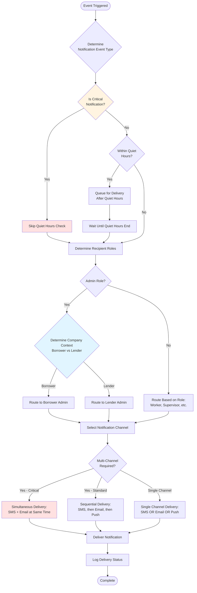
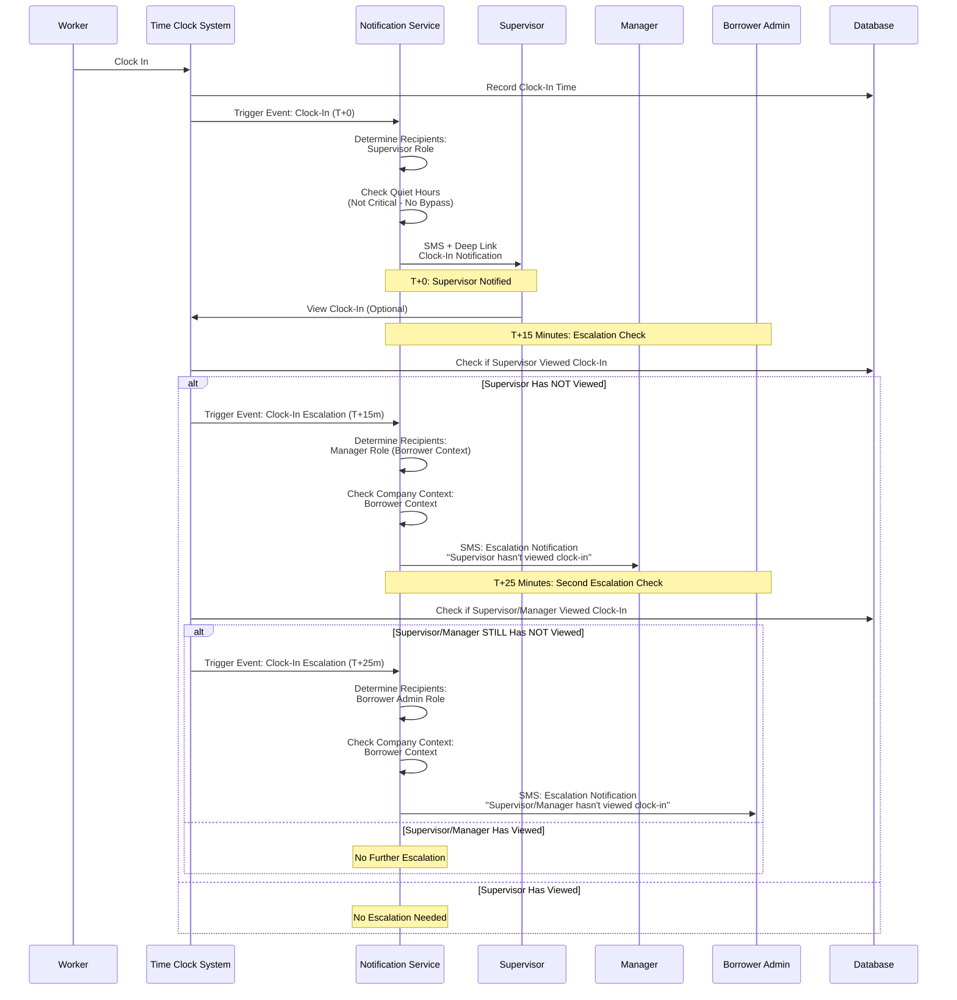
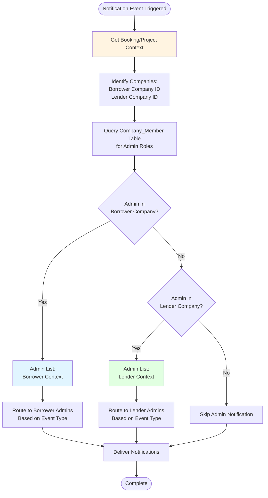
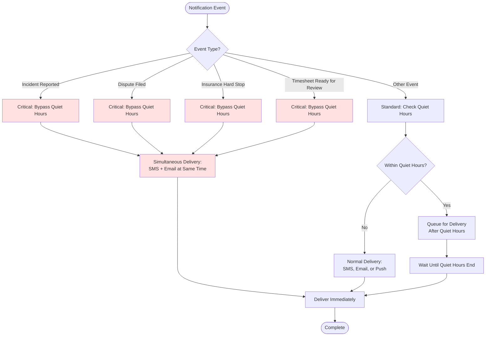

# Notifications & RBAC Matrix

**Purpose:** This matrix cross-references notification events with RBAC roles to provide clear implementation guidance for the notification system.

**Last Updated:** January 10, 2026  
**Version:** 1.2 - Added supervisor change notification (Epic 4 requirement)

---

## Role Context Clarification

For complete role definitions, capabilities, relationships, and business context, see [User Roles and Actors](./user-roles-and-actors.md).

**Quick Reference:**
- **Admin:** Company-level administration (can be Borrowing Admin or Lending Admin depending on context)
- **Manager:** Operational management (can Book Workers and List Workers without full Admin access to billing/Stripe)
- **Supervisor:** Timesheet verification and on-site management
- **Worker:** Individual worker performing shifts
- **System Admin:** Platform-level administration

**Context-Specific Roles:** See [User Roles and Actors](./user-roles-and-actors.md#context-specific-roles) for detailed definitions of Borrowing Admin, Lending Admin, and other context-specific roles. See [Terminology Glossary](./glossary.md) for standardized terminology.

---

## Combined Notifications × RBAC Matrix

| Notification Event | Worker Role | Supervisor Role | Manager Role (Borrower Context) | Manager Role (Lender Context) | Admin Role (Borrower Context) | Admin Role (Lender Context) | Channel | Bypasses Quiet Hours? | Notes |
|:---|:---:|:---:|:---:|:---:|:---:|:---:|:---|:---:|:---|
| **Roster Invite** | ✅ | ❌ | ❌ | ❌ | ❌ | ❌ | SMS (Magic Link) | No | Sent to Worker when invited to company |
| **Booking Request (Funds in Escrow)** | ❌ | ❌ | ❌ | ❌ | ❌ | ✅ | Email + Push | No | Lending Admin notified when booking payment received |
| **Shift Assigned** | ✅ | ❌ | ❌ | ❌ | ❌ | ❌ | SMS + Push | No | Worker notified when booking confirmed |
| **Site Contact Changed** | ✅ | ✅ | ✅ | ❌ | ✅ | ❌ | SMS + Push | No | Sent to Worker and new Site Contact when site contact assignment changes. Includes new site contact name and phone. Sent immediately upon change, even during active shifts. |
| **12h Before Shift Reminder** | ✅ | ❌ | ❌ | ❌ | ❌ | ❌ | SMS | No | Pre-shift reminder to Worker |
| **1h Before Shift Confirmation** | ✅ | ❌ | ❌ | ❌ | ❌ | ❌ | SMS (Deep Link) | No | Final confirmation with deep link |
| **Clock-In Notification (T+0)** | ❌ | ✅ | ❌ | ❌ | ❌ | ❌ | SMS (Deep Link) | No | Supervisor notified immediately when worker clocks in |
| **Clock-In Escalation (T+15m)** | ❌ | ❌ | ✅ | ❌ | ❌ | ❌ | SMS | No | Manager escalated if supervisor hasn't viewed clock-in within 15 minutes |
| **Clock-In Escalation (T+25m)** | ❌ | ❌ | ❌ | ❌ | ✅ | ❌ | SMS | No | Admin escalated if supervisor/manager hasn't viewed clock-in within 25 minutes |
| **Worker No-Show Warning** | ❌ | ✅ | ✅ | ❌ | ✅ | ✅ | SMS + Push | No | Sent to all parties when worker doesn't clock in |
| **Timesheet Ready for Review** | ❌ | ✅ | ❌ | ❌ | ❌ | ❌ | SMS (Deep Link) | **Yes** | Critical - Supervisor notified when worker clocks out (post-shift). Supervisor must be woken up if necessary, money is about to move |
| **5min After Clock-Out Reminder** | ❌ | ✅ | ❌ | ❌ | ❌ | ❌ | SMS | No | Reminder if Supervisor hasn't verified |
| **Hours Verified** | ✅ | ❌ | ❌ | ❌ | ❌ | ❌ | SMS | No | Worker notified when hours are approved |
| **Recall Notice Issued** | ❌ | ❌ | ✅ | ❌ | ✅ | ❌ | SMS + Email | No | Borrowing Manager and Admin notified when Lender recalls worker |
| **Incident Reported** | ❌ | ❌ | ✅ | ❌ | ✅ | ✅ | SMS + Email | **Yes** | Critical: Both Borrowing and Lending Admins/Managers notified |
| **Dispute Filed** | ✅ | ❌ | ❌ | ❌ | ❌ | ✅ | SMS + Email | **Yes** | Worker and Lending Admin notified when Supervisor disputes hours |
| **Supervisor Not Present** | ❌ | ✅ | ✅ | ❌ | ✅ | ✅ | SMS + Push | No | All parties notified when Supervisor doesn't arrive |
| **Booking Cancelled (Borrower Initiated)** | ✅ | ❌ | ✅ | ❌ | ✅ | ✅ | SMS + Email | No | All parties notified when Borrower cancels booking |
| **Booking Cancelled (Lender Initiated)** | ✅ | ❌ | ❌ | ❌ | ✅ | ✅ | SMS + Email | No | All parties notified when Lender cancels booking |
| **Booking Cancelled (Weather)** | ✅ | ❌ | ✅ | ❌ | ✅ | ✅ | SMS + Email | No | All parties notified when booking cancelled due to weather |
| **Payment Failed (Action Required)** | ❌ | ❌ | ❌ | ❌ | ✅ | ❌ | SMS + Email | No | Borrower Admin notified of payment failure at Wednesday 10 AM, action required |
| **Payment Paused Due to Dispute** | ❌ | ❌ | ❌ | ❌ | ✅ | ❌ | SMS + Email | No | Borrower Admin notified when weekly payment is skipped at Wednesday 10 AM due to active Option A dispute or pending Option A incident report |
| **Payment Final Warning** | ❌ | ❌ | ❌ | ❌ | ✅ | ❌ | SMS + Email | No | Borrower Admin notified of final warning at Wednesday 2 PM if payment still unpaid |
| **Worker Released (Non-Payment)** | ✅ | ❌ | ❌ | ❌ | ✅ | ✅ | SMS + Email | No | Worker, Borrower Admin, and Lender Admin notified when worker released due to non-payment at Wednesday 11:59 PM / Thursday 12:00 AM |
| **Insurance Expiration Warning (14 days)** | ❌ | ❌ | ❌ | ❌ | ✅ | ✅ | Email | No | Admin notified 14 days before insurance expiration |
| **Insurance Expiration Warning (7 days)** | ❌ | ❌ | ❌ | ❌ | ✅ | ✅ | Email + SMS | No | Admin notified 7 days before insurance expiration |
| **Saved Search Alert** | ❌ | ✅ | ✅ | ❌ | ✅ | ❌ | SMS/Email | No | Saved search alerts sent to all active company members with Borrower context (Admin, Manager, Supervisor roles). Workers in Borrower company do not receive saved search alerts (they cannot book workers). |
| **Subscription Expiring (7 days)** | ❌ | ❌ | ❌ | ❌ | ✅ | ❌ | Email | No | Borrower Admin notified before subscription expires |
| **Worker Approaching 40 Hours** | ❌ | ❌ | ❌ | ❌ | ✅ | ❌ | Dashboard Notification | No | Borrower Admin informational dashboard notification showing worker hours approaching OT thresholds. No blocking or unlock workflow - terms are pre-authorized at checkout. |
| **Insurance Hard Stop (Critical Alert)** | ❌ | ❌ | ❌ | ❌ | ✅ | ✅ | SMS + Email | **Yes** | Critical: All Admins (both Borrower and Lender) notified simultaneously |
| **Insurance Hard Stop (Suspension)** | ❌ | ❌ | ❌ | ❌ | ✅ | ✅ | SMS + Email | **Yes** | Critical: Both Borrowing and Lending Admins notified when booking suspended (Suspended_Insurance status) due to insurance expiration/revocation. Does NOT cancel shifts - suspends booking to prevent work without valid insurance. |
| **Auto-Approval Executed (4h)** | ✅ | ❌ | ❌ | ❌ | ❌ | ❌ | SMS | No | Worker notified when funds released automatically after 4-hour window |

---

## Implementation Notes

### Notifications Module Enforcement

**The Notifications module is the enforcement point for all rules defined in this matrix.**

- **Sole Authority:** The Notifications module is the **sole authority** on quiet hours logic and delivery timing. No other module should implement date/time logic for delivery.
- **Channel Abstraction:** The Notifications module wraps providers (Twilio, SendGrid, Push). Other modules just say "Notify User X," and the Notifications module figures out *how*.
- **RBAC Enforcement:** All role-based notification logic defined in this matrix is enforced by the Notifications module.
- **Cross-Module Communication:** Other modules (e.g., Messaging, Booking) emit events. The Notifications module listens for these events and handles all delivery logic.

**Example Cross-Module Flow:**
- Messaging module emits `chat.message.created` event
- Notifications module listens for this event
- Notifications module checks if recipient is offline
- Notifications module checks quiet hours (if non-critical)
- Notifications module sends SMS/Push notification if appropriate

For complete architectural details, see [Notifications Domain Data Dictionary](../architecture/data-dictionary-notifications.md) and [Repository Structure](../architecture/repository-structure-development-standards.md).

### Role-Based Notification Logic

1. **Context-Aware Routing:**
   - Admin role notifications must check company context (Borrower vs Lender)
   - Use `Company_Member` table to determine user's role in specific company
   - Use booking/project context to determine if Admin is Borrower Admin or Lender Admin

2. **Multi-Role Users:**
   - Users can have multiple roles (e.g., Solopreneur has `['Admin', 'Supervisor', 'Worker']`)
   - Notification system should check all roles and send notifications for each applicable role
   - Example: Solopreneur who is Worker on a booking should receive Worker notifications even if they also have Admin role
   - Manager role is not auto-assigned to Solopreneurs (only Admin, Supervisor, Worker)

3. **Company Context:**
   - **Borrower Admin:** Admin role in the company that is booking/borrowing workers
   - **Lender Admin:** Admin role in the company that is listing/lending workers
   - Same user can be Borrower Admin in one booking and Lender Admin in another

4. **Critical Notifications (Bypass Quiet Hours):**
   - Incident Reported
   - Dispute Filed
   - Insurance Hard Stop (both Critical Alert and Suspension)
   - Timesheet Ready for Review (Verify Now SMS at clock-out)
   - These should always be delivered regardless of user's quiet hours settings

5. **Notification Channels:**
   - **SMS:** Primary channel for time-sensitive, action-required notifications
   - **Email:** Used for detailed information, confirmations, and non-urgent alerts
   - **Push:** Real-time in-app notifications for active users
   - **Dashboard:** Non-intrusive notifications visible when user logs in
   - **Critical Notifications (Simultaneous Delivery):** Critical notifications (Insurance Hard Stop, Dispute Filed, Incident Reported) send to both SMS and Email channels simultaneously, not sequentially with fallback. Both channels are triggered at the same time to ensure maximum delivery reliability for critical alerts.

---

## Gap Analysis

### ✅ Resolved Gaps

All previously identified gaps have been resolved and added to the matrix:

1. **✅ Worker Dispute Notification:** Worker now receives notification when dispute is filed, enabling them to respond via Resolution Chat.

2. **✅ Booking Cancellation Notifications:** All cancellation scenarios now have explicit notifications:
   - Borrower-initiated cancellation
   - Lender-initiated cancellation  
   - Worker release (payment failure - results in Completed status at hard cutoff, worker released)
   - Weather-dependent cancellation

3. **✅ Payment Failure Notifications:** Weekly progress payment failures now have explicit notifications:
   - Action Required notification (Wednesday 10 AM failure)
   - Final Warning notification (Wednesday 2 PM if still unpaid)
   - Worker Released notification (Wednesday 11:59 PM - booking completed, worker released)

4. **✅ Insurance Expiration Warnings:** Added 14-day and 7-day warning notifications as specified in FR-1.8.

### Additional Clarifications

1. **Saved Search Alert Recipient:** Saved search alerts are sent to all active company members with Borrower context (Admin, Manager, Supervisor roles). Workers in Borrower company do not receive saved search alerts (they cannot book workers).

2. **Insurance Notifications:** All insurance-related notifications (warnings and hard stops) apply to both Borrowing Admin and Lending Admin, as both companies must maintain valid insurance.

---

## Notification Flow and Escalation Diagrams

The following diagrams illustrate the complete notification flow, role-based routing, escalation paths, and quiet hours logic:

**General Notification Flow:**

**Clock-In Escalation Flow (Example Escalation Path):**

**Context-Aware Routing Flow:**

**Critical Notification Bypass Logic:**

**Key Features Visualized:**
1. **Event Trigger → Role Determination:** System determines which roles should receive notifications based on event type
2. **Context-Aware Routing:** Admin and Manager role notifications check company context (Borrower vs Lender) using booking/project context
3. **Quiet Hours Logic:** Non-critical notifications respect quiet hours; critical notifications bypass
4. **Escalation Paths:** Clock-In notifications escalate from Supervisor → Manager (T+15m) → Admin (T+25m)
5. **Multi-Channel Delivery:** Critical notifications use simultaneous SMS + Email; standard notifications use sequential delivery
6. **Multi-Role Users:** Users with multiple roles receive notifications for each applicable role
7. **Channel Selection:** SMS for time-sensitive actions, Email for detailed info, Push for real-time in-app notifications

## Related Documentation

- [Notifications Domain Data Dictionary](../architecture/data-dictionary-notifications.md) - Notifications module architecture and business rules
- [Notifications Domain Schema](../architecture/schema-notifications.md) - Database schema for notification tables
- [Repository Structure](../architecture/repository-structure-development-standards.md) - Module structure and cross-module communication patterns
- [Notification Matrix](./notifications-rbac-matrix.md#combined-notifications-rbac-matrix) - Notification matrix with channels and quiet hours (this document)
- [Permissions Matrix](./rbac-acceptance-criteria.md) - RBAC permissions matrix
- [Unified User Model](../architecture/blueprints/identity/unified-user-model.md) - Role assignment and company membership
- [Authentication System](../architecture/blueprints/identity/authentication-system.md) - RBAC implementation details
