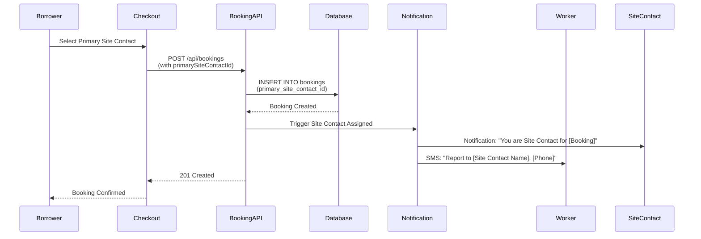
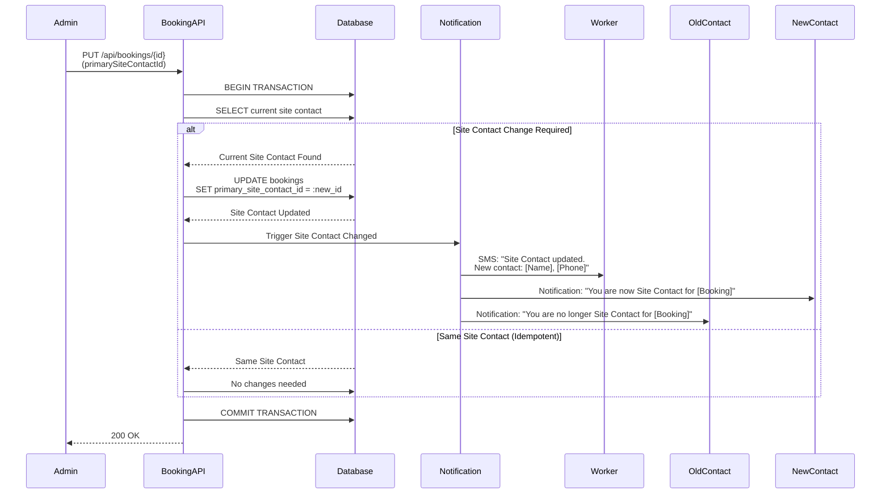

# Feature Blueprint: Site Contact & Role-Based Verification
**Domain:** Booking
**Related Epics:** [Epic 4: Booking & Payment Processing](../../../prd/epic-4.md)

## Requirement Reference

For detailed business rules, acceptance criteria, and context, see:
- [Epic 4.2: Site Contact & Verification](../../../prd/epic-4.md#story-42-site-contact-verification)

## Overview

The Site Contact & Role-Based Verification model separates operational communication from verification authority:

- **Site Contact:** The person the worker calls for operational issues (gate codes, running late, site access). Stored as `bookings.primary_site_contact_id`.
- **Verification Authority:** Role-based - ANY user with `Supervisor`, `Manager`, or `Admin` role in the Borrowing Company can verify timesheets, regardless of Site Contact assignment.

## Site Contact Flow Diagrams

### Initial Site Contact Selection

The following sequence diagram illustrates the Site Contact selection during checkout:



### Site Contact Change Workflow

The following sequence diagram illustrates the Site Contact change workflow:



## Technical Strategy (The "How")

### Database Pattern

Site Contact is stored directly in the `bookings` table as a foreign key:

```sql
-- Site Contact is a direct field on bookings table
UPDATE bookings
SET primary_site_contact_id = :new_site_contact_id,
    updated_at = CURRENT_TIMESTAMP
WHERE id = :booking_id;
```

**Key Constraints:**
- `primary_site_contact_id` is a nullable foreign key to `users(id)`
- Site Contact must be a member of the Borrower Company (enforced at application level)
- Site Contact can be any company member (not limited to Supervisor role)
- Site Contact changes are simple field updates (no junction table operations)

### Role-Based Verification Pattern

Verification permission is determined by role, not assignment:

```sql
-- Check if user can verify timesheet
SELECT COUNT(*) > 0 as can_verify
FROM users u
JOIN company_members cm ON u.id = cm.user_id
JOIN bookings b ON cm.company_id = b.borrower_company_id
WHERE u.id = :user_id
  AND b.id = :booking_id
  AND cm.roles && ARRAY['Supervisor', 'Manager', 'Admin']::text[]
  AND cm.status = 'Active';
```

**Permission Rules:**
1. **Role-Based Check:** ANY user with `Supervisor`, `Manager`, or `Admin` role in the Borrowing Company can verify timesheets
2. **No Assignment Required:** Verification does not require specific Site Contact assignment
3. **Company Context:** User must be an active member of the Borrower Company
4. **Multiple Verifiers:** If Site Contact is unavailable, any other Supervisor, Manager, or Admin in the company can verify

### Verification Link Generation

**Link Generation at Clock-Out:**
- When a worker clocks out, the system generates a verification link
- Link is sent to the Primary Site Contact (primary notification)
- Link is accessible to ANY Supervisor, Manager, or Admin in the Borrower Company (role-based access)
- Link format: `/verify-timesheet?token={encrypted_token}&timesheet_id={timesheet_id}`
- Token is cryptographically signed to prevent tampering and includes expiration timestamp

**Link Authority Determination:**
- System determines verification permission at link access time (not generation time)
- Permission check: `User.Company == Booking.Borrower_Company AND User.Role IN ('Supervisor', 'Manager', 'Admin')`
- No specific user assignment required - any authorized role can access the link

**Implementation Pattern:**
```typescript
async function generateVerificationLink(timesheetId: string, clockOutTime: Date) {
  // Get booking to find primary site contact
  const booking = await db.bookings.findUnique({
    where: { id: timesheetId },
    include: { primary_site_contact: true }
  });
  
  // Generate signed token (not tied to specific user)
  const token = await signToken({
    timesheet_id: timesheetId,
    booking_id: booking.id,
    clock_out_time: clockOutTime,
    expires_at: clockOutTime + 7 * 24 * 60 * 60 * 1000 // 7 days
  });
  
  // Store token in database
  await db('verification_tokens').insert({
    token,
    timesheet_id: timesheetId,
    booking_id: booking.id,
    generated_at: new Date(),
    is_valid: true
  });
  
  // Send to primary site contact (primary notification)
  await sendSMS(booking.primary_site_contact_id, 
    `Verify hours for [Worker]. Link: /verify-timesheet?token=${token}`
  );
  
  return `/verify-timesheet?token=${token}`;
}

async function validateVerificationAccess(userId: string, bookingId: string) {
  // Check role-based permission
  const user = await db.users.findUnique({
    where: { id: userId },
    include: {
      company_members: {
        where: {
          company: {
            bookings: {
              some: { id: bookingId }
            }
          },
          role: { in: ['Supervisor', 'Manager', 'Admin'] },
          is_active: true
        }
      }
    }
  });
  
  return user?.company_members.length > 0;
}
```

**Link Validation on Access:**
- When verification link is accessed, system validates:
  1. Token signature is valid and not expired
  2. User has role-based permission (Supervisor, Manager, or Admin in Borrower Company)
  3. Token is not marked as invalid in database
  4. Timesheet is still pending verification

## API Implementation

### PUT /api/bookings/{bookingId}

**Update Behavior:**
- Updates booking fields, including `primary_site_contact_id`
- Site Contact changes are allowed at any time, including during active shifts
- Worker receives immediate notification when Site Contact is changed
- **Authorization:** Admin or Manager (Borrower context) can update Site Contact. Manager inherits this capability as part of booking management permissions.

**Implementation:**
```typescript
async function updateBookingSiteContact(
  bookingId: string, 
  primarySiteContactId: string, 
  changedBy: string
) {
  return await db.transaction(async (tx) => {
    // Get current booking
    const booking = await tx.bookings.findUnique({
      where: { id: bookingId },
      include: { primary_site_contact: true }
    });

    // Validate site contact is in borrower company
    const siteContact = await tx.company_members.findFirst({
      where: {
        user_id: primarySiteContactId,
        company_id: booking.borrower_company_id,
        is_active: true
      }
    });

    if (!siteContact) {
      throw new Error('Site contact must be a member of the borrower company');
    }

    // If same site contact, return existing (idempotent)
    if (booking.primary_site_contact_id === primarySiteContactId) {
      return booking;
    }

    // Update site contact
    const updated = await tx.bookings.update({
      where: { id: bookingId },
      data: {
        primary_site_contact_id: primarySiteContactId,
        updated_at: new Date()
      },
      include: { primary_site_contact: true }
    });

    // Trigger notifications
    await triggerSiteContactChangeNotifications(
      bookingId, 
      booking.primary_site_contact_id, 
      primarySiteContactId
    );

    return updated;
  });
}
```

### POST /api/bookings

**Creation Behavior:**
- Site Contact is set during booking creation via `primarySiteContactId` in request body
- Site Contact selection is required before payment processing
- Site Contact must be a member of the Borrower Company
- **Authorization:** Admin or Manager (Borrower context) can create bookings and select Site Contact. Manager inherits this capability as part of booking creation permissions.

**Implementation:**
```typescript
async function createBooking(bookingData: CreateBookingDto) {
  // Validate site contact is in borrower company
  if (bookingData.primarySiteContactId) {
    const siteContact = await db.company_members.findFirst({
      where: {
        user_id: bookingData.primarySiteContactId,
        company_id: bookingData.borrowerCompanyId,
        is_active: true
      }
    });

    if (!siteContact) {
      throw new Error('Site contact must be a member of the borrower company');
    }
  }

  // Create booking with site contact
  const booking = await db.bookings.create({
    data: {
      project_id: bookingData.projectId,
      worker_id: bookingData.workerId,
      borrower_company_id: bookingData.borrowerCompanyId,
      lender_company_id: bookingData.lenderCompanyId,
      primary_site_contact_id: bookingData.primarySiteContactId,
      start_date: bookingData.startDate,
      end_date: bookingData.endDate,
      payment_type: bookingData.paymentType,
      status: 'Pending_Payment'
    }
  });

  // Send notifications
  await sendSiteContactAssignedNotifications(booking);

  return booking;
}
```

## Notification Requirements

### Site Contact Assigned (Initial Assignment)

**Trigger:** When Site Contact is first selected during checkout

**Recipients:**
- Worker: SMS with Site Contact name and phone number
- Site Contact: Notification of assignment

**Message Templates:**
- Worker SMS: "You are booked at [Address] for [Dates]. Report to [Site Contact Name], [Phone]."
- Site Contact Notification: "You are Site Contact for [Worker] shift starting [Time]. You will receive verification notifications when worker clocks out."

### Site Contact Changed

**Trigger:** When Site Contact is changed (any time before or during booking)

**Recipients:**
- Worker: SMS (immediate, even during active shift)
- New Site Contact: Notification
- Old Site Contact: Notification (informational)

**Message Templates:**
- Worker SMS: "Site Contact updated. New contact: [Name], [Phone]"
- New Site Contact Notification: "You are now Site Contact for [Worker] shift. [Booking Details]"
- Old Site Contact Notification: "You are no longer Site Contact for [Booking]. [Worker] will report to [New Site Contact Name]"

**Critical Requirements:**
- Notifications sent immediately upon change (synchronous with API response)
- Active shift changes trigger immediate worker notification (no delay)
- All notifications include deep links to booking details

### Verification Notification

**Trigger:** When Worker clocks out

**Recipients:**
- Primary Site Contact: SMS with verification link (primary notification, critical, bypasses quiet hours)
- All Supervisors, Managers, and Admins in Borrower Company: Can access verification link via dashboard (role-based access)

**Message Templates:**
- Site Contact SMS: "Verify hours for [Worker]. Link: [Deep Link]" (Critical notification, bypasses quiet hours)
- Dashboard Notification: "Timesheet pending verification for [Worker]" (visible to all Supervisors, Managers, and Admins)

**Note:** While Site Contact receives the primary notification, ANY Supervisor, Manager, or Admin in the Borrower Company can verify the timesheet by accessing the verification dashboard or using the deep link.

## Edge Cases

### 1. Site Contact Change During Active Shift

**Scenario:** Worker is clocked in, Site Contact is changed

**Behavior:**
- Change is allowed (no blocking)
- Worker receives immediate SMS notification with new contact information
- Verification is unaffected (role-based, not tied to Site Contact)
- New Site Contact will receive verification notification when worker clocks out

**Implementation:**
```typescript
// Check if worker is clocked in
const activeShift = await db.time_logs.findFirst({
  where: {
    booking_id: bookingId,
    clock_out_time: null
  }
});

// Change still allowed, notification includes active shift context
if (activeShift) {
  await sendSMS(workerId, 
    `Site Contact updated during active shift. New contact: ${newContact.name}, ${newContact.phone}`
  );
}
```

### 2. Site Contact Unavailable for Verification

**Scenario:** Site Contact doesn't verify within 2 hours

**Behavior:**
- System escalates to Borrowing Admin (per Story 5.7)
- Any other Supervisor, Manager, or Admin in the Borrower Company can verify the timesheet
- Verification is role-based - no transfer of authority required
- If still not verified within 4 hours, system auto-approves (per Story 5.9)

**Implementation:**
- Verification permission check is role-based at access time
- No specific assignment required - any authorized role can verify
- Escalation notifications sent to Borrowing Admin, but any Supervisor, Manager, or Admin can still verify

### 3. Site Contact Changed After Clock-Out

**Scenario:** Worker clocks out, then Site Contact is changed before verification

**Behavior:**
- Original Site Contact (at clock-out time) received the verification notification
- New Site Contact does not receive verification notification for this timesheet
- However, new Site Contact (if they have Supervisor, Manager, or Admin role) can still verify via role-based access
- Verification link remains valid and accessible to all authorized roles

**Implementation:**
- Verification notification sent at clock-out time to Site Contact at that moment
- Site Contact change after clock-out does not affect verification access
- Role-based verification allows any Supervisor, Manager, or Admin to verify regardless of Site Contact assignment

### 4. Multiple Supervisors/Managers/Admins Verify Same Timesheet

**Scenario:** Multiple authorized users attempt to verify the same timesheet

**Behavior:**
- First verification wins (timesheet status changes to `Verified`)
- Subsequent verification attempts are rejected (timesheet already verified)
- System prevents duplicate verification

**Implementation:**
- Database transaction with optimistic locking prevents race conditions
- Timesheet status check before verification: `WHERE status = 'Pending_Verification'`
- First successful verification updates status to `Verified`, blocking subsequent attempts

### 5. Site Contact Without Supervisor/Manager/Admin Role

**Scenario:** Site Contact is assigned but doesn't have Supervisor, Manager, or Admin role

**Behavior:**
- Site Contact receives primary notification when worker clocks out
- Site Contact cannot verify timesheet (no Supervisor, Manager, or Admin role)
- Another Supervisor, Manager, or Admin in the Borrower Company must verify
- System escalates to Borrowing Admin if not verified within 2 hours

**Implementation:**
- Verification permission check validates role: `User.Role IN ('Supervisor', 'Manager', 'Admin')`
- Site Contact without role receives notification but cannot verify
- Other authorized roles can verify via role-based access

## Related Documentation

- [Schema: bookings.primary_site_contact_id](../../schema-booking.md#bookings) - Database schema
- [API Contracts: Booking Endpoints](../../api-contracts.md#put-apibookingsbookingid) - API specifications
- [Epic 4.2: Site Contact & Verification](../../../prd/epic-4.md#story-42-site-contact-verification) - Business requirements
- [Epic 5: Time Tracking & Verification](../../../prd/epic-5.md) - Verification workflows
- [Data Dictionary: Primary Site Contact](../../data-dictionary-booking.md#primary-site-contact) - Entity definitions
