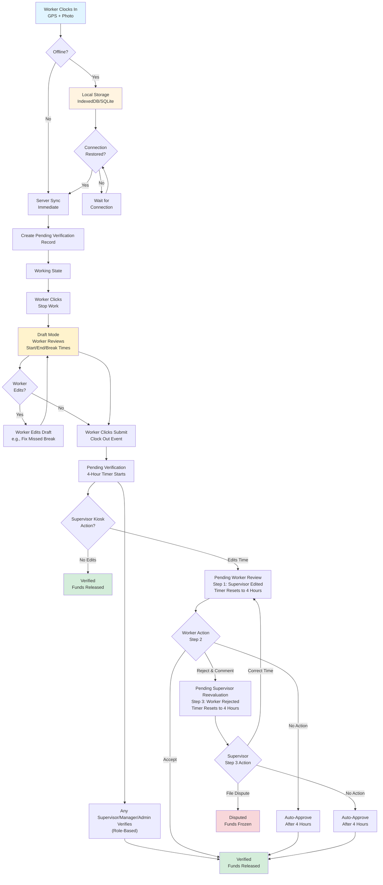
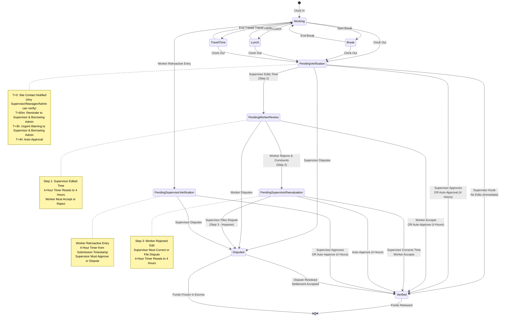

# Feature Blueprint: Time Tracking & Verification
**Domain:** Fulfillment
**Related Epics:** [Epic 5: Time Tracking & Verification](../../../prd/epic-5.md)

## Requirement Reference

For detailed business rules, acceptance criteria, and context, see:
- [Epic 5.5: Offline Time Clock](../../../prd/epic-5.md#story-55-offline-time-clock)
- [Epic 5.8: Supervisor Verification Workflow](../../../prd/epic-5.md#story-58-supervisor-verification-workflow) - Negotiation Loop

### Time Tracking Flow Diagram

The following flowchart illustrates the offline-capable time tracking flow with sync and Negotiation Loop verification:



### Time Log Status Lifecycle Diagram {#time-log-status-lifecycle-diagram}

The following state diagram shows time log status transitions including Negotiation Loop verification:



### Verification & Fund Release Flow Diagram {#verification--fund-release-flow-diagram}

The following sequence diagram illustrates the timesheet verification and fund release flow including Negotiation Loop:

```mermaid
sequenceDiagram
    participant Worker
    participant TimeClock
    participant SupervisorKiosk
    participant SMS
    participant Supervisor
    participant System
    participant Stripe
    
    Note over Worker,Stripe: Standard Clock-Out Flow with Draft Mode
    Worker->>TimeClock: Click "Stop Work"
    TimeClock->>Worker: Enter Draft Mode<br/>Show Calculated Times<br/>Start/End/Break
    Worker->>TimeClock: Edit Draft (Optional)<br/>e.g., Fix Missed Break
    Worker->>TimeClock: Click "Submit"<br/>Clock Out Event
    TimeClock->>System: Create Timesheet<br/>Status = Pending_Verification<br/>4-Hour Timer Starts
    System->>SMS: Send Deep Link to Supervisor
    SMS->>Supervisor: "Verify hours for [Worker]"<br/>(T+0: Primary Site Contact notified,<br/>but any Supervisor/Manager/Admin can verify)
    alt Worker Edited in Draft Mode
        System->>Supervisor: Display "Worker Edited" Badge<br/>or Visual Diff in Verification Card
    end
    
    alt Supervisor Kiosk - No Edits (Happy Path)
        Supervisor->>SupervisorKiosk: Clock Out Worker (No Edits)
        SupervisorKiosk->>System: Status = Verified (Immediate)
        System->>Stripe: Transfer to Lender's Connected Account
        Stripe->>SMS: Funds Released
        SMS->>Worker: "Your hours have been verified"
    else Supervisor Kiosk - Edits Time (Step 1)
        Supervisor->>SupervisorKiosk: Clock Out Worker
        Supervisor->>SupervisorKiosk: Edit Time (Add Lunch/Adjust)<br/>MUST Add Note
        SupervisorKiosk->>System: Status = Pending_Worker_Review<br/>auto_approval_time = edit_timestamp + 4 hours<br/>Timer Resets to 4 Hours
        System->>SMS: Trigger Worker Notification
        SMS->>Worker: "Supervisor updated your timesheet. Please review." + Deep Link
        
        alt Worker Accepts (Within 4 Hours) - Step 2
            Worker->>System: Click "Accept"
            System->>System: Status = Verified
            System->>Stripe: Transfer to Lender's Connected Account
            Stripe->>SMS: Funds Released
            SMS->>Worker: "Your hours have been verified"
        else Worker Rejects & Comments (Within 4 Hours) - Step 2
            Worker->>System: Click "Reject"<br/>MUST Enter Comment
            System->>System: Status = Pending_Supervisor_Reevaluation<br/>Timer Resets to 4 Hours
            System->>SMS: Trigger Supervisor Notification
            SMS->>Supervisor: "Worker rejected your edit. Comment: [Comment]"
            
            alt Supervisor Corrects Time (Within 4 Hours) - Step 3
                Supervisor->>System: Adjust Time
                System->>System: Status = Pending_Worker_Review<br/>Timer Resets to 4 Hours
                Note over System: Loop back to Step 2
            else Supervisor Files Dispute (Within 4 Hours) - Step 3
                Supervisor->>System: Click "File Dispute"
                System->>System: Status = Disputed
                System->>Stripe: Hold Funds in Escrow
                Note over System: Resolution Chat Opens
            else No Action (4 Hours Pass) - Step 3
                System->>System: Auto-Approve (auto_approval_time <= NOW())
                System->>System: Status = Verified
                System->>Stripe: Transfer to Lender's Connected Account
            end
        else Worker Disputes (Within 4 Hours)
            Worker->>System: Click "Dispute"
            System->>System: Status = Disputed
            System->>Stripe: Hold Funds in Escrow
            Note over System: Resolution Chat Opens
        else No Action (4 Hours Pass) - Step 2
            System->>System: Auto-Approve (auto_approval_time <= NOW())
            System->>System: Status = Verified
            System->>Stripe: Transfer to Lender's Connected Account
            Stripe->>SMS: Auto-Approval Notification
            SMS->>Worker: "Timesheet auto-approved after 4 hours"
        end
    else Supervisor Approves (Standard Flow)
        Supervisor->>System: Click "Approve"
        System->>Stripe: Transfer to Lender's Connected Account
        Stripe->>System: Payment Confirmed
        System->>Worker: Send "Hours Verified" SMS
    else Supervisor Disputes (Standard Flow)
        Supervisor->>System: Click "Dispute"
        System->>Stripe: Hold Funds in Escrow
        System->>System: Open Dispute Resolution
        Note over System: Chat-Based Resolution<br/>System Injects Evidence
    else No Action (Standard Flow - 4 Hours)
        Note over System: Notification Ladder:<br/>T+0: SMS to Supervisor<br/>T+60m: Reminder to Supervisor & Borrowing Admin<br/>T+3h: Urgent Warning to Supervisor & Borrowing Admin<br/>T+4h: Auto-Approve
        System->>System: Auto-Approve (4 hours after Clock-Out)
        System->>Stripe: Transfer to Lender's Connected Account
    end
    
    Note over Worker,Stripe: Worker Retroactive Entry Flow
    Worker->>TimeClock: Submit Manual/Retroactive Entry
    TimeClock->>System: Create Timesheet Entry
    System->>System: Status = Pending_Supervisor_Verification<br/>auto_approval_time = submission_timestamp + 4 hours<br/>last_editor_id = worker_id
    System->>SMS: Trigger Supervisor Notification
    SMS->>Supervisor: "Worker submitted manual timesheet entry. Please verify." + Deep Link
    
    alt Supervisor Approves (Within 4 Hours)
        Supervisor->>System: Click "Approve"
        System->>System: Status = Verified
        System->>Stripe: Transfer to Lender's Connected Account
        Stripe->>SMS: Funds Released
        SMS->>Worker: "Your hours have been verified"
    else Supervisor Disputes (Within 4 Hours)
        Supervisor->>System: Click "Dispute"
        System->>System: Status = Disputed
        System->>Stripe: Hold Funds in Escrow
        Note over System: Resolution Chat Opens
    else No Action (4 Hours Pass)
        System->>System: Auto-Approve (auto_approval_time <= NOW())
        System->>System: Status = Verified
        System->>Stripe: Transfer to Lender's Connected Account
        Stripe->>SMS: Auto-Approval Notification
        SMS->>Worker: "Timesheet auto-approved after 4 hours"
    end
    
    Note over Worker,Stripe: Force Clock Out Flow (Kiosk Mode)
    Supervisor->>SupervisorKiosk: Force Clock Out Worker
    SupervisorKiosk->>System: Calculate Clock-Out Time<br/>Status = Pending_Worker_Review<br/>auto_approval_time = force_clock_out_timestamp + 4 hours<br/>Timer Resets to 4 Hours
    System->>SMS: Trigger Worker Notification
    SMS->>Worker: "Your shift has been clocked out by [Supervisor Name].<br/>Please review and accept or reject this timesheet entry." + Deep Link
    
    alt Worker Accepts (Within 4 Hours)
        Worker->>System: Click "Accept"
        System->>System: Status = Verified
        System->>Stripe: Transfer to Lender's Connected Account
        Stripe->>SMS: Funds Released
        SMS->>Worker: "Your hours have been verified"
    else Worker Rejects & Comments (Within 4 Hours)
        Worker->>System: Click "Reject"<br/>MUST Enter Comment
        System->>System: Status = Pending_Supervisor_Reevaluation<br/>Timer Resets to 4 Hours
        System->>SMS: Trigger Supervisor Notification
        SMS->>Supervisor: "Worker rejected your Force Clock Out entry. Comment: [Comment]"
        
        alt Supervisor Corrects Time (Within 4 Hours)
            Supervisor->>System: Adjust Time
            System->>System: Status = Pending_Worker_Review<br/>Timer Resets to 4 Hours
            Note over System: Loop back to Worker Review
        else Supervisor Files Dispute (Within 4 Hours)
            Supervisor->>System: Click "File Dispute"
            System->>System: Status = Disputed
            System->>Stripe: Hold Funds in Escrow
            Note over System: Resolution Chat Opens
        else No Action (4 Hours Pass)
            System->>System: Auto-Approve (auto_approval_time <= NOW())
            System->>System: Status = Verified
            System->>Stripe: Transfer to Lender's Connected Account
        end
    else Worker Disputes (Within 4 Hours)
        Worker->>System: Click "Dispute"
        System->>System: Status = Disputed
        System->>Stripe: Hold Funds in Escrow
        Note over System: Resolution Chat Opens
    else No Action (4 Hours Pass)
        System->>System: Auto-Approve (auto_approval_time <= NOW())
        System->>System: Status = Verified
        System->>Stripe: Transfer to Lender's Connected Account
        Stripe->>SMS: Auto-Approval Notification
        SMS->>Worker: "Timesheet auto-approved after 4 hours"
    end
```



## Negotiation Loop Logic

The time tracking system implements a linear Negotiation Loop to ensure fairness when data is changed by either party. The loop consists of 3 steps that allow parties to negotiate time adjustments before escalating to dispute.

### A. The Supervisor Kiosk Flow (Happy Path)

**Scenario:** Supervisor clocks worker out via Supervisor Kiosk and makes NO edits to calculated hours.

**Technical Implementation:**
```python
@POST /api/supervisor-kiosk/clock-out
def supervisor_kiosk_clock_out(worker_id: UUID, booking_id: UUID):
    """
    Supervisor clocks worker out via Kiosk.
    If no edits made, status becomes Verified immediately.
    """
    time_log = get_active_time_log(worker_id, booking_id)
    
    # Calculate hours automatically
    calculated_hours = calculate_hours(time_log.clock_in_time, datetime.now())
    
    # Check if supervisor makes any edits
    if supervisor_makes_edits(time_log, calculated_hours):
        # Path B: Supervisor Correction Flow
        return handle_supervisor_edit(time_log, calculated_hours)
    else:
        # Path A: Happy Path - No Edits
        time_log.status = 'Verified'
        time_log.clock_out_time = datetime.now()
        time_log.save()
        
        # Release funds immediately
        release_funds(time_log.id)
        
        # Notify worker
        send_notification(
            recipient=time_log.worker,
            type='Hours_Verified',
            message="Your hours have been verified"
        )
        
        return {"status": "verified", "funds_released": True}
```

### B. The Supervisor Correction Flow (Deductions/Edits)

**Scenario:** Supervisor edits time during Kiosk flow (adds lunch break, adjusts clock-out time).

**Technical Implementation:**
```python
def handle_supervisor_edit(time_log: TimeLog, edited_data: TimesheetEdit):
    """
    Handle supervisor edit - triggers Negotiation Loop.
    """
    # CRITICAL: Check if timesheet is already Verified (cannot edit)
    if time_log.status == 'Verified':
        raise ValueError("Cannot edit Verified timesheet. Status is final. Create correction entry instead.")
    
    # Check if this constitutes an "edit" (changes billable hours)
    original_billable_hours = calculate_billable_hours(
        time_log.clock_in_time,
        time_log.clock_out_time,
        time_log.break_duration,
        time_log.lunch_duration
    )
    new_billable_hours = calculate_billable_hours(
        edited_data.clock_in_time,
        edited_data.clock_out_time,
        edited_data.break_duration,
        edited_data.lunch_duration
    )
    
    # If billable hours unchanged (within 1 minute threshold), no edit occurred
    if abs(new_billable_hours - original_billable_hours) <= (1/60):  # 1 minute threshold
        return {"status": time_log.status, "message": "No significant time change detected"}
    
    # Store original values for audit trail
    original_values = {
        "clock_in_time": time_log.clock_in_time,
        "clock_out_time": time_log.clock_out_time,
        "break_duration": time_log.break_duration,
        "lunch_duration": time_log.lunch_duration
    }
    
    # CRITICAL: Validate that supervisor added a note (required for edits)
    if not edited_data.note or len(edited_data.note.strip()) == 0:
        raise ValueError("Supervisor MUST add a note when editing time. Note is required.")
    
    # CRITICAL: Only allow edits from Pending_Verification (Step 1)
    if time_log.status != 'Pending_Verification':
        raise ValueError(f"Cannot edit timesheet in {time_log.status} status. Only edits from Pending_Verification are allowed.")
    
    # Step 1: Supervisor edits time - transition to Pending_Worker_Review
    target_status = 'Pending_Worker_Review'
    
    # Apply supervisor's edits
    time_log.clock_in_time = edited_data.clock_in_time
    time_log.clock_out_time = edited_data.clock_out_time
    time_log.break_duration = edited_data.break_duration
    time_log.lunch_duration = edited_data.lunch_duration
    
    # Transition to appropriate status
    time_log.status = target_status
    time_log.last_editor_id = current_user.id  # Supervisor ID
    
    # CRITICAL: Timer Reset on Status Transition
    # When status transitions from Pending_Verification to Pending_Worker_Review (Step 1),
    # the timer ALWAYS resets to full 4 hours from the edit timestamp.
    # This ensures the worker has adequate time to review the supervisor's edit.
    time_log.auto_approval_time = datetime.now() + timedelta(hours=4)
    
    time_log.save()
    
    # Create audit log
    create_audit_log(
        time_log_id=time_log.id,
        action='Supervisor_Edit',
        original_values=original_values,
        modified_values=edited_data.dict(),
        editor_id=current_user.id
    )
    
    # Notify worker
    send_notification(
        recipient=time_log.worker,
        type='Supervisor_Updated_Timesheet',
        message="Supervisor updated your timesheet. Please review.",
        timesheet_id=time_log.id,
        deep_link=f"/timesheets/{time_log.id}/review"
    )
    
    # Schedule auto-approval job (4 hours from edit timestamp)
    schedule_auto_approval_job(
        timesheet_id=time_log.id,
        scheduled_at=time_log.auto_approval_time,
        timezone=time_log.booking.project.timezone
    )
    
    return {"status": "pending_worker_review", "auto_approval_time": time_log.auto_approval_time}

@POST /api/timesheets/{timesheet_id}/worker-review
def worker_review_supervisor_edit(timesheet_id: UUID, action: str, comment: str = None):
    """
    Worker reviews supervisor edit (Step 2 of Negotiation Loop).
    Action: 'accept', 'reject', or 'dispute'
    If 'reject', comment is REQUIRED.
    """
    time_log = get_time_log(timesheet_id)
    
    if time_log.status != 'Pending_Worker_Review':
        raise ValueError(f"Cannot review timesheet in {time_log.status} status. Must be in Pending_Worker_Review.")
    
    if action == 'accept':
        # Cancel auto-approval job
        cancel_auto_approval_job(time_log.id)
        
        # Accept edit (Step 2 - Accepts Supervisor's edit)
        time_log.status = 'Verified'
        time_log.verified_at = datetime.now()
        time_log.save()
        
        # Release funds
        release_funds(time_log.id)
        
        # Notify supervisor
        send_notification(
            recipient=time_log.booking.supervisor,
            type='Worker_Accepted_Edit',
            message=f"Worker accepted your timesheet edit for {time_log.worker.name}.",
            timesheet_id=time_log.id
        )
        
    elif action == 'reject':
        # Step 2: Worker rejects edit - transition to Step 3
        # CRITICAL: Validate that worker provided a comment (required for rejection)
        if not comment or len(comment.strip()) == 0:
            raise ValueError("Worker MUST enter a comment when rejecting supervisor's edit. Comment is required.")
        
        # Store worker's rejection comment
        time_log.worker_rejection_comment = comment
        time_log.status = 'Pending_Supervisor_Reevaluation'
        time_log.last_editor_id = current_user.id  # Worker ID
        
        # Timer Reset: Reset to full 4 hours when status changes to Pending_Supervisor_Reevaluation
        time_log.auto_approval_time = datetime.now() + timedelta(hours=4)
        time_log.save()
        
        # Notify supervisor - Step 3
        send_notification(
            recipient=time_log.booking.primary_site_contact,
            type='Worker_Rejected_Edit',
            message=f"Worker rejected your timesheet edit. Comment: {comment}",
            timesheet_id=time_log.id
        )
        
    elif action == 'dispute':
        # CRITICAL: Cancel any active auto-approval timer (4-hour)
        cancel_auto_approval_job(time_log.id, timer_type='any')
        
        # Enter dispute workflow
        time_log.status = 'Disputed'
        time_log.save()
        
        # Freeze funds
        freeze_funds_in_escrow(time_log.id)
        
        # Open resolution chat
        create_dispute_resolution_chat(time_log.id)
        
        # Notify all parties
        notify_dispute_filed(time_log.id)
    
    return {"status": time_log.status, "action": action}
```

### D. Supervisor Re-Evaluation (Step 3)

**Scenario:** Supervisor sees worker's rejection and comment, must decide to correct time or file dispute.

**Technical Implementation:**
```python
@POST /api/timesheets/{timesheet_id}/supervisor-reevaluation
def supervisor_reevaluation(timesheet_id: UUID, action: str, corrected_data: TimesheetEdit = None):
    """
    Supervisor re-evaluates after worker rejection (Step 3 of Negotiation Loop).
    Action: 'correct' or 'file_dispute'
    If 'correct', corrected_data is REQUIRED.
    """
    time_log = get_time_log(timesheet_id)
    
    if time_log.status != 'Pending_Supervisor_Reevaluation':
        raise ValueError(f"Cannot re-evaluate timesheet in {time_log.status} status. Must be in Pending_Supervisor_Reevaluation.")
    
    if action == 'correct':
        # Path A: Supervisor agrees and corrects time
        # CRITICAL: Validate that corrected_data is provided
        if not corrected_data:
            raise ValueError("Supervisor MUST provide corrected time data when choosing to correct.")
        
        # Apply supervisor's correction
        time_log.clock_in_time = corrected_data.clock_in_time
        time_log.clock_out_time = corrected_data.clock_out_time
        time_log.break_duration = corrected_data.break_duration
        time_log.lunch_duration = corrected_data.lunch_duration
        
        # Loop back to Step 2 - Worker must accept correction
        time_log.status = 'Pending_Worker_Review'
        time_log.last_editor_id = current_user.id  # Supervisor ID
        time_log.supervisor_edit_note = corrected_data.note  # Store supervisor's note
        
        # Timer Reset: Reset to full 4 hours when status changes to Pending_Worker_Review
        time_log.auto_approval_time = datetime.now() + timedelta(hours=4)
        time_log.save()
        
        # Notify worker - correction made
        send_notification(
            recipient=time_log.worker,
            type='Supervisor_Corrected_Time',
            message="Supervisor corrected the timesheet based on your feedback. Please review.",
            timesheet_id=time_log.id,
            deep_link=f"/timesheets/{time_log.id}/review"
        )
        
    elif action == 'file_dispute':
        # Path B: Supervisor disagrees - file dispute (Impasse)
        # CRITICAL: Cancel any active auto-approval timer (4-hour)
        cancel_auto_approval_job(time_log.id, timer_type='any')
        
        # Enter dispute workflow
        time_log.status = 'Disputed'
        time_log.save()
        
        # Freeze funds
        freeze_funds_in_escrow(time_log.id)
        
        # Open resolution chat
        create_dispute_resolution_chat(time_log.id)
        
        # Notify all parties
        notify_dispute_filed(time_log.id)
    
    return {"status": time_log.status, "action": action}
```

### C. The Worker Retroactive Flow

**Scenario:** Worker submits manual/retroactive entry (due to bad signal, device loss, etc.).

**Technical Implementation:**
```python
@POST /api/timesheets/retroactive
def worker_submit_retroactive_entry(booking_id: UUID, entry_data: RetroactiveEntry):
    """
    Worker submits manual/retroactive timesheet entry.
    Triggers supervisor verification with 4-hour timer.
    Handles conflict if active timesheet exists.
    """
    booking = get_booking(booking_id)
    
    # CRITICAL: Check for existing active timesheet for same booking/shift
    existing_timesheet = get_active_timesheet(booking_id, current_user.id, entry_data.shift_date)
    
    if existing_timesheet:
        # Conflict detected - transition existing timesheet
        if existing_timesheet.status == 'Pending_Verification':
            # Cancel 4-hour timer
            cancel_auto_approval_job(existing_timesheet.id, timer_type='4_hour')
        
        # Update existing timesheet with worker's correction
        existing_timesheet.clock_in_time = entry_data.clock_in_time
        existing_timesheet.clock_out_time = entry_data.clock_out_time
        existing_timesheet.break_duration = entry_data.break_duration
        existing_timesheet.lunch_duration = entry_data.lunch_duration
        existing_timesheet.status = 'Pending_Supervisor_Verification'
        existing_timesheet.last_editor_id = current_user.id  # Worker ID
        existing_timesheet.auto_approval_time = datetime.now() + timedelta(hours=4)
        existing_timesheet.reconstruction_reason = entry_data.reason
        existing_timesheet.save()
        
        time_log = existing_timesheet
        notification_message = "Worker submitted a correction to their timesheet. Please verify."
    else:
        # No conflict - create new entry
        time_log = create_time_log(
            booking_id=booking_id,
            worker_id=current_user.id,
            clock_in_time=entry_data.clock_in_time,
            clock_out_time=entry_data.clock_out_time,
            break_duration=entry_data.break_duration,
            lunch_duration=entry_data.lunch_duration,
            status='Pending_Supervisor_Verification',
            last_editor_id=current_user.id,  # Worker ID
            auto_approval_time=datetime.now() + timedelta(hours=4),  # 4-hour timer from submission
            reconstruction_reason=entry_data.reason  # 'Bad_Signal', 'Device_Lost', etc.
        )
        notification_message = "Worker submitted manual timesheet entry. Please verify."
    
    # Notify supervisor
    send_notification(
        recipient=booking.primary_site_contact,
        type='Worker_Retroactive_Entry',
        message=notification_message,
        timesheet_id=time_log.id,
        deep_link=f"/timesheets/{time_log.id}/verify"
    )
    
    # Schedule auto-approval job (4 hours from submission timestamp)
    schedule_auto_approval_job(
        timesheet_id=time_log.id,
        scheduled_at=time_log.auto_approval_time,
        timezone=booking.project.timezone
    )
    
    return {"status": "pending_supervisor_verification", "timesheet_id": time_log.id, "auto_approval_time": time_log.auto_approval_time, "conflict_resolved": existing_timesheet is not None}
```

### Auto-Approval Timer Logic

**Timer Calculation:**
- Timer starts from the edit/submission timestamp, not the clock-out time
- `auto_approval_time = edit_timestamp + 4 hours` (stored explicitly in database)

**Timer Reset Rules:**
- **Status Transitions (Full 4-Hour Reset):** When status transitions occur in the Negotiation Loop, the timer ALWAYS resets to full 4 hours:
  - `Pending_Verification` → `Pending_Worker_Review` (Step 1): Timer resets to 4 hours from edit timestamp
  - `Pending_Worker_Review` → `Pending_Supervisor_Reevaluation` (Step 2): Timer resets to 4 hours from rejection timestamp
  - `Pending_Supervisor_Reevaluation` → `Pending_Worker_Review` (Step 3 correction): Timer resets to 4 hours from correction timestamp
- **Rationale:** Status transitions indicate a new negotiation step where the receiving party needs adequate time to review and respond. Full 4-hour reset ensures fairness.

**Timer Cancellation Rules:**
- When status transitions from `Pending_Verification` to Negotiation Loop states, the original 4-hour timer MUST be cancelled and a new 4-hour timer starts
- When dispute is filed, any active timer (4-hour) MUST be cancelled immediately
- When status transitions to `Verified` or `Disputed`, all timers are cancelled
- Background job queries: `SELECT * FROM time_log WHERE auto_approval_time <= NOW() AND status IN ('Pending_Worker_Review', 'Pending_Supervisor_Verification', 'Pending_Supervisor_Reevaluation')`

**Critical Edge Case - Timer Expiration vs. Status Change Race Condition:**
- **Scenario:** If a status change occurs AFTER the timer has already expired (`auto_approval_time <= NOW()`) but BEFORE the background job runs, the timer is reset to a new 4-hour window
- **Background Job Safety Check (MANDATORY):** The background job MUST check `updated_at` timestamp before auto-approving. If `updated_at > auto_approval_time`, this indicates a status change occurred after the timer expired, which means the timer was reset. In this case, skip auto-approval - the new timer is active and should be allowed to run its full 4-hour duration
- **Explicit Rule:** The check `updated_at > auto_approval_time` prevents auto-approving timesheets that were edited after the timer expired. This ensures fairness - if a party responds (even late), they get a full 4-hour window from their response timestamp
- **Implementation:** This safety check is implemented in the background job code (see Background Job Implementation section below)

**Background Job Implementation:**
```python
@background_job(schedule='every 1 minute')
def process_auto_approvals():
    """
    Process auto-approvals for Negotiation Loop.
    Runs every minute to check for expired timers.
    CRITICAL: Checks updated_at to prevent auto-approving if edit occurred after timer expired.
    """
    # Query timesheets with expired auto-approval timers
    expired_timesheets = db.query(
        TimeLog
    ).filter(
        TimeLog.status.in_(['Pending_Worker_Review', 'Pending_Supervisor_Reevaluation', 'Pending_Supervisor_Verification']),
        TimeLog.auto_approval_time <= datetime.now()
    ).all()
    
    for timesheet in expired_timesheets:
        # CRITICAL: Check if timesheet was edited after timer expired
        # If updated_at > auto_approval_time, an edit occurred after timer expired
        # Skip auto-approval in this case (edit cancelled the pending auto-approval)
        if timesheet.updated_at > timesheet.auto_approval_time:
            # Edit occurred after timer expired - skip auto-approval
            # Timer was reset by the edit, new auto_approval_time should be set
            continue
        
        # CRITICAL: Check if dispute was filed (status might have changed)
        # Dispute filing always takes precedence over auto-approval, even if both events occur simultaneously
        if timesheet.status not in ['Pending_Worker_Review', 'Pending_Supervisor_Verification', 'Pending_Supervisor_Reevaluation']:
            continue
        
        # Additional check: Query disputes table to ensure no dispute exists
        active_dispute = db.query(Dispute).filter(
            Dispute.time_log_id == timesheet.id,
            Dispute.status == 'Open'
        ).first()
        if active_dispute:
            # Dispute exists - skip auto-approval
            continue
        
        # Auto-approve (Silence = Consent)
        timesheet.status = 'Verified'
        timesheet.verified_at = datetime.now()
        timesheet.save()
        
        # Release funds
        release_funds(timesheet.id)
        
        # Notify worker
        send_notification(
            recipient=timesheet.worker,
            type='Auto_Approval',
            message="Timesheet auto-approved after 4 hours. No dispute was filed within the required timeframe.",
            timesheet_id=timesheet.id
        )
        
        # Log auto-approval
        create_audit_log(
            time_log_id=timesheet.id,
            action='Auto_Approval',
            reason='4_hour_timer_expired',
            auto_approved_at=datetime.now()
        )
```

## Technical Strategy (The "How")

### Offline Time Clock Architecture

**Client-Side (Mobile App):**

1. **Local Storage:**
   
   **Schema Reference:** See [schema-fulfillment.md](../../schema-fulfillment.md) for the `time_log_offline_sync` table definition. The client-side storage mirrors this structure for offline event persistence.

2. **Clock-In/Out Flow (Offline):**
   - Capture `device_timestamp` using `Date.now()` (JavaScript) or system clock
   - Store event in local IndexedDB/SQLite with `sync_status = 'pending'`
   - If GPS available, capture coordinates; if not, store `null`
   - **Mandatory Photo Requirement:** For offline clock-out, photo capture is REQUIRED. Store local file path in offline event.
   - **Visual Verification Screen:** After offline clock-out, UI displays persistent "Visual Verification" screen showing "Clocked Out: [Time] - Pending Sync" (e.g., "Clocked Out: 5:00 PM - Pending Sync"). This screen remains visible until sync completes, allowing supervisor to physically view and verify the clock-out time on the worker's device.

3. **Sync Process (When Connection Restored):**
   - Background sync service detects network connectivity
   - Batch all `sync_status = 'pending'` events
   - For each event, send to server with timestamp, GPS data, and photo
   - Server creates standard timesheet entry with status `Pending_Verification`
   - **Post-Sync Supervisor Notification:** After successful sync, supervisor receives notification to verify the timesheet digitally (notification sent AFTER sync completes, not before). This ensures supervisor has already physically verified via Visual Verification screen before digital verification occurs.

**Server-Side Processing:**

1. **Database Tables:**
   
   **Schema Reference:** See [schema-fulfillment.md](../../schema-fulfillment.md) for table definitions, indexes, constraints, and foreign keys:
   - `time_log` - Time clock entries with Negotiation Loop verification support
   - `time_log_offline_sync` - Stores raw offline events before sync

2. **Sync Conflict Detection (Worker Offline + Supervisor Manual Entry):**
   
   **Technical Implementation:**
   ```python
   @POST /api/timesheets/offline-sync
   def sync_offline_events(events: List[OfflineEvent]):
       """
       Sync offline events to server.
       Detects conflicts with supervisor Force Clock Out entries.
       """
       for event in events:
           # Check for existing time_log entry for same booking/shift
           existing_time_log = db.query(TimeLog).filter(
               TimeLog.booking_id == event.booking_id,
               TimeLog.worker_id == event.worker_id,
               TimeLog.clock_in_time.date() == event.device_timestamp.date()
           ).first()
           
           if existing_time_log:
               # Check if existing entry was created via Force Clock Out
               # Force Clock Out entries have supervisor/manager/admin as last_editor_id
               # and status is Pending_Worker_Review
               supervisor_role = db.query(User).filter(
                   User.id == existing_time_log.last_editor_id,
                   User.role.in_(['Supervisor', 'Manager', 'Admin'])
               ).first()
               
               if supervisor_role and existing_time_log.status == 'Pending_Worker_Review':
                   # Conflict detected: Worker offline entry vs Supervisor Force Clock Out
                   # Calculate time difference
                   time_diff = abs(
                       (event.device_timestamp - existing_time_log.clock_out_time).total_seconds() / 60
                   )
                   
                   if time_diff > 2:  # More than 2 minutes difference
                       # Flag conflict - requires supervisor resolution
                       create_sync_conflict(
                           offline_event_id=event.id,
                           time_log_id=existing_time_log.id,
                           conflict_type='Worker_Offline_vs_Supervisor_Manual',
                           worker_timestamp=event.device_timestamp,
                           supervisor_timestamp=existing_time_log.clock_out_time,
                           time_difference_minutes=time_diff
                       )
                       
                       # Notify supervisor
                       send_notification(
                           recipient=existing_time_log.booking.primary_site_contact,
                           type='Sync_Conflict_Detected',
                           message=f"Sync conflict detected: Worker offline entry conflicts with your Force Clock Out entry for {existing_time_log.worker.name} on {event.device_timestamp.date()}. Please review and resolve.",
                           conflict_id=conflict.id,
                           deep_link=f"/conflicts/{conflict.id}/resolve"
                       )
                       
                       # Mark offline event as conflict - do not create time_log entry yet
                       event.sync_status = 'conflict'
                       event.save()
                       continue  # Skip creating time_log entry - wait for conflict resolution
           
           # No conflict - create standard time_log entry
           time_log = create_time_log(
               booking_id=event.booking_id,
               worker_id=event.worker_id,
               clock_in_time=event.clock_in_timestamp,
               clock_out_time=event.device_timestamp,
               gps_coordinates=event.gps_coordinates,
               project_photo_url=event.project_photo_url,
               status='Pending_Verification',
               auto_approval_time=datetime.now() + timedelta(hours=4)
           )
           
           # Mark offline event as synced
           event.sync_status = 'synced'
           event.synced_at = datetime.now()
           event.save()
           
           # Post-sync supervisor notification
           send_notification(
               recipient=time_log.booking.primary_site_contact,
               type='Timesheet_Pending_Verification',
               message=f"Worker {time_log.worker.name} clocked out. Please verify timesheet.",
               timesheet_id=time_log.id,
               deep_link=f"/timesheets/{time_log.id}/verify"
           )
   ```

## Edge Cases & Failure Handling

### GPS Unavailable During Offline Clock-In
- **Behavior:** Store `gps_coordinates = null` in offline event
- **Server Processing:** When synced, create standard timesheet entry with `gps_coordinates = NULL`
- **Supervisor Action:** Supervisor sees that GPS was not captured but can still verify the time based on their physical presence
- **Database:** `time_log.gps_coordinates` remains `NULL`

### Network Intermittency During Sync
- **Retry Logic:** Client retries failed syncs with exponential backoff (1s, 2s, 4s, 8s, max 5 attempts)
- **Partial Sync:** If batch contains 10 events and 3 fail, mark those 3 as `sync_status = 'failed'`, retry individually
- **User Notification:** If sync fails after all retries, show notification: "Some time entries failed to sync. Please check your connection."

### Sync Conflict: Worker Offline Entry + Supervisor Manual Entry

**Conflict Scenario:** Worker creates an offline clock-out entry (stored in `time_log_offline_sync` with `sync_status = 'pending'`) AND Supervisor creates a manual entry (Force Clock Out) for the same shift/booking.

**Conflict Detection:**
- When worker's offline entry syncs, system checks for existing `time_log` entries for same `booking_id` and `worker_id`
- If `time_log` entry exists that was created via Force Clock Out (indicated by `last_editor_id` being supervisor/manager/admin and status being `Pending_Worker_Review`), conflict is detected
- Conflict is flagged by comparing offline entry's `device_timestamp` (clock-out time) against existing `time_log.clock_out_time` - if they differ by more than 2 minutes, conflict is flagged

**Conflict Resolution:**
- System flags "Sync Conflict" and requires supervisor resolution
- Supervisor receives notification: "Sync conflict detected: Worker offline entry conflicts with your Force Clock Out entry for [Worker] on [Date]. Please review and resolve."
- Conflict resolution UI shows both entries side-by-side:
  - Worker's offline entry: Device timestamp, GPS coordinates, Photo evidence
  - Supervisor's Force Clock Out entry: Manual timestamp, Supervisor ID, Status (`Pending_Worker_Review`)
- Supervisor options: "Accept Worker Entry", "Accept Supervisor Entry", "Merge Data", "Request Worker Correction"
- Resolution action is logged in audit trail with timestamp and supervisor user ID
- **Explicit Rule:** This conflict type requires supervisor intervention - it cannot be auto-resolved using "Last Write Wins" because both entries represent valid but conflicting records

**Edge Cases:**
- If conflict detected before worker's offline entry syncs: System holds sync until supervisor resolves conflict
- If conflict detected after worker's offline entry syncs: System creates conflict resolution task, supervisor must resolve before timesheet can proceed to verification

### Force Clock Out (Kiosk Mode) - Negotiation Loop Requirement

**CRITICAL CHANGE:** Force Clock Out now transitions to `Pending_Worker_Review` status (Negotiation Loop Step 1), NOT `Pending_Verification`. This ensures worker must Accept or Reject the supervisor's entry.

**Force Clock Out Workflow:**
- Supervisor performs Force Clock Out via Kiosk mode
- System calculates clock-out time as current time (or supervisor-specified time)
- **Status Transition:** Timesheet enters `Pending_Worker_Review` status (Negotiation Loop Step 1)
- **4-Hour Timer:** Timer starts from Force Clock Out timestamp and resets to 4 hours
- **Worker Notification:** Worker receives notification: "Your shift has been clocked out by [Supervisor Name]. Please review and accept or reject this timesheet entry."
- **Worker Action Required:** Worker must click "Accept" (verify) or "Reject" (dispute) the supervisor's Force Clock Out entry
  - If worker accepts: Status → `Verified`, funds released
  - If worker rejects: Status → `Pending_Supervisor_Reevaluation` (Negotiation Loop Step 3)
- **No Auto-Verification:** Force Clock Out entries MUST NOT auto-verify - they require worker review through Negotiation Loop workflow

**Force Clock Out While Worker is in Draft Mode:**
- **Behavior:** If supervisor performs Force Clock Out while worker is actively in Draft Mode (has clicked "Stop Work" but hasn't clicked "Submit" yet), the system uses the calculated times from clock-in (ignoring any draft edits the worker may have made)
- **Worker Notification:** Worker receives notification: "Your shift has been clocked out by [Supervisor Name]. Your draft edits were not saved. Please review your timesheet."
- **Timesheet Status:** Timesheet enters `Pending_Worker_Review` status with calculated times from clock-in timestamp, not draft times, requiring worker to Accept or Reject
- **Explicit Rule:** Force Clock Out overrides Draft Mode - any draft edits are discarded and the system uses calculated times from clock-in timestamp. The timesheet enters Negotiation Loop workflow, requiring worker review.

### Negotiation Loop (3-Step Linear Workflow)

**Critical Rule:** The Negotiation Loop provides a linear 3-step process for parties to negotiate time adjustments before escalating to dispute. The loop can continue indefinitely - there is no limit to the number of iterations. Each time the status transitions between `Pending_Worker_Review` and `Pending_Supervisor_Reevaluation`, the 4-hour auto-approval timer resets to full 4 hours, ensuring fairness while preventing infinite loops (timer ensures eventual resolution).

**The Negotiation Loop:**

1. **Step 1 (Supervisor Review):** Worker clocks out → Status: `Pending_Verification`
   - Supervisor can **Approve** (Done) or **Edit Time**
   - If **Edit Time**: Supervisor changes hours and **MUST** add a note. Status → `Pending_Worker_Review`
   - Timer: 4-hour auto-approval timer **resets** to 4 hours when status changes to `Pending_Worker_Review`

2. **Step 2 (Worker Action):** Worker receives the edit
   - **Option A (Accept):** Status → `Verified`. Funds Released.
   - **Option B (Reject & Comment):** Worker clicks Reject and **MUST** enter a text explanation. Status → `Pending_Supervisor_Reevaluation`
   - **Option C (File Dispute):** Worker can choose to file a dispute instead of accepting or rejecting. Clicking "Dispute" immediately cancels the 4-hour auto-approval timer, transitions status to `Disputed`, holds funds via Stripe escrow/hold, and opens resolution chat with Fork in the Road decision (Option A or Option B)
   - Timer: 4-hour auto-approval timer **resets** to 4 hours when status changes to `Pending_Supervisor_Reevaluation` (if worker rejects) OR is cancelled immediately if worker files dispute

3. **Step 3 (Supervisor Re-Evaluation):** Supervisor sees the rejection and comment
   - **Path A (Correction):** Supervisor agrees. They revert/adjust time. Status → `Pending_Worker_Review` (loops back to Step 2 - worker must accept the correction)
   - **Path B (Impasse):** Supervisor disagrees. They click **"File Dispute"**. Status → `Disputed`
   - **Loop Continuation:** If supervisor corrects time (Path A), the loop returns to Step 2. The worker can accept, reject again (returning to Step 3), or file a dispute. This can continue indefinitely - there is no limit to the number of loops. The only constraint is the 4-hour auto-approval timer that resets on each status transition, ensuring eventual resolution if parties don't respond.

**Timer Behavior:** The 4-hour auto-approval timer **resets** to 4 hours whenever the status changes to `Pending_Worker_Review` or `Pending_Supervisor_Reevaluation`. This ensures parties have time to respond to the negotiation.

**Worker Edit Prevention at Step 1:** Workers cannot edit timesheets in `Pending_Verification` status (Step 1). Only Supervisor can edit from this status. If worker attempts to edit, system returns error: "Cannot edit timesheet in Pending_Verification. Supervisor must approve, edit, or dispute first."

## Data Model Impact

### Tables Modified

**Schema Reference:** See [schema-fulfillment.md](../../schema-fulfillment.md) for complete table definitions, indexes, constraints, and foreign keys:
- `time_log` - Time clock entries with Negotiation Loop verification support
  - Added: `auto_approval_time TIMESTAMP` - Stores calculated deadline (Event Time + 4 Hours)
  - Added: `last_editor_id UUID` - Tracks who made the last change (Worker or Supervisor)
  - Added: `supervisor_edit_note TEXT` - Stores supervisor's note when editing time (required)
  - Added: `worker_rejection_comment TEXT` - Stores worker's comment when rejecting edit (required)
  - Updated: `status` ENUM includes `Pending_Worker_Review`, `Pending_Supervisor_Reevaluation`, and `Pending_Supervisor_Verification`
- `time_log_offline_sync` - Stores raw offline events before sync

### Indexes

- `idx_time_log_auto_approval_time` - Efficient queries for background job processing auto-approvals
  ```sql
  CREATE INDEX idx_time_log_auto_approval_time ON time_log(auto_approval_time) 
    WHERE status IN ('Pending_Worker_Review', 'Pending_Supervisor_Reevaluation', 'Pending_Supervisor_Verification');
  ```
