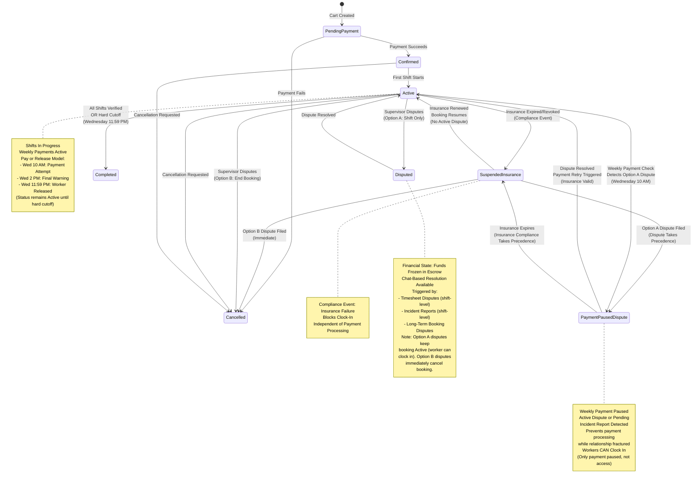

# Data Dictionary - Booking Domain

**Version:** 1.0  
**Last Updated:** January 2026  
**Part of:** [Data Dictionary](./data-dictionary.md)

This document contains business-focused descriptions of Booking domain entities, their relationships, state machines, and business rules. For technical schema definitions, SQL table structures, constraints, and indexes, see [schema-booking.md](schema-booking.md).

**ENUM Values:** All ENUM values referenced in this document (booking.status, etc.) are defined in [schema-booking.md](schema-booking.md), which serves as the single source of truth for all technical ENUM definitions. This document provides business context and state machine transitions for these values.

---

## Booking Domain

### Jurisdiction

Jurisdiction definitions for overtime calculation strategy pattern and weekly reset logic. Each jurisdiction has specific overtime rules and weekly reset day configuration. The `jurisdictions` table handles Identity (name) and Overtime Strategy only.

**Key Attributes:**
- Jurisdiction name (e.g., 'Federal USA', 'Minnesota', 'Wisconsin')
- Overtime rule strategy (e.g., 'Federal_40')
- Weekly reset day

**Business Rules:**
- Implements Strategy Pattern for overtime calculation
- System loads the correct calculator strategy at runtime based on the project's jurisdiction
- The `jurisdictions` table handles Identity (name) and Overtime Strategy (weekly reset day, overtime rule strategy) only
- **Important:** The `jurisdictions` table is NOT used for break/lunch policy validation. Break/lunch policies use the self-attestation model. The `jurisdictions` table is used exclusively for overtime calculation strategy, holiday calendar definitions, and business day calculations.

**Break/Lunch Policy Configuration:**

**Business Rules Reference:** For complete break/lunch policy configuration and self-attestation model, see:
- [Epic 5: Story 5.2 - Break and Lunch Tracking](../prd/epic-5.md#story-52-break-and-lunch-tracking) - Lender self-attestation model
- [Epic 2: Story 2.9 - Lender Policy Configuration](../prd/epic-2.md#story-29-lender-policy-configuration) - Policy configuration and self-attestation

**Technical Implementation:**
- Lenders configure break/lunch policies in Company Settings
- Lenders must self-attest that their policies comply with local labor laws via Terms of Service acceptance
- No database-level validation is performed - lenders accept full liability for their policy configuration
- Policies are enforced based purely on the *Lender's configured settings*, regardless of state laws

### Holiday Calendar

Holiday calendar definitions per jurisdiction. Determines business days for withdrawal timing, recall notice calculations, and other business day calculations.

**Key Attributes:**
- Jurisdiction reference (holidays are defined per jurisdiction)
- Holiday date
- Holiday name
- Active status

**Business Rules:**
- Holidays are defined per jurisdiction (MN/WI for MVP)
- Holidays exclude dates from business day calculations
- Business days are Monday through Friday, excluding holidays
- Used for: Withdrawal timing (T+2 business days), Recall notice business day calculations
- **Note:** Holiday calendar does NOT affect auto-approval timing. Auto-approval occurs exactly 4 hours after clock-out regardless of weekends, holidays, or business days. **Timezone Rule:** The 4-hour auto-approval timer calculation uses UTC timestamps for all calculations (stored in database). Clock-out time is stored as UTC timestamp. Auto-approval timer = `clock_out_utc + 4 hours` (UTC calculation). DST transitions do not affect the 4-hour calculation (always exactly 4 hours in UTC). Display times are converted to project timezone for user viewing, but all calculations use UTC internally. Auto-approval notifications are sent immediately when the timer expires, regardless of quiet hours, business hours, weekends, or holidays. **Rationale:** Using UTC for calculations ensures consistent 4-hour intervals regardless of DST transitions, eliminating edge cases where DST "fall back" or "spring forward" could affect timer accuracy.
- System checks holiday calendar when calculating business days for withdrawal timing and recall notice periods

### Project

Project entity. Parent entity for bookings. Holds address and timezone information.

**Key Attributes:**
- Company (Borrower Company)
- Address and timezone
- Jurisdiction reference

**Business Rules:**
- Project is the parent entity. Every Booking belongs to a Project
- Project holds the Address and Timezone
- A single Project can have multiple Bookings (e.g., different workers on the same project site)
- **Timezone Logic:** Project timezone is authoritative for all calculations. See [Timezone Handling](./timezone-handling.md) for implementation details, DST rules, and display conversion.

**Project Timezone Authority {#project-timezone-is-authoritative}:** The project's timezone (stored in `projects.timezone`) is the authoritative source for all time-based calculations including shift scheduling, payment timing, and business day calculations. All users see times converted to their preferred timezone for display, but the underlying calculations use the project timezone.

### Booking

Booking records linking workers to projects. Represents a commitment for a worker to perform work on a project for a specific date range.

**Key Attributes:**
- Project, Worker, Borrower Company, Lender Company
- Start and end dates
- Status (lifecycle state)
- Payment type (Full_Upfront or Weekly_Progress)
- Currency code
- **funded_period_end** (Timestamp, nullable): End of the current funded period for weekly progress payments. For full upfront payments, this equals the booking end date. For weekly progress payments, this tracks the end of the week that has been paid for, used to determine when the next weekly charge is needed and which shifts are covered by the current funding period. **Note:** Insurance validation does NOT occur during weekly payment processing. Insurance gate validation (3-day gate rule) only applies during booking creation. Insurance failures are handled via independent compliance events that immediately suspend bookings.
- **termination_notice_days** (Integer): Copied from Lender's company settings at the time of booking. Defines the required business-day notice period for Borrower-initiated cancellation on Long-Term bookings (Default: 3 days).
- **ot_terms_snapshot** (JSONB): Pre-Authorized Contract terms agreed upon at checkout. Stores OT rules and rates that cannot change mid-booking. Structure: `{ "daily_rule": boolean, "weekly_rule": boolean, "weekend_rule": boolean, "ot_rate": number }`. The `ot_rate` value is a specific dollar amount (e.g., 52.50 for $52.50) that comes directly from `worker_rates.overtime_rate` at checkout, NOT a calculated multiplier. **Business Rule:** This must be populated at checkout - booking creation is blocked if `ot_terms_snapshot` is null. The snapshot ensures OT terms remain fixed for the booking duration, even if Lender's company settings change later. All OT calculations during time tracking use this snapshot. See [Epic 6: Story 6.5](../prd/epic-6.md#story-65-overtime-rules-and-calculations) for complete overtime calculation rules.

**Business Rules:**
- Funded period end is essential for determining when next charge is needed for weekly payments
- **Payment Processing:** All payments are processed directly through Stripe API. The full booking total (Worker Rate + Service Fee) is charged to the Borrower's credit card. See [Epic 6: Story 6.2](../prd/epic-6.md#story-62-payment-processing-service-fee) for complete payment processing logic.
- **Currency Consistency:** Booking currency must match Borrower Company's default currency (not Lender's currency). This ensures the borrower pays in their preferred currency. For MVP, all companies default to USD (`companies.default_currency = 'USD'`), so all bookings use USD. Cross-currency bookings are blocked for MVP. Multi-currency support deferred to Post-MVP.
  - **Validation Location:** Application-level validation during booking creation AND at checkout (double-check). Database constraint not feasible due to cross-table relationship, but application logic enforces the rule.
  - **Currency Selection Logic:** Booking currency is set to borrower company's `default_currency` at booking creation time. When multi-currency is enabled in Post-MVP, booking currency will continue to be determined by borrower company's `default_currency` setting at booking creation time.
  - **Error Handling:** When currency mismatch is detected, show error: "Booking currency does not match borrower company default currency. Booking currency (USD) must match borrower company default currency."
  - **Currency Change Handling:** If borrower changes default currency after booking creation, existing bookings retain their original currency (immutable once created).
- **Overtime Terms Immutability:** The `ot_terms_snapshot` field ensures that OT terms agreed upon at checkout cannot change during the booking. If the Lender changes their company OT policy after booking creation, the original snapshot remains in effect for that booking. This Pre-Authorized Contract model ensures transparency and prevents mid-booking rate changes. See [Epic 4: Story 4.3](../prd/epic-4.md#story-43-checkout-and-payment-processing) for checkout snapshot creation requirements.
- Primary Site Contact is stored directly in the `bookings` table as `primary_site_contact_id`

### Primary Site Contact

The primary site contact is the person the worker calls for operational issues (gate codes, running late, site access). This is separate from verification authority, which is role-based (any Supervisor, Manager, or Admin in the Borrower Company can verify timesheets).

**Key Attributes:**
- `primary_site_contact_id` (FK to `users` table) - stored directly in `bookings` table
- Site Contact Name and Phone Number displayed to Worker in dashboard
- Site Contact receives primary notification when Worker clocks out

**Business Rules:**
- Site Contact must be a member of the Borrower Company (enforced at application level)
- Site Contact can be any company member (not limited to Supervisor role)
- Site Contact is editable by Company Admins and Managers at any time (even after booking creation)
- Site Contact selection is required during checkout before payment processing
- Site Contact is for operational communication only - verification is role-based
- When Site Contact is changed, Worker receives notification with new contact information
- Verification authority is separate: ANY user with `Supervisor`, `Manager`, or `Admin` role in the Borrowing Company can verify timesheets (role-based check, not user-based assignment)

### Booking Status State Machine {#booking-status-state-machine}

The system tracks booking lifecycle through a defined state machine. The `Status` field tracks the booking's current state.

#### Booking Status Values and Dispute Clarification
- **Pending_Payment** - Cart created, payment not yet processed
- **Confirmed** - Payment successful, funds processed via Stripe
- **Active** - Shifts in progress
- **Suspended_Insurance** - Insurance expired/revoked/invalid, triggered by compliance events (nightly monitoring jobs or manual updates). This status change is **independent of payment processing**. Blocks clock-in. Workers are immediately notified to stop work.
- **Disputed** - Funds held in escrow for disputed shift(s) (booking-level financial state)
- **Payment_Paused_Dispute** - Weekly payment paused due to active Option A dispute or pending Option A incident report. **Critical Distinction:** This status ONLY affects weekly payment processing - it does NOT block clock-in. Booking remains `Active`, workers CAN clock in for future shifts. `Payment_Paused_Dispute` is set during Wednesday 10 AM weekly payment check when an Option A dispute is detected, causing payment to be skipped while the booking continues normally.
- **Completed** - All shifts verified, funds released
- **Cancelled** - Booking cancelled by Borrower or Lender

**Dispute Status Clarification:**
- **Shift-Level Disputes:** Disputes are tracked at the Shift (`time_log`) level. Individual shifts can be in `Disputed` status while the booking remains `Active`.
- **Booking-Level Disputed Status:** The booking status `Disputed` is a **financial state** that indicates funds are frozen in escrow, not a shift verification state. A booking transitions to `Disputed` when:
  1. Funds are frozen in escrow for a disputed shift (timesheet dispute, incident report, or long-term booking dispute)
  2. The booking can remain `Active` with some shifts `Disputed` and other shifts `Pending_Verification` or `Verified`
  3. The `Disputed` booking status is used when funds are frozen in escrow, regardless of individual shift status
- **Relationship:** A booking can be `Active` with individual shifts in `Disputed` status. The booking status `Disputed` is used when funds are frozen in escrow (financial state), while shift-level `Disputed` status indicates verification issues (operational state).

#### State Transitions and Validation Rules
```
Pending_Payment → (payment succeeds) → Confirmed
Pending_Payment → (payment fails) → Cancelled
Confirmed → (first shift starts) → Active
Active → (insurance expired/revoked/invalid) → Suspended_Insurance
Suspended_Insurance → (insurance renewed, booking resumes) → Active
Active → (active dispute/pending incident report detected) → Payment_Paused_Dispute
Payment_Paused_Dispute → (dispute resolved, booking continues) → Active
Payment_Paused_Dispute → (Option A dispute timeout) → Payment_Paused_Dispute (future shifts cancelled, booking remains Active)
Active → (Option B dispute filed) → Cancelled (immediate)
Payment_Paused_Dispute → (Option B dispute filed) → Cancelled (immediate)
Active → (weekly payment fails, hard cutoff reached) → Completed (end_date set to Sunday, worker released)
Suspended_Insurance → (Option A dispute filed) → Payment_Paused_Dispute (dispute takes precedence for payment, insurance still required)
Suspended_Insurance → (Option B dispute filed) → Cancelled (immediate)
Payment_Paused_Dispute → (insurance expires) → Suspended_Insurance (insurance compliance takes precedence)
Suspended_Insurance → (insurance renewed during active dispute) → Payment_Paused_Dispute (not Active until disputes resolved)
Active → (funds held in escrow for disputed shift) → Disputed
Disputed → (dispute resolved, remaining shifts) → Active
Disputed → (dispute resolved, all shifts complete) → Completed
Active → (all shifts verified) → Completed
Any → (cancellation requested) → Cancelled
```

#### Dispute Status Transition Rules and Edge Cases
- **Active → Disputed:** Booking transitions to `Disputed` when funds are frozen in escrow for a disputed shift. This is a financial state change, not a shift verification state change. The booking can remain `Active` with some shifts `Disputed` and other shifts `Pending_Verification` or `Verified`.
- **Shift-Level vs Booking-Level:** Shift-level disputes (tracked in `time_log` table) can exist independently of booking-level `Disputed` status. A booking can be `Active` with individual shifts in `Disputed` status. The booking status `Disputed` is used when funds are frozen in escrow (financial state), indicating that escrow funds are held pending dispute resolution.
- **Disputed → Active:** When dispute is resolved and funds are released, booking transitions back to `Active` if there are remaining shifts. If all shifts are complete, booking transitions to `Completed`.

#### Booking Status Machine Diagram



#### Weekly Payment Failure Logic (Pay or Release Model)
- Wednesday 10 AM: Charge attempted for Next Week
- Failure: Booking Status remains `Active` (no status change). "Action Required" notification sent to Borrower Admin.
- Wednesday 2 PM: Final Warning notification sent to Borrower Admin if still unpaid.
- Wednesday 11:59 PM / Thursday 12:00 AM: Hard Cutoff - Worker Released
  - Update `end_date` to this coming Sunday
  - Change Status to `Completed` (effective Sunday)
  - Cancel all shifts scheduled after Sunday
  - Send "Worker Released" notifications to Worker, Borrower Admin, and Lender Admin
- Result: Worker is released at end of day Wednesday. Zero risk of unpaid work on Monday. Worker immediately becomes available in search for next week.

The Booking Status State Machine includes comprehensive validation rules to prevent invalid state transitions and ensure data integrity:

**Valid State Transitions:**
- `Pending_Payment` → `Confirmed` (payment succeeds)
- `Pending_Payment` → `Cancelled` (payment fails)
- `Confirmed` → `Active` (first shift starts)
- `Confirmed` → `Cancelled` (cancellation requested before shifts start)
- `Active` → `Suspended_Insurance` (insurance expired/revoked/invalid)
- `Active` → `Completed` (all shifts verified OR weekly payment hard cutoff - worker released)
- `Suspended_Insurance` → `Active` (insurance renewed, booking resumes)
- `Active` → `Completed` (all shifts verified)
- `Active` → `Cancelled` (cancellation requested)

**Invalid State Transitions (Explicitly Prevented):**
- `Cancelled` → `Active` (cancelled bookings cannot be reactivated, even if payment succeeds later)
- `Cancelled` → `Confirmed` (cancelled bookings cannot transition to confirmed)
- `Completed` → `Active` (completed bookings cannot return to active)
- `Suspended_Insurance` → `Pending_Payment` (contract already executed)

**Weekly Payment Failure Logic (Pay or Release Model):**
*   **Definition:** Booking remains `Active` when payment fails. No status change occurs on payment failure.
*   **Timeline:**
    *   **Wednesday 10:00 AM:** Charge attempt. If fails, status remains `Active`, "Action Required" notification sent.
    *   **Wednesday 2:00 PM:** Final Warning notification sent if still unpaid.
    *   **Wednesday 11:59 PM / Thursday 12:00 AM:** Hard Cutoff - Worker Released
      - Update `end_date` to this coming Sunday
      - Change Status to `Completed` (effective Sunday)
      - Cancel all shifts scheduled after Sunday
      - Send "Worker Released" notifications to Worker, Borrower Admin, and Lender Admin
*   **Result:** Worker is released at end of day Wednesday. Booking becomes a short-term booking ending Sunday. Worker immediately becomes available in search for next week.

#### Dispute Resolution and Edge Cases

**Note on Disputes:** Disputes are tracked exclusively at the Shift (`time_log`) level, not at the Booking level. A booking can be `Active` with some shifts `Disputed` and other shifts `Pending_Verification` or `Verified`. Future shifts can be cancelled separately while a dispute continues for a specific shift. **Fork in the Road Logic:** When a dispute is filed, the supervisor MUST choose one of two paths: (1) **Option A: "Dispute Shift Only"** - Booking remains `Active`, worker CAN clock in for future shifts, only disputed shift funds frozen. (2) **Option B: "End Booking & Dispute"** - Booking immediately transitions to `Cancelled`, worker released, total freeze (disputed shift + cancellation penalty). **Explicit Rule:** A booking is either `Active` (work continues) or `Cancelled` (work stops). There is no middle ground for disputes. The fork decision determines the booking status immediately - Option A = Active, Option B = Cancelled.

**Multiple Option A Disputes:** If multiple Option A disputes are filed on the same booking, the booking remains `Active` and workers CAN clock in for shifts that haven't been cancelled. Each disputed shift's funds are frozen independently. Weekly payment processing is paused if any Option A dispute is active, but this does NOT block clock-in.

**Dispute Resolution Timeout:** If an Option A dispute is not resolved within 3 hours of filing (Resolution Timer expires): (1) **Current Shift:** The disputed shift remains in `Disputed` status (Frozen in Escrow) **indefinitely** until resolved through chat-based negotiation and Super Admin processing. The dispute does not expire or auto-resolve. (2) **Future Shifts:** All shifts with `start_time > now` (current timestamp) are automatically **Cancelled**, including shifts scheduled for later today, tomorrow, and all subsequent shifts. (3) **Booking Status:** The booking remains `Active` with the disputed shift frozen in escrow and future shifts cancelled. Worker cannot clock in for cancelled future shifts, but booking status remains `Active` for dispute resolution purposes. **Option B Dispute Timeout:** If an Option B dispute is filed, the booking is already `Cancelled` immediately, so no timeout action is needed.

**Payment Pause During Disputes:** When an active Option A dispute or pending Option A incident report is detected during the weekly payment check (Wednesday 10 AM), the booking status transitions to `Payment_Paused_Dispute` to prevent payment processing while the relationship is fractured. **Critical:** This status ONLY pauses weekly payments - it does NOT block clock-in. Workers can continue clocking in for shifts that haven't been cancelled. Booking remains `Active` in terms of worker access. This ensures no payment is attempted for future weeks while disputes are unresolved, without trapping workers in a booking they cannot work on. **Option B Dispute During Weekly Payment:** If an Option B dispute is filed, the booking immediately transitions to `Cancelled`, so no weekly payment processing occurs (cancelled bookings are excluded from weekly payment queries).

**Edge Cases - Disputes Filed During Different Booking Statuses:**
- **`Active`**: Standard fork logic applies. Option A → Booking remains `Active`, Option B → `Cancelled` immediately.
- **`Active` (payment failure, before hard cutoff)**: Option A → `Payment_Paused_Dispute` (dispute takes precedence over payment failure), Option B → `Cancelled` immediately.
- **`Active` (payment failure, after hard cutoff)**: If worker has been released (status = `Completed`), disputes cannot be filed. Booking is already completed.
- **`Suspended_Insurance`** (insurance expired/revoked): Option A → `Payment_Paused_Dispute` (dispute takes precedence for payment, but insurance still required - worker cannot clock in until insurance renewed), Option B → `Cancelled` immediately.
- **`Payment_Paused_Dispute`** (already has Option A dispute): Option A → No change (already paused for dispute), Option B → `Cancelled` immediately (Option B takes precedence).
- **`Disputed`** (financial state with funds frozen): Option A → No change (already has disputed shift), Option B → `Cancelled` immediately. **Clarification:** `Disputed` is a financial state indicating funds are frozen, not a booking status that blocks new disputes. New disputes can be filed on different shifts even if booking has `Disputed` status. Multiple disputes on different shifts are tracked independently. Booking status `Disputed` is informational (financial state), not a blocker for new disputes.

**Edge Cases - Multiple Disputes:**
- **Multiple Option A disputes:** Booking remains `Active`, all disputed shifts frozen independently, workers CAN clock in for non-disputed shifts.
- **Option A dispute + Option B dispute:** Option B takes precedence → `Cancelled` immediately (Option B overrides Option A).
- **Dispute timeout with Option A:** Future shifts cancelled, booking remains `Active` (status stays `Payment_Paused_Dispute` if payment was paused, or `Active` if payment was not paused).
- **Dispute timeout with Option B:** Already `Cancelled`, no additional action needed.

**Edge Cases - Insurance + Dispute Interactions:**
- **Insurance expires during Option A dispute:** Status → `Suspended_Insurance` (insurance compliance takes precedence). Worker cannot clock in until insurance renewed AND disputes resolved. When insurance renewed, status → `Payment_Paused_Dispute` (not `Active` until disputes resolved).
- **Insurance expires during Option B dispute:** Already `Cancelled`, no change (insurance expiration has no effect on cancelled bookings).
- **Insurance renewed during Option A dispute:** Status → `Payment_Paused_Dispute` (not `Active` until disputes resolved). Worker can clock in only after insurance renewed AND all disputes resolved.

**Edge Cases - Subscription Expiration + Dispute Interactions:** In these edge cases, "subscription" refers to the borrower's platform subscription (Bench subscription), not the Stripe payment method; weekly payments use Card on File (Merchant Initiated).

- **Subscription expires during Option A dispute:** If subscription expires while booking has active Option A dispute (status = `Payment_Paused_Dispute`), the booking status remains `Payment_Paused_Dispute` (no status change). The dispute remains active and tracked separately. Weekly payment processing remains paused while dispute is active. When subscription is renewed during active dispute, booking status remains `Payment_Paused_Dispute` (not `Active`) until all disputes are resolved. **Explicit Rule:** Subscription expiration does not change booking status. Payment attempts will fail if subscription is expired, but booking status remains unchanged until hard cutoff (Wednesday 11:59 PM) when worker is released.
- **Subscription expires during Option B dispute:** Already `Cancelled`, no change (subscription expiration has no effect on cancelled bookings).

**Edge Cases - Dispute Filed During Active Shift (Worker Clocked In):**
- **Disputes During Active Shifts:** Disputes can be filed while a worker is currently clocked in for a shift. The system handles this scenario differently based on the selected option.
- **Option A Selected During Active Shift:** (1) Worker can continue working (no automatic clock-out), (2) Active shift's time_log status is set to `Disputed` when worker clocks out (not immediately), (3) Only active shift funds are frozen in escrow when worker clocks out. The dispute resolution workflow proceeds normally after clock-out. **Explicit Rule:** Option A disputes during active shifts allow worker to continue working. The shift is marked as `Disputed` when worker clocks out, and funds are frozen at that time.
- **Option B Selected During Active Shift:** (1) Worker is automatically clocked out immediately, (2) Active shift's time_log status is set to `Disputed` immediately, (3) Booking is cancelled immediately, (4) Active shift funds + cancellation penalty are frozen in escrow, (5) Worker becomes available in search immediately (real-time availability via PostgreSQL query - no sync delay). **Explicit Rule:** Option B disputes during active shifts immediately clock out the worker and cancel the booking. The active shift is treated as a disputed shift with funds frozen.

**Edge Cases - Dispute Filed on Already-Cancelled Booking:**
- **Option B Dispute on Cancelled Booking:** If a supervisor attempts to file an Option B dispute on a booking that is already `Cancelled` (e.g., from a previous Option B dispute or manual cancellation), the system returns an error with code `DISPUTE_BOOKING_CANCELLED`: "Booking is already cancelled. Cannot file dispute on cancelled booking."
- **Option A Dispute on Cancelled Booking:** Option A disputes also cannot be filed on cancelled bookings. The booking must be in `Active` or a valid status (e.g., `Suspended_Insurance`, `Payment_Paused_Dispute`) to file a dispute. **Explicit Rule:** Disputes (both Option A and Option B) cannot be filed on already-cancelled or completed bookings. The booking must be in a valid status that allows disputes.

**State Transition Validation:**
- All state transitions are validated at both database and application levels
- Invalid transitions are prevented with clear error messages
- Error message format: "Invalid booking status transition. Booking cannot be moved from [Current Status] to [Target Status]."
- **Status as Authoritative Source:** The `bookings.status` column is the **authoritative source of truth** for booking status. The status is stored directly in the database column - it is NOT derived from events, calculated on-the-fly, or reconstructed from event history. Status transitions are performed via a database transaction that:
  1. Validates the transition is allowed (application-level validation)
  2. Updates the `bookings.status` column directly (authoritative source)
  3. Inserts a record into the `audit_log` table to track the history with `previous_value`, `new_value`, and `reason` in the metadata JSONB field
- The `audit_log` table provides a chronological audit trail for compliance and debugging, but the current status is always read from the `bookings.status` column, not from event history
- State machine transitions are enforced by application-level validation logic with direct column updates, not event replay

**Dispute Resolution Final State Logic:**
- **Shift-Level Disputes:** Disputes apply to specific shifts, not entire bookings. A booking can be `Active` with some shifts `Disputed` and other shifts `Pending_Verification` or `Verified`. This allows users to fight over money without being forced to fire the worker, or fire the worker without being forced to freeze money.
- **Dispute Triggers:** A shift enters `Disputed` state via three mechanisms:
  1. **Timesheet Disputes** - Supervisor disputes a timesheet (see [Story 5.10](../prd/epic-5.md#story-510-dispute-resolution-chat-based-resolution))
  2. **Incident Reports** - Borrower files incident report for "End for Cause" (see [Story 4.9](../prd/epic-4.md#story-49-incident-reporting-termination))
  3. **Long-Term Booking Disputes** - Dispute filed during long-term booking notice period or cancellation (see [Story 4.5](../prd/epic-4.md#story-45-weekly-progress-payment-system))
- **Unified Dispute Workflow:** All dispute types use the same chat-based resolution workflow (Story 5.10) with system-injected evidence and Super Admin processing
- **Disputes During Weekly Payment Periods:** If a dispute affects specific shifts only (not the entire booking), the booking remains `Active` with disputed funds frozen in escrow. **Dispute Resolution Timeout:** If dispute is not resolved within 3 hours of filing (Resolution Timer expires): (1) The disputed shift remains in `Disputed` status (Frozen in Escrow) **indefinitely** until resolved, (2) All future shifts with `start_time > now` are automatically cancelled (per Story 5.10), including shifts scheduled for later today. Weekly payment processing skips cancelled shifts. Payment only processes for active, non-disputed shifts.
- **Cancellation During Dispute:** Future shifts can be cancelled separately while a dispute continues for a specific shift. Cancellation can occur via: (1) Manual "Cancel Remaining Shifts" button in Incident Report/Dispute UI, or (2) Automatic cancellation via Resolution Timer timeout (3 hours after dispute filed). **Button Availability:** The "Cancel Remaining Shifts" button is shown only when: (1) Option A dispute is active (booking status = `Payment_Paused_Dispute` or `Active` with active Option A dispute), (2) Future shifts exist that can be cancelled, (3) Dispute is for Option A (not Option B - if Option B was selected, booking is already cancelled so button is not shown). The button is available for all Option A disputes (both incident reports and timesheet disputes), not just incident reports. **Standard Cancellation Policy:** Standard cancellation policy applies to calculate penalty amounts (50% penalty for short-term, notice period for long-term, based on 24-hour notice rule). **Disputed Cancellation Escrow:** If future shifts are cancelled while a shift is in `Disputed` status, cancellation penalties are **FROZEN in Escrow** (not paid to lender immediately, not refunded to borrower). Both disputed shift funds and frozen cancellation fees are resolved together in dispute resolution chat. **Dispute Resolution Interaction:** If future shifts are cancelled via "Cancel Remaining Shifts" button, and then dispute resolves: (1) Cancellation remains in effect (cancelled shifts are not restored), (2) Frozen cancellation penalties are released per dispute resolution outcome (chat agreement between admins, followed by Super Admin processing). If dispute resolution favors borrower, cancellation penalties may be refunded. If dispute resolution favors lender, cancellation penalties are paid to lender. **Lender Cancels Future Shifts:** If Lender cancels future shifts, 100% refund of future days to Borrower (no penalty). The disputed shift remains in `Disputed` state until resolved. **Explicit Rule:** Disputed Cancellation Protocol applies when cancellation occurs during active dispute (via manual "Cancel Remaining Shifts" button or automatic Resolution Timer timeout). Cancellation penalties are held in escrow until dispute resolution, not paid to lender immediately.
- **Resolution Outcomes:** When a dispute is resolved, the shift transitions from `Disputed` to `Verified` (funds released) or `Cancelled` (funds refunded). The booking remains `Active` if there are remaining shifts. If all shifts were completed before the dispute, the booking transitions to `Completed` after dispute resolution. Dispute resolution does not automatically cancel the booking unless explicitly requested.

### State Change Tracking with Audit Log

**Purpose:** Booking status changes are tracked via the `audit_log` table to maintain a complete audit trail of all state transitions. The `bookings.status` column is the **authoritative source of truth** for the current booking status. The status is stored directly in the database column and is NOT derived from events or calculated from audit log history.

**State Transition Pattern:**

Status transitions are performed via a database transaction that updates the status column and logs the change:

```typescript
// Transaction: Update status + Log to audit
await db.transaction(async (trx) => {
  // 1. Validate transition is allowed (application-level check)
  const isValidTransition = validateStateTransition(currentStatus, newStatus);
  if (!isValidTransition) {
    throw new Error(`Invalid booking status transition. Booking cannot be moved from ${currentStatus} to ${newStatus}.`);
  }
  
  // 2. Update bookings.status (authoritative source)
  await trx('bookings')
    .where('id', bookingId)
    .update({ status: newStatus });
  
  // 3. Insert audit log entry
  await trx('audit_log').insert({
    action_type: 'Booking_Status_Changed',
    target_entity: 'Booking',
    target_id: bookingId,
    metadata: {
      previous_value: currentStatus,
      new_value: newStatus,
      reason: reason // e.g., 'Supervisor Dispute', 'Payment Failed', 'Insurance Expired'
    },
    user_id: userId // nullable for system events
  });
});
```

**Audit Log Structure:**

The `audit_log` table stores state change history with the following structure:
- `action_type`: 'Booking_Status_Changed'
- `target_entity`: 'Booking'
- `target_id`: UUID of the booking
- `metadata` (JSONB): Contains `previous_value`, `new_value`, and `reason`
- `user_id`: User who triggered the change (nullable for system events)
- `timestamp`: When the change occurred

**Benefits:**
- **Financial Integrity:** Complete audit trail for all booking state changes involving money
- **Prevents Invalid States:** Impossible state transitions are prevented by application-level validation
- **Debuggability:** Can query `audit_log` to understand how booking reached current state
- **Compliance:** Immutable audit log satisfies audit requirements for financial transactions
- **Simplicity:** Direct column updates are simpler than event replay, reducing complexity for MVP

---

**Back to:** [Data Dictionary](./data-dictionary.md)
