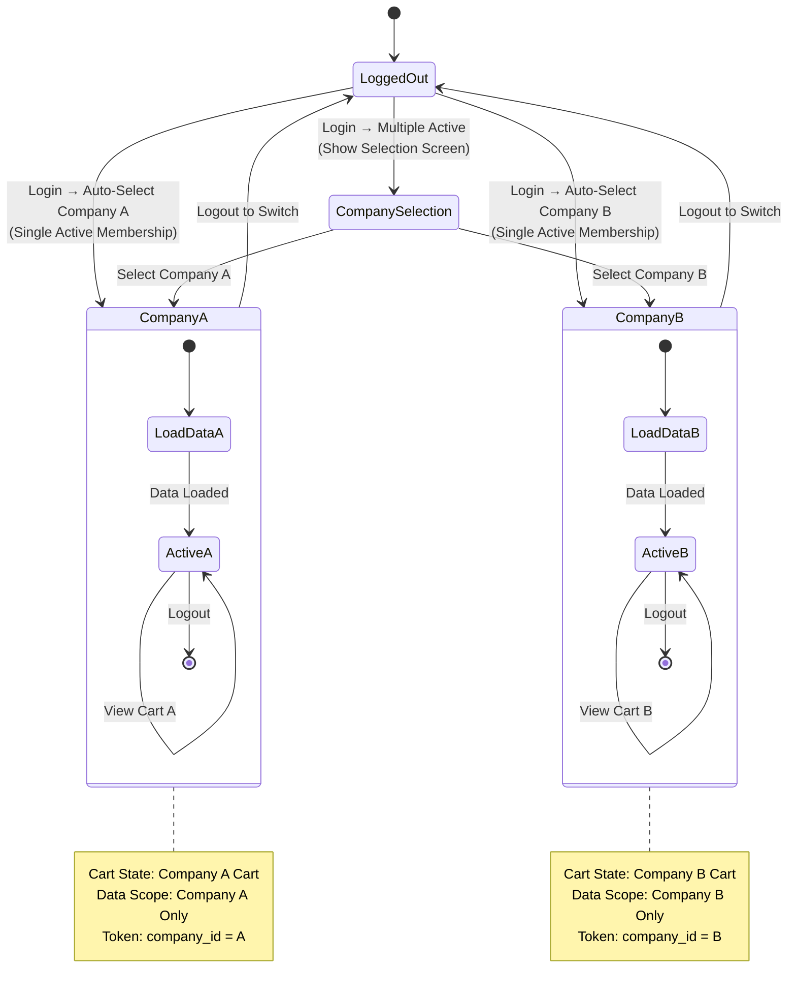

# Customer Journey

**Purpose:** End-to-end user journeys for key personas, showing decision points, pain points, and how features support user goals.

**Last Updated:** January 2026  
**Version:** 1.0

---

## Overview

SmartBench serves three primary personas: **Borrowers** (companies needing workers), **Lenders** (companies providing workers), and **Workers** (individuals working shifts). Each persona has distinct journeys through the platform.

---

## Borrower Journey

**Persona:** Company admin or supervisor who needs to find and book workers for construction projects.

### Journey Stages

#### 1. Discovery & Search
- **Entry Point:** Borrower needs workers for a project
- **Actions:**
  - Search workers by trade, skills, location, availability
  - Filter results by rating, experience, certifications
  - View worker profiles (company name hidden initially)
  - Review availability calendars
- **Pain Points Addressed:**
  - Finding qualified workers quickly
  - Ensuring workers are available when needed
  - Comparing options without revealing company identity (prevent poaching)
- **Features Used:** [Marketplace & Search](./epic-3.md)

#### 2. Selection & Booking
- **Actions:**
  - Create or select existing project (required - bookings cannot exist without a project)
  - Add workers to cart (company name revealed after cart addition)
  - Review cart with total costs
  - Select Primary Site Contact (for operational communication)
  - Proceed to checkout
  - Enter payment information
  - Confirm booking
- **Pain Points Addressed:**
  - Booking multiple workers in one transaction
  - Ensuring payment security
  - Setting up verification workflow
- **Features Used:** [Booking & Payment Processing](./epic-4.md)

#### 3. Project Management
- **Actions:**
  - Create project (persistent entity)
  - Link bookings to project
  - Track project progress
  - Manage multiple bookings under one project
- **Pain Points Addressed:**
  - Organizing multiple bookings
  - Tracking project-level progress
- **Features Used:** [Project Management](./epic-1-1.md)

#### 4. Verification & Payment
- **Actions:**
  - Receive notification when worker clocks in
  - Receive notification when timesheet ready for review
  - Verify hours via SMS magic link
  - Funds automatically released upon verification
  - Weekly payments processed automatically (Wednesday 10 AM)
  - Unpaid bookings: Final Warning at 2 PM (Project time); worker released at 11:59 PM if still unpaid (Pay or Release model)
- **Pain Points Addressed:**
  - Ensuring accurate time tracking
  - Streamlined verification process
  - Automatic payment processing
- **Features Used:** [Time Tracking & Verification](./epic-5.md), [Financial Operations](./epic-6.md)

#### 5. Ongoing Management
- **Actions:**
  - View booking history
  - View booking history and payment records
  - Review financial reports
  - Manage saved searches for future needs
- **Pain Points Addressed:**
  - Financial transparency
  - Reusing successful searches
- **Features Used:** [Financial Operations & Admin](./epic-6.md), [Marketplace & Search](./epic-3.md)

### Decision Points

- **Insurance Verification:** Borrower can audit lender insurance during checkout
- **Site Contact Selection:** Select Primary Site Contact from company members (for operational communication; verification is role-based - any Supervisor, Manager, or Admin can verify)
- **Payment Method:** Credit card charged directly via Stripe API (full booking total including Service Fee)
- **Booking Type:** Short-term (fixed dates) vs. Long-term (with recall rights)

### Reference Journey Diagram

For a detailed booking journey diagram, see [Epic 4: Booking Journey](./epic-4.md#booking-journey).

---

## Lender Journey

**Persona:** Company admin who wants to monetize idle workers by listing them in the marketplace.

### Journey Stages

#### 1. Company Onboarding
- **Entry Point:** Lender wants to list workers on platform
- **Actions:**
  - Complete multi-step onboarding wizard
  - Provide company information (EIN, business name, address)
  - Complete KYB verification (Stripe Identity)
  - Choose: Solopreneur or Company with employees
- **Pain Points Addressed:**
  - Simplified onboarding process
  - Clear guidance through setup
- **Features Used:** [Foundation & Core Infrastructure](./epic-1.md)

#### 2. Worker Management
- **Actions:**
  - Invite workers via bulk roster invite (SMS magic links)
  - Workers complete profiles (trade, skills, experience, photo)
  - Admin reviews profiles in roster
  - Admin sets lending rate ($/hr)
  - Admin toggles "List in Marketplace" to ON
- **Pain Points Addressed:**
  - Efficient worker onboarding
  - Control over worker listing
  - Setting competitive rates
- **Features Used:** [Worker Onboarding & Profile Management](./epic-2.md)

#### 3. Insurance & Compliance
- **Actions:**
  - Upload insurance policies (General Liability, Workers' Compensation)
  - System validates insurance expiration dates
  - Receive warnings (14 days, 7 days before expiration)
  - Insurance gates booking creation (3-day rule) - ensures insurance valid throughout booking period
- **Pain Points Addressed:**
  - Compliance management
  - Ensuring insurance coverage throughout booking lifecycle
- **Features Used:** [Worker Onboarding & Profile Management](./epic-2.md)

#### 4. Availability Management
- **Actions:**
  - Set availability date ranges (start and end dates)
  - Block specific dates for exceptions
  - Choose availability mode (Short-Term vs. Long-Term with recall)
  - System automatically locks dates when booked
- **Pain Points Addressed:**
  - Managing worker availability efficiently
  - Preventing double-booking
- **Features Used:** [Marketplace & Search](./epic-3.md)

#### 5. Booking Management
- **Actions:**
  - Receive notification when booking request received (payment processed to Stripe Connect)
  - Review booking details
  - Worker receives shift assignment notification
  - Monitor worker clock-in/out status
- **Pain Points Addressed:**
  - Real-time booking updates
  - Worker attendance tracking
- **Features Used:** [Booking & Payment Processing](./epic-4.md), [Time Tracking & Verification](./epic-5.md)

#### 6. Payment & Payouts
- **Actions:**
  - Funds processed directly via Stripe API upon verification
  - View payment history through Stripe dashboard integration
  - Payments processed directly via Stripe API
  - Withdraw funds to bank account (T+2 days or instant with fee)
- **Pain Points Addressed:**
  - Fast payouts (daily upon verification)
  - Financial flexibility (direct Stripe payment processing)
  - Clear financial tracking
- **Features Used:** [Financial Operations & Admin](./epic-6.md)

### Decision Points

- **Solopreneur vs. Company:** Determines onboarding flow and role assignment
- **Availability Mode:** Short-term (fixed) vs. Long-term (with recall rights)
- **Lending Rate:** Setting competitive rates while maintaining profitability
- **Withdrawal Timing:** Standard (T+2) vs. Instant (with fee)

---

## Worker Journey

**Persona:** Individual construction worker who works shifts booked through the platform.

### Journey Stages

#### 1. Invitation & Onboarding
- **Entry Point:** Worker receives SMS magic link invitation
- **Actions:**
  - Click SMS link
  - Create password
  - Accept terms and conditions
  - Complete profile: Trade, Skills, Experience, Photo, Certifications
  - Submit profile for admin review
- **Pain Points Addressed:**
  - Simple onboarding process
  - Mobile-friendly setup
- **Features Used:** [Worker Onboarding & Profile Management](./epic-2.md)

#### 2. Profile Review & Listing
- **Actions:**
  - Wait for admin review
  - Admin sets lending rate
  - Admin toggles listing ON
  - Worker appears in marketplace search
- **Pain Points Addressed:**
  - Clear status visibility
  - Understanding listing requirements
- **Features Used:** [Worker Onboarding & Profile Management](./epic-2.md)

#### 3. Booking & Assignment
- **Actions:**
  - Receive notification when booked (shift assigned)
  - View shift details (date, time, location, supervisor contact)
  - Receive 12-hour reminder before shift
  - Receive 1-hour confirmation with deep link
- **Pain Points Addressed:**
  - Clear shift information
  - Reminders to prevent no-shows
- **Features Used:** [Booking & Payment Processing](./epic-4.md)

#### 4. Time Tracking
- **Actions:**
  - Clock in with GPS coordinate capture and photo
  - Log breaks/lunch as required
  - Log travel time if applicable
  - Clock out
  - Timesheet sent to supervisor for verification
- **Pain Points Addressed:**
  - Accurate time tracking
  - Offline support for dead zones
  - Simple clock in/out process
- **Features Used:** [Time Tracking & Verification](./epic-5.md)

#### 5. Verification & Payment
- **Actions:**
  - Receive notification when hours verified
  - Funds released to lender's Stripe Connected Account
  - Lender processes payout (worker receives payment from lender company)
- **Pain Points Addressed:**
  - Fast verification process
  - Clear payment status
- **Features Used:** [Time Tracking & Verification](./epic-5.md), [Financial Operations](./epic-6.md)

### Decision Points

- **Profile Completion:** Worker must complete profile before listing
- **Clock-In with GPS Failure:** Worker can proceed with clock-in. Supervisor verifies time as normal based on physical presence.
- **Break/Lunch Logging:** Required for shifts exceeding thresholds

### Reference Journey Diagram

For a detailed worker onboarding journey diagram, see [Epic 2: Worker Onboarding Journey](./epic-2.md#worker-onboarding-journey).

---

## Cross-Journey Interactions

### Borrower ↔ Lender
- Borrower searches → Lender's workers appear in results
- Borrower books → Lender receives booking request
- Borrower verifies hours → Lender receives funds

### Lender ↔ Worker
- Lender invites → Worker receives SMS
- Lender lists worker → Worker appears in marketplace
- Lender receives payment → Worker paid by lender company

### Borrower ↔ Worker
- Borrower books → Worker receives shift assignment
- Worker clocks in → Borrower receives notification
- Worker completes shift → Borrower verifies hours

### Multi-Company Workflow (Login-Time Resolution)

**Scenario:** A worker or admin belongs to multiple companies (e.g., moved from Company A to Company B - sequential employment model).

**Workflow Details:**
- **Login-Time Resolution:** When user logs in, system checks `company_members` for `Active` memberships and resolves company context automatically.
- **Single Active Membership:** User is logged directly into that company (no selection needed).
- **Multiple Active Memberships (Edge Case):** System shows "Select Company" screen once immediately after login.
- **Sequential Employment:** If worker moved from Company A to Company B, Company A membership is `Inactive` and Company B is `Active` - system auto-logs into Company B.
- **No Hot-Swapping:** Global header company switcher has been removed. To switch companies, user must log out and log back in.
- **Cart Isolation:** Shopping Carts are persisted server-side linked to `company_id`. Each company maintains its own independent cart.
- **Data Isolation:** Data is strictly isolated. A user cannot see Company A's schedule while in Company B's context.

**Login-Time Company Context Resolution Flow Diagrams:**

```mermaid
sequenceDiagram
    participant U as User
    participant FE as Frontend
    participant API as API Server
    participant DB as Database
    participant Auth as Auth Service

    Note over U,Auth: Login with Identifier (Phone/Email)
    U->>FE: Login (Identifier + Password)
    FE->>API: POST /auth/login<br/>{identifier, password}
    API->>DB: Find User by Email OR Mobile Number
    DB->>API: User Record
    API->>DB: Get Active Company Memberships
    DB->>API: Company Memberships
    
    alt Single Active Membership
        API->>Auth: Generate JWT (company_id: Company A)
        Auth->>FE: Access Token + User Data
        FE->>FE: Store Token + Company Context
        FE->>U: Redirect to Dashboard (Company A)
    else Multiple Active Memberships
        API->>FE: Access Token + requiresCompanySelection: true
        FE->>U: Show "Select Company" Screen
        U->>FE: Select Company B
        FE->>API: POST /auth/select-company<br/>{companyId: Company B}
        API->>Auth: Generate New JWT (company_id: Company B)
        Auth->>FE: New Access Token
        FE->>FE: Store Token + Company Context
        FE->>U: Redirect to Dashboard (Company B)
    end
        FE->>FE: Load Company B Context
        FE->>API: GET /cart (Company B Context)
        API->>DB: Get Cart (company_id: Company B)
        DB->>API: Cart Data (Company B)
        API->>FE: Cart Response
        FE->>U: Display Company B Dashboard
    else Membership Invalid
        API->>FE: Error: "Not a member of target company"
        FE->>U: Display Error
    end
    
    Note over FE,DB: Data Isolation
    U->>FE: Request Bookings
    FE->>API: GET /bookings<br/>(Token: company_id: Company B)
    API->>API: Extract company_id from Token
    API->>DB: SELECT * FROM bookings<br/>WHERE company_id = Company B
    DB->>API: Bookings (Company B only)
    API->>FE: Bookings Response
    Note over FE: Company A data not accessible<br/>in Company B context
```



---

## Pain Points Addressed

### Security & Trust
- **Problem:** Trust between unknown companies
- **Solution:** Insurance verification, Stripe escrow/hold protection (funds held via Stripe during disputes), verification workflows, ratings system

### Payment Security
- **Problem:** Payment terms and disputes
- **Solution:** Upfront payment, Stripe escrow/hold (funds held via Stripe API during disputes), automatic fund release, dispute resolution

### Operational Efficiency
- **Problem:** Manual coordination and verification
- **Solution:** Automated notifications, magic link verification, offline time tracking, automatic payments

### Financial Flexibility
- **Problem:** Cash flow management
- **Solution:** Direct Stripe payment processing, daily payouts, T+2 or instant withdrawals

---

## Related Documentation

- [Feature Blueprint](./feature-blueprint.md) - Feature overview and relationships
- [User Roles and Actors](./user-roles-and-actors.md) - Role definitions and permissions
- [Terminology Glossary](./glossary.md) - Standardized terminology definitions
- [Epic List](./epic-list.md) - Detailed feature requirements
- [Epic 1: Foundation & Core Infrastructure](./epic-1.md) - Authentication and company setup
- [Epic 2: Worker Onboarding & Profile Management](./epic-2.md) - Worker onboarding journey
- [Epic 3: Marketplace & Search](./epic-3.md) - Worker search and discovery
- [Epic 4: Booking & Payment Processing](./epic-4.md) - Booking workflow
- [Epic 5: Time Tracking & Verification](./epic-5.md) - Time tracking and verification
- [Epic 6: Financial Operations & Admin](./epic-6.md) - Financial operations