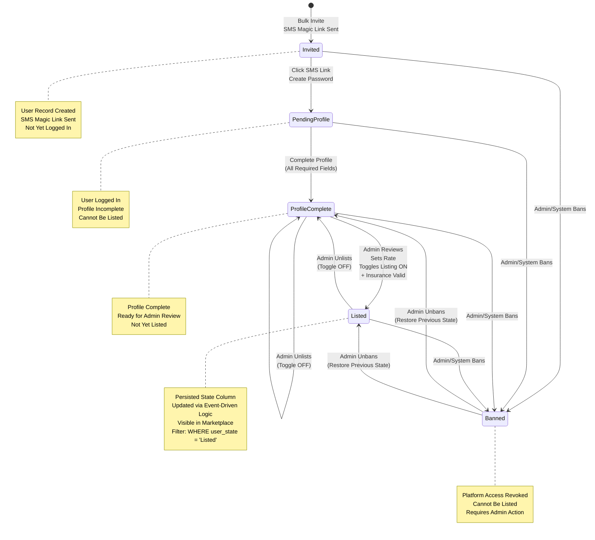
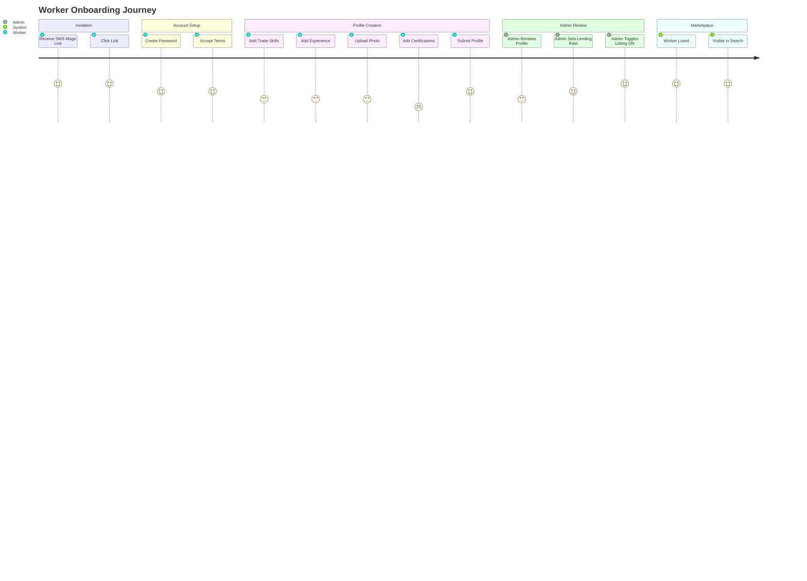
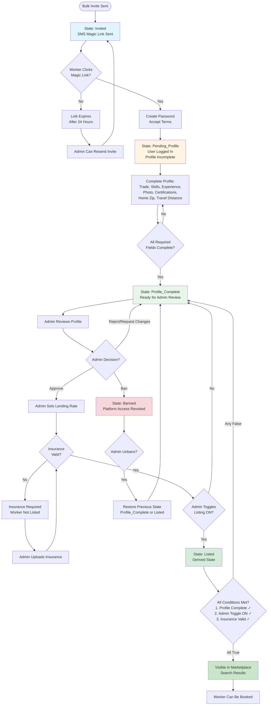
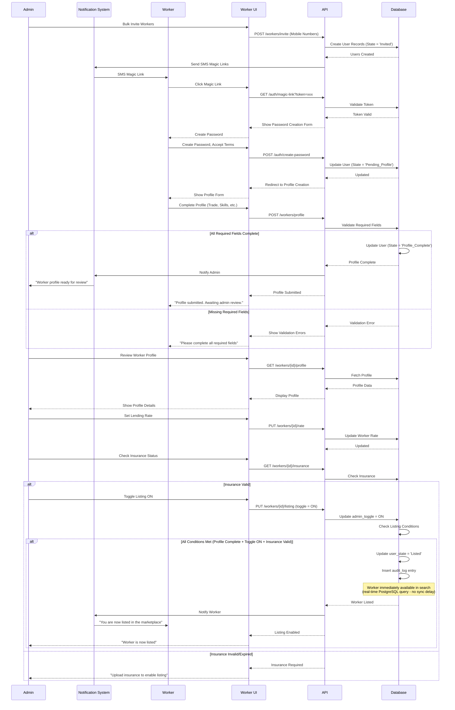
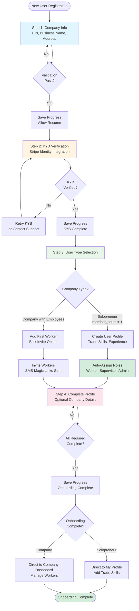
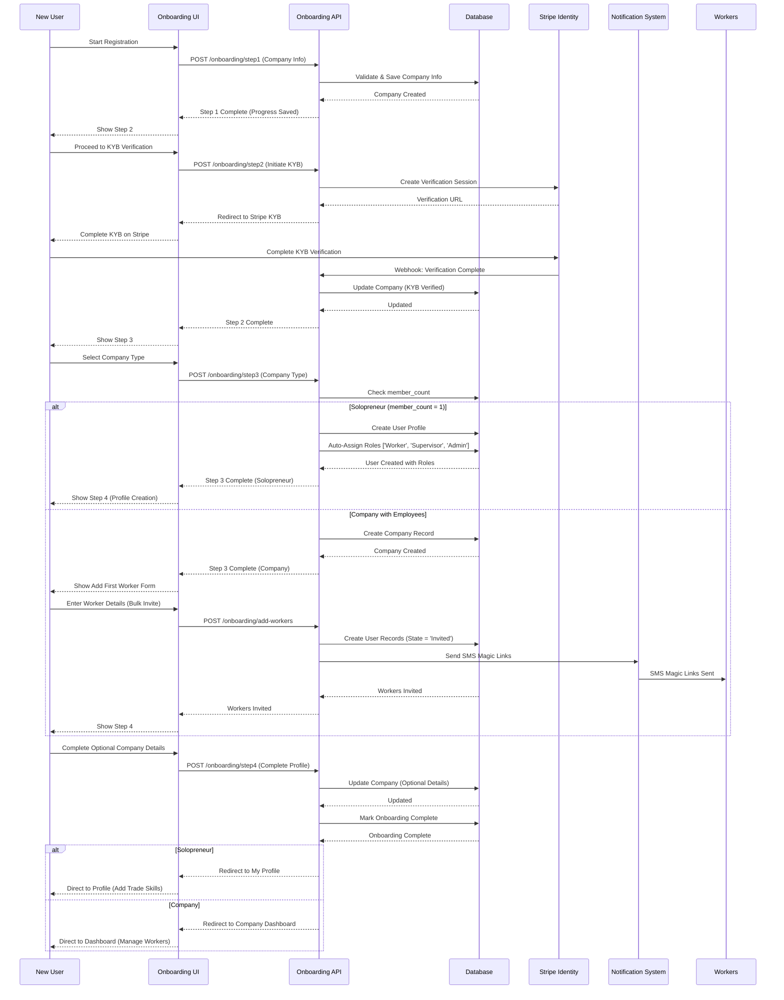
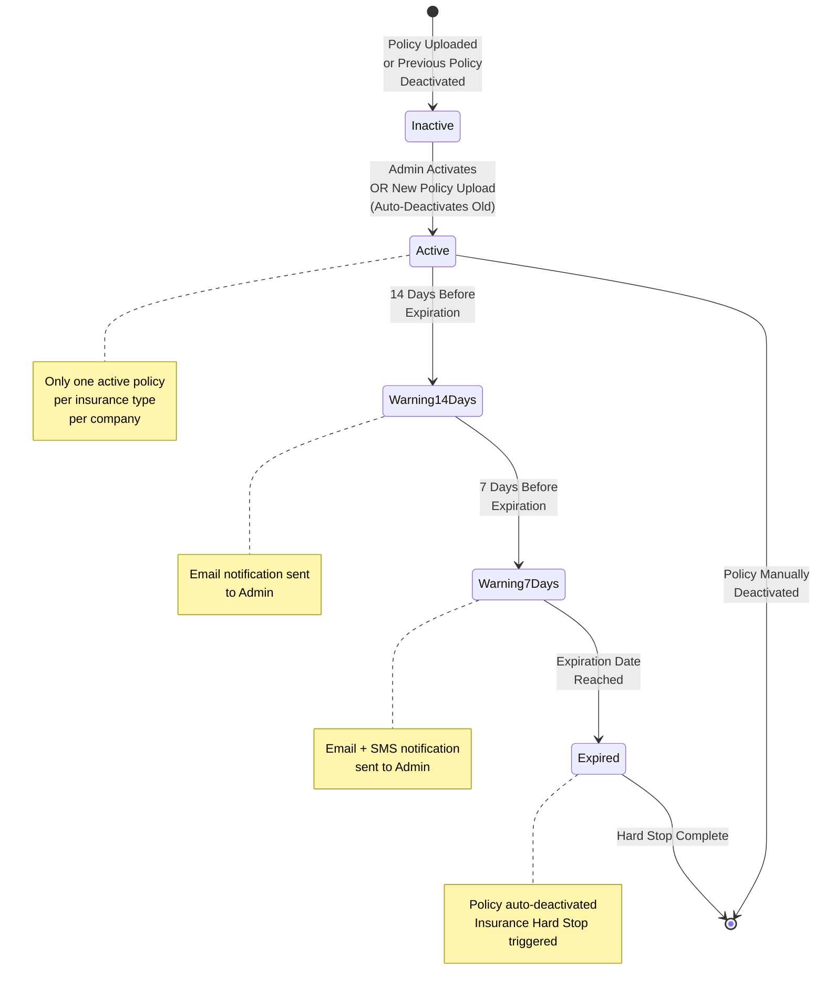
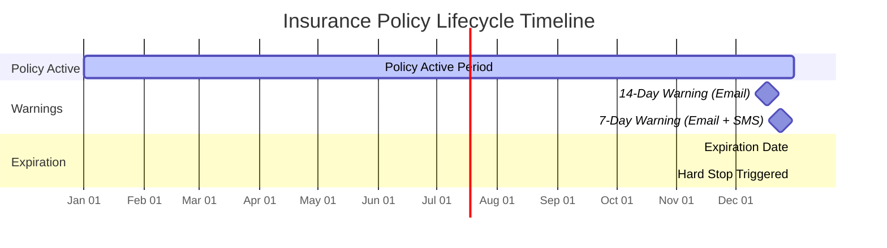
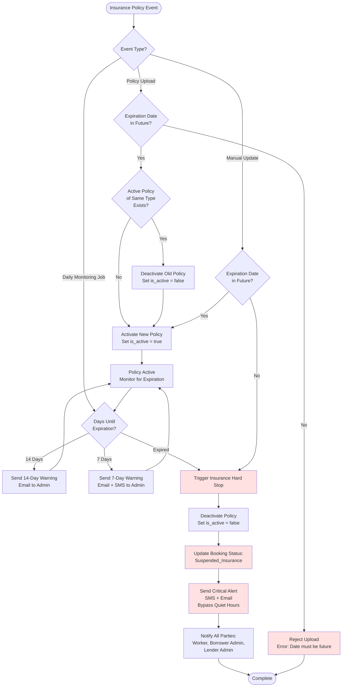
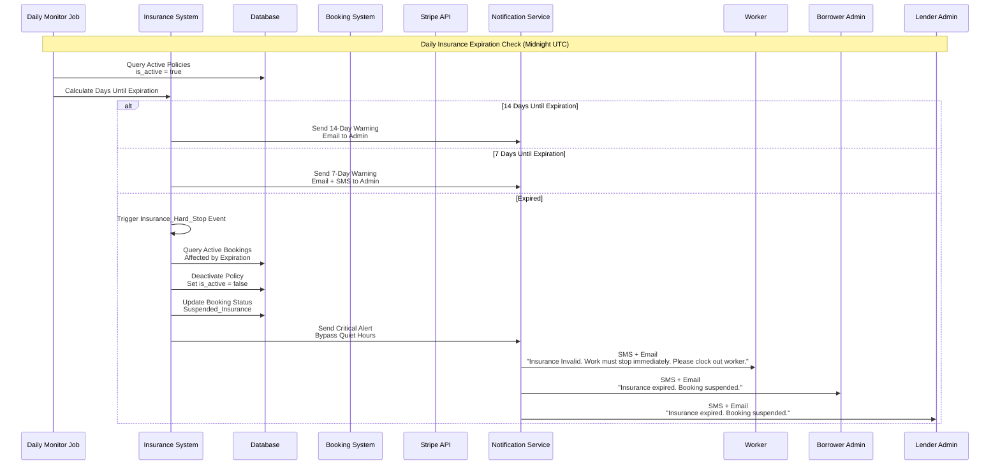

# Epic 2: Worker Onboarding & Profile Management

**Epic Goal:** Enable workers to create comprehensive profiles, allow admins to manage company rosters, implement insurance verification workflows, and enable workers to be listed in the marketplace. This epic delivers the complete worker lifecycle from invitation to marketplace listing.

## Worker State Machine

See [Worker State Machine](../architecture/data-dictionary-identity.md#worker-state-machine) in the Data Dictionary for the authoritative state definitions, transition rules, and diagrams.

**Worker State Machine Diagram:**

**"Listed" State as Persisted Column:**
The `Listed` state is a **persisted column** (`users.user_state = 'Listed'`), not a derived status. Listing is an **Event-Driven Update**:
- **When Admin toggles listing ON:** System validates worker is in `Profile_Complete` state and insurance is valid, then updates `user_state` to `Listed` (persisted) and logs the change to `audit_log`
- **When Insurance Expires (detected by background job):** System updates `user_state` to `Profile_Complete` and logs the change to `audit_log` with reason: 'Insurance Expired'
- **Search queries:** Filter by `WHERE user_state = 'Listed'` (simple column check)

**Profile Completeness Requirement for Listed State:**
- **State Machine Guarantee:** Workers can only reach `Listed` state when profile is complete (enforced by state machine)
- **State Transition Validation:** State machine prevents `Listed` state until all required fields are complete
- **Data Consistency:** If worker reaches `Listed` state, profile is guaranteed to be complete
- **Search Query Assumption:** Search queries can safely assume profile completeness for workers with `user_state = 'Listed'` - no explicit profile validation needed in search queries
- **Edge Case Prevention:** State machine validation prevents partial profile data from appearing in search results

## Worker Onboarding Journey

The following journey diagram shows the complete onboarding flow from invitation to marketplace listing:

**Enhanced Worker Onboarding Flow with State Transitions:**

The following flowchart provides detailed state transitions and decision points during worker onboarding:

**Worker Onboarding Sequence Diagram:**

## Story 2.1: Company Onboarding Wizard {#story-21-company-onboarding-wizard}

As a new company admin,
I want to complete a guided onboarding process,
so that I can set up my company and first worker efficiently.

**Acceptance Criteria:**
1. Multi-step onboarding wizard implemented with progress indicator
2. Step 1: Company Info collection (EIN, Business Name, Address) with validation
3. Step 2: KYB Verification integration with Stripe Identity (basic business verification)
4. Step 3: User Profile creation (for solopreneur) OR Add First Worker option
5. Step 4: Complete Profile (optional company details)
6. Progress can be saved and resumed
7. Validation prevents proceeding to next step until current step complete
8. Onboarding completion triggers appropriate next actions based on user type

**Company Onboarding Wizard Flow Diagram:**

The following flowchart illustrates the complete company onboarding wizard workflow:

**Company Onboarding Sequence Diagram:**

## Story 2.2: Solopreneur Auto-Role Assignment {#story-22-solopreneur-auto-role-assignment}

As a solopreneur creating an account,
I want to automatically receive all necessary roles,
so that I can immediately use all platform features.

**Acceptance Criteria:**
1. When single user creates company, system automatically assigns roles: ['Worker', 'Supervisor', 'Admin']
2. User immediately directed to "My Profile" to add trade skills
3. User can access all features (list self, book workers, verify hours, manage financials)
4. No additional role assignment required

## Story 2.3: Bulk Roster Invite {#story-23-bulk-roster-invite}

As a company admin or manager,
I want to invite multiple workers at once via bulk import,
so that I can quickly onboard my entire crew.

**Acceptance Criteria:**
1. "Add Crew" input form accepts list of Mobile Numbers + First Names
2. System creates User records with State = 'Invited' for each entry
3. SMS Magic Links sent to each mobile number
4. Duplicate mobile number detection prevents multiple invites
5. Admin and Manager see list of invited users with status (Invited, Pending_Profile, Profile_Complete)
6. Admin and Manager can resend invite if needed
7. **Role-Based Access:** Admin and Manager can invite workers via bulk roster. Manager can invite workers and supervisors, but cannot assign Manager or Admin roles (Admin only).

## Story 2.4: Worker Profile Creation {#story-24-worker-profile-creation}

As an invited worker,
I want to complete my profile with skills, experience, and certifications,
so that I can be listed in the marketplace.

**Acceptance Criteria:**
1. Invitee clicks SMS Magic Link and creates password
2. **Phone-First Authentication:** Mobile Number is the primary identifier for Workers and is required. Email is optional for Workers (phone-first authentication model).
3. Worker Profile form includes: Trade selection, Hierarchical Skills (parent > child), Years of Experience (required for each skill), **Tools/Equipment (free-form text description - simplified for MVP)**, Languages (selection with proficiency: Minimal, Basic Conversation, Fluent), Certifications (name + optional document upload), Photo upload, **Home Zip Code, Maximum Travel Distance (miles)**
4. **Travel Radius:** Home Zip Code and Maximum Travel Distance are set at the Worker level, not Company level. Workers often live far from their company office, so travel radius is worker-specific. Maximum Travel Distance is limited to 100 miles to prevent unrealistic travel distances.
5. **Tools Simplification:** Tools/Equipment is a simple free-form text field, not a complex checklist. This reduces complexity for MVP while still allowing workers to describe what they bring to job sites.
6. Form validation ensures required fields completed
7. Skills hierarchy allows parent skill selection, then sub-skill selection
8. Profile submission changes User_State to 'Profile_Complete'
9. Worker cannot proceed until profile complete

**Error Handling:**
- **Invalid Magic Link:** If magic link is expired or invalid, show: "This invitation link has expired or is invalid. Please contact your company admin for a new invitation." Link to contact admin.
- **Profile Validation Failure:** If required fields are missing, show inline validation errors: "Please complete all required fields: [list of missing fields]." Highlight missing fields.
- **Photo Upload Failure:** If photo upload fails, show: "Photo upload failed. Please try again or continue without photo (photo can be added later)." Retry button provided.
- **Network Error During Submission:** If network error occurs during profile submission, show: "Network error. Your profile has been saved locally and will sync when online." Display sync status indicator.
- **Duplicate Profile Submission:** If profile already submitted, show: "Profile already submitted. Please wait for admin review." Redirect to profile status page.

## Story 2.5: Profile Review and Listing {#story-25-profile-review-and-listing}

As a lender company admin or manager,
I want to review worker profiles and control marketplace listing,
so that I can ensure quality and set appropriate rates.

**Acceptance Criteria:**
1. When worker profile reaches 'Profile_Complete' state, Lender Company Admin and Manager receive notification
2. Admin and Manager see "Roster" tab with list of workers in 'Profile_Complete' state
3. Admin and Manager can view full worker profile
4. Admin and Manager can review and edit worker skills before setting lending rate
5. **Smart Pricing Suggestions:** When setting rates, show an indicator: "Avg rate for [Trade] in [Zip] is $[Amount]."
6. **Role-Based Rate Setting:** Only Admin can set "Lending Rate" ($/hr) for each worker. Manager cannot set lending rates (Admin only).
7. **Listing Toggle and State Machine Relationship:** `Listed` is a **persisted state column** (`users.user_state = 'Listed'`). Admin and Manager (Lender context) can toggle "List in Marketplace" to ON, which updates `user_state` to `Listed` if worker is in 'Profile_Complete' state and insurance is valid. The state change is logged to `audit_log`. Workers with `user_state = 'Listed'` appear in marketplace search (filtered by `WHERE user_state = 'Listed'`).
8. **State Machine Validation:** Admin and Manager cannot toggle listing ON if worker is still in 'Pending_Profile' or 'Invited' state. System validates that worker must be in 'Profile_Complete' state before listing toggle can be enabled. If worker profile becomes incomplete later (e.g., required fields removed), system automatically disables listing toggle (sets admin_toggle = OFF) and worker is removed from marketplace search.
9. Admin and Manager (Lender context) can unlist workers by toggling "List in Marketplace" to OFF (worker remains in 'Profile_Complete' state but is removed from marketplace)
10. Admin can edit worker rates at any time (Manager cannot edit rates)
11. Lender Company Admin and Manager bear full responsibility for the accuracy of worker listings and skills
12. **State Transition Validation:** Only workers in "Profile_Complete" state can transition to "Listed". System validates state before allowing transition. If admin or manager attempts to list a worker who is not in "Profile_Complete" state (e.g., still "Invited" or "Pending_Profile"), system returns clear error message: "Worker profile must be complete before listing. Current state: [state]. Please ensure worker has completed profile creation." Invalid transitions are blocked and error message displayed to admin or manager.

**Error Handling:**
- **Listing Toggle Failure:** If listing toggle fails (e.g., insurance invalid, profile incomplete), show: "Unable to list worker. [Reason]. Please resolve the issue and try again." Display specific reason (insurance expired, profile incomplete, etc.).
- **Rate Validation Failure:** If rate is invalid (e.g., negative, too high), show: "Invalid rate. Please enter a valid hourly rate between $0.01 and $999.99." Inline validation prevents submission.
- **Network Error During Update:** If network error occurs during rate or listing update, show: "Network error. Your changes may not have been saved. Please try again." Retry button provided with status check.

## Story 2.6: Enhanced Worker Profile Features {#story-26-company-settings-configuration}

As a worker or admin,
I want to add detailed profile information including testimonials,
so that borrowers can make informed booking decisions.

**Acceptance Criteria:**
1. Worker profile displays: Skills with experience years, **Tools/Equipment (free-form text description)**, Languages with proficiency levels, Certifications with optional documents, **Home Zip Code and Travel Radius**, Testimonials section (with worker permission)
2. **Travel Radius Display:** Profile shows worker's home zip code and maximum travel distance, allowing borrowers to understand worker's geographic availability
3. **Privacy Toggle:** Explicit worker toggle for "Allow Testimonials on Public Profile."
4. Testimonials display previous borrower ratings and comments
5. Worker can grant/revoke permission for testimonials display
6. Profile shows aggregate rating and individual dimension scores (Punctuality, Attitude, Effort, Teamwork)
7. Skills breakdown shows ratings per skill: "Carpentry: 5/5 (3 ratings), Painting: 4.5/5 (2 ratings)"

## Story 2.7: Insurance Upload and Lender Self-Certification {#story-27-insurance-upload-and-lender-self-certification}

As a lender company admin,
I want to upload insurance documents and self-certify expiration dates,
so that my workers can be listed and bookings can proceed.

#### Acceptance Criteria
1. Insurance upload interface in Company Settings accepts PDF files for General Liability and Workers Compensation. Insurance PDF uploads are limited to 10MB maximum file size to prevent storage and performance issues.
2. **Role-Based Access:** Only Admin can upload insurance policies. Manager cannot upload insurance policies (Admin only).
3. **Insurance Upload Validation:** Admin manually types expiration date (Lender Self-Certification method). System validates that expiration date is in the future - all insurance uploads with expiration dates in the past are rejected. **Explicit Rule:** Insurance expiration date must be > current date. Insurance expiring today is considered expired and rejected. If admin attempts to upload insurance with expiration date in the past or today, system displays error: "Insurance expiration date must be in the future. Please enter a valid expiration date." No admin override allowed - expired insurance cannot be uploaded. System validates date format and ensures date is after current date before accepting upload.

#### Manual Override Process for Insurance Verification

The system provides a manual override mechanism for insurance verification failures in specific scenarios:

- **When Override is NOT Allowed:**
  - Insurance expiration date validation (must be in future) cannot be overridden - this is a hard business rule enforced at all levels
  - Insurance upload validation failures due to expired dates cannot be bypassed

- **When Override is Allowed:**
  - Lost offline data scenarios where insurance verification data cannot be retrieved from external systems
  - System errors preventing automatic verification where manual document review is required
  - Edge cases where automated verification fails but documents are valid (requires Super Admin review)

- **Override Workflow:**
  1. Insurance verification failure is logged in system with failure reason
  2. Super Admin reviews the insurance verification failure case via admin dashboard
  3. Super Admin manually reviews insurance documents (PDF files) to verify validity
  4. Super Admin sets insurance status via admin dashboard (marks as verified/valid)
  5. System logs override action in `audit_log` with:
     - `action_type = 'Insurance_Verification_Override'`
     - `target_entity = 'Insurance_Policy'`
     - `target_id = insurance_policy_id`
     - `metadata` includes: `admin_id`, `insurance_policy_id`, `override_reason`, `override_timestamp`, `original_failure_reason`
  6. Insurance policy status is updated to reflect manual verification
  7. Worker listing and booking gates are re-evaluated based on updated insurance status

- **Audit Requirements:**
  - All override actions must include a reason in the audit log
  - Override actions are immutable and cannot be reversed
  - Override history is visible in insurance policy audit trail
  - Super Admin actions are tracked for compliance and review purposes

3. **Backdating Safety Modal:** If a user manually updates an insurance expiration date to a date in the past (or earlier than the previous valid date), the system triggers a safety modal before accepting the change. **Modal Content:** "Warning: You are entering a date in the past. This will trigger an immediate stop to active bookings." **Modal Actions:** (1) "Cancel" button - Reverts the date change and closes modal, (2) "Confirm" button - Proceeds with the date change. **Event Trigger:** If user clicks "Confirm", the system triggers the `Insurance_Hard_Stop` event immediately upon accepting the backdated expiration date. This ensures that any active bookings are immediately affected when insurance is backdated, preventing work from continuing without valid coverage.
4. Admin must check "Legal Liability Waiver" box confirming date accuracy under penalty of fraud
5. Insurance_Exp_Date_Manual stored in Company table (only after validation passes)
6. System validates insurance expiration before allowing worker listing or booking checkout
7. **"3-Day Gate" (Booking Creation Gate):** System must enforce a '3-Day Gate' ensuring insurance is valid for the duration of the booking plus a safety buffer at booking creation time. This rule applies to all booking types (full upfront and weekly progress payments). **Rationale:** The 3 calendar day buffer provides a safety margin to prevent coverage gaps and allows time for insurance renewal processing. **Full Upfront Payment Equivalence:** For full upfront payments, funded_period_end equals booking_end_date at booking creation time (i.e., the entire booking period is funded upfront, so funded_period_end = booking_end_date). **Insurance Gate Timing:** Insurance validity is checked during booking checkout to ensure coverage throughout the booking period. Insurance must be valid at booking creation time AND through the booking end date + 3 calendar days. See [Identity Data Dictionary](../architecture/data-dictionary-identity.md) for validation logic. **Insurance Renewal and Grace Period:** There is NO grace period for insurance renewal. Insurance must be valid at booking creation time. If insurance expires before booking creation, lender must upload renewal before creating the booking. System validates renewal immediately upon upload (no grace period). **Note:** This booking creation gate rule is separate from the ongoing compliance monitoring (see Insurance Hard Stop section below). Ongoing insurance monitoring runs independently via nightly jobs and immediately suspends bookings when insurance fails, regardless of payment timing.
8. **Notification Timing Sequence:** (1) Insurance expiration warning (14 days before expiration: Email), (2) Insurance expiration warning (7 days before expiration: Email + SMS), (3) Insurance expired notification (immediately when expiration detected: SMS + Email to both Borrowing and Lending Admins with message: "Insurance expired. Booking suspended. Work must stop immediately."). **Explicit Rule:** Insurance expiration triggers immediate notification to all parties (Worker, Supervisor, Borrowing Admin, Lending Admin) when booking status changes to `Suspended_Insurance`. **Late Upload Handling:** Insurance warnings are sent based on time until expiration. If insurance is uploaded with expiration < warning threshold, appropriate warning is sent immediately (e.g., if expiration < 7 days, send 7-day warning immediately; if expiration < 14 days but > 7 days, send 14-day warning immediately).
9. **"Graceful Hard Stop" (Event-Driven Compliance Model):** **CRITICAL SEPARATION:** Insurance validation runs **completely independently** of payment processing and dispute resolution. This logic is triggered by compliance events (insurance expired, revoked, or invalid) detected via nightly monitoring jobs or manual insurance updates. This ensures that safety/compliance concerns are completely separated from scheduled payment processing and dispute workflows. **Explicit Rule - Independent Operation:** Insurance Hard Stop logic does NOT run during the Wednesday payment loop. Instead, it operates as an event-driven compliance check that **immediately suspends bookings** when insurance fails, regardless of payment timing or dispute status. The Wednesday payment job only processes bookings that are currently `Active`. It assumes if a booking is Active, it is compliant. If a booking was suspended on Tuesday due to insurance failure (status changed to `Suspended_Insurance`), the payment query won't pick it up. See [Identity Data Dictionary](../architecture/data-dictionary-identity.md) for the authoritative 'Insurance Hard Stop' workflow. **Explicit Rule - No Auto Clock-Out:** The system **DOES NOT** automatically clock out a worker when insurance expires. Workers must manually clock out. **Insurance Hard Stop Workflow:** When insurance expires, is revoked, or becomes invalid during an active booking (detected via nightly job or manual update), the system **immediately** performs the following actions **independently of any payment processing or dispute resolution** (no external API calls are made during the critical Payment Processing batch job): (1) **Updates Booking Status to `Suspended_Insurance`** - This status change is triggered by compliance events and is completely separate from payment processing and dispute resolution. The booking status change happens immediately upon insurance failure detection, regardless of when payments are scheduled or dispute status. Bookings with status `Active`, `Payment_Paused_Dispute`, or `Disputed` all transition to `Suspended_Insurance` when insurance expires. (2) System sends **Critical Alert** (SMS/Email, bypassing Quiet Hours) to Worker, Supervisor, Borrowing Admin, and Lending Admin with message: *"Insurance Invalid. Work must stop immediately. Please clock out worker."* - Workers are notified immediately to stop work, ensuring safety compliance is enforced without waiting for payment processing cycles. (3) **Clock-In Blocking:** Workers cannot clock in if booking status is `Suspended_Insurance`. This preserves data integrity while preventing work from continuing without valid insurance coverage. (4) **Liability Statement:** Any work performed after the insurance expiration timestamp is at the **Lender's sole liability**. The platform bears no responsibility for work performed after insurance expiration. **Current Shift Definition:** "Current shift" means the active time log entry (until worker clocks out). If insurance expires during active shift, worker can finish that shift (until clock-out), then future shifts are blocked from clock-in. **Explicit Rule:** Insurance expiration during active shift allows worker to complete current shift (until clock-out). Future shifts are blocked from clock-in immediately upon expiration detection. **Already-verified shifts are final. Only future unverified shifts are blocked. No clawback of released funds.** **Insurance Expiration Timing Rules (Explicit):** The system enforces explicit rules based on when insurance expires relative to shift timing: (1) **Expires Before Shift Start:** If insurance expires before the scheduled shift start time, the booking status is set to `Suspended_Insurance` and workers cannot clock in for that shift. Early cancellation fee applies per the cancellation policy agreed to by both parties if the booking is cancelled. (2) **Expires During Active Shift:** If insurance expires while a worker is clocked in (active shift), the current shift is paid based on actual hours worked or minimum billable hours or cancellation fee (whichever is greater). Booking status is set to `Suspended_Insurance` and workers cannot clock in for future shifts. Worker must clock out manually upon receiving notification. (3) **Expires Exactly at Shift Start:** If insurance expires exactly at the shift start time, it is treated the same as expiring during an active shift - booking status is set to `Suspended_Insurance` and workers cannot clock in. **Shift Start Time Definition:** "Shift start time" is defined as the scheduled shift start time in the booking, not the clock-in time. This ensures consistent handling regardless of when the worker actually clocks in. **Insurance Renewal and Booking Resumption:** When insurance is renewed or updated to valid status, the system automatically updates booking status based on the booking's state before insurance expiration: (1) If booking was `Active` before insurance expiration, status transitions back to `Active`. (2) If booking had an active Option A dispute (status was `Payment_Paused_Dispute` or `Disputed`) before insurance expiration, status transitions to `Payment_Paused_Dispute` (not `Active`) until all disputes are resolved. Workers can clock in only after insurance is renewed AND all disputes are resolved. **Insurance Expiration During Active Dispute:** 
- **Option A Dispute Active:** If insurance expires while a booking has an active Option A dispute (status = `Payment_Paused_Dispute` or `Active`), the booking status transitions to `Suspended_Insurance` (insurance compliance takes precedence). The dispute remains active and tracked separately. When insurance is renewed during an active Option A dispute, booking status transitions to `Payment_Paused_Dispute` (not `Active`) until all disputes are resolved. Workers can clock in only after insurance is renewed AND all disputes are resolved. **Explicit Rule:** Insurance compliance takes precedence over dispute resolution - insurance expiration during Option A dispute results in `Suspended_Insurance` status, blocking clock-in until insurance is renewed.
- **Option B Dispute Active:** If insurance expires while a booking has an Option B dispute, the booking is already `Cancelled` (Option B immediately cancels booking when dispute is filed). Insurance expiration has no effect on cancelled bookings - no status change occurs. **Explicit Rule:** Option B disputes result in immediate cancellation, so insurance expiration during Option B dispute has no additional impact.

**Explicit Rule:** Insurance Hard Stop operates independently of payment processing and dispute resolution. The Wednesday payment loop only processes bookings with status `Active` and assumes compliance. If a booking was suspended on Tuesday due to insurance failure, the payment query won't pick it up (status is `Suspended_Insurance`, not `Active`). Insurance compliance and dispute resolution are independent concerns - insurance expiration during Option A dispute results in `Suspended_Insurance` status, and insurance renewal returns booking to `Payment_Paused_Dispute` (not `Active`) until disputes resolve. Option B disputes already result in cancellation, so insurance expiration has no effect. See [Epic 5: Story 5.10](../prd/epic-5.md#story-510-dispute-resolution-chat-based-resolution) for complete dispute interaction rules.
10. **Borrower Audit Link:** During booking checkout, Borrower must be able to view a link to the Lender's active insurance documents (General Liability and Workers Compensation) to perform personal audit before completing booking

#### Insurance Gating and Expiration Workflow Diagrams

The following diagrams illustrate the complete insurance policy lifecycle, expiration warnings, gating logic, and hard stop workflow:

**Insurance Expiration Timeline:**

**Insurance Gating and Hard Stop Flow:**

**Insurance Hard Stop Sequence Diagram:**

**Key Features Visualized:**
1. **Policy States:** Inactive → Active → Warning (14 days) → Warning (7 days) → Expired
2. **Active Policy Uniqueness:** Only one active policy per insurance type per company (new upload auto-deactivates old)
3. **Expiration Warnings:** 14-day email warning, 7-day email + SMS warning
4. **Event-Driven Hard Stop:** Insurance Hard Stop runs independently via nightly monitoring jobs or manual updates, not during payment processing
5. **Hard Stop Workflow:** Immediately sets booking status to `Suspended_Insurance`, sends critical alerts, deactivates policy. Workers cannot clock in if status is `Suspended_Insurance`.
6. **Notification Timing:** Warnings sent at specific intervals; hard stop triggers immediate critical notifications
7. **Policy Activation/Deactivation:** Automatic deactivation on expiration or new policy upload
8. **Independent Operation:** Insurance validation is completely separate from payment processing. The Wednesday payment loop only processes bookings with status `Active` and assumes compliance.

## Story 2.9: Lender Policy Configuration {#story-29-lender-policy-configuration}

As a lender company admin,
I want to configure break/lunch policies and overtime authorization settings,
so that my company policies are enforced according to my configured settings (I accept full liability for ensuring compliance with local labor laws via Terms of Service acceptance).

**Acceptance Criteria:**
1. Lending Admin can configure Break Policy: Duration (minutes) and Frequency (hours) - e.g., 30-minute break every 6 hours
2. Lending Admin can configure Lunch Policy: Duration (minutes) and Frequency (hours) - e.g., 30-minute lunch every 6 hours
3. **Self-Attestation Model:** Lender must check a box certifying their policies comply with local labor laws (Terms of Service acceptance). System allows lenders to set *any* values for Break/Lunch parameters without database blocking. The lender accepts full liability for their policy configuration. **Self-Attestation Tracking:** Self-attestation is tracked in the `user_agreements` table with `agreement_type = 'Labor_Law_Compliance'`, providing an audit trail that includes timestamp, IP address, and user agent. This audit trail can be referenced if disputes arise about policy compliance.
4. **No Database Validation:** The system does NOT validate policies against state minimums. Lenders are responsible for ensuring their policies comply with applicable labor laws.
5. **Overtime Rate Type:** Lender can choose:
   - "No OT" (`ot_rate_type = 'No_OT'`) - No overtime rates apply
   - "Custom Rate" (`ot_rate_type = 'Custom_Rate'`) - Lenders define specific dollar amounts for overtime rates per worker in `worker_rates.overtime_rate`
6. **Overtime Rules Configuration:** Lender configures when OT rate applies (these serve as defaults for workers):
   - `ot_rule_daily`: Apply OT rate after 8 hours/day (within a booking)
   - `ot_rule_weekly`: Apply OT rate after 40 hours/week (within a booking, Mon-Sun, Project Timezone)
   - `ot_rule_weekend`: Apply OT rate on Saturday/Sunday (within a booking, Project Timezone)
7. **Pre-Authorized Contract Model:** At checkout, these OT rules and the worker's `overtime_rate` are snapshotted into `bookings.ot_terms_snapshot`. The Borrower must explicitly accept these terms to create the booking. **Critical:** The system does NOT use a 1.5x multiplier or any platform-calculated multiplier. OT rates are specific dollar amounts (e.g., $52.50) configured by lenders, not calculated percentages. See [Epic 6: Story 6.5](../prd/epic-6.md#story-65-overtime-rules-and-calculations) for complete overtime calculation rules.
8. **Trial Policy Configuration:** Lender can configure trial period policy:
   - Options: "None" (no trial period), "2_Hours", "4_Hours"
   - Default: "4_Hours"
   - **Trial Eligibility Rule:** Trial option (reject button) is only available for the **first booking** between a specific Borrower and Worker. It is active ONLY on the **first day** of that booking.
9. **No-Show Fee Configuration:** Lender can configure no-show fee in hours:
   - Configurable value (DECIMAL, e.g., 4.0 hours)
   - Default: 4.0 hours
   - Used for both Supervisor No-Show and Worker No-Show scenarios
10. **Policy Display:** Lender's configured policies are displayed to Borrowers during booking checkout for acknowledgment
11. **Policy Updates:** Policies can be updated at any time. When policies are updated, the Lending Admin **must re-accept the Terms of Service self-attestation checkbox**. Each policy update creates a new `user_agreements` record with `agreement_type = 'Labor_Law_Compliance'` to maintain a complete audit trail. No validation is performed - lenders self-attest compliance via Terms of Service acceptance. **Multi-Jurisdiction Policies:** For companies using `company_break_lunch_policies` table with different policies per jurisdiction, self-attestation is required **once globally** (not per jurisdiction). The single self-attestation covers all jurisdictions where the company operates, as the lender accepts full liability for all policy configurations across all jurisdictions.

**Policy Change Behavior During Active Bookings:**
- **Break/Lunch Policies:** When a lender changes break/lunch policies, the changes apply to **new bookings only**. Active bookings continue to use the policies that were in effect at booking creation time. This ensures consistency throughout the booking lifecycle and prevents mid-booking policy changes from affecting agreed-upon terms.
- **Overtime Policies:** Overtime rules are snapshotted at booking creation in `bookings.ot_terms_snapshot` and cannot change during active bookings, ensuring the Pre-Authorized Contract model is maintained.

**Borrower Policy Acknowledgment and Liability:**
- **Borrower Acceptance:** During booking checkout, borrowers see the lender's configured break/lunch policies and must acknowledge them as part of the booking agreement. This acknowledgment confirms that the borrower has reviewed the policies.
- **Liability Clarification:** Borrower acceptance at checkout does **NOT** transfer legal liability from the lender. The lender retains full legal responsibility for ensuring their policies comply with applicable labor laws. Borrower acceptance only acknowledges that the borrower has seen and accepted the policies as part of the booking terms. The platform bears no responsibility for validating policy compliance.

**Policy Compliance Dispute Handling:**
- **Dispute Resolution:** If a borrower, worker, or regulatory authority disputes that a lender's policy violates state labor laws, such disputes are **legal matters handled outside the platform** between the parties involved (lender, borrower, worker, regulatory authorities).
- **Audit Trail:** The platform maintains a complete audit trail of self-attestation in the `user_agreements` table with `agreement_type = 'Labor_Law_Compliance'`, including timestamp, IP address, and user agent. This audit trail can be referenced as evidence if disputes arise about policy compliance, but the platform does not participate in or resolve such disputes.
- **Platform Responsibility:** The platform bears **no responsibility** for validating policy compliance or resolving compliance disputes. The self-attestation model places full legal liability on the lender for ensuring their policies comply with applicable labor laws.

**Edge Cases and Policy Configuration Limits:**

**Zero/Minimal Policy Values:**
- **System Behavior:** The system allows lenders to set break duration to 0 minutes, lunch duration to 0 minutes, or any minimal values. No database-level blocking occurs.
- **Functional Impact:** If break duration is set to 0 minutes, the system will not enforce breaks (no break reminders or warnings). If lunch duration is set to 0 minutes, the system will not enforce lunch periods. This is acceptable per the self-attestation model.
- **Lender Liability:** Lenders accept full legal liability for all policy configurations, including zero or minimal values that may violate labor laws. The platform does not validate or block such configurations.

**Extreme Policy Values:**
- **System Behavior:** The system allows lenders to set very large values (e.g., 8-hour lunch break, 12-hour break duration). No maximum limits are enforced by the system.
- **Functional Impact:** The system will enforce whatever values the lender configures. If a lender sets an 8-hour lunch break, the system will enforce an 8-hour lunch period.
- **Lender Liability:** Lenders accept full legal liability for all policy configurations, including extreme values. The platform does not validate or limit policy values.

**Self-Attestation Blocking Behavior:**
- **Booking Creation:** Self-attestation is required when break/lunch policies are first configured or when they are updated. If a lender attempts to configure or update policies without completing self-attestation, the policy configuration cannot be saved.
- **Active Bookings:** Self-attestation status does NOT block existing active bookings. Once a booking is created, it operates independently of self-attestation status. Self-attestation is a policy configuration requirement, not a booking operation requirement.
- **Policy Display:** If a lender has not completed self-attestation, policies cannot be configured. Therefore, borrowers will only see policies during checkout if the lender has completed self-attestation (policies cannot exist without attestation).

**Multi-Jurisdiction Policy Edge Cases:**

**Jurisdiction Mismatch (No Policy for Project Jurisdiction):**
- **Fallback Behavior:** If a lender has policies configured for Jurisdiction A (e.g., Minnesota) but creates a booking for a project in Jurisdiction B (e.g., Wisconsin) where no jurisdiction-specific policy exists, the system falls back to the company-level default policies stored in the `companies` table (`break_required_after_hours`, `break_duration_minutes`, etc.).
- **Policy Requirement:** The system does NOT require policy configuration for every jurisdiction. Lenders can operate with company-level defaults and add jurisdiction-specific policies as needed.
- **Self-Attestation:** The global self-attestation covers all policies (company-level defaults and jurisdiction-specific policies), so no additional attestation is required when using company-level defaults for a new jurisdiction.

**Adding New Jurisdiction Policies:**
- **Self-Attestation Requirement:** When a lender adds a NEW jurisdiction-specific policy (e.g., first time configuring a policy for Wisconsin), self-attestation does NOT need to be re-accepted. The existing global self-attestation covers all policy configurations, including new jurisdictions.
- **Policy Updates:** If a lender updates an existing jurisdiction-specific policy, self-attestation must be re-accepted (as stated in Acceptance Criteria #11). This ensures the audit trail reflects policy changes.

**Policy Change Timing During Active Bookings:**

**Policy Snapshot at Booking Creation:**
- **Authoritative Timing:** Break/lunch policies are snapshotted at booking creation time (when the booking record is created in the database), NOT at clock-in time. This ensures consistent policy application throughout the booking lifecycle.
- **Mid-Day Policy Changes:** If a lender changes policies mid-day (e.g., at 2 PM), and a worker has already clocked in for a booking created before the policy change (e.g., booking created at 8 AM), the worker's shift uses the policies that were in effect at booking creation time (8 AM policies), not the new policies (2 PM policies).
- **New Bookings:** Any bookings created after a policy change (e.g., after 2 PM) will use the new policies. The policy change timestamp is tracked in the `user_agreements` table via the self-attestation record.

## Story 2.8: Subscription Management {#story-28-subscription-management}

As a system,
I want to manage borrower subscriptions and enforce booking gates,
so that revenue is collected and access is properly controlled.

**Acceptance Criteria:**
1. Listing workers is FREE (no subscription required)
2. Booking workers requires active subscription ($30/month or $300/year)
3. Free trial for new companies (configurable by Super Admin, default: 14 days)
4. Stripe subscription billing with auto-renewal
5. If subscription expires: Active listings remain visible, new bookings blocked until renewal, existing bookings continue
6. **Subscription Expiration During Weekly Payments:** (Here "subscription" means the borrower's platform subscription (Bench subscription), not the Stripe payment method; weekly payments use Card on File (Merchant Initiated).) Sequence: Check Subscription → Attempt Charge. If Subscription is expired, payment attempt fails. Booking status remains `Active` (no status change). "Action Required" notification sent to Borrower Admin to renew subscription. **Explicit Rule:** Subscription expiration does not change booking status. Payment attempts will fail if subscription is expired, but booking status remains unchanged until hard cutoff (Wednesday 11:59 PM) when worker is released. See [Epic 4: Weekly Progress Payment System](./epic-4.md#story-45-weekly-progress-payment-system) for complete payment failure handling.
7. Borrowing Admin notified 7 days before subscription expires
8. Subscription status checked at booking checkout

---

## Related Documentation

- [Epic 1: Foundation & Core Infrastructure](./epic-1.md) - Authentication and company setup
- [Epic 3: Marketplace & Search](./epic-3.md) - Worker listing and marketplace search
- [Architecture Blueprint: Company Onboarding](../architecture/blueprints/identity/company-onboarding.md) - Multi-step onboarding wizard
- [Architecture Blueprint: Magic Link Onboarding](../architecture/blueprints/identity/magic-link-onboarding.md) - SMS magic link invitation system
- [Architecture Blueprint: Worker Search Engine](../architecture/blueprints/marketplace/worker-search-engine.md) - Worker search implementation
- [Architecture Blueprint: Error Handling](../architecture/blueprints/system/error-handling.md) - Error handling patterns and user messages
- [Data Dictionary: Identity Domain](../architecture/data-dictionary-identity.md) - User and worker state machines
- [Customer Journey: Lender Journey](./customer-journey.md#lender-journey) - End-to-end lender onboarding workflow

---