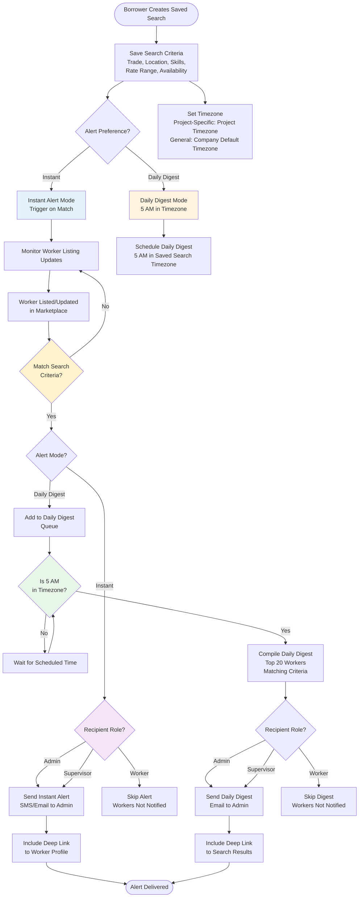
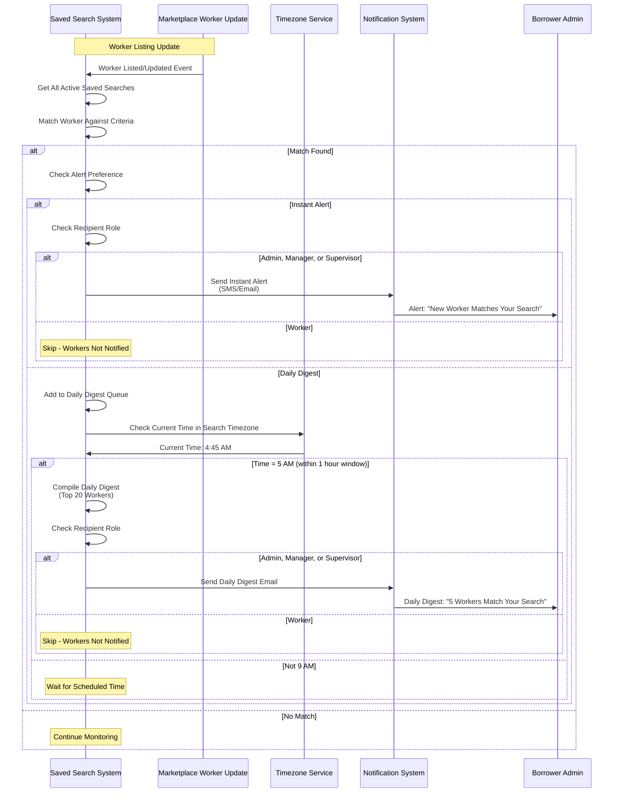

# Epic 3: Marketplace & Search

**Epic Goal:** Build a comprehensive worker search and discovery system that enables borrowers to find qualified workers based on multiple criteria, view availability calendars, and manage saved searches. This epic delivers the core marketplace functionality that connects borrowers with available workers.

## Story 3.1: Worker Search Engine {#story-31-worker-search-engine}

As a Borrowing Admin or Manager,
I want to search for available workers by trade, skills, and location,
so that I can find qualified workers for my projects.

**Acceptance Criteria:**
1. Search endpoint queries database directly with read-optimized SQL for workers where State = 'Listed'
2. Search results display: "Electrician - 5 Yrs Exp" | "Gold Tier Lender" | **"On-Time: 95%"** (replaces generic star ratings)
3. **On-Time Reliability % Metric:** Worker Card displays percentage badge showing: `(Count of Clock-Ins within 5 mins of Start) / (Total Shifts) * 100`
4. **Company-Level Metrics:** Search results and company profiles display company-level metrics for both lender and borrower companies:
   - **Lender Company Metrics:** (a) **Fulfillment Score** - Inverse of Cancellation Rate: `(1 - (Cancelled Bookings / Total Confirmed Bookings)) * 100`. High score means Lender rarely cancels confirmed bookings. Display "Reliable Partner" badge for top tier Lenders (e.g., >95% fulfillment score). (b) **Company On-Time Reliability %** - Aggregate of all workers' on-time percentages: `AVG(Worker On-Time %)` across all workers in the company. (c) **Company Metrics Display:** Lender company metrics are displayed in search results when viewing worker profiles (e.g., "Lender Company: 98% Fulfillment, 92% On-Time Average"). Metrics are also displayed on lender company profile pages.
   - **Borrower Company Metrics:** (a) **Fast Verifier Score** - Average time between Worker Clock Out and Supervisor Verification: `AVG(verified_at - clock_out_time)` across all verified shifts. Display badge visible to Lenders when receiving booking request. Badge tiers: "Fast Verifier" (< 2 hours average), "Quick Approver" (< 4 hours average). (b) **Borrower Company Metrics Display:** Borrower company metrics are displayed to lenders when they receive booking requests or view borrower company profiles. Metrics help lenders assess borrower reliability and payment speed.
   - **Calculation Methodology:** Company metrics are calculated in background jobs and updated daily (not real-time). Metrics aggregate data across all bookings, workers, and shifts for the company. Minimum data threshold: Company metrics require minimum 5 completed bookings before displaying to prevent misleading metrics from new companies.
   - **Metrics Update Frequency:** Metrics are updated daily via background job (not real-time). All workers in a single search result set use the same metrics snapshot (calculated at query time). Metrics may differ between search queries if updated between requests (acceptable behavior). Metrics are "as of" the search query time - slight variations between queries are expected.

**Technical Reference:** See [Background Jobs Blueprint](../architecture/blueprints/system/background-jobs.md) for daily metrics update job implementation details.
   - **Metrics Display Locations:** (a) Search results - Company metrics shown when viewing worker profiles, (b) Company profile pages - Full metrics dashboard, (c) Booking requests - Borrower metrics shown to lenders, (d) Marketplace listings - Lender metrics shown to borrowers.
5. **Visual Trust Badges:** Metrics (On-Time %, Fulfillment Score, Fast Verifier) must be displayed as visual rings or Gold/Silver Tier badges, not just text.
5. Company Name hidden in search results (prevent poaching)
6. Pricing displays All-Inclusive Price (Worker Rate + Service Fee) - e.g., "$65.00/hr"
7. Company Name revealed when User adds worker to Cart
8. Verified Badges displayed (tier badges, metrics) - badges reflect Lender verification of worker, not Platform verification
9. Search supports filtering by: Trade, Zip Code, Availability Dates, **On-Time Reliability % (minimum threshold)**, Experience level (years per skill), Certifications, Availability date range, Rate range (min/max), Distance radius (miles from zip code), Skills (hierarchical/nested). See [Worker Search Engine Blueprint](../architecture/blueprints/marketplace/worker-search-engine.md) for technical query implementation.
10. Search results paginated for performance
11. Borrower Audit Capability: Search results and worker profiles indicate that Borrowers can audit Lender insurance documents during booking checkout as part of due diligence

**Error Handling:**
- **Database Unavailable:** If the database is unavailable, show: "Search service temporarily unavailable. Please try again in a few moments." Retry button provided with status indicator.
- **No Results Found:** If search returns no results, show: "No workers found matching your criteria. Try adjusting your filters or search terms." Suggest removing filters or expanding search radius.
- **Invalid Search Parameters:** If search parameters are invalid (e.g., invalid date range, negative distance), show inline validation: "Invalid search parameters. Please check your filters." Highlight invalid fields.
- **Network Error:** If network error occurs during search, show: "Network error. Please check your connection and try again." Retry button provided.
- **Search Timeout:** If search takes too long (>5 seconds), show inline error with retry button: "Search is taking longer than expected. Try narrowing your filters or [Retry]."
- **Rate Limiting (429):** Show toast notification: "Too many search requests. Please wait a moment before searching again." Auto-dismiss after 5 seconds.
- **Extension Failure:** Show banner: "Search service temporarily unavailable. Please try again in a few moments." Auto-retry after 30 seconds or manual retry button.
- **Degraded Search State:** When geo search is unavailable, show warning banner: "Location-based search is temporarily unavailable. Showing text-only results." Disable geo-related filters (distance radius, zip code search).
- **Filter Validation Errors:** Show inline validation errors below invalid filters with specific error messages (e.g., "Invalid date range", "Distance must be between 1-100 miles").

## Story 3.2: Distance Radius Filtering {#story-32-distance-radius-filtering}

As a Borrowing Admin,
I want to search for workers within a specific distance from a location,
so that I can find workers willing to travel to my job site.

**Acceptance Criteria:**
1. **Per-Worker Configuration:** Travel radius is configured **per-worker** (not per-company). Each worker sets their own home location (zip code) and maximum travel distance (miles) in their worker profile. **Explicit Rule:** Travel radius is worker-specific because company office is in one location, but employees come from all over, and each employee may have their own standards or preferences for travel distance.
2. Worker sets home location (zip code) + Maximum travel distance (miles) in profile
3. **Worker Profile Fields:** Worker profile includes: (a) Home Zip Code field, (b) Maximum Travel Distance field (miles, limited to 100 miles maximum). These fields are editable by the worker (with lender admin oversight if needed).
4. **Workflow for Updating Worker Home Location:** Workers can update their home zip code and travel radius from their profile settings. If worker's home zipcode changes, they can update it, and the system recalculates their availability for existing searches. **Notification:** If worker updates home location significantly (e.g., >50 miles change), system may notify lender admin for verification.
5. Search filter: "Within X miles of [zip code]"
6. System only shows workers whose radius includes search location
7. Distance calculation uses zip code coordinates
8. Workers outside radius excluded from results
9. Distance displayed in search results: "15 miles from [zip code]"
10. **Geo-Availability Search Interaction:** Travel radius per-worker configuration directly impacts geo-availability search. System filters workers based on whether their individual travel radius includes the search location. Workers with smaller travel radii appear in fewer search results, while workers with larger travel radii appear in more search results.

## Story 3.3: Availability Management {#story-33-availability-management}

As a lender admin, manager, or supervisor,
I want to set worker availability patterns and specific date blocks,
so that workers appear in search only when actually available.

**Acceptance Criteria:**
1. Only Users with Admin, Manager (Lender context), or Supervisor role can set worker availability
2. Date range availability: Set start and end dates for availability periods
3. Specific date overrides: Block specific dates for exceptions
4. Availability modes: A) Short-Term (Fixed Date Range), B) Long-Term (Indefinite with Recall Notice - 3 full business days minimum)
5. Calendar view displays available dates
6. System automatically locks dates when booked
7. Availability conflicts prevented (worker cannot be double-booked)

## Story 3.4: Real-Time Availability Check {#story-34-real-time-availability-check}

As a Borrowing Admin,
I want to see accurate worker availability in search results,
so that I can make informed booking decisions.

**Acceptance Criteria:**
1. Workers appear in search results based on their availability settings and existing confirmed bookings
2. Workers remain visible in search results even when added to another user's cart (cart has no reservation power)
3. Day-Based availability: If worker booked for ANY portion of day, entire day is considered unavailable for new bookings
4. Availability is checked in real-time during search queries
5. Final availability validation occurs at checkout (before payment processing)
6. If two users attempt to book the same worker simultaneously, the first to complete payment wins
7. The second user receives a clear error message: "Worker no longer available"
8. Search results exclude workers with confirmed bookings that conflict with requested dates
9. Workers become unavailable in search results only after booking is fully paid and confirmed (status = 'Confirmed')
10. When booking is cancelled or completed, worker becomes available again in search results for those dates

## Story 3.5: Booking Conflict Prevention {#story-35-booking-conflict-prevention}

As a Borrowing Admin or Manager,
I want the system to prevent booking conflicts,
so that I don't accidentally book an unavailable worker.

**Acceptance Criteria:**
1. System validates worker availability at moment of checkout
2. Worker cannot be booked if ANY part of requested dates overlap with existing booking
3. Day-Based: If worker booked for ANY portion of day, entire day blocked
4. UI shows "Unavailable" for conflicting dates in calendar
5. Checkout blocked if conflict detected with clear error message
6. Real-time availability check prevents race conditions

## Story 3.6: Availability Calendar Display {#story-36-availability-calendar-display}

As a Borrowing Admin,
I want to see worker availability in a calendar view,
so that I can easily identify when workers are available.

**Acceptance Criteria:**
1. Worker profile displays availability calendar
2. Calendar shows available dates highlighted
3. Booked dates shown as unavailable/grayed out
4. Date ranges and specific blocked dates clearly marked
6. Calendar supports month view navigation
7. Clicking available date pre-fills booking date range

## Story 3.7: Saved Searches & Alerts {#story-37-saved-searches--alerts}

As a Borrowing Admin or Manager,
I want to save search criteria and receive alerts when matching workers become available,
so that I don't have to repeatedly search for the same criteria.

**Acceptance Criteria:**
1. Borrower can save search criteria (trade, location, skills, filters)
2. Saved searches stored with user preferences
3. Alert options: Daily digest or instant alerts (user preference)
4. System checks for new workers matching saved search criteria
5. SMS/Email alert sent when new worker matching criteria becomes available
6. Alert includes link to view worker profile
7. Borrower can manage saved searches (edit, delete, pause alerts)
8. **Saved Search Creation Options:** Saved searches can be created from project context (automatically project-specific) or from general search (company default timezone). **UI Option:** When saving a search, borrower can choose "Save search for this project" (project-specific) vs "Save search for all projects" (general saved search). **Timezone Handling:** Saved search alerts use borrower's company default timezone (from company settings) for timezone-aware alert scheduling. **Daily Digest Timing:** Daily digest alerts are sent at 5 AM in the borrower's company default timezone. **Explicit Rule:** Daily digest is sent once per day at 5 AM in borrower's company default timezone, including all saved searches (project-specific and general). If borrower has multiple projects in different timezones, project-specific saved searches use the project's timezone for alert scheduling. **Timezone Source Priority:** (1) Project timezone (if saved search is project-specific), (2) Borrower's company default timezone (for general saved searches). Instant alerts are sent immediately regardless of timezone, but daily digest follows the timezone-aware schedule. **Explicit Rule:** Project-specific saved searches use project timezone. General saved searches use company default timezone.

**Saved Search Alert Flow Diagrams:**

**Key Features:**
- **Timezone-Aware Scheduling:** Daily digest sent at 5 AM in saved search timezone (project-specific or company default)
- **Role-Based Filtering:** Only Admin, Manager, and Supervisor roles receive alerts (Workers are not notified)
- **Instant vs Daily Digest:** User preference determines delivery method
- **Deduplication:** System tracks last notified worker IDs to prevent duplicate alerts
- **Project-Specific vs General:** Project-specific searches use project timezone; general searches use company default timezone

## Story 3.8: Overtime Listing Configuration {#story-38-overtime-listing-configuration}

As a lender admin,
I want to configure overtime requirements at listing level,
so that borrowers see transparent pricing including OT when applicable.

**Acceptance Criteria:**
1. Lender configures OT requirements at listing level (e.g., "This worker is at 32 hours; Friday shifts require OT rates")
2. Toggle: Lender identifies if entire shift is OT or partial hours (up to 8 hours) are OT
3. Platform calculates **estimated blended rate** based on inputs and presents single, flat hourly rate to Borrower for marketplace display purposes. **Note:** This is an estimate only - actual OT calculations use the Pre-Authorized Contract model at checkout (see [Story 6.5](./epic-6.md#story-65-overtime-rules-and-calculations)).
4. Borrower sees "High Demand" or "Overtime Included" badge
5. Badge explains why rate is higher without post-booking "Change Order" friction
6. OT configuration visible in worker profile and search results

> **Note:** For complete overtime calculation rules including the Start-Day Rule, booking-scoped calculation, 40-hour threshold logic, and travel time aggregation, see [Epic 6: Overtime Rules](./epic-6.md#story-65-overtime-rules-and-calculations).

**Relationship to Pre-Authorized Contract Model:**

This story describes **marketplace listing-level OT configuration** for display and estimation purposes only. The "flat hourly rate" shown to borrowers in search results is an **estimated blended rate** that helps borrowers understand potential costs before checkout.

**Important:** The actual OT calculation at booking creation follows the **Pre-Authorized Contract Model** (see [Epic 6: Story 6.5](./epic-6.md#story-65-overtime-rules-and-calculations)):
- At checkout, the system snapshots the Lender's actual OT rules (`companies.ot_rule_daily`, `companies.ot_rule_weekly`, `companies.ot_rule_weekend`) and Worker's actual `overtime_rate` (custom dollar amount from `worker_rates.overtime_rate`) into `bookings.ot_terms_snapshot`
- The Borrower must explicitly accept these actual OT terms to create the booking
- OT calculations during time tracking use the `ot_terms_snapshot` stored on the booking, not the listing-level display configuration
- The listing-level configuration is informational only - it helps borrowers understand potential OT costs, but the actual OT terms are determined by the Lender's company settings and worker rates at checkout time

---

## Related Documentation

- [Epic 2: Worker Onboarding & Profile Management](./epic-2.md) - Worker profile creation and listing
- [Epic 4: Booking & Payment Processing](./epic-4.md) - Booking creation from search results
- [Architecture Blueprint: Worker Search Engine](../architecture/blueprints/marketplace/worker-search-engine.md) - Search implementation using PostgreSQL native search with aggregation queries for facets
- [Architecture Blueprint: Availability Management](../architecture/blueprints/marketplace/availability-management.md) - Availability patterns and date blocking
- [Architecture Blueprint: Geo-Availability](../architecture/blueprints/marketplace/geo-availability.md) - Distance-based filtering
- [Architecture Blueprint: Saved Searches & Alerts](../architecture/blueprints/marketplace/saved-searches-alerts.md) - Saved search and alert system
- [Architecture Blueprint: Error Handling](../architecture/blueprints/system/error-handling.md) - Error handling patterns and user messages
- [Data Dictionary: Marketplace Domain](../architecture/data-dictionary-marketplace.md) - Marketplace entity definitions
- [Customer Journey: Borrower Journey](./customer-journey.md#borrower-journey) - End-to-end borrower search and booking workflow

---