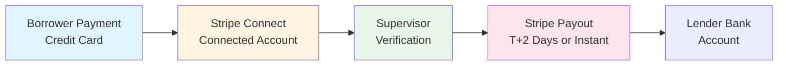
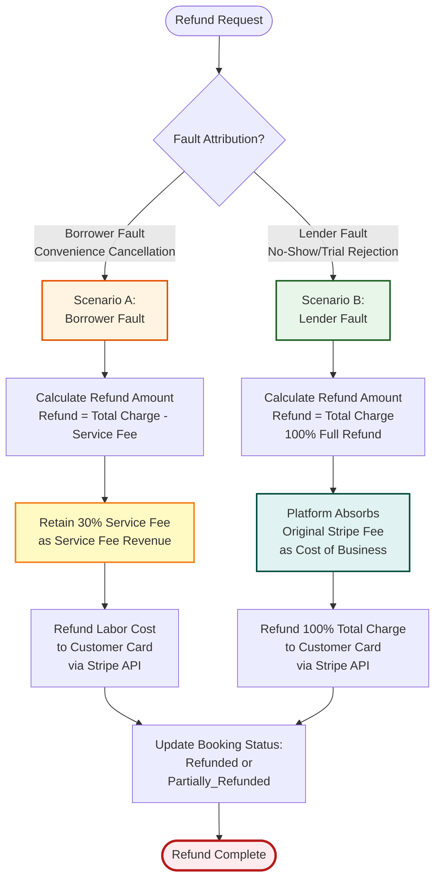
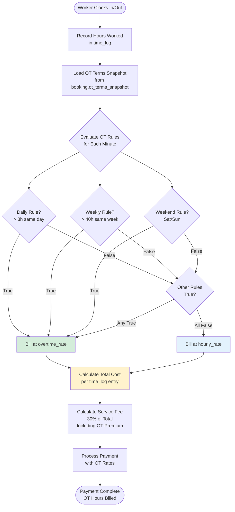

# Epic 6: Financial Operations & Admin

**Epic Goal:** Complete the financial operations layer including direct Stripe payments, refunds, overtime calculations, and comprehensive company dashboard. This epic delivers the financial operations that enable daily payouts and complete financial transparency through direct Stripe-native processing.

## Payment Flow

The following flowchart illustrates the direct Stripe payment flow showing payment processing, verification, and payout:

## Story 6.1: Direct Stripe Payout Processing {#story-61-direct-stripe-payout-processing}

As a system,
I want to process payouts directly to Lender's Stripe Connected Account upon verification,
so that lenders receive daily payouts as promised.

**Acceptance Criteria:**
1. Trigger: Supervisor Verifies Hours (or Auto-Approval 4 hours after clock-out)
2. System calculates worker payout amount: `Worker Rate * Hours Worked`
3. System triggers Stripe Transfer to Lender's Connected Account for the worker payout amount
4. Funds are transferred directly to Lender's Stripe Connected Account balance
5. Booking record updated with payout information: `worker_payout_amount` field populated
6. Payout timing: Immediately upon verification or 4 hours after clock-out (auto-approval). **Explicit Rule:** Auto-approval occurs exactly 4 hours after clock-out regardless of day/time (weekends, holidays included). Once auto-approved, payout is processed and cannot be reversed or disputed. **Timezone Rule:** The 4-hour auto-approval timer calculation uses UTC timestamps for all calculations (stored in database). Clock-out time is stored as UTC timestamp. Auto-approval timer = `clock_out_utc + 4 hours` (UTC calculation). DST transitions do not affect the 4-hour calculation (always exactly 4 hours in UTC). Display times are converted to project timezone for user viewing, but all calculations use UTC internally. **Rationale:** Using UTC for calculations ensures consistent 4-hour intervals regardless of DST transitions, eliminating edge cases where DST "fall back" or "spring forward" could affect timer accuracy.
7. **Auto-Approval Notification:** When auto-approval triggers payout, system sends notification: "Timesheet auto-approved after 4 hours. Supervisor did not verify within required timeframe." **Notification Timing:** Auto-approval notifications are sent immediately when the timer expires, regardless of quiet hours, business hours, weekends, or holidays. The system does not delay notifications based on time of day.
8. **Service Fee Retention:** The Service Fee (30% of Worker Rate) is retained by the platform and not included in the worker payout amount.

**Technical Implementation:** See [Financial Architecture](../architecture/financial-architecture.md) for Stripe Connect payout implementation details.

## Story 6.2: Payment Processing and Service Fee Calculation {#story-62-payment-processing-service-fee}

As a Borrower,
I want to pay for bookings with clear pricing that includes the Service Fee,
so that I understand the total cost upfront.

**Acceptance Criteria:**
1. **Service Fee Calculation:** Service Fee is 30% of Worker Rate, added on top of labor costs
2. **Payment Formula:** `Total Charge = (Worker Rate * Hours) + (Worker Rate * Hours * 0.30)`
   - Example: Worker Rate $50/hr × 8 hours = $400 labor + $120 Service Fee = $520 Total
3. **Booking Record Fields:** System stores in `bookings` table:
   - `total_amount` (BIGINT, in cents) - The full charge amount ($520.00 = 52000 cents)
   - `service_fee_amount` (BIGINT, in cents) - The 30% service fee portion ($120.00 = 12000 cents)
   - `worker_payout_amount` (BIGINT, in cents) - The labor portion ($400.00 = 40000 cents)
4. **Payment Processing:** System charges the full `total_amount` to Borrower's credit card via Stripe
5. **Funds Flow:** Payment goes directly to Stripe Connect Connected Account
6. **Service Fee Retention:** The Service Fee (30%) is retained by the platform as revenue
7. **Worker Payout:** The `worker_payout_amount` is transferred to Lender's Stripe Connected Account upon verification (see Story 6.1)
8. **Payment Failure Handling:** If payment fails, booking status transitions to `Cancelled` and worker remains available

**Example Calculations:**

**Example 1: Standard Booking**
- **Worker Rate:** $50.00/hour
- **Hours:** 8 hours
- **Labor Cost:** $50.00 × 8 = $400.00
- **Service Fee (30%):** $400.00 × 0.30 = $120.00
- **Total Charge:** $400.00 + $120.00 = $520.00
- **Stored Values:**
  - `total_amount`: 52000 cents
  - `service_fee_amount`: 12000 cents
  - `worker_payout_amount`: 40000 cents

**Example 2: Weekly Progress Payment**
- **Worker Rate:** $35.00/hour
- **Hours per Week:** 40 hours
- **Weekly Labor Cost:** $35.00 × 40 = $1,400.00
- **Service Fee (30%):** $1,400.00 × 0.30 = $420.00
- **Weekly Total Charge:** $1,400.00 + $420.00 = $1,820.00

## Story 6.3: Withdrawals and Payouts {#story-63-withdrawals-and-payouts}

As a lender admin,
I want to withdraw funds from my Stripe Connected Account to my bank account,
so that I can access my earnings.

> **Role Restriction:** Only Lending Admin can access financial dashboard and withdraw funds. Manager role cannot access financial dashboard, view available balance, or initiate withdrawals (Admin only). See [RBAC Acceptance Criteria](./rbac-acceptance-criteria.md) for complete permission matrix.

**Acceptance Criteria:**
1. Withdrawal Action: Payouts not automatic, Lending Admin must manually click "Withdraw Funds" in dashboard
2. Payout Speed Options: Standard (T+2 Days) or Instant Payout (1.5% Fee, deducted from total)
3. **Withdrawal Timing Definition:** "T" = The timestamp the user clicks "Withdraw". "+2 Days" = 2 **Business Days** (banking days, Monday-Friday excluding holidays)

**Timezone for T+2 Calculation:**
- "T" (withdrawal request timestamp) is calculated in the **company's default timezone** (from `companies.default_timezone` or company's jurisdiction timezone if default not set)
- Business days calculation uses the company's timezone to determine Monday-Friday boundaries
- Holiday exclusions use the company's jurisdiction holiday calendar (from `jurisdictions` table)
- **Rationale:** Withdrawals are company-level financial operations, so company timezone is authoritative (not project timezone, which applies to booking-specific operations)
- **Example:** If company is in America/Chicago timezone and withdrawal is requested on Friday 11:00 PM CST, T+2 = Tuesday (Monday is first business day, Tuesday is second business day). If withdrawal is requested on Friday 11:00 PM CST but company timezone is America/Los_Angeles (9:00 PM PST), the calculation uses PST, so Friday 9:00 PM PST → T+2 = Tuesday (same result in this case, but timezone matters for edge cases near midnight)
- See [Timezone Handling](../architecture/timezone-handling.md) for complete timezone handling specifications

4. System triggers Stripe Connect Express Manual Payout from Lender's Connected Account balance → Lender's Connected Bank Account. **Note:** Funds are already in the Lender's Stripe Connect balance, so payout is from their Connected Account, not from Platform Account.
5. Withdrawal transaction recorded in system for audit purposes.
6. Lender's Stripe Connected Account balance decreased by withdrawal amount
7. Withdrawal history queryable in dashboard
8. Just-in-Time KYC: Strict Identity Verification (Passport/SSN via Stripe Identity) triggered when withdrawing funds (if not already completed). Stripe handles all KYC/KYB requirements - Platform does NOT handle sensitive identity documents.

**Error Handling:**
User-facing error messages for withdrawal scenarios are defined in the [Error Message Catalog](../architecture/error-message-catalog.md). Key error scenarios include:
- Insufficient balance
- KYC verification required
- KYC verification failures
- Withdrawal processing failures
- Payment service unavailability
- Bank account not connected
- Instant payout unavailability

**Technical Reference:** See [Error Message Catalog](../architecture/error-message-catalog.md) for complete user-facing error messages and [Error Handling Blueprint](../architecture/blueprints/system/error-handling.md) for technical error handling implementation details.

## Story 6.4: Refund Logic (Stripe-Native Processing) {#story-64-refund-logic-stripe-native-processing}

As a Borrowing Admin,
I want refunds processed directly to my payment method via Stripe,
so that I receive refunds quickly and transparently.

> **Role Restriction:** Only Borrowing Admin can request refunds. Manager role cannot request refunds or access financial reports (Admin only). See [RBAC Acceptance Criteria](./rbac-acceptance-criteria.md) for complete permission matrix.

## Refund Logic Decision Tree

The following decision tree illustrates the simplified Stripe-native refund logic with two clear scenarios:

### Key Decision Points Explained

1. **Fault Attribution:** Determines which scenario applies
   - **Borrower Fault:** Convenience cancellations initiated by the borrower
   - **Lender Fault:** No-show, trial rejection, or lender-initiated cancellations
2. **Service Fee Handling:**
   - **Scenario A:** Service Fee (30%) is retained by the platform as revenue
   - **Scenario B:** Service Fee is refunded along with labor (100% full refund)
3. **Refund Processing:** All refunds go directly to the customer's payment method (card) via Stripe API
4. **Stripe Fees:** Never mentioned to users. Handled internally as operational expenses

**Acceptance Criteria:**

### Scenario A: Borrower Fault (Convenience Cancellation)

1. **Refund Calculation:** `Refund Amount = Total Charge - Service Fee`
   - Service Fee (30%) is retained by the platform as revenue
   - Only the labor cost portion is refunded to the customer
2. **Refund Processing:** Refund is processed directly to the customer's payment method (card) via Stripe API
3. **Booking Status:** Booking status updated to `Refunded` or `Partially_Refunded` as appropriate
4. **Service Fee Revenue:** The 30% Service Fee covers the platform's Stripe processing expense and generates profit

**Example - Scenario A:**
- **Total Charge:** $520.00 (Worker Rate $400 + Service Fee $120)
- **Service Fee (30%):** $120.00 (retained by platform)
- **Refund Amount:** $520.00 - $120.00 = $400.00 (refunded to customer's card)
- **Service Fee Revenue:** $120.00 (Service Fee retained)

### Scenario B: Lender Fault / No-Show / Trial Rejection

1. **Refund Calculation:** `Refund Amount = Total Charge` (100% Full Refund)
   - Customer receives the complete refund including both labor and Service Fee
2. **Refund Processing:** Refund is processed directly to the customer's payment method (card) via Stripe API
3. **Booking Status:** Booking status updated to `Refunded`
4. **Platform Cost:** Platform absorbs the original Stripe processing fee as a cost of doing business

**Example - Scenario B:**
- **Total Charge:** $520.00 (Worker Rate $400 + Service Fee $120)
- **Refund Amount:** $520.00 (100% full refund to customer's card)
- **Platform Cost:** Platform absorbs original Stripe processing fee (not shown to user)

### General Refund Rules

#### Refund Processing Rules

**No User-Facing Stripe Fees:** Stripe processing fees are never mentioned to users. They are internal operational expenses paid from the Service Fee (Scenario A) or absorbed as business costs (Scenario B).
6. **Direct Stripe Processing:** All refunds go directly to the customer's payment method via Stripe API.
7. **Status Tracking:** Booking status fields (`status: 'Refunded'` or `'Partially_Refunded'`) track refund status.
**Refund Timing:** Refunds are processed immediately upon cancellation request via Stripe API (no holding period - direct refund to payment method).

#### Refund Logic: Short-Term vs. Long-Term Bookings
   >
   > **1. Short-Term Bookings (Fixed Date Range)**
   > *   **Concept:** Reservation Model.
   > *   **Past/Verified Shifts:** No Refund.
   > *   **24-Hour Notice Calculation:** Notice period = Time from cancellation timestamp to start time of next scheduled shift (in project timezone). **Multi-Shift Day Handling:** If multiple shifts are scheduled on the same day, each shift is evaluated independently for 24-hour notice. The notice period is calculated from the cancellation timestamp to the start time of each individual shift. **Explicit Rule:** Each shift on a multi-shift day is treated as a separate entity for notice calculation and penalty purposes. (1) **Cancellation After First Shift Starts (Before Second Shift):** If cancellation occurs after the first shift has started or completed but before the second shift starts, the first shift is paid 100% (already started/completed). The second shift is evaluated independently for 24-hour notice from the cancellation timestamp. If < 24 hours notice to second shift start, late cancellation penalty applies to the second shift only. (2) **Mid-Day Cancellation Between Shifts:** If cancellation occurs between shifts on the same day (e.g., cancel at 12:30 PM, morning shift 7 AM-12 PM completed, afternoon shift 1 PM-5 PM), the completed shift is paid 100%, and the upcoming shift is evaluated for 24-hour notice. (3) **Penalty Calculation for Multi-Shift Days - Clarified:** The late cancellation penalty (50% rule) is calculated based on the **first shift rate scheduled for that day** (regardless of whether that shift has been completed). **Explicit Rule:** The penalty always uses the first shift rate of the day (chronologically), regardless of whether that shift has been completed. This ensures consistent penalty calculation regardless of cancellation timing. "First shift rate" refers to the first shift scheduled chronologically for that day, not the first cancelled shift. If the first shift of the day has already been completed when cancellation occurs, the penalty still uses the first shift's rate, but applies to the next scheduled shift that is being cancelled. **Penalty Application:** The penalty applies only to the first shift being cancelled on that day (not to each cancelled shift individually). If multiple shifts are cancelled on the same day, only one penalty is applied using the first shift rate. **Examples:**
   >     - **Example A - Cancellation Before First Shift:** Morning shift 7 AM-12 PM ($140), Afternoon shift 1 PM-5 PM ($140). Cancel at 6:00 AM (before first shift). First shift cancelled < 24h before start (6:00 AM to 7:00 AM = 1 hour notice). Penalty = 50% of first shift rate = 50% × $140 = $70 to lender, $70 refunded to borrower. Second shift also cancelled, but no additional penalty (penalty applies only to first cancelled shift). Remaining future days refunded 100%.
   >     - **Example B - Cancellation After First Shift Completed:** Morning shift 7 AM-12 PM ($140, completed), Afternoon shift 1 PM-5 PM ($140). Cancel at 12:30 PM (after morning shift completed, before afternoon shift). Morning shift paid 100% ($140 - already completed). Afternoon shift cancelled < 24h before start (12:30 PM to 1:00 PM = 30 minutes notice). Penalty = 50% of first shift rate of the day = 50% × $140 = $70 to lender, $70 refunded to borrower. Note: Even though the first shift was already completed, the penalty calculation uses the first shift's rate ($140) and applies it to the afternoon shift cancellation. Remaining future days refunded 100%.
   >     - **Example C - Cancellation After Both Shifts Completed:** Morning shift 7 AM-12 PM ($140, completed), Afternoon shift 1 PM-5 PM ($140, completed). Cancel at 6:00 PM (after both shifts completed). Both shifts paid 100% (already completed). No penalty applies (no future shifts cancelled on this day). Remaining future days refunded 100%.
   > *   **Current Day Payout Rule:**
   >     *   **Current Day Definition:** Current day = Day containing cancellation timestamp (in project timezone). For shifts spanning midnight, the day containing shift start time is the "current day" for that shift.
   >     *   **Cancellation During Active Shift (Worker Clocked In):** Current shift is paid 100% (minimum billable hours apply). Late cancellation penalty applies only to future shifts, not the active shift.
   >     *   **Cancellation Exactly at Shift Start Time (00:00:00 or shift start time):** Treated as "before shift start" - 24-hour notice rule applies. If < 24 hours notice, late cancellation penalty applies to that shift.
   >     *   **Cancellation After Shift Start Time (Project Timezone):** Paid 100% (Minimum Billable Hours apply). If cancellation occurs < 24 hours before next scheduled shift, late cancellation penalty applies to next shift only.
   >     *   **Cancellation Before Shift Start Time:** 
   >         *   If ≥ 24 hours notice to shift start: Paid 100% (no penalty)
   >         *   If < 24 hours notice to shift start: Paid 100% PLUS late cancellation penalty (50% of first day rate to lender, remainder refunded to borrower)
   > *   **Future Days:** 
   >     *   If cancellation occurs ≥ 24 hours before first future day: Borrower refunded 100% to payment method via Stripe API
   >     *   If cancellation occurs < 24 hours before first future day: 50% penalty applies only to FIRST future day (50% to lender, 50% refunded to borrower). Remaining future days refunded 100% to borrower via Stripe API. Lender receives 50% of first future day rate (capped at 5 days' worth total cancellation fees across all future days).
   >
   > **2. Long-Term Bookings (Indefinite / Weekly Progress)**
   > *   **Concept:** Reciprocal Notice Model.
   > *   **Policy:** Borrower must provide notice equal to the `termination_notice_days` (Default: 3 Business Days).
   > *   **24-Hour Notice Calculation:** Same as short-term bookings - notice period = Time from cancellation timestamp to start time of next scheduled shift (in project timezone). **Multi-Shift Day Handling:** Same as short-term bookings - each shift is evaluated independently for 24-hour notice. If multiple shifts are scheduled on the same day, each shift is treated as a separate entity for notice calculation and penalty purposes. See Short-Term Bookings section above for complete multi-shift day handling rules and examples. This applies to current day and future days within the funded week.
   > *   **Current Day Payout Rule (Same as Short-Term):**
   >     *   **Current Day Definition:** Current day = Day containing cancellation timestamp (in project timezone). For shifts spanning midnight, the day containing shift start time is the "current day" for that shift.
   >     *   **Cancellation During Active Shift:** Current shift is paid 100% (lending company's minimum billable hours apply - see definition above). Late cancellation penalty applies only to future shifts.
   >     *   **Cancellation Before/At Shift Start:** If ≥ 24 hours notice, paid 100% (no penalty). If < 24 hours notice, paid 100% PLUS late cancellation penalty.
   > *   **Future Days of Funded Week:**
   >     *   If cancellation occurs ≥ 24 hours before first future day: Refunded 100% to borrower via Stripe API
   >     *   If cancellation occurs < 24 hours before first future day: 50% penalty applies only to FIRST future day, remaining future days of funded week refunded 100% via Stripe API
   > *   **Cancellation Workflow (Convenience):** When Borrower initiates cancellation, they select:
   >     *   *Option A (Work the Notice):* Booking End Date is set to `Today + Notice Days`. Worker continues to work; standard verification applies. 24-hour notice rule applies to current day only; notice period forfeiture is separate logic.
   >     *   *Option B (Immediate Release - Contract Buyout):* Booking ends Today.
   >         *   **Part A: Today (Operational Penalty):** The current day is processed according to the **24-Hour Notice Rule** (see Short-Term logic). If cancelled mid-shift or < 24h before start, the Borrower pays for Today.
   >         *   **Part B: Future (Notice Period Forfeiture):** The system calculates the cost of the next `X` Business Days (defined by `termination_notice_days`, starting *Tomorrow*).
   >         *   **Funding Logic:**
   >             1.  **Calculate Notice Period Cost:** This amount is calculated from the current funded week's remaining funds.
   >             2.  **Termination Charge:** If the Notice Period extends into a future week that has *not* yet been paid (e.g., cancellation on Friday, notice covers Mon/Tue), the system creates an immediate **"Contract Termination Charge"** to the Borrower's payment method for the difference.
   >         *   **Result:** The Lender receives the full Notice Period pay immediately via Stripe transfer. The Borrower receives a refund of any *remaining* funds beyond the notice period via Stripe API.
11. **Service Fee Calculation:** The Service Fee (30% of Worker Rate) is calculated simply as 30% of the labor cost. For refunds, the Service Fee is either retained (Borrower Fault) or refunded (Lender Fault) based on the fault attribution as described in Story 6.4.

12. **Dispute Settlement Integration:** Chat-based dispute resolution (see Story 5.10) integrates with direct Stripe processing. **Detailed Workflow:** (1) Dispute filed → Funds held via Stripe escrow/hold for disputed shift, (2) Admins negotiate in chat interface with system-injected evidence, (3) When admins agree on resolution in chat, Super Admin is notified, (4) Super Admin processes resolution → Stripe transfer/refund executed per agreement: X% to Lender's Stripe Connected Account, Y% refunded to Borrower's payment method via Stripe API, (5) Resolution amounts override standard refund calculations - if resolution is for 50% of hours, the other 50% goes to lender (not refunded to borrower unless resolution specifies otherwise), (6) Dispute resolution interacts with weekly payment refunds - if dispute occurs during weekly payment period, resolution applies to the specific disputed shift only, remaining shifts follow standard refund logic. **Original Booking Amount Handling:** When dispute is resolved, the original booking amount is split according to resolution terms agreed in chat. If resolution is for partial hours (e.g., 50%), the system reflects: (Resolved Amount to Lender) + (Remaining Amount Refund to Borrower) = Original Booking Amount. Resolutions can specify any split percentage, and Super Admin executes the Stripe transfer/refund after reviewing evidence and chat agreement. **Dispute Resolution Independence from Cancellation Penalties:** Disputed shift resolution is calculated independently from cancellation penalties. When a dispute occurs and future shifts are cancelled, the disputed shift resolution (e.g., 50% to lender, 50% refunded to borrower per chat agreement) is processed separately from cancellation penalties for future weeks (which follow standard refund logic: 50% rule for short-term or notice period for long-term). Both amounts are held via Stripe escrow/hold during dispute resolution. Resolution applies only to the disputed shift; cancellation penalties follow standard refund logic independently. **Explicit Rule:** Dispute resolution and cancellation penalties are decoupled - they are calculated separately and both held via Stripe escrow/hold until dispute resolution is complete. All funds are held via Stripe's escrow/hold functionality, not an internal system.
13. **Dispute vs. Cancellation Separation (Fork in the Road):** The "Fork in the Road" decision at dispute filing determines whether disputes and cancellations are coupled or separated. **Option A (Dispute Shift Only):** Disputes and cancellations are decoupled - only that shift's funds are held. Future shifts continue normally. The booking remains `Active` with the disputed shift in `Disputed` state. Worker can continue clocking in for future shifts. **Option B (End Booking & Dispute):** Disputes and cancellations are coupled - booking is immediately cancelled, worker released, and both disputed shift funds AND cancellation penalty are held. **Cancelling Future Shifts Separately (Option A Only):** If Option A was selected and borrower later cancels future shifts separately, standard cancellation policy applies (50% penalty for short-term, notice period for long-term). Disputed shift funds remain held until dispute resolution. **Lender Cancels Future Shifts:** 100% refund of future days to Borrower via Stripe API (no penalty, but may incur Reliability Strike). **Borrower Cancels Future Shifts:** Standard penalty rules apply (50% penalty for short-term, notice period for long-term). If Incident Report filed, dispute resolution applies instead of automatic penalty. **Explicit Rule:** The fork decision determines whether dispute and cancellation are coupled (Option B) or separated (Option A). Option A allows fighting over money without firing the worker. Option B immediately fires the worker and holds all funds. A dispute is about *past* money (e.g., "You worked 6 hours, not 8"). A cancellation is about *future* work (e.g., "Don't come back tomorrow"). With Option A, these are separate actions with separate financial logic. With Option B, they are combined.
14. **Disputed Cancellation Protocol (Fee Escrow):**
    *   **Standard Cancellation:** Borrower cancels → Penalty (50% or Notice Period) calculated → **Released to Lender immediately**.
    *   **Disputed Cancellation (Option B - End Booking & Dispute):**
        *   **Trigger:** Supervisor selects Option B (End Booking & Dispute) when filing a dispute. Booking is immediately cancelled, future shifts removed, worker released.
        *   **Financial Logic (Total Freeze):** The system calculates and freezes: `Cost of Disputed Shift` + `Cancellation Penalty` (based on standard Cancellation Policy in Epic 6). The calculated Cancellation Penalty/Notice Fee is **HELD** along with the Disputed Shift funds, not paid to the Lender immediately, and not refunded to the Borrower. **Explicit Rule:** Total Freeze = Disputed Shift value + Cancellation Penalty. Both amounts are held in Escrow until dispute resolution.
        *   **Cancellation Penalty Calculation:** 
            - **Short-Term Bookings:** 50% penalty for first future day (based on 24-hour notice rule)
            - **Long-Term Bookings:** Notice period forfeiture (next X business days based on `termination_notice_days`)
        *   **Resolution:** The Dispute Resolution chat negotiates the release of *two* amounts:
            1.  The Disputed Shift funds (current shift in dispute).
            2.  The frozen Cancellation Fee (penalty for cancelled future shifts).
        *   **Result:** This ensures that if the Borrower proves the Lender was at fault (e.g., unsafe behavior), the Borrower does not pay the Early Cancellation Fee. Both disputed shift funds and cancellation penalty are resolved together in the dispute resolution workflow.
    *   **Option A (Dispute Shift Only):** If Option A is selected, booking remains `Active` and no cancellation occurs, so no cancellation penalty applies. Only disputed shift funds are frozen.
15. **Cancellation Dispute Protocol (Termination for Cause - Total Freeze Rule):**
    *   **Trigger:** Booking is terminated via Incident Report (For Cause) - see [Story 4.9: Incident Reporting & Termination](../prd/epic-4.md#story-49-incident-reporting-termination). Supervisor must choose Option A or Option B in the "Fork in the Road" modal.
    *   **Option A (Dispute Shift Only):** Booking remains `Active`, only current shift funds frozen. No cancellation penalty applies.
    *   **Option B (End Booking & Dispute) - Total Freeze Rule:** When Option B is selected, **ALL** associated funds are **HELD**. This includes:
        *   The Current Shift value (Actuals or Min Billable, whichever applies based on shift status at termination).
        *   The Cancellation Penalty for future days (50% Rule for Short-Term bookings OR Notice Period Pay for Long-Term bookings).
    *   **Financial Security:** *Neither* party receives these funds until the dispute is resolved. The entire amount is subject to chat-based negotiation in the Dispute Resolution chat (see [Story 5.10: Dispute Resolution](../prd/epic-5.md#story-510-dispute-resolution-chat-based-resolution)).
    *   **Resolution:** The Dispute Resolution chat negotiates the release of the frozen funds. Admins discuss and agree on resolution terms in chat. Funds remain frozen until: (a) Admins agree in chat and Super Admin processes resolution (Stripe transfer/refund per agreement), or (b) Super Admin manually resolves based on evidence review.
    *   **Explicit Rule:** Termination for Cause via Incident Report with Option B selected triggers a complete financial freeze. All funds (current shift + cancellation penalties) are held via Stripe escrow/hold and subject to dispute resolution. No automatic releases occur until the dispute is fully resolved. If Option A is selected, only current shift funds are held via Stripe escrow/hold and booking continues.
16. **Insurance Revocation Refund Logic (Fault-Based):** When insurance expires or is revoked during an active booking, refund calculations are based on who caused the insurance failure (fault-based model). This implements the "Trust but Audit" approach where workers are notified to leave but shifts aren't digitally severed, allowing safe site shutdown. Financial liability is determined by fault attribution. **Scenario A: Lender Fault (Lender revoked/expired insurance):** (a) **Billing:** Borrower pays ONLY for actual hours worked (based on the manual Clock Out time recorded by the worker). No minimum billable hours apply - only actual time worked is charged. (b) **Refund:** Borrower receives 100% refund of all unspent funds (remainder of current day + all future days) via Stripe API. This includes any funds for the current day that weren't worked, plus all future days in the funded period. **Scenario B: Borrower Fault (Borrower revoked/expired insurance):** (a) **Billing:** Borrower is charged for the **Full Current Day** using the lending company's minimum billable hours (or scheduled duration, whichever is greater) as a disruption fee. This applies even if the worker clocked out early due to the insurance revocation. (b) **Early Cancellation Fee:** For cancelled future shifts, the Lending Company Admin-defined early cancellation fee applies. This fee is separate from the disruption fee and is charged because the Borrowing Company is at fault for the insurance expiration. The early cancellation fee is configured by each Lending Company Admin in Company Settings and applies to all cancelled future shifts when Borrower Fault is determined. (c) **Refund:** Borrower receives 100% refund of *Future* days only, minus the early cancellation fee, via Stripe API. The current day disruption fee is not refunded. **Fault Attribution:** System determines fault based on which company's insurance expired or was revoked. If Lender's insurance expires/revoked → Lender Fault (Scenario A). If Borrower's insurance expires/revoked → Borrower Fault (Scenario B). **Explicit Rule:** Fault-based refund logic applies to all insurance revocation scenarios, regardless of whether the revocation occurs during a funded period or at booking creation. The system tracks which company's insurance triggered the `Insurance_Hard_Stop` event to determine fault attribution. For Borrower Fault scenarios, both the disruption fee (current day) and early cancellation fee (future days) apply.
17. **Mid-Week Cancellation Calculation (Borrower Convenience):** For Borrower Convenience cancellations during weekly progress payment bookings, the system uses the following exact refund formula: (1) **Lender Payout:** Lender receives actuals worked (hours already verified/worked) + Cancellation Penalty (50% rule for short-term bookings or Notice Period forfeiture for long-term bookings). (2) **Service Fee:** Platform **RETAINS** the 30% Service Fee on the total transaction amount. The Service Fee is retained on all components of the transaction, not just the work portion. (3) **Borrower Refund:** Borrower receives (Total Charge) - (Actuals Worked) - (Cancellation Penalty) - (Service Fee). Refund is processed directly to the customer's payment method via Stripe API. **Explicit Rule:** Service Fee retention applies to the entire transaction value, ensuring the platform retains its 30% fee on work, penalties, and refunded amounts combined. This maintains consistent fee retention across all cancellation scenarios.

**Error Handling:**
User-facing error messages for refund scenarios are defined in the [Error Message Catalog](../architecture/error-message-catalog.md). Key error scenarios include:
- Refund processing failures
- Invalid refund requests
- Card refund processing failures
- Refund calculation errors

**Business Rule:** If a card refund fails, the system retries the refund and notifies the borrower. All refunds are processed directly via Stripe API.

**Technical Reference:** See [Error Message Catalog](../architecture/error-message-catalog.md) for complete user-facing error messages and [Error Handling Blueprint](../architecture/blueprints/system/error-handling.md) for technical error handling implementation details.

**Refund Calculation Scenarios & Examples {#refund-calculation-scenarios--examples}:**

The following examples demonstrate the simplified two-scenario refund logic using direct Stripe processing.

#### Example 1: Borrower Fault - Convenience Cancellation (Scenario A)

**Context:** Borrower-initiated cancellation. Service Fee (30%) is retained by the platform.

**Booking Details:**
- **Worker Rate:** $50.00/hour
- **Hours:** 8 hours
- **Labor Cost:** $50.00 × 8 = $400.00
- **Service Fee (30%):** $400.00 × 0.30 = $120.00
- **Total Charge:** $400.00 + $120.00 = $520.00

**Refund Calculation (Scenario A):**
- **Total Charge:** $520.00
- **Service Fee (30%):** $120.00 (retained by platform as revenue)
- **Refund Amount:** $520.00 - $120.00 = $400.00
- **Refund Processing:** $400.00 refunded directly to customer's card via Stripe API
- **Service Fee Revenue:** $120.00 (Service Fee retained)

#### Example 2: Lender Fault - No-Show / Trial Rejection (Scenario B)

**Context:** Lender-initiated cancellation (no-show, trial rejection). Customer receives 100% full refund.

**Booking Details:**
- **Worker Rate:** $50.00/hour
- **Hours:** 8 hours
- **Labor Cost:** $50.00 × 8 = $400.00
- **Service Fee (30%):** $400.00 × 0.30 = $120.00
- **Total Charge:** $400.00 + $120.00 = $520.00

**Refund Calculation (Scenario B):**
- **Total Charge:** $520.00
- **Refund Amount:** $520.00 (100% full refund to customer's card)
- **Refund Processing:** $520.00 refunded directly to customer's card via Stripe API
- **Platform Cost:** Platform absorbs original Stripe processing fee as cost of doing business (not shown to user)

---

**Note:** All refund scenarios follow the two-scenario approach described above. The system determines fault attribution (Borrower Fault vs Lender Fault) and applies the appropriate refund logic accordingly. All refunds are processed directly through Stripe API to the customer's payment method. The examples above demonstrate the core logic; edge cases (partial refunds, multi-week bookings, etc.) follow the same two-scenario pattern based on fault attribution.

**Technical Implementation:** See [Financial Architecture](../architecture/financial-architecture.md) for Stripe-native refund processing implementation details.

## Story 6.5: Overtime Rules and Calculations {#story-65-overtime-rules-and-calculations}

As a system,
I want to calculate overtime based on pre-authorized contract terms stored at booking creation,
so that Borrowers agree to OT rates upfront and calculations are transparent and booking-scoped.

**Acceptance Criteria:**
1. **Pre-Authorized Contract Model:** At checkout, system snapshots OT rules from Lender's company settings (`companies.ot_rule_daily`, `companies.ot_rule_weekly`, `companies.ot_rule_weekend`) and Worker's `overtime_rate` from `worker_rates` table into `bookings.ot_terms_snapshot` JSONB field. Borrower must explicitly accept these terms to create booking. **Explicit Rule:** `ot_terms_snapshot` must be populated at checkout before booking creation. Structure: `{ "daily_rule": boolean, "weekly_rule": boolean, "weekend_rule": boolean, "ot_rate": number }`. **Critical:** The system does NOT use a 1.5x multiplier or any platform-calculated multiplier. The `ot_rate` value is a specific dollar amount that comes directly from `worker_rates.overtime_rate` (e.g., $52.50), not a calculated percentage of the hourly rate.
2. **OT Calculation Uses Snapshot:** OT calculation uses `ot_terms_snapshot` from the booking, not current company settings. This ensures terms cannot change mid-booking. **Explicit Rule:** If `ot_terms_snapshot` is null (legacy bookings), system uses standard `hourly_rate` only (no OT calculation).
3. **Booking-Scoped Calculation:** Overtime is calculated per booking (Booking-Worker-Week), not aggregated across multiple borrowers. Each booking has independent OT calculation based on its own `ot_terms_snapshot`. **Explicit Rule:** Hours are NOT aggregated across different bookings or different Borrowers. All calculations must be scoped to the Booking (Borrower-Worker pair). Do NOT aggregate hours across multiple Borrowers to determine OT thresholds. Each booking's time_log entries are evaluated independently.
4. **OT Rule Evaluation:** For each minute in a `time_log`, system evaluates against `ot_terms_snapshot`:
   - **Daily Rule:** If `daily_rule = true` AND worker has worked > 8 hours in the same day (within this booking), minute is billed at `overtime_rate`
   - **Weekly Rule:** If `weekly_rule = true` AND worker has worked > 40 hours in the same week (Mon-Sun, Project Timezone, within this booking), minute is billed at `overtime_rate`
   - **Weekend Rule:** If `weekend_rule = true` AND the minute falls on Saturday or Sunday (Project Timezone), minute is billed at `overtime_rate`
   - **Priority Logic:** If a minute satisfies ANY true condition (daily, weekly, or weekend), it is billed at `overtime_rate`. If multiple conditions are true, still billed at `overtime_rate` (no double-counting). If no conditions are met, minute is billed at `hourly_rate` from `worker_rates`.
5. **No Blocking Logic:** System does NOT block worker from clocking in. Borrower pre-authorized OT terms at checkout, so worker can always clock in and hours are calculated according to pre-agreed terms. **Explicit Rule:** No notifications, no soft caps, no unlock workflows. Calculation happens automatically based on `ot_terms_snapshot`.
6. **Start-Day Rule:** Overtime calculations use the 'Start-Day Rule' as defined in the [Financial Data Dictionary](../architecture/data-dictionary-financial.md). A shift belongs entirely to the day (and week) it **Starts**. Example: Shift starts Saturday 11:00 PM (Week 1) and ends Sunday 7:00 AM (Week 2). All 8 hours count toward **Week 1** for overtime calculations within that booking.
7. **Cross-Week Bookings:** Week resets Sunday 12:01 AM (Project Timezone). Bookings spanning weeks are calculated separately per week using the Start-Day Rule. Each week within a booking is evaluated independently for weekly rule (> 40 hours).
8. **Travel Time Overtime Calculation:** Travel hours are treated the same as labor hours for overtime calculation within the booking. Travel hours count toward daily and weekly thresholds. If travel time satisfies OT rules (daily > 8h, weekly > 40h, or weekend), it is billed at `overtime_rate`. **Travel Time Eligibility:** Travel time is ONLY paid when a worker is assigned to two different projects for the same borrower company. See [Epic 5: Story 5.3](./epic-5.md#story-53-travel-time-tracking) for complete travel time eligibility rules.
9. **Rate Validation:** At checkout, if `company.ot_rate_type = 'Custom_Rate'`, system validates that `worker_rates.overtime_rate` is not null. If validation fails, booking creation is blocked with error message: "Worker must have overtime rate configured for this company." **Explicit Rule:** Lenders configure custom OT rates per worker in the `worker_rates` table. These are specific dollar amounts (e.g., $52.50), not multipliers or calculated percentages. The system does NOT calculate OT rates as a percentage of the hourly rate.

## Story 6.5: Overtime Rules and Calculations {#story-65-overtime-rules-and-calculations}
- **Verification:** The per-day allocation ensures that fees are properly distributed: $252 ÷ 7 days = $36.00/day, and the sum of all daily fees equals the weekly total.

**Total Refund Breakdown:**
- **Week 3 Future Days Labor Refund:** $1,200 (to borrower via Stripe API)
- **Service Fee Retained:** $180.00 (from 5 cancelled days in Week 3)
- **Total Refund to Borrower:** $1,200 (labor only)

#### Example 4: Multi-Shift Day Fee Allocation (Per-Day vs Per-Shift Clarification)

**Context:** This example demonstrates Service Fee calculation for multi-shift days.

**Booking Details:**
- **Booking Type:** Short-Term, Fixed Date Range
- **Start Date:** Monday, February 10, 2026
- **Cancellation Date:** Monday, February 10, 2026, 12:30 PM (after morning shift, before afternoon shift)
- **Worker Rate:** $35/hour
- **Hours per Shift:** 5 hours
- **Shift Rate:** $175/shift
- **Daily Rate (2 shifts):** $350/day
- **Service Fee:** 30% ($105.00/day for 2-shift days)

**Schedule:**
- **Monday, Feb 10:**
  - Morning shift: 7:00 AM - 12:00 PM ($175, completed)
  - Afternoon shift: 1:00 PM - 6:00 PM ($175, cancelled)
- **Tuesday-Sunday:** Single shift per day, $175/day

**Service Fee Calculation (Per-Day Basis):**
- **Monday Service Fee:** $105.00 total fee for the day (30% of $350 daily total)
  - **Important:** The fee is calculated on Monday as a whole ($105.00), NOT split between morning and afternoon shifts
  - Service Fee applies to the entire day's labor cost
- **Tuesday-Sunday Service Fee:** $52.50 per day (30% of $175 daily total for single-shift days)

**Refund Calculation:**
1. **Morning Shift (Completed):** Paid 100% = $175 labor. Service fee portion: Since the day is partially worked, the fee retention logic applies:
   - **Fee Retention Rule:** For partial day cancellations, Service Fee is retained proportionally based on cancelled hours vs. total scheduled hours for that day
   - Monday scheduled hours: 10 hours total (5 morning + 5 afternoon)
   - Cancelled hours: 5 hours (afternoon shift)
   - Service Fee retention: $105.00 × (5 cancelled hours ÷ 10 total hours) = $52.50 RETAINED
   - Service Fee for worked portion: $105.00 - $52.50 = $52.50 (included in lender payout for morning shift)
2. **Afternoon Shift (Cancelled):** Refunded 100% labor = $175 (refunded to borrower via Stripe API). Service Fee: $52.50 RETAINED (proportional to cancelled hours).
3. **Future Days (Tue-Sun):** Each day has one shift, so fee calculation is straightforward:
   - Each day: $175 labor + $52.50 Service Fee
   - If cancelled: $175 labor refunded via Stripe API, $52.50 Service Fee RETAINED per day

**Key Clarification:**
- **Per-Day Calculation:** Service Fee is calculated per calendar day, not per shift
- **Multi-Shift Day:** A day with 2 shifts receives one Service Fee calculation for that day ($105.00), not two separate fees
- **Partial Day Cancellation:** When cancelling part of a multi-shift day, Service Fee is retained proportionally based on cancelled hours vs. total scheduled hours for that day
- **Single-Shift Day:** A day with one shift receives one Service Fee calculation for that day ($52.50)

**Total Refund Breakdown:**
- **Afternoon Shift Labor Refund:** $175 (to borrower via Stripe API)
- **Service Fee Retained (Monday):** $52.50 (proportional to cancelled afternoon shift)
- **Future Days:** Standard refund calculation applies (labor refunded via Stripe API, Service Fee retained per day)

#### Example 5: Mid-Week Cancellation Edge Cases

**Scenario A: Cancellation on Monday (Start of Week) - < 24 Hours Notice**
- **Cancellation Date:** Monday, February 10, 2026, 9:00 AM (Week 2, Day 1)
- **Next Shift:** Tuesday, February 11, 2026, 8:00 AM
- **Notice Period:** 23 hours (< 24 hours)
- **Current Day:** Monday (full day)
- **Refund Calculation:**
  - Current day (Monday): Paid 100% PLUS late cancellation penalty (50% of Tuesday rate to lender)
  - First future day (Tuesday): 50% penalty applies (50% to lender, 50% refunded to borrower)
  - Remaining future days (Wed-Sun): Refunded 100% to borrower via Stripe API
- **Service Fee:** 30% retained on refunded amounts

**Scenario B: Cancellation on Friday (End of Week) - < 24 Hours Notice**
- **Cancellation Date:** Friday, February 14, 2026, 9:00 AM (Week 2, Day 5)
- **Next Shift:** Saturday, February 15, 2026, 8:00 AM
- **Notice Period:** 23 hours (< 24 hours)
- **Current Day:** Friday (full day)
- **Refund Calculation:**
  - Current day (Friday): Paid 100% PLUS late cancellation penalty (50% of Saturday rate to lender)
  - First future day (Saturday): 50% penalty applies (50% to lender, 50% refunded to borrower)
  - Remaining future day (Sunday): Refunded 100% to borrower via Stripe API
- **Service Fee:** 30% retained on refunded amounts

**Scenario C: Cancellation During Payment Failure**
- **Cancellation Date:** Thursday, February 13, 2026 (Week 2, Day 4, after payment failure)
- **Payment Status:** Week 3 payment failed, booking status remains `Active` (hard cutoff not yet reached)
- **Refund:** Week 2 future days refunded per 24-hour notice rule via Stripe API, Week 3 payment not processed (no refund needed)
- **Service Fee:** 30% retained on Week 2 future days refund

**Scenario D: Cancellation with Active Disputes**
- **Cancellation Date:** Wednesday, February 12, 2026 (Week 2, Day 3)
- **Active Dispute:** Dispute filed for Monday, February 10 shift
- **Refund:** 
  - Disputed shift funds frozen in escrow (not refunded)
  - Undisputed future days (Thu-Sun) refunded per 24-hour notice rule via Stripe API
  - Dispute resolution required before disputed funds released
- **Service Fee:** 30% retained on undisputed refunded days only

#### Example 6: Cancellation with < 24 Hours Notice (Late Cancellation Penalty)

**Booking Details:**
- **Booking Type:** Short-Term, Fixed Date Range
- **Cancellation Date:** Tuesday, February 11, 2026, 9:00 AM
- **Next Shift:** Wednesday, February 12, 2026, 8:00 AM
- **Notice Period:** 23 hours (< 24 hours, so penalty applies)
- **Worker Rate:** $35/hour
- **Daily Rate:** $280/day

**Refund Calculation:**
1. **Current Day (Tuesday):** Paid 100% = $280 PLUS late cancellation penalty (50% of Wednesday rate = $140 to lender)
2. **First Future Day (Wednesday):** 50% penalty applies = $140 to lender, $140 refunded to borrower
3. **Remaining Future Days:** 100% refunded to borrower via Stripe API

**Total Refund Breakdown:**
- **Current Day Payment:** $280 (to lender via Stripe transfer)
- **Late Cancellation Penalty (Current Day):** $140 (to lender via Stripe transfer)
- **First Future Day Penalty:** $140 (to lender via Stripe transfer), $140 (refunded to borrower via Stripe API)
- **Remaining Future Days:** 100% refunded to borrower via Stripe API
- **Service Fee:** 30% retained on refunded amounts

#### Example 7: Cancellation with < 24 Hours Notice - Long-Term Booking

**Booking Details:**
- **Booking Type:** Long-Term, Weekly Progress Payments
- **Cancellation Date:** Tuesday, February 11, 2026, 10:00 PM
- **Next Shift:** Wednesday, February 12, 2026, 8:00 AM
- **Notice Period:** 10 hours (< 24 hours)
- **Worker Rate:** $35/hour
- **Daily Rate:** $280/day

**Refund Calculation:**
1. **Current Day (Tuesday):** Paid 100% = $280 PLUS late cancellation penalty (50% of Wednesday rate = $140 to lender)
2. **First Future Day (Wednesday):** 50% penalty applies = $140 to lender, $140 refunded to borrower
3. **Remaining Future Days of Funded Week (Thu-Sun):** Refunded 100% to borrower via Stripe API

**Total Refund Breakdown:**
- **Current Day Payment:** $280 (to lender via Stripe transfer)
- **Late Cancellation Penalty (Current Day):** $140 (to lender via Stripe transfer)
- **First Future Day Penalty:** $140 (to lender via Stripe transfer), $140 (refunded to borrower via Stripe API)
- **Remaining Future Days:** 100% refunded to borrower via Stripe API
- **Service Fee:** 30% retained on refunded amounts

#### Example 8: Cancellation During Active Shift

**Booking Details:**
- **Booking Type:** Short-Term, Fixed Date Range
- **Cancellation Date:** Tuesday, February 11, 2026, 2:00 PM (worker clocked in since 8:00 AM)
- **Current Shift:** Tuesday 8:00 AM - 5:00 PM (active, worker clocked in)
- **Next Shift:** Wednesday, February 12, 2026, 8:00 AM
- **Notice Period to Next Shift:** 18 hours (< 24 hours)
- **Worker Rate:** $35/hour
- **Daily Rate:** $280/day

**Refund Calculation:**
1. **Current Shift (Tuesday, Active):** Paid 100% (lending company's minimum billable hours apply - example: 8 hours × $35 = $280). No penalty on active shift.
2. **Next Shift (Wednesday):** Late cancellation penalty applies (50% of Wednesday rate = $140 to lender, $140 refunded to borrower) because notice < 24 hours
3. **Remaining Future Days:** Refunded 100% to borrower via Stripe API

**Total Refund Breakdown:**
- **Active Shift Payment:** $280 (to lender via Stripe transfer, based on lending company's minimum billable hours configuration)
- **Next Shift Penalty:** $140 (to lender via Stripe transfer), $140 (refunded to borrower via Stripe API)
- **Remaining Future Days:** 100% refunded to borrower via Stripe API
- **Service Fee:** 30% retained on refunded amounts

#### Example 9: Cancellation Exactly at Shift Start Time

**Booking Details:**
- **Booking Type:** Short-Term, Fixed Date Range
- **Cancellation Date:** Wednesday, February 12, 2026, 8:00 AM (exactly at shift start time)
- **Cancelled Shift:** Wednesday 8:00 AM - 5:00 PM
- **Next Shift:** Thursday, February 13, 2026, 8:00 AM
- **Notice Period to Cancelled Shift:** 0 hours (treated as "before shift start")
- **Notice Period to Next Shift:** 24 hours (≥ 24 hours)
- **Worker Rate:** $35/hour
- **Daily Rate:** $280/day

**Refund Calculation:**
1. **Cancelled Shift (Wednesday, at start time):** Treated as "before shift start" - late cancellation penalty applies (50% of Wednesday rate = $140 to lender, $140 refunded to borrower) because cancellation occurred at shift start (0 hours notice)
2. **Next Shift (Thursday):** Full refund (100% to borrower via Stripe API) because notice ≥ 24 hours
3. **Remaining Future Days:** Refunded 100% to borrower via Stripe API

**Total Refund Breakdown:**
- **Cancelled Shift Penalty:** $140 (to lender via Stripe transfer), $140 (refunded to borrower via Stripe API)
- **Next Shift and Remaining Future Days:** 100% refunded to borrower via Stripe API
- **Service Fee:** 30% retained on refunded amounts

**Technical Implementation:** See [Financial Architecture](../architecture/financial-architecture.md) for Stripe-native refund processing implementation details.

#### Example 10: Insurance Revocation - Lender Fault (Scenario A)

**Context:** Lender's insurance expired during active booking. Fault-based refund logic applies.

**Booking Details:**
- **Booking Type:** Long-Term, Weekly Progress Payments
- **Start Date:** Monday, February 3, 2026
- **Insurance Expiration:** Wednesday, February 12, 2026, 10:00 AM (Lender's insurance expired)
- **Current Shift:** Worker clocked in at 8:00 AM, manually clocked out at 10:30 AM (2.5 hours worked)
- **Worker Rate:** $35/hour
- **Daily Rate:** $280/day (8 hours)
- **Weekly Rate:** $1,960/week
- **Service Fee:** 30% ($588/week)

**Payment History:**
- **Week 1 (Feb 3-9):** Paid upfront: $1,960 + $588 = $2,548
- **Week 2 (Feb 10-16):** Paid Wednesday, Feb 5: $1,960 + $588 = $2,548

**Refund Calculation (Lender Fault):**
1. **Billing (Actual Hours Only):** Borrower pays ONLY for actual hours worked
   - Hours worked on Wednesday: 2.5 hours
   - Billing: 2.5 hours × $35 = $87.50
   - **No minimum billable hours apply** (only actual time worked)
2. **Current Day Refund:** Refund remainder of current day
   - Charge for Wednesday: $280 (full day)
   - Hours worked: 2.5 hours = $87.50
   - Refund: $280 - $87.50 = $192.50
   - Service Fee: 30% of $192.50 = $57.75 (retained)
   - Net refund: $192.50 - $57.75 = $134.75
3. **Future Days Refund:** 100% refund of all future days
   - Future days in Week 2 (Thu-Sun): 4 days × $280 = $1,120
   - Service Fee: 30% of $1,120 = $336 (retained)
   - Net refund: $1,120 - $336 = $784

**Total Refund Breakdown:**
- **Current Day Refund:** $134.75 (to borrower via Stripe API)
- **Future Days Refund:** $784 (to borrower via Stripe API)
- **Service Fee Retained:** $57.75 + $336 = $393.75
- **Total Refund to Borrower:** $918.75
- **Borrower Pays:** $87.50 (actual hours worked only)

#### Example 11: Insurance Revocation - Borrower Fault (Scenario B)

**Context:** Borrower's insurance expired during active booking. Fault-based refund logic applies.

**Booking Details:**
- **Booking Type:** Long-Term, Weekly Progress Payments
- **Start Date:** Monday, February 3, 2026
- **Insurance Expiration:** Wednesday, February 12, 2026, 10:00 AM (Borrower's insurance expired)
- **Current Shift:** Worker clocked in at 8:00 AM, manually clocked out at 10:30 AM (2.5 hours worked)
- **Worker Rate:** $35/hour
- **Daily Rate:** $280/day (8 hours)
- **Weekly Rate:** $1,960/week
- **Service Fee:** 30% ($588/week)

**Payment History:**
- **Week 1 (Feb 3-9):** Paid upfront: $1,960 + $588 = $2,548
- **Week 2 (Feb 10-16):** Paid Wednesday, Feb 5: $1,960 + $588 = $2,548

**Refund Calculation (Borrower Fault):**
1. **Billing (Full Current Day Disruption Fee):** Borrower charged for full current day
   - Minimum billable hours: Lending company's configured minimum (example: 8 hours for this company)
   - Disruption fee: Minimum billable hours × hourly rate (example: 8 hours × $35 = $280)
   - **Applies even though worker only worked 2.5 hours**
2. **Current Day:** No refund (disruption fee applies)
3. **Early Cancellation Fee:** Lending Company Admin-defined early cancellation fee applies to cancelled future shifts
   - Early cancellation fee: Lending company's configured fee (example: $50 per cancelled day, or $200 total for 4 days)
   - **Applies because Borrowing Company is at fault for insurance expiration**
4. **Future Days Refund:** 100% refund of all future days, minus early cancellation fee
   - Future days in Week 2 (Thu-Sun): 4 days × $280 = $1,120
   - Early cancellation fee: $200 (example: $50 per day × 4 days)
   - Refundable amount: $1,120 - $200 = $920
   - Service Fee: 30% of $920 = $276 (retained)
   - Net refund: $920 - $276 = $644

**Total Refund Breakdown:**
- **Current Day Disruption Fee:** $280 (to lender via Stripe transfer, no refund)
- **Early Cancellation Fee:** $200 (to lender via Stripe transfer, separate from disruption fee)
- **Future Days Refund:** $644 (to borrower via Stripe API)
- **Service Fee Retained:** $276 (from future days refund)
- **Total Refund to Borrower:** $644
- **Borrower Pays:** $280 (disruption fee) + $200 (early cancellation fee) = $480 total

#### Example 12: Trial Period Rejection - payment method via Stripe API vs Card Refund

**Context:** Worker rejected during trial period. Risk-free refund policy applies.

**Booking Details:**
- **Booking Type:** Short-Term, Fixed Date Range (Trial Period)
- **Original Payment:** $1,000 (paid via Credit Card)
- **Trial Rejection Date:** Day 1 of 3-day trial period
- **Service Fee:** 30% ($300)

**Refund Processing (Lender Fault - 100% Full Refund):**
- **Original Charge:** $1,000
- **Refund Amount:** $1,000 (100% full refund to borrower's payment method via Stripe API)
- **Platform Cost:** Platform absorbs original Stripe processing fee as cost of doing business (not shown to user)

#### Example 13: Standard Cancellation Refund

**Context:** Standard cancellation refund processed directly via Stripe API.

**Booking Details:**
- **Original Payment Amount:** $1,000
- **Cancellation:** Standard cancellation (≥ 24 hours notice, Borrower Fault)
- **Refund Amount:** $1,000 - Service Fee = Labor portion refunded

**Refund Processing:**
- **Refund Amount:** Labor portion refunded directly to borrower's payment method via Stripe API
- **Service Fee:** 30% retained by platform
- **Processing:** All refunds go directly to customer's payment method (card) via Stripe API

#### Example 14: Dispute Settlement Integration with Refund

**Context:** Dispute filed for a shift, then booking cancelled. Settlement overrides standard refund logic.

**Booking Details:**
- **Booking Type:** Short-Term, Fixed Date Range
- **Disputed Shift:** Monday, February 10, 2026 (8 hours, $280)
- **Dispute Filed:** Tuesday, February 11, 2026
- **Cancellation Date:** Wednesday, February 12, 2026 (future shifts cancelled)
- **Chat Resolution:** Admins agree to 50% of disputed shift hours (4 hours = $140)
- **Worker Rate:** $35/hour
- **Daily Rate:** $280/day

**Dispute Resolution Workflow:**
1. **Dispute Filed:** Monday shift funds ($280) held
2. **Chat Negotiation:** Admins discuss in chat, agree to 50% resolution (4 hours = $140)
3. **Super Admin Processing:** Super Admin reviews evidence and processes resolution - Stripe transfer/refund executed
   - Lender receives: $140 (50% of disputed shift) via Stripe transfer
   - Borrower receives: $140 refund (50% of disputed shift) via Stripe API
   - Service Fee: 30% of $140 = $42 (retained from lender portion)
   - Net to Lender: $140 - $42 = $98

**Cancellation Refund (Future Shifts):**
- **Future Days (Wed-Sun):** Standard cancellation refund applies
- **Refund:** 100% refunded to borrower via Stripe API (≥ 24 hours notice)
- **Service Fee:** 30% retained on refunded amounts

**Total Financial Breakdown:**
- **Disputed Shift Settlement:**
  - Lender receives: $98 (after Service Fee) via Stripe transfer
  - Borrower receives: $140 refund via Stripe API
  - Service Fee: $42
- **Future Days Refund:** Standard refund calculation applies via Stripe API
- **Settlement Override:** Settlement amounts override standard refund calculations for disputed shift only

**Technical Implementation:** See [Financial Architecture](../architecture/financial-architecture.md) for Stripe-native refund processing implementation details.

## Story 6.5: Overtime Rules and Calculations {#story-65-overtime-rules-and-calculations}

As a system,
I want to calculate overtime based on pre-authorized contract terms stored at booking creation,
so that Borrowers agree to OT rates upfront and calculations are transparent and booking-scoped.

**Acceptance Criteria:**
1. **Pre-Authorized Contract Model:** At checkout, system snapshots OT rules from Lender's company settings (`companies.ot_rule_daily`, `companies.ot_rule_weekly`, `companies.ot_rule_weekend`) and Worker's `overtime_rate` from `worker_rates` table into `bookings.ot_terms_snapshot` JSONB field. Borrower must explicitly accept these terms to create booking. **Explicit Rule:** `ot_terms_snapshot` must be populated at checkout before booking creation. Structure: `{ "daily_rule": boolean, "weekly_rule": boolean, "weekend_rule": boolean, "ot_rate": number }`. **Critical:** The system does NOT use a 1.5x multiplier or any platform-calculated multiplier. The `ot_rate` value is a specific dollar amount that comes directly from `worker_rates.overtime_rate` (e.g., $52.50), not a calculated percentage of the hourly rate.
2. **OT Calculation Uses Snapshot:** OT calculation uses `ot_terms_snapshot` from the booking, not current company settings. This ensures terms cannot change mid-booking. **Explicit Rule:** If `ot_terms_snapshot` is null (legacy bookings), system uses standard `hourly_rate` only (no OT calculation).
3. **Booking-Scoped Calculation:** Overtime is calculated per booking (Booking-Worker-Week), not aggregated across multiple borrowers. Each booking has independent OT calculation based on its own `ot_terms_snapshot`. **Explicit Rule:** Hours are NOT aggregated across different bookings or different Borrowers. All calculations must be scoped to the Booking (Borrower-Worker pair). Do NOT aggregate hours across multiple Borrowers to determine OT thresholds. Each booking's time_log entries are evaluated independently.
4. **OT Rule Evaluation:** For each minute in a `time_log`, system evaluates against `ot_terms_snapshot`:
   - **Daily Rule:** If `daily_rule = true` AND worker has worked > 8 hours in the same day (within this booking), minute is billed at `overtime_rate`
   - **Weekly Rule:** If `weekly_rule = true` AND worker has worked > 40 hours in the same week (Mon-Sun, Project Timezone, within this booking), minute is billed at `overtime_rate`
   - **Weekend Rule:** If `weekend_rule = true` AND the minute falls on Saturday or Sunday (Project Timezone), minute is billed at `overtime_rate`
   - **Priority Logic:** If a minute satisfies ANY true condition (daily, weekly, or weekend), it is billed at `overtime_rate`. If multiple conditions are true, still billed at `overtime_rate` (no double-counting). If no conditions are met, minute is billed at `hourly_rate` from `worker_rates`.
5. **No Blocking Logic:** System does NOT block worker from clocking in. Borrower pre-authorized OT terms at checkout, so worker can always clock in and hours are calculated according to pre-agreed terms. **Explicit Rule:** No notifications, no soft caps, no unlock workflows. Calculation happens automatically based on `ot_terms_snapshot`.
6. **Start-Day Rule:** Overtime calculations use the 'Start-Day Rule' as defined in the [Financial Data Dictionary](../architecture/data-dictionary-financial.md). A shift belongs entirely to the day (and week) it **Starts**. Example: Shift starts Saturday 11:00 PM (Week 1) and ends Sunday 7:00 AM (Week 2). All 8 hours count toward **Week 1** for overtime calculations within that booking.
7. **Cross-Week Bookings:** Week resets Sunday 12:01 AM (Project Timezone). Bookings spanning weeks are calculated separately per week using the Start-Day Rule. Each week within a booking is evaluated independently for weekly rule (> 40 hours).
8. **Travel Time Overtime Calculation:** Travel hours are treated the same as labor hours for overtime calculation within the booking. Travel hours count toward daily and weekly thresholds. If travel time satisfies OT rules (daily > 8h, weekly > 40h, or weekend), it is billed at `overtime_rate`. **Travel Time Eligibility:** Travel time is ONLY paid when a worker is assigned to two different projects for the same borrower company. See [Epic 5: Story 5.3](./epic-5.md#story-53-travel-time-tracking) for complete travel time eligibility rules.
9. **Rate Validation:** At checkout, if `company.ot_rate_type = 'Custom_Rate'`, system validates that `worker_rates.overtime_rate` is not null. If validation fails, booking creation is blocked with error message: "Worker must have overtime rate configured for this company." **Explicit Rule:** Lenders configure custom OT rates per worker in the `worker_rates` table. These are specific dollar amounts (e.g., $52.50), not multipliers or calculated percentages. The system does NOT calculate OT rates as a percentage of the hourly rate.
10. **Calculation Example:** Worker has `hourly_rate = $35.00`, `overtime_rate = $52.50` (custom dollar amount configured by lender, NOT a 1.5x multiplier). Booking has `ot_terms_snapshot = { "daily_rule": false, "weekly_rule": true, "weekend_rule": false, "ot_rate": 52.50 }`. Worker works 45 hours in Week 1 (Mon-Sun) for this booking. Hours 1-40 billed at $35.00/hour. Hours 41-45 billed at $52.50/hour (custom overtime_rate from snapshot, not calculated).

**Overtime Calculation Flow Diagram:**

**Overtime Calculation Example:**
- **Worker:** `hourly_rate = $35.00`, `overtime_rate = $52.50`
- **Booking:** `ot_terms_snapshot = { "daily_rule": false, "weekly_rule": true, "weekend_rule": false, "ot_rate": 52.50 }`
- **Week 1 Hours:** 45 hours (Mon-Sun, within this booking)
- **Calculation:** Hours 1-40 at $35.00/hour = $1,400.00. Hours 41-45 at $52.50/hour = $262.50. Total = $1,662.50
- **Service Fee:** 30% of $1,662.50 = $498.75

**Key Rules:**
- OT calculation is booking-scoped (not aggregated across borrowers)
- Terms are pre-authorized at checkout and stored in `ot_terms_snapshot`
- No blocking or unlock workflows - calculation happens automatically
- Each minute evaluated independently against OT rules
- If multiple OT rules are true, still billed at `overtime_rate` (no double-counting)
- Week resets Sunday 12:01 AM (Project Timezone)
- **No Multiplier Calculation:** The system does NOT use a 1.5x multiplier or any platform-calculated multiplier. OT rates are specific dollar amounts defined by lenders in `worker_rates.overtime_rate`, not calculated percentages.

## Story 6.7: Pricing Display and Sales Tax {#story-67-pricing-display-and-sales-tax}

As a system,
I want to display pricing transparently while handling sales tax appropriately,
so that users understand costs and tax obligations.

**Acceptance Criteria:**
1. Search/Marketplace View: Shows All-Inclusive Price (Worker Rate + Service Fee) - e.g., "$65.00/hr"
2. Invoice/Checkout View: Shows Transparent Breakdown - Line items show Worker Rate: $50.00 | Service Fee (30%): $15.00
3. Sales Tax (Pass-Through / Marketplace Only): SmartBench implements Tax Integration Adapter interface (Strategy Pattern) with `NullTaxProvider` returning 0 for MVP. **Do NOT integrate Avalara for MVP.** The `NullTaxProvider` always returns 0, reflecting MN/WI tax exemptions for temporary labor. This architecture prevents technical debt by allowing us to swap in an `AvalaraTaxProvider` (or other tax providers) later without refactoring the checkout logic. See [Tax Adapter Blueprint](../architecture/blueprints/financial/tax-adapter.md) for implementation details.
4. Research indicates Temporary Labor exempt in target region (MN/WI)
5. Platform functions as "Pass-Through" marketplace
6. Lender responsible for own tax obligations
7. Invoice explicitly states Rate is for "Labor Services" and any tax liability rests with parties involved
8. **Tax Exemption Certification:** Tax exemption declaration functionality is deferred to post-MVP. Minnesota does not charge sales tax for temporary labor services, and MVP is limited to Minnesota. Tax exemption declaration will be implemented when expanding to states that require tax collection.

## Story 6.8: Lien Waivers {#story-68-lien-waivers}

As a system,
I want to generate lien waivers upon payout,
so that borrowers receive proper documentation.

**Acceptance Criteria:**
1. Trigger: Payout (when Lender withdraws funds)
2. System generates PDF Partial Lien Waiver
3. Email to Borrowing Admin with PDF attachment
4. Lien waiver includes: Company information, Amount, Dates, Booking reference
5. PDF stored in system for audit purposes

## Story 6.9: Company Dashboard {#story-69-company-dashboard}

As a company admin,
I want a comprehensive dashboard with metrics and alerts,
so that I can monitor my business on the platform.

> **Role Restrictions:** Admin has full dashboard access including financial reports. Manager can view operational metrics (hours, bookings, alerts) but cannot access financial reports (Admin only). See [RBAC Acceptance Criteria](./rbac-acceptance-criteria.md) for complete permission matrix.

**Acceptance Criteria:**
1. Metrics: Total hours booked/worked (on platform only), Revenue earned/spent (on platform), Booking frequency, Active bookings count
2. Charts: Revenue trends (platform only), Booking frequency, Top workers/borrowers (by hours or revenue)
3. Alerts: Pending verifications, Upcoming shifts, Payment issues, Insurance expiration warnings
4. Actions: Quick access to common tasks (list worker, book worker, verify hours)
5. Dashboard updates in real-time or near real-time
6. Filters: Date range, Worker, Borrower, Booking status
7. Export capabilities for financial reporting (Admin only - Manager cannot export financial reports)

## Story 6.10: Payment Failure Handling {#story-610-payment-failure-handling}

As a system,
I want to handle payment failures gracefully,
so that bookings can be retried and workers aren't unnecessarily locked.

**Acceptance Criteria:**
1. Payment Method: Credit card only (Stripe) for MVP, ACH/Bank Transfer disabled
2. Cart: Worker added to cart remains visible in search results (cart has no reservation power)
3. Final availability check occurs at checkout (before payment processing)
4. Payment Failure: No automatic retries, user can manually retry payment
5. If payment fails, worker remains available for other borrowers
6. Borrower notified immediately on payment failure with retry option
8. **Final Availability Check:** A final availability check must occur at the exact moment of payment processing. If the check fails, payment is prevented and the user is notified. This prevents race conditions using database-level locking (SELECT FOR UPDATE) at checkout
9. Double-Booking Prevention: System validates worker availability at moment of payment confirmation
10. Error messages clear and actionable

## Story 6.11: Critical Business Rules Implementation {#story-611-critical-business-rules-implementation}

As a system,
I want to implement all critical business rules,
so that the platform operates according to defined policies.

**Acceptance Criteria:**
1. **Trial Period:** Trial period is configured by the Lender in their Company Profile/Settings (`trial_policy`). Options: `None` (no trial period), `2_Hours`, `4_Hours`. Default: `4_Hours`. Trial period applies to "First [configured hours] of Billable Time" (Work + Travel). Unpaid lunch does not count toward the timer. **Trial Eligibility:** Trial option (reject button) is only available for the **first booking** between a specific Borrower and Worker, and only on the **first day** of that booking. If Supervisor rejects worker within the configured trial period, Borrower receives "Risk-Free" refund: 100% full refund to payment method via Stripe API (lender fault scenario). Lender receives $0. **No-Show Fee Exception:** No-show fee applies even in trial period if supervisor doesn't show. **Service Fee:** Service Fee (30%) is refunded for trial rejections (lender fault). See [Story 6.4: Refund Logic](#story-64-refund-logic-stripe-native-processing) for complete trial rejection refund details.
2. Standard Cancellation Policy: Borrower Cancels > 24 Hours: Full Refund per Stripe-native refund logic (Scenario A - Service Fee retained). Borrower Cancels < 24 Hours: 50% of First Day Rate paid to Lender. **24-Hour Notice Calculation:** Notice period = Time from cancellation timestamp to start time of next scheduled shift (in project timezone). If multiple shifts scheduled on the same day, notice is calculated to the first shift start time. **Partial Cancellation (Multi-Day Booking Logic):** (1) **Past/Verified Shifts:** No Refund. Shifts that have been completed and verified by the Supervisor are final and not refundable. (2) **Future/Unworked Shifts:** If cancellation occurs ≥ 24 hours before first future shift: 100% Refund to payment method via Stripe API (Service Fee retained). If cancellation occurs < 24 hours before first future shift: 50% penalty applies only to FIRST future day (50% to lender, 50% refunded to borrower), remaining future days refunded 100% to borrower via Stripe API. (3) **Today (Late Cancel):** Current day = Day containing cancellation timestamp (in project timezone). If cancellation occurs during active shift (worker clocked in), that shift is paid 100% (minimum billable hours apply) and penalty applies only to next scheduled shift. If cancellation occurs before/at shift start: If ≥ 24 hours notice to shift start, paid 100% (no penalty). If < 24 hours notice to shift start, paid 100% PLUS late cancellation penalty (50% of first day rate to lender, remainder refunded to borrower via Stripe API). Cancellation exactly at shift start time (00:00:00 or shift start time) is treated as "before shift start" and 24-hour notice rule applies. The system automatically calculates refunds based on shift status at the time of cancellation and 24-hour notice period. **No-Show (Supervisor):** If Supervisor not present at job-site at start of shift and doesn't arrive within 1 hour (timer calculated from Scheduled Shift Start Time, not button click time), worker free to leave and receives no-show fee. No-show fee is configured by lender in Company Profile/Settings (`no_show_fee_hours`). Default: 4.0 hours. Fee calculated as: `no_show_fee_hours × worker_hourly_rate`. Borrower pays no-show fee to lender. **Service Fee for No-Shows:** Service Fee (30%) is calculated based **only** on the No-Show amount, not the full shift value. **Explicit Rule:** Service Fee = 30% of no-show fee amount, not 30% of full shift value. Lender Cancels: No Fee, but incurs "Reliability Strike." >3 Strikes = Ban.
   *   **Cancellation Dispute Protocol (Termination for Cause)**
   *   *   **Trigger:** Borrower selects "Worker Incident / Performance / Safety" as the cancellation reason and supervisor chooses Option B (End Booking & Dispute) in the "Fork in the Road" modal. Booking is immediately cancelled when Option B is selected. See [Story 5.10: Dispute Resolution](../prd/epic-5.md#story-510-dispute-resolution-chat-based-resolution) for fork logic details.
   *   *   **Action:**
   *       *   Booking stops immediately (Worker removed from schedule, future shifts cancelled).
   *       *   **Total Freeze Rule (Option B Only):** ALL associated funds are **HELD** - this includes: (1) The Current Shift value (Actuals or Min Billable, whichever applies), (2) The Cancellation Penalty for future days (50% Rule for Short-Term OR Notice Period Pay for Long-Term). See [Story 6.4: Refund Logic - Cancellation Dispute Protocol (Termination for Cause - Total Freeze Rule)](#story-64-refund-logic-stripe-native-processing) for complete details.
   *       *   **Disputed Cancellation Escrow:** When Option B is selected, cancellation penalties are calculated using standard rules (50% for short-term, notice period for long-term) and **HELD** via Stripe escrow/hold (not paid to lender immediately, not refunded to borrower). Both disputed shift funds AND held cancellation fees are held via Stripe escrow/hold until dispute resolution.
   *       *   **Option A (Dispute Shift Only):** If Option A is selected, booking remains `Active`, only current shift funds frozen, no cancellation penalty applies.
   *       *   Remaining *undisputed* future funds are refunded to Borrower immediately (if any, only applies if Option A selected and future shifts cancelled separately).
   *   *   **Notification:** Lending Admin receives an "Incident Report" via Email/SMS with notification that Option B was selected and booking is cancelled.
   *   *   **Resolution Path:**
   *       1.  **Lender Concedes:** Lender accepts the Incident Report or dispute. Frozen funds (both disputed shift funds and cancellation fees, if Option B selected) returned to Borrower.
   *       2.  **Negotiation:** Parties use Resolution Chat to negotiate resolution (e.g., "Pay for 1 day of notice instead of 3"). The resolution chat negotiates the release of *two* amounts (if Option B): (1) The Disputed Shift funds (current shift in dispute), (2) The frozen Cancellation Fee (penalty for cancelled future shifts). Admins discuss and agree on resolution terms in chat, then Super Admin processes the resolution.
   *   *   **Explicit Rule:** "Disputed Cancellation" protocol applies when Option B (End Booking & Dispute) is selected. Cancellation occurs immediately, and cancellation penalties are held in escrow until dispute resolution, not paid to lender immediately. Both disputed shift funds and cancellation fees are negotiated together in the resolution chat. If Option A is selected, booking continues and no cancellation penalty applies.
3. Weather Dependency: Only valid if "Weather Dependent" checked at booking. Full refund to Borrower via Stripe API per Stripe-native refund logic (Scenario B - 100% full refund). No payout to Lender.
4. **Minimum Billable Hours:** Company Admin sets minimum billable hours in Company Settings (configurable per company - each company can choose their own value, e.g., 2 hours, 4 hours, 8 hours, etc.). The database default of 4 hours is merely a technical default that companies can override. **Definition:** Minimum Billable Hours = The minimum shift duration requirement in order to hire a worker from a company. **When it applies:** (1) Cancellation during active shift, (2) Cancellation after shift start time, (3) Involuntary Early Departure (Sent home by Supervisor) - bills company's configured minimum, (4) Borrower fault scenarios. **When it does NOT apply:** (1) Voluntary Early Departure (Worker leaves) - bills actuals only, (2) Safety Incident - bills actuals only, (3) Worker completes full scheduled shift - bills actual hours worked, not minimum. **Early Departure Scenarios:** Voluntary Early Departure (Worker leaves): Bill Actuals (No minimum). Involuntary Early Departure (Sent home by Supervisor): Bill company's configured minimum billable hours. Safety Incident: Bill Actuals (No minimum).
5. **3 Strike Rule:** Companies that accumulate 3 or more strikes may face platform restrictions including: (1) Temporary suspension from listing new workers, (2) Increased monitoring of bookings, (3) Potential permanent ban for severe violations. Strike types include: Recall Notice violations (< 3 business days notice), Cancellation violations, No-Show violations, and other reliability issues. Strike tracking maintains both a quick reference count and detailed audit trail. See [Data Dictionary](../architecture/data-dictionary.md) for company strikes schema.
6. **Insurance Gating (3-Day Hard Cutoff Rule - Booking Creation Gate):** Bookings cannot be scheduled within 3 calendar days of insurance expiration for either company owner (Borrower or Lender). This is a hard cutoff date with no grace period. The owner should have received reminders to update insurance previously. **Validation:** System checks both Borrower and Lender insurance expiration dates before allowing booking creation. If either company's insurance expires within 3 calendar days of the booking start date, booking creation is blocked. **UI Requirements:** Insurance status must be obvious when the user logs in (dashboard warning/banner if insurance expiring within 3 calendar days) and when attempting to make a booking (clear error message if insurance gates booking). **Note:** This booking creation gate rule is separate from the payment gate rule (funded_period_end + 3 calendar days) - see [Epic 2: Insurance Upload](../prd/epic-2.md#story-27-insurance-upload-and-lender-self-certification) and [Epic 4: Weekly Progress Payment System](../prd/epic-4.md#story-45-weekly-progress-payment-system) for payment gate details. Insurance gating applies to both booking creation and weekly progress payment processing (see Story 4.5 for weekly payment insurance gate).

---

## Related Documentation

- [Epic 4: Booking & Payment Processing](./epic-4.md) - Booking creation, payment processing, and refund triggers (Epic 4 references Epic 6 for refund logic - see [Epic 4 Story 4.3](./epic-4.md#story-43-checkout-and-payment-processing))
- [Epic 5: Time Tracking & Verification](./epic-5.md) - Verification workflows and dispute resolution
- [Architecture: Financial Architecture](../architecture/financial-architecture.md) - Stripe Connect integration and direct payment processing
- [Architecture Blueprint: Weekly Payments](../architecture/blueprints/booking/weekly-payments.md) - Weekly progress payment system
- [Architecture Blueprint: Error Handling](../architecture/blueprints/system/error-handling.md) - Error handling patterns and user messages
- [Architecture: Financial Architecture](../architecture/financial-architecture.md) - Stripe Connect integration and direct payment processing
- [Data Dictionary: Financial Domain](../architecture/data-dictionary-financial.md) - Financial entity definitions and transaction types
- [Customer Journey: Lender Journey](./customer-journey.md#lender-journey) - End-to-end lender financial operations workflow

---