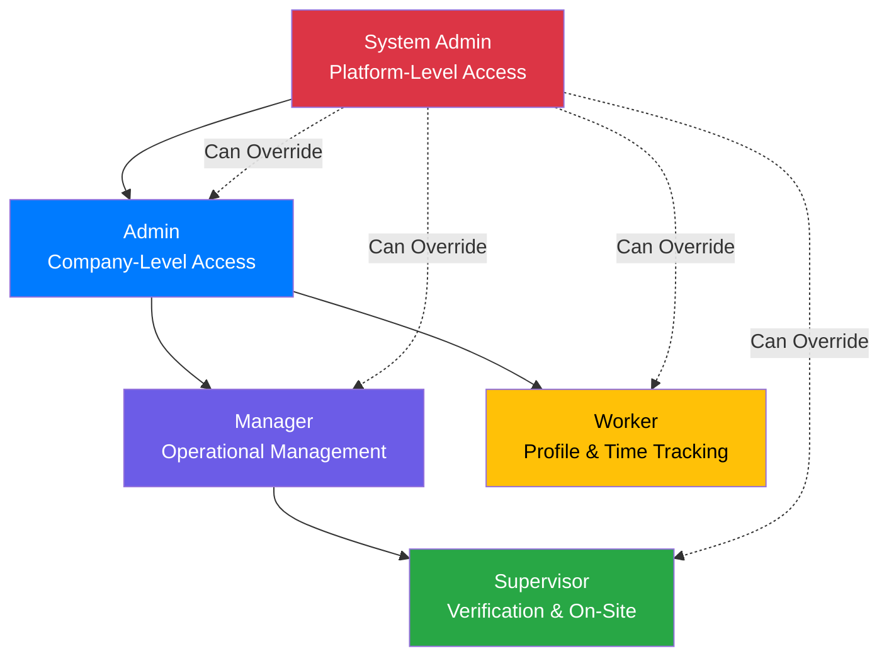
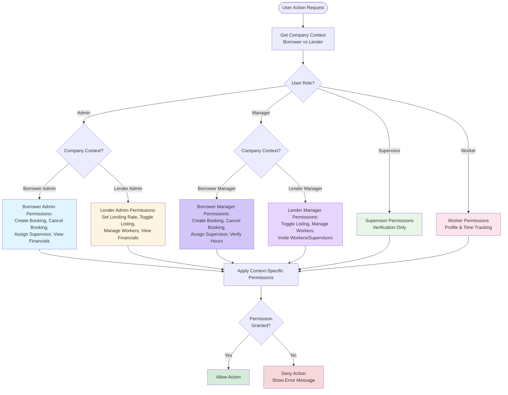

# RBAC Acceptance Criteria

**Purpose:** Comprehensive role-based access control (RBAC) acceptance criteria for all features across the SmartBench platform.

**Last Updated:** January 2026  
**Version:** 1.0

> **Note:** For notification-specific RBAC requirements, see [Notifications & RBAC Matrix](./notifications-rbac-matrix.md). This document focuses on feature-level permissions across all epics.

---

## Overview

This document defines feature-level RBAC permissions across all epics. For complete role definitions, capabilities, relationships, and business context, see [User Roles and Actors](./user-roles-and-actors.md).

**Core Roles:** System Admin, Admin, Manager, Supervisor, Worker (see [User Roles and Actors](./user-roles-and-actors.md) for detailed definitions)

**RBAC Role Hierarchy and Permission Matrix Visualization:**

The following diagrams illustrate the role hierarchy and permission matrix across key features:

**RBAC Permission Matrix (Key Features):**

```mermaid
flowchart LR
    subgraph Roles[" "]
        SA[System Admin]
        A[Admin]
        M[Manager]
        S[Supervisor]
        W[Worker]
    end
    
    subgraph CompanyMgmt["Company Management"]
        CM1[Create Company]
        CM2[Edit Company Profile]
        CM3[Invite Workers]
        CM4[Manage Members]
    end
    
    subgraph WorkerMgmt["Worker Management"]
        WM1[Create Profile]
        WM2[Edit Own Profile]
        WM3[Set Lending Rate]
        WM4[Toggle Listing]
    end
    
    subgraph Booking["Booking & Payment"]
        B1[Create Booking]
        B2[Cancel Booking]
        B3[Select Site Contact]
        B4[View Financials]
    end
    
    subgraph Verification["Time Tracking"]
        V1[Clock In/Out]
        V2[Verify Hours]
        V3[Dispute Timesheet]
        V4[View Timesheets]
    end
    
    SA -->|✅| CM1
    SA -->|✅| CM2
    SA -->|✅| CM3
    SA -->|✅| CM4
    SA -->|✅| WM1
    SA -->|✅| WM2
    SA -->|✅| WM3
    SA -->|✅| WM4
    SA -->|✅| B1
    SA -->|✅| B2
    SA -->|✅| B3
    SA -->|✅| B4
    SA -->|✅| V1
    SA -->|✅| V2
    SA -->|✅| V3
    SA -->|✅| V4
    
    A -->|✅| CM2
    A -->|✅| CM3
    A -->|✅| CM4
    A -->|✅| WM3
    A -->|✅| WM4
    A -->|✅| B1
    A -->|✅| B2
    A -->|✅| B3
    A -->|✅| B4
    A -->|❌| CM1
    A -->|❌| WM2
    A -->|❌| V2
    A -->|✅| V4
    
    M -->|❌| CM1
    M -->|❌| CM2
    M -->|✅| CM3
    M -->|✅| CM4
    M -->|❌| WM3
    M -->|✅| WM4
    M -->|✅| B1
    M -->|✅| B2
    M -->|✅| B3
    M -->|❌| B4
    M -->|✅| V2
    M -->|✅| V3
    M -->|✅| V4
    M -->|❌| V1
    
    S -->|❌| CM1
    S -->|❌| CM2
    S -->|❌| CM3
    S -->|❌| CM4
    S -->|❌| WM3
    S -->|❌| WM4
    S -->|❌| B1
    S -->|❌| B2
    S -->|✅| V2
    S -->|✅| V3
    S -->|✅| V4
    S -->|❌| V1
    
    W -->|✅| WM1
    W -->|✅| WM2
    W -->|✅| V1
    W -->|✅| V4
    W -->|❌| CM1
    W -->|❌| CM2
    W -->|❌| CM3
    W -->|❌| CM4
    W -->|❌| WM3
    W -->|❌| WM4
    W -->|❌| B1
    W -->|❌| B2
    W -->|❌| B3
    W -->|❌| B4
    W -->|❌| V2
    W -->|❌| V3
    
    style SA fill:#dc3545,color:#fff
    style A fill:#007bff,color:#fff
    style M fill:#6c5ce7,color:#fff
    style S fill:#28a745,color:#fff
    style W fill:#ffc107,color:#000
```

**Context-Aware RBAC (Borrower vs Lender):**

---

## Epic 1: Foundation & Core Infrastructure

### Company and User Management

| Feature | Admin | Manager | Supervisor | Worker | System Admin |
|---------|:-----:|:-------:|:----------:|:------:|:------------:|
| Create Company | ✅ | ❌ | ❌ | ❌ | ✅ |
| Edit Company Profile | ✅ | ❌ | ❌ | ❌ | ✅ |
| View Company Profile | ✅ | ✅ | ✅ | ✅ | ✅ |
| Invite Workers (Bulk Roster) | ✅ | ✅ | ❌ | ❌ | ✅ |
| Manage Company Members | ✅ | ✅ | ❌ | ❌ | ✅ |
| Assign Roles to Members | ✅ | ✅ (Worker, Supervisor only) | ❌ | ❌ | ✅ |
| View Company Roster | ✅ | ✅ | ✅ | ✅ | ✅ |
| Ban/Unban Users | ❌ | ❌ | ❌ | ❌ | ✅ |
| Ban/Unban Companies | ❌ | ❌ | ❌ | ❌ | ✅ |

**Acceptance Criteria:**
- Only Admin can create companies and manage company members
- Admin and Manager can assign roles (Worker, Supervisor, Manager, Admin) to company members
- At least one role must remain for active members
- System Admin can ban/unban users and companies globally
- Workers cannot invite other workers or manage company members

---

### Authentication

| Feature | Admin | Manager | Supervisor | Worker | System Admin |
|---------|:-----:|:-------:|:----------:|:------:|:------------:|
| Create Account | ✅ | ✅ | ✅ | ✅ | ✅ |
| Login | ✅ | ✅ | ✅ | ✅ | ✅ |
| Reset Password | ✅ | ✅ | ✅ | ✅ | ✅ |
| Magic Link Authentication | ✅ | ✅ | ✅ | ✅ | ✅ |
| OAuth2 (Stripe Connect) | ✅ (Lender) | ❌ | ❌ | ❌ | ✅ |

**Acceptance Criteria:**
- All roles can create accounts and authenticate
- Magic links work for onboarding (new user invitation) and verification (supervisor timesheet review)
- OAuth2 integration (Stripe Connect) available only to Lending Admins for account linking
- System Admin has full authentication access

---

## Epic 2: Worker Onboarding & Profile Management

### Worker Profile Management

| Feature | Admin | Manager | Supervisor | Worker | System Admin |
|---------|:-----:|:-------:|:----------:|:------:|:------------:|
| Create Worker Profile | ✅ | ❌ | ❌ | ✅ | ✅ |
| Edit Own Profile | ❌ | ❌ | ❌ | ✅ | ✅ |
| Edit Worker Profile (Others) | ✅ | ❌ | ❌ | ❌ | ✅ |
| Set Lending Rate | ✅ | ❌ | ❌ | ❌ | ✅ |
| Toggle Marketplace Listing | ✅ | ✅ (Lender) | ❌ | ❌ | ✅ |
| View Worker Profiles | ✅ | ✅ | ✅ | ✅ | ✅ |
| Upload Insurance Policies | ✅ | ❌ | ❌ | ❌ | ✅ |

**Acceptance Criteria:**
- Workers can create and edit their own profiles
- Admin can edit any worker profile in their company
- Only Admin can set lending rates; Admin and Manager (Lender context) can toggle marketplace listing
- Only Admin can upload insurance policies
- Workers cannot list themselves (requires Admin or Manager approval)

---

### Insurance Management

| Feature | Admin | Manager | Supervisor | Worker | System Admin |
|---------|:-----:|:-------:|:----------:|:------:|:------------:|
| Upload Insurance Policy | ✅ | ❌ | ❌ | ❌ | ✅ |
| View Insurance Policies | ✅ | ✅ | ✅ | ✅ | ✅ |
| Audit Insurance (Borrower) | ✅ (Borrower) | ❌ | ❌ | ❌ | ✅ |
| Receive Insurance Warnings | ✅ | ❌ | ❌ | ❌ | ✅ |

**Acceptance Criteria:**
- Only Admin can upload insurance policies
- Borrowing Admin can audit lender insurance during booking checkout
- Insurance warnings sent to Admins only (both Borrower and Lender)
- System validates insurance expiration independently via nightly monitoring jobs and manual updates. Insurance validation does NOT occur during weekly payment processing. Insurance failures immediately suspend bookings (Suspended_Insurance status) via compliance events.

---

## Epic 3: Marketplace & Search

### Worker Search

| Feature | Admin | Manager | Supervisor | Worker | System Admin |
|---------|:-----:|:-------:|:----------:|:------:|:------------:|
| Search Workers | ✅ (Borrower) | ✅ (Borrower) | ✅ (Borrower) | ❌ | ✅ |
| View Worker Profiles | ✅ (Borrower) | ✅ (Borrower) | ✅ (Borrower) | ❌ | ✅ |
| View Company Name (After Cart) | ✅ (Borrower) | ✅ (Borrower) | ✅ (Borrower) | ❌ | ✅ |
| Create Saved Search | ✅ (Borrower) | ✅ (Borrower) | ✅ (Borrower) | ❌ | ✅ |
| Manage Saved Searches | ✅ (Borrower) | ✅ (Borrower) | ✅ (Borrower) | ❌ | ✅ |
| Set Availability | ✅ (Lender) | ✅ (Lender) | ✅ (Lender) | ❌ | ✅ |
| Block Dates | ✅ (Lender) | ✅ (Lender) | ✅ (Lender) | ❌ | ✅ |

**Acceptance Criteria:**
- Only Borrower context users (Admin, Manager, Supervisor) can search and book workers
- Company name hidden in search results, revealed only after adding to cart
- Only Lender context users (Admin, Manager, Supervisor) can set worker availability
- Workers cannot search for or book other workers
- System Admin has full access for support purposes

---

## Epic 4: Booking & Payment Processing

### Booking Management

| Feature | Admin | Manager | Supervisor | Worker | System Admin |
|---------|:-----:|:-------:|:----------:|:------:|:------------:|
| Create Booking | ✅ (Borrower) | ✅ (Borrower) | ❌ | ❌ | ✅ |
| View Own Bookings | ✅ | ✅ | ✅ | ✅ | ✅ |
| Cancel Booking | ✅ (Borrower) | ✅ (Borrower) | ❌ | ❌ | ✅ |
| Recall Worker (Long-Term) | ✅ (Lender) | ❌ | ❌ | ❌ | ✅ |
| Assign Supervisor | ✅ (Borrower) | ✅ (Borrower) | ❌ | ❌ | ✅ |
| View Booking Details | ✅ | ✅ | ✅ | ✅ | ✅ |
| Force-Cancel Booking | ❌ | ❌ | ❌ | ❌ | ✅ |

**Acceptance Criteria:**
- Borrowing Admin and Manager can create bookings
- Borrowing Admin and Manager can cancel bookings (subject to cancellation policy)
- Lending Admin can recall workers from long-term bookings (with 3-day notice)
- Borrowing Admin and Manager can select/manage Site Contact (for operational communication). Verification is role-based - any Supervisor/Admin/Manager in the Borrower Company can verify timesheets.
- System Admin can force-cancel bookings (with audit trail)
- Workers can view their assigned bookings but cannot create or cancel

---

### Payment Processing

| Feature | Admin | Manager | Supervisor | Worker | System Admin |
|---------|:-----:|:-------:|:----------:|:------:|:------------:|
| Process Payment | ✅ (Borrower) | ❌ | ❌ | ❌ | ✅ |
| View Payment History | ✅ | ✅ | ✅ | ✅ | ✅ |
| View Payment History | ✅ | ✅ | ✅ | ❌ | ✅ |
| Access Financial Dashboard | ✅ | ❌ | ❌ | ❌ | ✅ |
| View Payment History | ✅ | ❌ | ❌ | ❌ | ✅ |

**Acceptance Criteria:**
- Only Borrowing Admin can process payments
- All roles can view payment history for their bookings
- Only Admin can access financial dashboard and view payment history
- All refunds processed directly to payment method via Stripe API
- Workers cannot access financial operations

---

## Epic 5: Time Tracking & Verification

### Time Clock

| Feature | Admin | Manager | Supervisor | Worker | System Admin |
|---------|:-----:|:-------:|:----------:|:------:|:------------:|
| Clock In/Out | ❌ | ❌ | ❌ | ✅ | ✅ |
| Log Breaks/Lunch | ❌ | ❌ | ❌ | ✅ | ✅ |
| Log Travel Time | ❌ | ❌ | ❌ | ✅ | ✅ |
| Self-Correct Time | ❌ | ❌ | ❌ | ✅ | ✅ |
| View Own Timesheets | ✅ | ✅ | ✅ | ✅ | ✅ |
| View All Timesheets (Company) | ✅ | ✅ | ✅ | ❌ | ✅ |

**Acceptance Criteria:**
- Only Workers can clock in/out and log time
- Workers can self-correct time entries before submission
- All roles can view their own timesheets
- Admin, Manager, and Supervisor can view all company timesheets
- System Admin can view all timesheets for support

---

### Verification

| Feature | Admin | Manager | Supervisor | Worker | System Admin |
|---------|:-----:|:-------:|:----------:|:------:|:------------:|
| Verify Hours | ✅ (Borrower) | ✅ (Borrower) | ✅ (Borrower) | ❌ | ✅ |
| Dispute Timesheet | ✅ (Borrower) | ✅ (Borrower) | ✅ (Borrower) | ❌ | ✅ |
| Reject Worker (Trial) | ✅ (Borrower) | ✅ (Borrower) | ✅ (Borrower) | ❌ | ✅ |
| View Verification Dashboard | ✅ (Borrower) | ✅ (Borrower) | ✅ (Borrower) | ❌ | ✅ |
| Rate Worker | ✅ (Borrower) | ✅ (Borrower) | ✅ (Borrower) | ❌ | ✅ |
| Rate Supervisor/Company | ❌ | ❌ | ❌ | ✅ | ✅ |
| Manual Timesheet Entry | ✅ (Both) | ❌ | ❌ | ❌ | ✅ |

**Acceptance Criteria:**
- Borrowing Admin, Manager, and Supervisor can verify hours
- Borrowing Admin, Manager, and Supervisor can dispute timesheets
- Only Borrowing Admin, Manager, and Supervisor can reject workers during trial period
- Workers can rate supervisors and companies after shift completion
- Both Borrowing Admin and Lending Admin must approve manual timesheet reconstruction

---

## Epic 6: Financial Operations & Admin

### Financial Operations

| Feature | Admin | Manager | Supervisor | Worker | System Admin |
|---------|:-----:|:-------:|:----------:|:------:|:------------:|
| Withdraw Funds | ✅ (Lender) | ❌ | ❌ | ❌ | ✅ |
| View Payment History | ✅ | ❌ | ❌ | ❌ | ✅ |
| View Transaction History | ✅ | ✅ | ✅ | ✅ | ✅ |
| View Financial Reports | ✅ | ❌ | ❌ | ❌ | ✅ |
| Access Company Dashboard | ✅ | ❌ | ❌ | ❌ | ✅ |

**Acceptance Criteria:**
- Only Admin can access financial operations
- Lending Admin can withdraw funds to bank account
- Borrowing Admin can view payment history and booking financial records
- All roles can view transaction history for their bookings
- Only Admin can view financial reports and company dashboard

---

### Refunds and Overtime

| Feature | Admin | Manager | Supervisor | Worker | System Admin |
|---------|:-----:|:-------:|:----------:|:------:|:------------:|
| Request Refund | ✅ (Borrower) | ❌ | ❌ | ❌ | ✅ |
| Process Refund | ✅ (System) | ❌ | ❌ | ❌ | ✅ |
| View Overtime Calculations | ✅ | ✅ | ✅ | ✅ | ✅ |

**Acceptance Criteria:**
- Borrowing Admin can request refunds (subject to refund policy)
- System automatically processes refunds based on business rules
- OT terms are pre-authorized at checkout - no unlock workflow needed
- All roles can view overtime calculations for their bookings

---

## Epic 7: Super Admin Dashboard

### Platform Administration

| Feature | System Admin | Admin | Supervisor | Worker |
|---------|:------------:|:-----:|:----------:|:------:|
| View Global Statistics | ✅ | ❌ | ❌ | ❌ |
| Manage Users | ✅ | ❌ | ❌ | ❌ |
| Manage Companies | ✅ | ❌ | ❌ | ❌ |
| Force-Cancel Bookings | ✅ | ❌ | ❌ | ❌ |
| View All Transactions | ✅ | ❌ | ❌ | ❌ |
| System Monitoring | ✅ | ❌ | ❌ | ❌ |
| Access Error Logs | ✅ | ❌ | ❌ | ❌ |
| Handle Dead Letter Queue | ✅ | ❌ | ❌ | ❌ |

**Acceptance Criteria:**
- Only System Admin can access platform-level administration
- System Admin can view global statistics and system health
- System Admin can ban/unban users and companies
- System Admin can force-cancel bookings with audit trail
- System Admin has access to all financial transactions for audit
- Company-level Admins cannot access platform administration

---

## Context-Aware Permissions

### Borrower vs. Lender Context

Many permissions depend on company context (Borrower vs. Lender):

**Borrower Context:**
- Search and book workers (Admin, Manager, Supervisor)
- Select/manage Site Contact (for operational communication) (Admin, Manager)
- Verify hours (Admin, Manager, Supervisor)
- Cancel bookings (Admin, Manager)
- Request refunds (Admin only)

**Lender Context:**
- List workers
- Set availability
- Set lending rates
- Recall workers
- Withdraw funds

**Same User, Different Context:**
- User can be Borrowing Admin in one booking and Lending Admin in another
- Permissions checked based on company context for each operation

---

## Solopreneur Permissions

For complete definition, business context, and registration flow of Solopreneurs, see [User Roles and Actors: Special Actor: Solopreneur](./user-roles-and-actors.md#special-actor-solopreneur).

**Feature-Level Permissions:**
- All Admin permissions (as defined in this document)
- All Supervisor permissions (as defined in this document)
- All Worker permissions (as defined in this document)

**Special Considerations:**
- Can list themselves in marketplace
- Can book other workers
- Can verify their own hours (if they book themselves)
- Full access to all features without role switching

---

## Permission Validation Rules

### Role Checking

**Acceptance Criteria:**
- All API endpoints must validate user roles before processing requests
- Role checking middleware validates JWT token and checks role permissions
- Role checks must include both `user_id` AND `company_id` for context
- Invalid role access returns 403 Forbidden with clear error message

### Multi-Role Users

**Acceptance Criteria:**
- Users with multiple roles receive permissions for all applicable roles
- Example: Solopreneur receives Worker, Supervisor, and Admin permissions
- Notification system checks all roles and sends notifications for each applicable role

### Company Context

**Acceptance Criteria:**
- Admin and Manager role permissions must check company context (Borrower vs. Lender)
- Use `Company_Member` table to determine user's role in specific company
- Use booking/project context to determine if Admin/Manager is Borrowing Admin/Manager or Lending Admin/Manager

---

## Related Documentation

- [User Roles and Actors](./user-roles-and-actors.md) - Role definitions and relationships
- [Notifications & RBAC Matrix](./notifications-rbac-matrix.md) - Notification-specific RBAC
- [Unified User Model Blueprint](../architecture/blueprints/identity/unified-user-model.md) - Technical RBAC implementation
